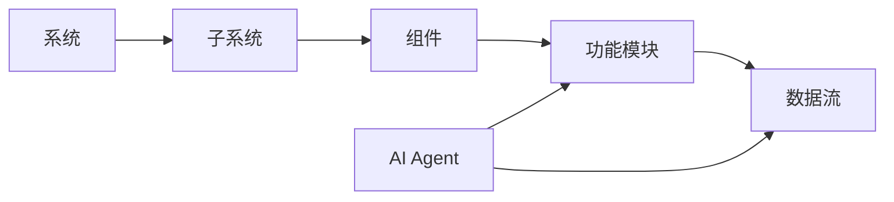
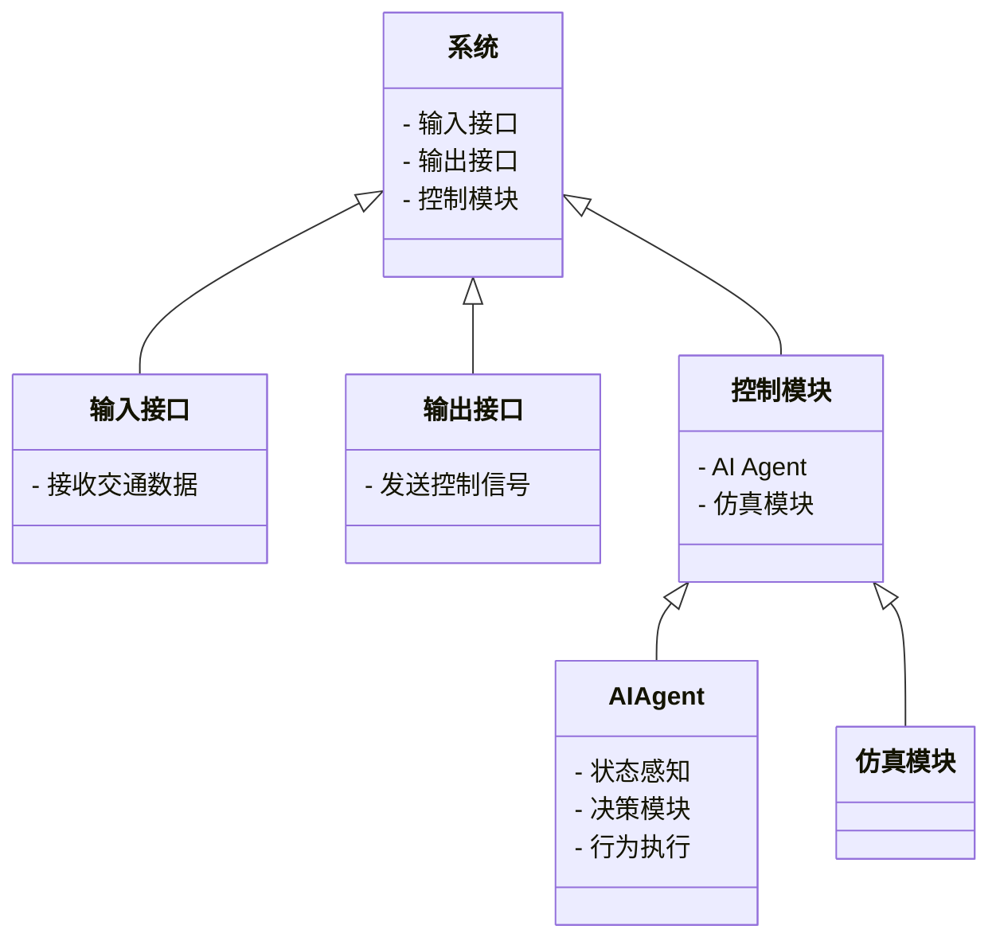
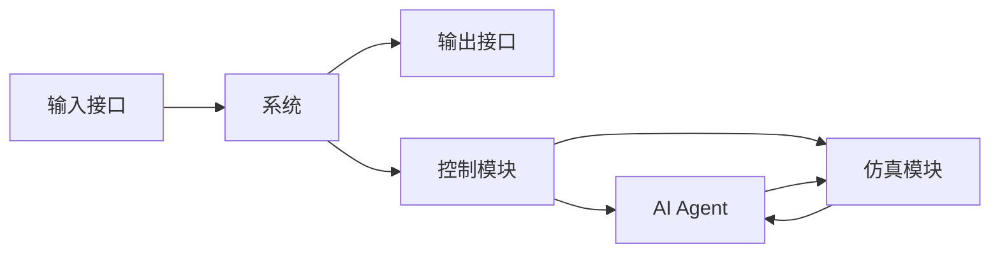
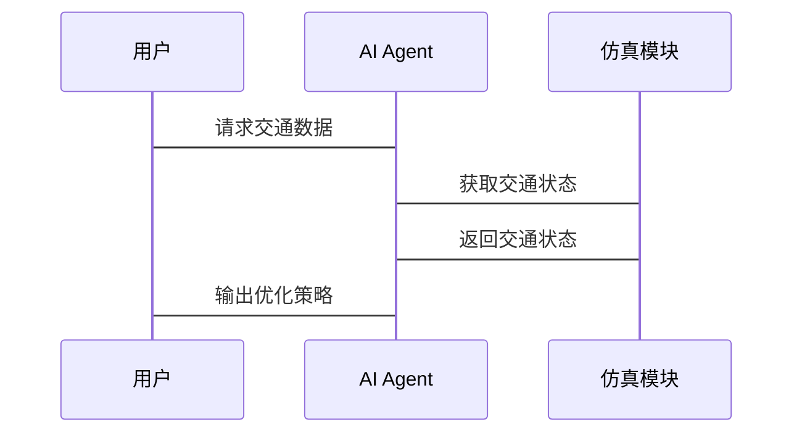

                 


# 开发具有复杂系统建模与仿真能力的AI Agent

> 关键词：复杂系统建模，AI Agent，强化学习，生成对抗网络，系统仿真，智能体设计

> 摘要：本文详细探讨了开发具有复杂系统建模与仿真能力的AI Agent的关键技术与方法。通过分析复杂系统建模的核心问题，结合AI Agent的智能特性，提出了基于强化学习和生成对抗网络的算法原理，并通过系统架构设计与项目实战，展示了如何实现高效的复杂系统建模与仿真。本文还提供了丰富的数学模型、代码实现和系统架构图，帮助读者全面理解并掌握相关技术。

---

## 第1章: 背景与核心概念

### 1.1 问题背景

在现代科技领域，复杂系统的建模与仿真已成为一项关键任务。复杂系统通常具有高度的不确定性、非线性关系和多层次结构，例如交通网络、生态系统、金融市场等。传统的建模方法往往难以捕捉系统的动态行为和潜在规律，而AI Agent（智能体）的引入为解决这些问题提供了新的可能性。

AI Agent是一种能够感知环境、自主决策并执行任务的智能实体。在复杂系统建模中，AI Agent可以通过学习和自适应能力，帮助我们更好地理解系统的运行机制，并预测其行为趋势。

### 1.2 问题描述

复杂系统建模的核心问题在于如何准确描述系统的动态行为，并通过仿真验证模型的准确性。AI Agent在这一过程中扮演了关键角色，它需要具备以下能力：
1. **感知能力**：能够采集和处理多源数据。
2. **决策能力**：基于数据做出最优或近似最优的决策。
3. **自适应能力**：能够根据环境变化调整自身行为。

### 1.3 核心概念与联系

为了更好地理解AI Agent在复杂系统建模中的作用，我们需要明确以下几个核心概念及其联系：

#### 1.3.1 系统建模
- **定义**：系统建模是通过数学或逻辑模型描述系统结构、行为和动态的过程。
- **特征**：抽象性、动态性、层次性。

#### 1.3.2 AI Agent
- **定义**：AI Agent是一种能够感知环境、自主决策并执行任务的智能实体。
- **特征**：智能性、自主性、反应性、主动性。

#### 1.3.3 复杂系统仿真
- **定义**：复杂系统仿真是通过计算机模拟系统的行为，以验证模型的准确性和预测系统的行为趋势。
- **特征**：高度非线性、多尺度性、涌现性。

### 1.4 实体关系图

以下是复杂系统建模与AI Agent之间的关系图：



---

## 第2章: 算法原理

### 2.1 强化学习算法

强化学习是一种通过试错机制来优化决策策略的算法。在复杂系统建模中，强化学习常用于AI Agent的决策过程。

#### 2.1.1 Q-learning算法

Q-learning是一种经典的强化学习算法，其核心思想是通过更新Q值表来学习最优策略。

- **算法流程**：
  1. 初始化Q值表。
  2. 选择动作。
  3. 执行动作并获得奖励。
  4. 更新Q值表。
  5. 重复上述步骤，直到收敛。

- **数学公式**：
  $$ Q(s, a) = Q(s, a) + \alpha [r + \max Q(s', a') - Q(s, a)] $$

- **流程图**：
  ```mermaid
  graph LR
      S[状态] --> A[动作选择]
      A --> R[环境响应]
      R --> S[更新状态]
  ```

#### 2.1.2 Deep Q-Networks (DQN) 算法

DQN通过深度神经网络近似Q值函数，解决了Q-learning中Q值表维度高的问题。

- **核心思想**：
  使用两个神经网络（主网络和目标网络）来近似Q值函数，并通过经验回放和目标网络更新来稳定训练过程。

- **代码实现**：
  ```python
  import numpy as np
  import tensorflow as tf

  class DQN:
      def __init__(self, state_dim, action_dim, learning_rate):
          self.state_dim = state_dim
          self.action_dim = action_dim
          self.lr = learning_rate
          self.model = self._build_model()

      def _build_model(self):
          model = tf.keras.Sequential([
              tf.keras.layers.Dense(64, activation='relu', input_shape=(self.state_dim,)),
              tf.keras.layers.Dense(64, activation='relu'),
              tf.keras.layers.Dense(self.action_dim)
          ])
          model.compile(optimizer=tf.keras.optimizers.Adam(self.lr), loss='mse')
          return model

      def update(self, states, actions, rewards, next_states):
          # 预测当前Q值
          current_q = self.model.predict(states)
          # 预测目标Q值
          target_q = self.model.predict(next_states)
          # 更新目标Q值
          target_q[0][actions[0]] = rewards[0] + np.max(target_q[0])
          # 训练模型
          self.model.fit(states, target_q, epochs=1, verbose=0)
  ```

### 2.2 生成对抗网络

生成对抗网络（GAN）是一种通过对抗训练生成数据的模型，常用于复杂系统的数据生成与模拟。

#### 2.2.1 GAN的基本原理

GAN由生成器和判别器组成，两者通过对抗训练互相提升。

- **损失函数**：
  判别器的损失函数：
  $$ \mathcal{L}_D = -\mathbb{E}[\log D(x) + \log(1 - D(G(z)))] $$
  生成器的损失函数：
  $$ \mathcal{L}_G = -\mathbb{E}[\log D(G(z))] $$

- **流程图**：
  ```mermaid
  graph LR
      G[生成器] --> D[判别器]
      X[真实数据] --> D
      D --> G
  ```

#### 2.2.2 WGAN的改进方法

WGAN通过引入Wasserstein距离，解决了GAN训练不稳定的问题。

- **核心思想**：
  使用Wasserstein距离作为损失函数，优化生成器和判别器的参数。

---

## 第3章: 系统分析与架构设计

### 3.1 问题场景介绍

假设我们正在开发一个城市交通流模拟系统，目标是通过AI Agent模拟交通信号灯的控制行为，优化交通流量。

### 3.2 系统功能设计

以下是系统的功能模块类图：



### 3.3 系统架构设计

以下是系统的整体架构图：



### 3.4 系统交互设计

以下是系统的交互序列图：



---

## 第4章: 项目实战

### 4.1 环境安装

需要安装以下依赖：
- Python 3.8+
- TensorFlow 2.0+
- Mermaid CLI
- matplotlib

### 4.2 核心代码实现

以下是AI Agent的核心代码实现：

```python
import numpy as np
import tensorflow as tf

class AI_Agent:
    def __init__(self, state_dim, action_dim, learning_rate):
        self.state_dim = state_dim
        self.action_dim = action_dim
        self.lr = learning_rate
        self.model = self._build_model()

    def _build_model(self):
        model = tf.keras.Sequential([
            tf.keras.layers.Dense(64, activation='relu', input_shape=(self.state_dim,)),
            tf.keras.layers.Dense(64, activation='relu'),
            tf.keras.layers.Dense(self.action_dim)
        ])
        model.compile(optimizer=tf.keras.optimizers.Adam(self.lr), loss='mse')
        return model

    def act(self, state):
        state = np.array([state])
        prediction = self.model.predict(state)
        return np.argmax(prediction[0])

    def train(self, state, action, reward, next_state):
        state = np.array([state])
        next_state = np.array([next_state])
        target = self.model.predict(state)
        target[0][action] = reward + np.max(self.model.predict(next_state))
        self.model.fit(state, target, epochs=1, verbose=0)
```

### 4.3 案例分析

以下是一个简单的案例分析：

```python
# 初始化AI Agent
state_dim = 4
action_dim = 2
learning_rate = 0.01
agent = AI_Agent(state_dim, action_dim, learning_rate)

# 训练过程
for _ in range(1000):
    state = np.random.random(state_dim)
    action = agent.act(state)
    reward = np.random.random()
    next_state = np.random.random(state_dim)
    agent.train(state, action, reward, next_state)
```

### 4.4 项目小结

通过上述代码实现，我们可以看到AI Agent在复杂系统建模中的应用潜力。然而，实际应用中还需要考虑系统的实时性、鲁棒性和可扩展性。

---

## 第5章: 高级主题与拓展

### 5.1 复杂系统建模的挑战

复杂系统建模的难点在于：
1. **不确定性**：系统的动态行为难以预测。
2. **非线性**：系统行为通常是非线性的。
3. **多尺度**：系统可能涉及多个空间和时间尺度。

### 5.2 应用案例分析

#### 5.2.1 自动驾驶

在自动驾驶中，AI Agent可以用于路径规划和决策控制。

#### 5.2.2 智慧城市

在智慧城市中，AI Agent可以用于交通流量预测和资源分配优化。

### 5.3 最佳实践

1. **数据质量**：确保数据的准确性和完整性。
2. **模型选择**：根据具体问题选择合适的算法。
3. **系统优化**：通过并行计算和分布式架构提升性能。

### 5.4 未来趋势

1. **强化学习的深化应用**：强化学习在复杂系统建模中的应用将更加广泛。
2. **多智能体协作**：多智能体协作将成为研究的热点。
3. **实时仿真**：实时仿真技术将推动复杂系统建模的发展。

---

## 第6章: 总结与展望

### 6.1 总结

本文详细探讨了开发具有复杂系统建模与仿真能力的AI Agent的关键技术与方法。通过分析复杂系统建模的核心问题，结合AI Agent的智能特性，提出了基于强化学习和生成对抗网络的算法原理，并通过系统架构设计与项目实战，展示了如何实现高效的复杂系统建模与仿真。

### 6.2 展望

未来，随着人工智能技术的不断发展，复杂系统建模与仿真的能力将更加智能化和自动化。AI Agent将在更多领域得到广泛应用，为人类社会的发展带来更大的价值。

---

通过本文的系统讲解，读者可以全面理解开发具有复杂系统建模与仿真能力的AI Agent的相关技术，并能够将其应用于实际场景中。

