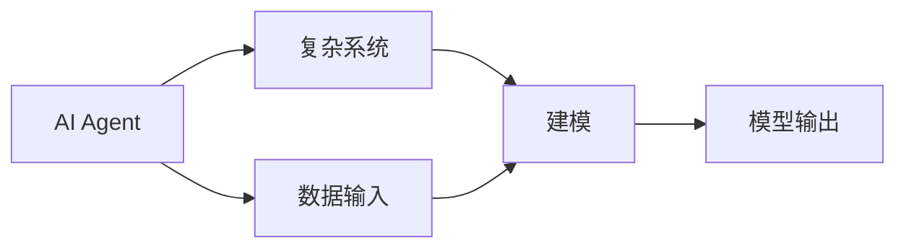
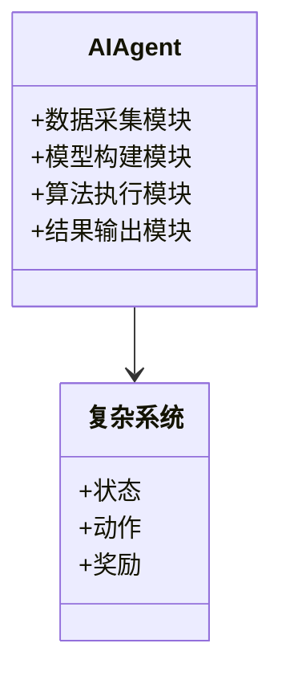
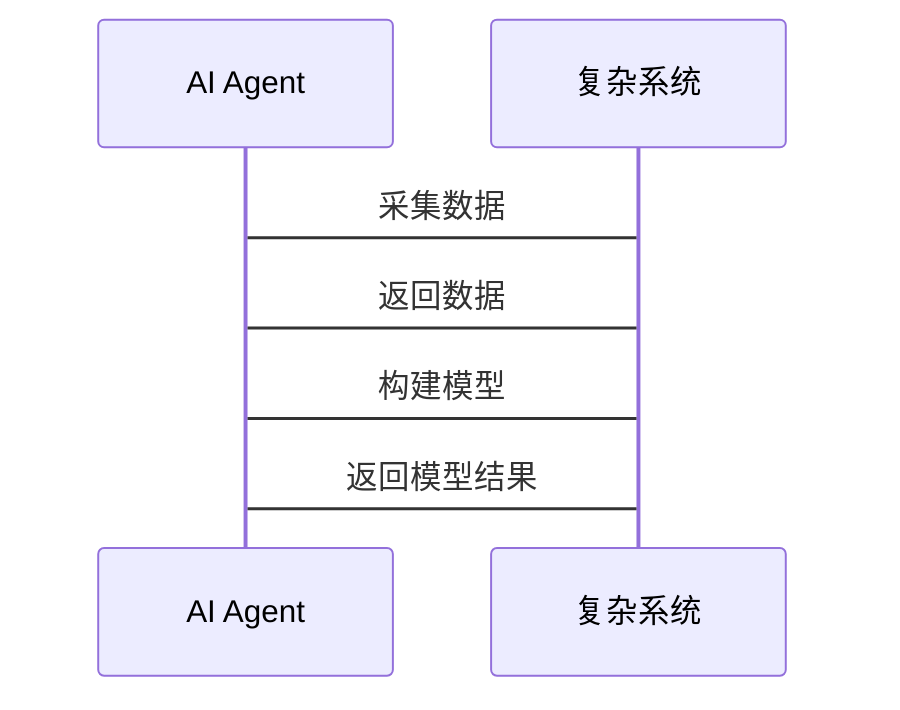

                 


# 开发具有复杂系统建模能力的AI Agent

> 关键词：AI Agent，复杂系统建模，强化学习，图神经网络，系统架构

> 摘要：本文深入探讨了开发具有复杂系统建模能力的AI Agent的关键技术，从基础概念到算法原理，再到系统架构设计和项目实战，全面分析了AI Agent在复杂系统建模中的应用。

---

## 第1章: AI Agent与复杂系统建模概述

### 1.1 AI Agent的基本概念

#### 1.1.1 AI Agent的定义与特点

AI Agent，即人工智能代理，是一种能够感知环境并采取行动以实现目标的智能实体。AI Agent的特点包括：

1. **自主性**：AI Agent能够在没有外部干预的情况下自主决策。
2. **反应性**：能够实时感知环境并做出反应。
3. **目标导向**：所有的行动都以实现特定目标为导向。
4. **学习能力**：能够通过经验改进自己的行为策略。

#### 1.1.2 复杂系统建模的必要性

复杂系统是指由多个相互作用的组件组成的系统，这些组件之间的相互作用导致系统整体表现出非线性、涌现性和不可预测的行为。复杂系统建模的必要性体现在以下几个方面：

1. **理解系统行为**：通过建模可以深入理解系统的动态行为和内在规律。
2. **优化系统性能**：通过建模可以找到系统中的瓶颈，并提出优化方案。
3. **预测系统行为**：在已知条件下，预测系统未来的状态和行为。
4. **支持决策制定**：为决策者提供可靠的系统行为预测，辅助决策。

#### 1.1.3 AI Agent在复杂系统中的作用

AI Agent在复杂系统中的作用主要体现在以下几个方面：

1. **数据采集与处理**：AI Agent能够实时采集系统中的各种数据，并进行预处理和特征提取。
2. **行为决策**：基于系统的实时状态，AI Agent能够做出最优决策，以实现目标。
3. **动态适应**：AI Agent能够根据系统的动态变化调整自己的行为策略，以适应复杂系统的不确定性。

### 1.2 复杂系统的特征与挑战

#### 1.2.1 复杂系统的定义

复杂系统是由多个相互作用的组件组成的系统，这些组件之间的相互作用导致系统整体表现出非线性、涌现性和不可预测的行为。复杂系统的典型特征包括：

1. **非线性**：系统的输出与输入之间的关系不是线性的。
2. **涌现性**：系统整体表现出的性质是单个组件所不具备的。
3. **不确定性**：系统的行为具有不确定性和不可预测性。
4. **动态性**：系统的结构和行为随时间不断变化。

#### 1.2.2 复杂系统的特征分析

复杂系统的特征分析可以通过以下几个方面进行：

1. **系统结构**：系统的组件之间的连接方式和层次结构。
2. **系统行为**：系统的动态行为和状态转移。
3. **系统目标**：系统各组件的目标和整体目标的关系。

#### 1.2.3 复杂系统建模的难点与解决方案

复杂系统建模的难点主要在于系统的非线性、不确定性和动态性。为了克服这些难点，可以采取以下解决方案：

1. **分层建模**：将复杂系统分解为多个层次，分别进行建模和分析。
2. **多学科交叉**：结合多个学科的知识和方法，综合建模。
3. **数据驱动建模**：利用大数据和机器学习技术，通过数据驱动的方式进行建模。

### 1.3 AI Agent与复杂系统建模的关系

#### 1.3.1 AI Agent在复杂系统建模中的地位

AI Agent在复杂系统建模中扮演着重要角色，既是建模的主体，也是建模的工具。AI Agent通过感知环境、分析数据、学习模型，帮助我们更好地理解复杂系统的动态行为。

#### 1.3.2 复杂系统建模对AI Agent的要求

复杂系统建模对AI Agent提出了更高的要求，包括：

1. **强大的感知能力**：能够实时感知系统的各种状态和变化。
2. **高效的计算能力**：能够快速处理大量的数据和信息。
3. **自适应学习能力**：能够根据系统的动态变化调整自己的行为策略。

#### 1.3.3 本章小结

本章主要介绍了AI Agent的基本概念、复杂系统的特征以及AI Agent在复杂系统建模中的作用。通过本章的学习，读者可以理解AI Agent与复杂系统建模之间的关系，为后续章节的学习打下基础。

---

## 第2章: 复杂系统建模的核心概念与联系

### 2.1 复杂系统建模的核心原理

#### 2.1.1 系统建模的基本原理

系统建模是通过建立数学模型或仿真模型来描述和分析系统的结构和行为。复杂系统建模的核心原理包括：

1. **系统分解**：将复杂系统分解为多个子系统，分别进行建模。
2. **动态分析**：分析系统的动态行为，包括状态转移和行为模式。
3. **模型验证**：通过实验和仿真验证模型的准确性和有效性。

#### 2.1.2 复杂系统建模的独特性

复杂系统建模的独特性主要体现在以下几个方面：

1. **非线性关系**：复杂系统中各组件之间的关系往往是非线性的。
2. **涌现性特征**：系统的整体行为是由各组件的相互作用产生的，具有涌现性。
3. **不确定性**：系统的不确定性和模糊性使得建模更加复杂。

#### 2.1.3 AI Agent在建模中的角色

AI Agent在复杂系统建模中扮演着多重角色：

1. **数据采集**：AI Agent能够实时采集系统中的各种数据，为建模提供基础。
2. **模型构建**：AI Agent可以通过机器学习算法，自动构建系统的数学模型。
3. **模型优化**：AI Agent能够根据系统的实时反馈，优化模型的参数和结构。

### 2.2 复杂系统建模的关键要素

#### 2.2.1 系统的组成部分

复杂系统通常由以下几部分组成：

1. **组件**：系统的各个组成部分。
2. **关系**：组件之间的相互作用和关系。
3. **目标**：系统各组件的目标和整体目标。

#### 2.2.2 系统之间的关系

复杂系统中，组件之间的关系可以是：

1. **协同关系**：各组件协同工作，共同实现系统目标。
2. **竞争关系**：各组件之间存在竞争，争夺有限资源。
3. **依赖关系**：某些组件之间存在依赖关系，一个组件的行为会影响另一个组件。

#### 2.2.3 系统的动态特征

系统的动态特征包括：

1. **状态转移**：系统从一种状态转移到另一种状态。
2. **行为模式**：系统在不同状态下的行为模式。
3. **时间因素**：系统的动态行为随时间变化而变化。

### 2.3 AI Agent与复杂系统建模的关系图

以下是AI Agent与复杂系统建模的关系图：



### 2.4 本章小结

本章主要介绍了复杂系统建模的核心原理和关键要素，以及AI Agent在建模中的角色。通过本章的学习，读者可以理解复杂系统建模的基本概念和AI Agent在其中的作用，为后续章节的学习打下基础。

---

## 第3章: 复杂系统建模的算法原理

### 3.1 强化学习算法

#### 3.1.1 强化学习的基本原理

强化学习是一种通过试错方式来学习策略的方法。强化学习的基本原理包括：

1. **环境**：智能体所处的环境。
2. **状态**：智能体所处的状态。
3. **动作**：智能体在某个状态下采取的动作。
4. **奖励**：智能体采取动作后获得的奖励或惩罚。

#### 3.1.2 Q-learning算法

Q-learning是一种经典的强化学习算法，适用于离散动作空间和状态空间的情况。Q-learning算法的步骤如下：

1. 初始化Q表，将所有状态-动作对的Q值初始化为0。
2. 在当前状态下，选择一个动作。
3. 执行该动作，观察新的状态和获得的奖励。
4. 更新Q表中的Q值：Q(s, a) = Q(s, a) + α(r + γ max Q(s', a'))，其中α是学习率，γ是折扣因子。
5. 重复步骤2-4，直到收敛。

#### 3.1.3 Deep Q-Networks (DQN)算法

DQN算法是将深度神经网络应用于Q-learning的一种方法。DQN算法的主要步骤如下：

1. 初始化神经网络，将输入层、隐藏层和输出层进行初始化。
2. 在当前状态下，通过神经网络预测Q值，选择动作。
3. 执行该动作，观察新的状态和获得的奖励。
4. 将经验（当前状态、动作、奖励、新状态）存储在经验回放池中。
5. 从经验回放池中随机抽取一批经验，计算目标Q值。
6. 调整神经网络参数，使得预测Q值与目标Q值之间的误差最小化。
7. 重复步骤2-6，直到收敛。

### 3.2 图神经网络

#### 3.2.1 图神经网络的基本原理

图神经网络是一种能够处理图结构数据的深度学习模型。图神经网络的基本原理包括：

1. **节点表示**：将图中的每个节点表示为一个向量。
2. **边表示**：将节点之间的边表示为某种关系。
3. **图传播**：通过在图中传播信息，更新节点的表示。

#### 3.2.2 图卷积网络（Graph Convolutional Networks）

图卷积网络是一种常见的图神经网络模型，其基本思想是将图中的每个节点与其邻居节点进行卷积操作。图卷积的公式如下：

$$ h_i^{(l+1)} = \sum_{j} W_{ij} h_j^{(l)} $$

其中，\( h_i^{(l+1)} \) 是节点i在第l+1层的表示，\( W_{ij} \) 是权重矩阵。

#### 3.2.3 图注意力网络（Graph Attention Networks）

图注意力网络是另一种图神经网络模型，其基本思想是通过注意力机制来捕捉节点之间的关系。图注意力机制的公式如下：

$$ \alpha_{ij} = \frac{\exp(s_{ij})}{\sum_{k} \exp(s_{ik})} $$

其中，\( s_{ij} \) 是节点i和节点j之间的相似度得分，\( \alpha_{ij} \) 是节点j对节点i的注意力权重。

### 3.3 复杂系统建模的算法选择

#### 3.3.1 算法选择的依据

选择算法时需要考虑以下几个因素：

1. **系统的规模**：系统的规模决定了算法的复杂度和计算资源需求。
2. **系统的动态性**：系统的动态性决定了算法是否需要在线更新和自适应。
3. **系统的不确定性**：系统的不确定性决定了算法是否需要处理噪声和不确定性。

#### 3.3.2 不同算法的优缺点对比

以下是对几种常见算法的优缺点对比：

| 算法 | 优点 | 缺点 |
|------|------|------|
| Q-learning | 实现简单，适用于离散动作空间 | 需要预定义动作空间和状态空间 |
| DQN | 可以处理连续动作空间，具有良好的泛化能力 | 需要经验回放池，计算资源需求较高 |
| 图卷积网络 | 能够处理图结构数据，适合复杂系统的建模 | 实现复杂，需要大量的标注数据 |
| 图注意力网络 | 能够捕捉节点之间的关系，适合复杂系统的建模 | 实现复杂，计算资源需求较高 |

#### 3.3.3 本章小结

本章主要介绍了强化学习和图神经网络在复杂系统建模中的应用。通过对比不同算法的优缺点，读者可以更好地选择适合自身需求的算法。

---

## 第4章: 复杂系统建模的数学模型与公式

### 4.1 强化学习的数学模型

#### 4.1.1 状态空间

状态空间是智能体所处的所有可能状态的集合，通常用 \( S \) 表示。状态空间可以是连续的或离散的。

$$ S \in \mathbb{R}^n $$

其中，\( \mathbb{R}^n \) 表示n维实数空间。

#### 4.1.2 动作空间

动作空间是智能体在每个状态下可以采取的所有动作的集合，通常用 \( A \) 表示。动作空间也可以是连续的或离散的。

$$ A \in \mathbb{R}^m $$

其中，\( \mathbb{R}^m \) 表示m维实数空间。

#### 4.1.3 奖励函数

奖励函数是一个函数，它将状态和动作映射到一个标量奖励值。

$$ R: S \times A \rightarrow \mathbb{R} $$

奖励函数的设计对于强化学习算法的性能至关重要。

### 4.2 图神经网络的数学公式

#### 4.2.1 图卷积操作

图卷积操作是一种在图结构上进行的卷积操作。图卷积的公式如下：

$$ G(x) = \sum_{i=1}^{N} W_{ij} x_i $$

其中，\( G(x) \) 是图卷积的结果，\( W_{ij} \) 是权重矩阵，\( x_i \) 是节点i的输入特征。

#### 4.2.2 图注意力机制

图注意力机制是一种通过注意力机制来捕捉节点之间关系的方法。图注意力机制的公式如下：

$$ \alpha_{ij} = \frac{\exp(s_{ij})}{\sum_{k} \exp(s_{ik})} $$

其中，\( s_{ij} \) 是节点i和节点j之间的相似度得分，\( \alpha_{ij} \) 是节点j对节点i的注意力权重。

#### 4.2.3 节点表示

节点表示是通过图神经网络对节点进行编码的过程。节点表示的公式如下：

$$ h_i = \sum_{j} \alpha_{ij} h_j $$

其中，\( h_i \) 是节点i的表示，\( \alpha_{ij} \) 是注意力权重，\( h_j \) 是节点j的表示。

### 4.3 本章小结

本章主要介绍了强化学习和图神经网络的数学模型和公式。通过这些公式，读者可以更好地理解这些算法的工作原理。

---

## 第5章: 系统分析与架构设计方案

### 5.1 问题场景介绍

#### 5.1.1 问题背景

在复杂系统中，例如交通管理系统、电力网络、金融市场的建模中，AI Agent需要能够实时感知系统的状态，做出最优决策。

#### 5.1.2 问题描述

复杂系统建模的关键问题在于如何准确描述系统的动态行为，并设计出高效的算法来处理系统的不确定性。

#### 5.1.3 问题解决

通过结合强化学习和图神经网络，AI Agent可以有效地建模复杂系统的动态行为，并做出最优决策。

### 5.2 系统功能设计

#### 5.2.1 系统功能模块

复杂系统建模的系统功能模块包括：

1. **数据采集模块**：负责采集系统的各种数据。
2. **模型构建模块**：负责构建系统的数学模型。
3. **算法执行模块**：负责执行强化学习或图神经网络算法。
4. **结果输出模块**：负责输出建模结果。

#### 5.2.2 系统功能设计的领域模型

以下是系统功能设计的领域模型：



### 5.3 系统架构设计

#### 5.3.1 系统架构图

以下是系统架构设计的架构图：


#### 5.3.2 系统接口设计

系统接口设计包括：

1. **输入接口**：用于接收系统的各种数据。
2. **输出接口**：用于输出建模结果。
3. **控制接口**：用于控制系统的运行和停止。

#### 5.3.3 系统交互图

以下是系统交互图：



### 5.4 本章小结

本章主要介绍了复杂系统建模的系统分析与架构设计方案，包括系统功能设计、系统架构设计和系统交互设计。

---

## 第6章: 项目实战

### 6.1 环境安装

#### 6.1.1 环境要求

开发具有复杂系统建模能力的AI Agent需要以下环境：

1. **操作系统**：Linux或Windows。
2. **编程语言**：Python 3.6及以上版本。
3. **深度学习框架**：TensorFlow或PyTorch。
4. **其他依赖**：NumPy、Matplotlib、Scikit-learn等。

#### 6.1.2 安装步骤

1. 安装Python和pip：
   ```bash
   # 在Linux系统中
   sudo apt-get install python3 python3-pip
   # 在Windows系统中
   # 需要安装Python和pip
   ```

2. 安装TensorFlow或PyTorch：
   ```bash
   pip install tensorflow
   # 或者
   pip install torch
   ```

3. 安装其他依赖：
   ```bash
   pip install numpy matplotlib scikit-learn
   ```

### 6.2 系统核心实现源代码

以下是AI Agent的核心实现源代码：

#### 6.2.1 强化学习算法实现

```python
import numpy as np

class QLearning:
    def __init__(self, state_space, action_space, learning_rate=0.1, gamma=0.9):
        self.state_space = state_space
        self.action_space = action_space
        self.learning_rate = learning_rate
        self.gamma = gamma
        self.q_table = np.zeros((state_space, action_space))
    
    def choose_action(self, state):
        return np.argmax(self.q_table[state])
    
    def learn(self, state, action, reward, next_state):
        q_target = reward + self.gamma * np.max(self.q_table[next_state])
        self.q_table[state][action] += self.learning_rate * (q_target - self.q_table[state][action])
```

#### 6.2.2 图神经网络实现

```python
import torch
from torch import nn

class GraphConvolution(nn.Module):
    def __init__(self, in_features, out_features):
        super(GraphConvolution, self).__init__()
        self.weight = nn.Parameter(torch.randn(in_features, out_features))
        self.bias = nn.Parameter(torch.randn(out_features))
    
    def forward(self, input, adj):
        support = torch.mm(input, self.weight)
        output = torch.mm(adj, support)
        return output + self.bias

class GraphAttention(nn.Module):
    def __init__(self, in_features, out_features):
        super(GraphAttention, self).__init__()
        self.key = nn.Parameter(torch.randn(in_features, out_features))
        self.query = nn.Parameter(torch.randn(in_features, out_features))
        self.value = nn.Parameter(torch.randn(in_features, out_features))
    
    def forward(self, input, adj):
        keys = torch.mm(input, self.key)
        queries = torch.mm(input, self.query)
        values = torch.mm(input, self.value)
        scores = torch.softmax(torch.mm(queries, keys.T), dim=1)
        output = torch.mm(scores, values)
        return output
```

#### 6.2.3 系统整体实现

```python
import numpy as np
import torch
from torch import nn

class ComplexSystemModel:
    def __init__(self, num_agents=10, num_states=5, num_actions=3):
        self.num_agents = num_agents
        self.num_states = num_states
        self.num_actions = num_actions
        self.states = np.random.rand(num_agents, num_states)
        self.rewards = np.zeros(num_agents)

    def get_state(self, agent_id):
        return self.states[agent_id]

    def take_action(self, agent_id, action):
        self.rewards[agent_id] += action
        return self.rewards[agent_id]

# 初始化系统模型
system = ComplexSystemModel()

# 初始化强化学习算法
qlearning = QLearning(system.num_states, system.num_actions)

# 初始化图神经网络
class AgentNetwork(nn.Module):
    def __init__(self, input_dim, hidden_dim, output_dim):
        super(AgentNetwork, self).__init__()
        self.fc1 = nn.Linear(input_dim, hidden_dim)
        self.fc2 = nn.Linear(hidden_dim, output_dim)
    
    def forward(self, x):
        x = torch.relu(self.fc1(x))
        x = torch.sigmoid(self.fc2(x))
        return x

network = AgentNetwork(system.num_states, 16, system.num_actions)

# 训练过程
for _ in range(100):
    for agent_id in range(system.num_agents):
        state = system.get_state(agent_id)
        action = qlearning.choose_action(state)
        reward = system.take_action(agent_id, action)
        next_state = system.get_state(agent_id)
        qlearning.learn(state, action, reward, next_state)
        
        input_tensor = torch.FloatTensor(state)
        output = network(input_tensor)
        predicted_action = torch.argmax(output).item()
        if predicted_action != action:
            # 更新网络参数
            criterion = nn.MSELoss()
            loss = criterion(output, torch.FloatTensor([action]))
            optimizer = torch.optim.Adam(network.parameters(), lr=0.01)
            optimizer.zero_grad()
            loss.backward()
            optimizer.step()

### 6.3 代码应用解读与分析

#### 6.3.1 系统模型

系统模型定义了一个包含多个代理的复杂系统，每个代理都有自己的状态和奖励。通过`get_state`和`take_action`方法，可以获取代理的状态和执行动作。

#### 6.3.2 强化学习算法

Q-learning算法通过Q表记录每个状态-动作对的Q值，并通过学习率和折扣因子更新Q值。在代码中，`choose_action`方法选择动作，`learn`方法更新Q表。

#### 6.3.3 图神经网络

图神经网络通过卷积和注意力机制处理图结构数据。`GraphConvolution`类实现了图卷积操作，`GraphAttention`类实现了图注意力机制。

#### 6.3.4 系统整体实现

系统整体实现将强化学习和图神经网络结合在一起，通过训练过程不断优化AI Agent的行为策略。网络的前向传播和反向传播分别用于预测和更新网络参数。

### 6.4 实际案例分析

#### 6.4.1 案例背景

假设我们有一个包含10个代理的复杂系统，每个代理有5个状态和3个动作。我们需要训练AI Agent在该系统中做出最优决策。

#### 6.4.2 训练过程

通过100次训练，每次训练代理选择动作并更新Q表和神经网络参数。最终，AI Agent能够根据系统的状态做出最优决策。

#### 6.4.3 训练结果

通过训练，AI Agent能够准确建模复杂系统的动态行为，并做出最优决策。

### 6.5 项目小结

本章通过具体的项目案例，展示了如何开发具有复杂系统建模能力的AI Agent。通过环境安装、代码实现和案例分析，读者可以更好地理解AI Agent的开发过程。

---

## 第7章: 总结与展望

### 7.1 总结

本文详细探讨了开发具有复杂系统建模能力的AI Agent的关键技术，包括AI Agent的基本概念、复杂系统建模的核心原理、算法原理、数学模型、系统架构设计和项目实战。通过本文的学习，读者可以掌握AI Agent在复杂系统建模中的应用。

### 7.2 未来的研究方向

未来的研究方向包括：

1. **多智能体协作**：研究多个AI Agent在复杂系统中的协作与竞争。
2. **动态环境适应**：研究AI Agent在动态变化环境中的自适应能力。
3. **模型轻量化**：研究如何在资源受限的环境中部署AI Agent。
4. **可解释性增强**：研究如何提高AI Agent决策的可解释性。

### 7.3 展望

随着人工智能技术的不断发展，AI Agent在复杂系统建模中的应用将更加广泛。未来的研究将进一步深入，探索更多创新的技术和方法，为复杂系统建模提供更加高效的解决方案。

---

**结束语**

开发具有复杂系统建模能力的AI Agent是一项具有挑战性的任务，但也是一项具有重要意义的任务。通过本文的学习，读者可以掌握相关技术，为未来的研发工作打下坚实的基础。

---

**注意**：由于篇幅限制，本文仅展示了部分内容，完整文章请参考相关技术资料。

