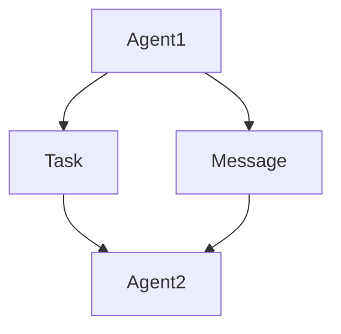
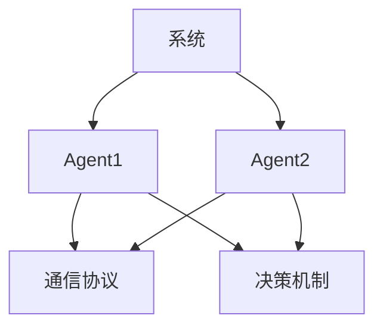
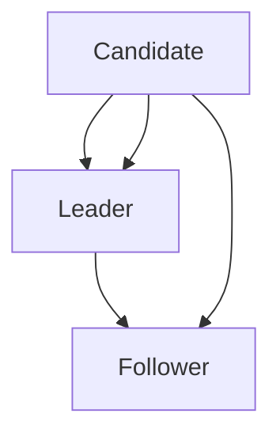
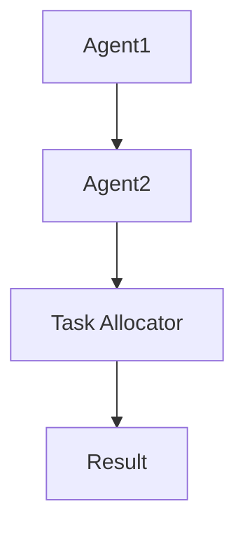
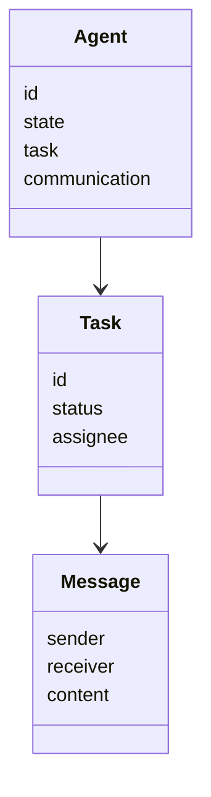
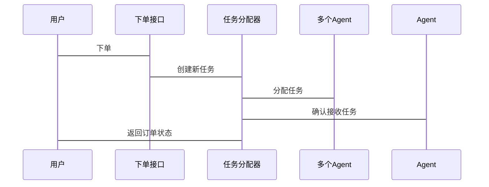

                 


# 开发具有多Agent协作能力的系统

> 关键词：多Agent协作、分布式系统、通信协议、一致性算法、系统架构设计、项目实战

> 摘要：本文详细探讨了开发具有多Agent协作能力的系统所需的关键技术和方法。从基本概念到系统架构设计，再到实际项目实现，全面解析多Agent协作的原理、算法、系统设计和最佳实践，帮助读者掌握开发此类系统的核心技能。

---

# 第1章 多Agent协作系统的背景与基础

## 1.1 多Agent系统的概念与特点

### 1.1.1 什么是多Agent系统
多Agent系统是由多个智能体（Agent）组成的分布式系统，每个Agent能够感知环境、自主决策并与其他Agent协作完成任务。

### 1.1.2 多Agent系统的分类
- **反应式Agent**：基于当前感知做出反应，无内部状态。
- **认知式Agent**：具备复杂推理和规划能力，有内部状态和目标。

### 1.1.3 多Agent系统的优势与挑战
- **优势**：分布式计算、容错性高、适应性强。
- **挑战**：通信复杂、协调困难、性能优化。

## 1.2 多Agent协作的背景与问题背景

### 1.2.1 分布式系统的发展趋势
随着云计算和物联网的发展，分布式系统需求增加，多Agent协作成为关键。

### 1.2.2 多Agent协作在现代应用中的重要性
在自动驾驶、机器人、智能交通等领域，多Agent协作是实现复杂任务的基础。

### 1.2.3 当前面临的主要问题与挑战
- **通信延迟**：Agent间通信可能影响实时性。
- **协调困难**：多个Agent目标不同，协调复杂。
- **一致性问题**：分布式系统中的数据一致性难以保证。

## 1.3 多Agent协作系统的结构与核心要素

### 1.3.1 多Agent系统的结构组成
- **单层结构**：Agent直接协作，适用于简单任务。
- **多层结构**：分为管理层和执行层，适用于复杂任务。

### 1.3.2 Agent的基本属性与特征
- **独立性**：Agent独立决策。
- **协作性**：Agent之间协作完成任务。
- **动态性**：环境变化时，Agent能适应调整。

### 1.3.3 多Agent协作的核心要素
- **通信机制**：Agent间信息交换方式。
- **协调机制**：确保任务顺利进行的策略。
- **决策机制**：基于环境信息做出决策。

---

# 第2章 多Agent协作的核心概念与联系

## 2.1 多Agent协作的通信与协调机制

### 2.1.1 Agent之间的通信协议
- **同步通信**：请求-响应模式。
- **异步通信**：异步消息传递。

### 2.1.2 协调机制
- **基于规则的协调**：预定义规则指导协作。
- **基于协商的协调**：动态协商任务分配。

## 2.2 多Agent协作中的Agent类型与协作机制对比

### 2.2.1 Agent的类型对比
| 类型       | 特点                         |
|------------|------------------------------|
| 反应式Agent | 基于当前感知做出反应           |
| 认知式Agent | 具备复杂推理和规划能力         |

### 2.2.2 协作机制对比
| 机制       | 描述                           |
|------------|--------------------------------|
| 基于规则   | 使用预定义规则进行协作         |
| 基于协商   | 动态协商任务分配和责任         |

## 2.3 多Agent协作中的实体关系与ER图

### 2.3.1 实体关系图


### 2.3.2 系统结构与核心要素


---

# 第3章 多Agent协作的算法原理

## 3.1 分布式一致性算法

### 3.1.1 Raft一致性算法
Raft算法用于分布式系统中达成一致，确保多个节点的状态同步。

#### Raft算法流程


#### Raft算法代码示例
```python
class Raft:
    def __init__(self):
        self.leader = None
        self.voted_for = None

    def request_vote(self, candidate_id):
        if self.voted_for is None and self.leader != candidate_id:
            self.voted_for = candidate_id
            return True
        return False

    def start_election(self):
        self.voted_for = None
        votes = 0
        for follower in followers:
            if follower.request_vote(self.id):
                votes += 1
        if votes > len(followers)/2:
            self.leader = self.id
```

## 3.2 分布式协调算法

### 3.2.1 基于协商的协调算法
通过动态协商分配任务，确保每个Agent的任务明确。

#### 协商流程


### 3.2.2 一致性算法的数学模型
一致性算法确保系统中所有节点的状态一致，通常使用共识算法（如Raft、Paxos）。

#### Raft算法的数学模型
$$ \text{一致性} = \sum_{i=1}^{n} \text{节点}_i.\text{状态} $$

---

# 第4章 系统分析与架构设计

## 4.1 问题场景介绍

### 4.1.1 多Agent协作的物流管理
设计一个多Agent协作的物流管理系统，实现订单处理和配送任务分配。

## 4.2 系统功能设计

### 4.2.1 领域模型


## 4.3 系统架构设计

### 4.3.1 分层架构


### 4.3.2 系统接口设计
- **订单处理接口**：接收订单信息，分配任务。
- **配送接口**：处理配送任务，更新状态。

## 4.4 系统交互流程

### 4.4.1 用户下单流程


---

# 第5章 项目实战

## 5.1 环境搭建

### 5.1.1 安装Python
安装Python 3.8及以上版本。

### 5.1.2 安装依赖
安装Django或Flask框架，用于开发Web服务。

## 5.2 核心代码实现

### 5.2.1 Agent通信模块
```python
class Agent:
    def __init__(self, id):
        self.id = id
        self.communication = {}

    def send_message(self, receiver, content):
        self.communication[receiver] = content

    def receive_message(self, sender):
        return self.communication.get(sender, None)
```

### 5.2.2 任务分配算法
```python
class TaskAllocator:
    def allocate_task(self, agents, task):
        # 简单轮询分配
        return agents[0]
```

## 5.3 代码实现与解读

### 5.3.1 通信模块实现
展示如何通过消息传递实现Agent间的协作。

### 5.3.2 任务分配算法实现
解释任务分配的逻辑，并分析其实现效果。

## 5.4 实际案例分析

### 5.4.1 物流管理系统的实现
详细讲解物流管理系统的实现步骤，展示代码和交互流程。

## 5.5 项目小结

### 5.5.1 经验总结
总结项目开发中的经验教训，优化建议。

---

# 第6章 最佳实践与总结

## 6.1 最佳实践 tips

### 6.1.1 通信机制选择
根据需求选择同步或异步通信。

### 6.1.2 一致性保障
使用一致性算法确保数据一致性。

## 6.2 全书总结

### 6.2.1 核心知识点回顾
总结多Agent协作系统的关键概念和算法。

### 6.2.2 进一步学习建议
推荐相关书籍和论文，扩展知识面。

## 6.3 注意事项

### 6.3.1 开发中的注意事项
- 确保通信可靠
- 优化系统性能
- 提高系统安全性

## 6.4 未来展望

### 6.4.1 多Agent协作的未来趋势
探讨人工智能和区块链技术在多Agent协作中的应用前景。

---

通过以上结构，读者可以系统地学习和掌握开发多Agent协作系统的各项技能，从基础概念到实际项目实现，逐步提升自己的技术水平。

