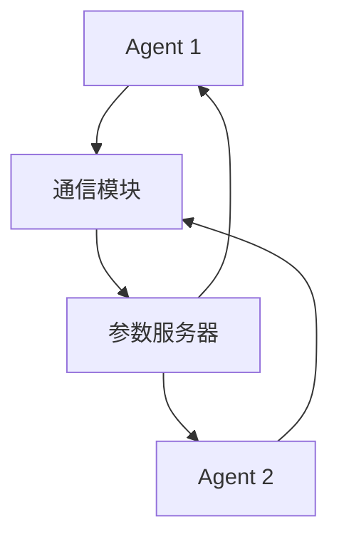
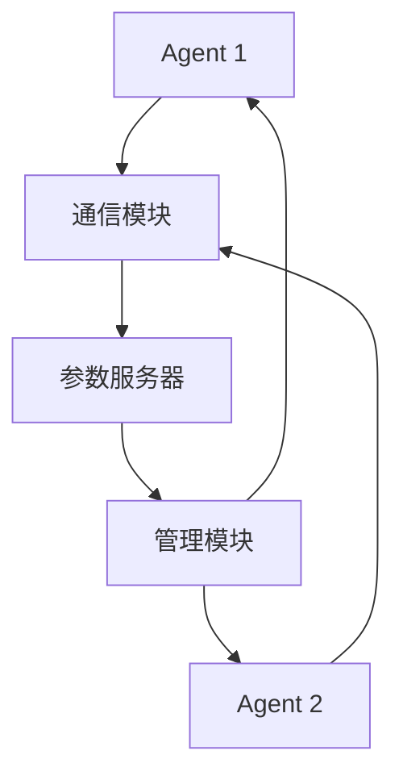
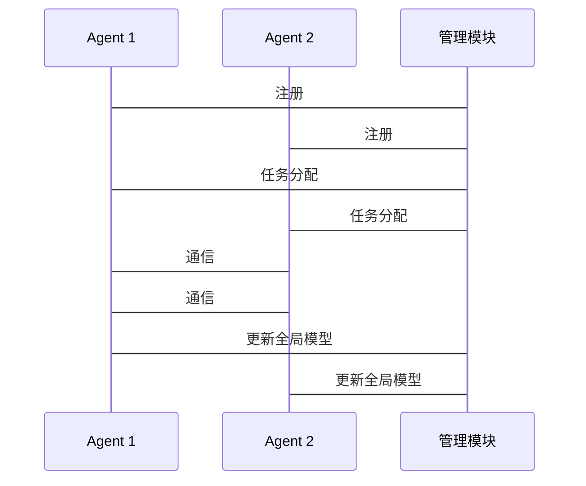

                 


# 开发具有多Agent协同学习能力的系统

## 关键词：多Agent系统，协同学习，分布式计算，协作协议，人工智能，系统架构

## 摘要：本文深入探讨了开发具有多Agent协同学习能力的系统的各个方面，从基本概念到实现细节，再到实际应用。文章首先介绍了多Agent系统的背景和协同学习的重要性，然后详细讲解了多Agent协同学习的核心概念和算法原理。接着，文章分析了系统的架构设计和接口设计，提供了实际的项目实战案例，并探讨了多Agent协同学习在不同领域的应用。最后，文章总结了开发多Agent协同学习系统的最佳实践和未来发展方向。

---

# 第1章 多Agent协同学习系统的背景与基础

## 1.1 多Agent系统的基本概念

### 1.1.1 什么是多Agent系统
多Agent系统是由多个智能体（Agent）组成的分布式系统，这些智能体能够自主决策、协作和通信，以完成共同的目标。

### 1.1.2 多Agent系统的特征
- **自主性**：每个Agent都能独立决策。
- **反应性**：能够感知环境并做出实时反应。
- **协作性**：多个Agent之间能够协同完成任务。
- **分布式**：Agent分布在不同的位置，通过网络通信。

### 1.1.3 多Agent与单Agent的区别
- **单Agent**：一个智能体独立完成任务。
- **多Agent**：多个智能体协作完成任务，具有更高的灵活性和容错性。

## 1.2 协同学习的基本概念

### 1.2.1 协同学习的定义
协同学习是指多个智能体通过协作和共享信息，共同提高学习效果的过程。

### 1.2.2 协同学习的类型
- **同步学习**：多个Agent同时学习，共享信息。
- **异步学习**：Agent在不同时间学习，通过通信共享信息。

### 1.2.3 协同学习的应用场景
- 教育：多个学生协作完成学习任务。
- 医疗：多个智能系统协作进行诊断。
- 金融：多个Agent协作进行股票交易。

## 1.3 多Agent协同学习的背景与意义

### 1.3.1 当前AI发展的趋势
人工智能技术快速发展，单Agent系统逐渐向多Agent系统发展。

### 1.3.2 多Agent协同学习的重要性
- 提高系统的智能性和灵活性。
- 实现复杂任务的分解和协作。

### 1.3.3 多Agent协同学习的应用前景
- 智能家居：多个智能设备协作完成家庭自动化。
- 自动驾驶：多个车辆协作完成交通管理。

---

# 第2章 多Agent协同学习的核心概念与原理

## 2.1 多Agent系统中的通信与协作

### 2.1.1 Agent之间的通信机制
- **直接通信**：Agent之间直接交换信息。
- **间接通信**：通过中间媒介进行信息交换。

### 2.1.2 协作协议的设计
- **协商协议**：确定任务分配和责任分工。
- **通信协议**：定义信息交换的标准格式。

### 2.1.3 通信协议的选择与实现
选择合适的通信协议（如HTTP、WebSocket）并实现高效的通信机制。

## 2.2 多Agent协同学习的数学模型

### 2.2.1 协同学习的基本模型
- **分布式学习模型**：每个Agent独立学习，通过通信共享信息。
- **集中式学习模型**：所有Agent将数据集中到一个中心节点进行学习。

### 2.2.2 多Agent协作的数学表达
使用数学公式描述Agent之间的协作过程。

$$
y_i = \sum_{j=1}^{n} w_{ij}x_j
$$

### 2.2.3 协同学习的优化目标
优化目标函数以提高学习效果。

$$
\min_{w} \frac{1}{2n} \sum_{i=1}^{n} (y_i - t_i)^2
$$

## 2.3 多Agent系统中的分布式计算

### 2.3.1 分布式计算的基本概念
- **分布式计算**：任务分布在多个计算节点上执行。

### 2.3.2 分布式计算在多Agent系统中的应用
- **数据分片**：将数据分片分配给不同的Agent处理。
- **任务分解**：将复杂任务分解为多个子任务，由不同的Agent完成。

### 2.3.3 分布式计算的挑战与解决方案
- **数据一致性**：通过共识算法（如拜占庭容错）保证数据一致性。
- **计算同步**：通过分布式锁机制保证计算同步。

---

# 第3章 多Agent协同学习的算法与实现

## 3.1 分布式学习算法

### 3.1.1 分布式学习算法的基本原理
- **局部学习**：每个Agent在本地进行学习。
- **全局优化**：通过通信将局部结果汇总到全局模型。

### 3.1.2 分布式学习算法的实现步骤
1. 初始化全局模型参数。
2. 每个Agent在本地数据上进行训练，更新局部参数。
3. 将局部参数上传到中心服务器，更新全局模型。

### 3.1.3 分布式学习算法的优化
- **参数服务器**：使用参数服务器集中更新全局模型。
- **异步更新**：允许Agent异步更新参数，提高效率。

## 3.2 基于多Agent的分布式学习实现

### 3.2.1 系统架构设计
使用Mermaid绘制系统架构图：



### 3.2.2 实现代码示例
Python代码实现分布式学习：

```python
import numpy as np

class Agent:
    def __init__(self, id):
        self.id = id
        self.weights = np.random.randn(2, 2)

    def update_weights(self, gradients, learning_rate):
        self.weights -= learning_rate * gradients

def main():
    # 初始化多个Agent
    agents = [Agent(1), Agent(2)]
    # 参数服务器
    server_weights = np.random.randn(2, 2)
    
    # 通信模块
    def average_gradients(agents):
        # 计算平均梯度
        avg_gradients = np.zeros_like(server_weights)
        for agent in agents:
            avg_gradients += agent.weights
        avg_gradients /= len(agents)
        return avg_gradients
    
    # 迭代更新
    for _ in range(100):
        # 计算梯度
        gradients = average_gradients(agents)
        # 更新参数服务器
        server_weights -= 0.1 * gradients
        # 更新Agent权重
        for agent in agents:
            agent.update_weights(gradients, 0.1)

if __name__ == "__main__":
    main()
```

---

# 第4章 多Agent协同学习的系统设计

## 4.1 系统架构设计

### 4.1.1 系统功能设计
- **通信模块**：负责Agent之间的信息交换。
- **学习模块**：负责协同学习算法的实现。
- **管理模块**：负责Agent的注册、任务分配和状态管理。

### 4.1.2 系统架构图
使用Mermaid绘制系统架构图：



## 4.2 接口设计与交互流程

### 4.2.1 接口设计
- **注册接口**：Agent向管理模块注册。
- **通信接口**：Agent之间通过通信模块交换信息。
- **任务分配接口**：管理模块根据任务需求分配任务。

### 4.2.2 交互流程
使用Mermaid绘制交互流程图：



---

# 第5章 项目实战：实现一个多Agent协同学习系统

## 5.1 环境搭建

### 5.1.1 安装必要的库
- Python
- NumPy
- TensorFlow
- 进程间通信库（如ZMQ）

## 5.2 核心代码实现

### 5.2.1 Agent类实现
```python
import zmq

class Agent:
    def __init__(self, id):
        self.id = id
        self.context = zmq.Context()
        self.socket = self.context.socket(zmq.REQ)
        self.socket.connect("tcp://localhost:5555")

    def send_message(self, message):
        self.socket.send_pyobj(message)

    def receive_message(self):
        return self.socket.recv_pyobj()
```

### 5.2.2 参数服务器实现
```python
import zmq

class ParameterServer:
    def __init__(self):
        self.context = zmq.Context()
        self.socket = self.context.socket(zmq.REP)
        self.socket.bind("tcp://localhost:5555")

    def run(self):
        while True:
            message = self.socket.recv_pyobj()
            # 处理消息并返回响应
            self.socket.send_pyobj("ACK")
```

## 5.3 案例分析与实现

### 5.3.1 实现一个多Agent协同学习系统
```python
# 启动参数服务器
server = ParameterServer()
server.run()

# 启动多个Agent
agents = [Agent(1), Agent(2)]
for agent in agents:
    agent.send_message("Hello, server!")
```

---

# 第6章 多Agent协同学习系统的应用与案例

## 6.1 多Agent协同学习在教育中的应用
- **应用场景**：多个学生协作完成学习任务。
- **案例分析**：通过多Agent协同学习实现个性化学习推荐。

## 6.2 多Agent协同学习在医疗中的应用
- **应用场景**：多个医疗系统协作进行诊断。
- **案例分析**：通过多Agent协同学习实现精准医疗。

## 6.3 多Agent协同学习在金融中的应用
- **应用场景**：多个金融系统协作进行股票交易。
- **案例分析**：通过多Agent协同学习实现智能投资组合管理。

---

# 第7章 总结与展望

## 7.1 本章总结
本文详细探讨了开发具有多Agent协同学习能力的系统的各个方面，从基本概念到实现细节，再到实际应用。

## 7.2 未来展望
随着人工智能技术的不断发展，多Agent协同学习将更加广泛地应用于各个领域，未来的研究方向包括更高效的通信协议、更智能的协作机制以及更强大的分布式计算能力。

---

# 最佳实践 Tips

- **通信协议选择**：选择适合的通信协议以提高系统的效率。
- **系统架构设计**：合理设计系统架构以确保系统的稳定性和可扩展性。
- **算法优化**：不断优化协同学习算法以提高学习效果。
- **安全性考虑**：确保系统中的数据安全和隐私保护。

---

通过本文的详细讲解和实际案例分析，读者可以全面掌握开发具有多Agent协同学习能力系统的相关知识和技能。

