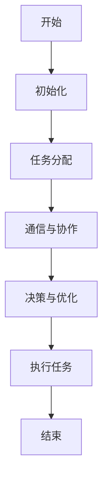
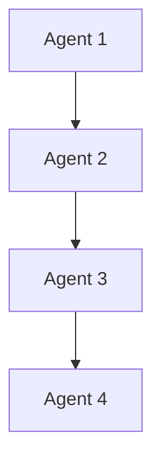
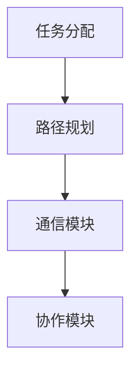
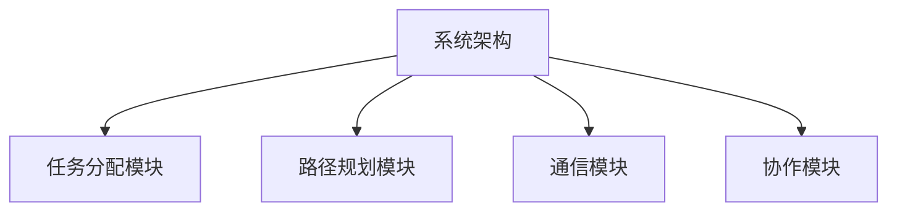
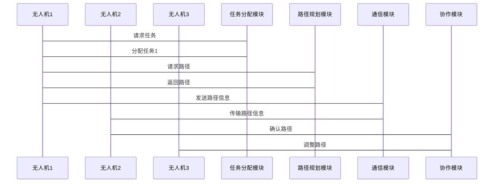

                 


# 开发具有多Agent协同规划能力的系统

> 关键词：多Agent系统，协同规划，算法原理，系统架构设计，项目实战

> 摘要：本文详细介绍了开发具有多Agent协同规划能力的系统的各个方面。从基本概念到核心算法，从系统架构设计到项目实战，全面阐述了多Agent协同规划系统的核心原理和实现方法。文章通过理论分析和实践案例相结合的方式，深入探讨了多Agent协同规划系统的开发过程，为读者提供了从理论到实践的完整指导。

---

# 第一部分: 多Agent协同规划系统背景与核心概念

## 第1章: 多Agent协同规划系统概述

### 1.1 多Agent系统的基本概念

#### 1.1.1 什么是多Agent系统
多Agent系统（Multi-Agent System, MAS）是由多个智能体（Agent）组成的分布式系统，这些智能体通过协作完成特定任务。每个Agent都是一个能够感知环境、自主决策、主动行动的实体。

#### 1.1.2 多Agent系统的特征
- **自主性**：每个Agent都具有自主决策的能力，能够独立完成任务。
- **反应性**：Agent能够实时感知环境并做出反应。
- **协作性**：多个Agent之间能够通过通信和协作共同完成复杂任务。
- **分布性**：系统中的Agent分布在网络中的不同节点上，不存在集中控制点。

#### 1.1.3 多Agent系统与传统单体系统的主要区别
- **结构**：多Agent系统是分布式的，而单体系统是集中式的。
- **协作性**：多Agent系统强调Agent之间的协作，而单体系统通常是单线程的。
- **灵活性**：多Agent系统能够更好地适应动态变化的环境。

### 1.2 协同规划的定义与背景

#### 1.2.1 协同规划的基本概念
协同规划是指多个Agent在协作过程中共同制定和优化行动计划的过程。它是多Agent系统中实现任务分配和协作的核心机制。

#### 1.2.2 协同规划在多Agent系统中的重要性
协同规划能够提高系统的整体效率和灵活性，使多个Agent能够更好地协调行动，避免冲突。

#### 1.2.3 协同规划的实际应用场景
- **分布式任务分配**：例如无人机编队、机器人协作等。
- **复杂问题求解**：例如多智能体共同解决NP难问题。
- **动态环境适应**：例如智能交通系统中的路径规划。

### 1.3 多Agent协同规划的核心问题

#### 1.3.1 问题背景与挑战
在多Agent系统中，协同规划的核心问题包括任务分配、路径规划、资源分配等，这些都需要通过Agent之间的协作来解决。

#### 1.3.2 问题描述与目标
- **问题描述**：多个Agent需要在动态环境中协作完成特定任务。
- **目标**：制定合理的计划，确保任务高效完成，同时避免冲突。

#### 1.3.3 问题解决的基本思路与方法
- **任务分解**：将整体任务分解为多个子任务，分配给不同的Agent。
- **通信与协作**：通过通信协议实现Agent之间的信息共享和协作。
- **冲突解决**：通过协商机制解决任务分配中的冲突。

### 1.4 本章小结
本章介绍了多Agent系统的基本概念、协同规划的定义与背景，以及多Agent协同规划的核心问题。通过这些内容，我们为后续的算法设计和系统实现奠定了基础。

---

## 第2章: 多Agent协同规划的核心概念与联系

### 2.1 多Agent系统中的关键概念

#### 2.1.1 Agent的基本属性与行为
- **属性**：每个Agent都有自己的目标、知识库、行动规则等。
- **行为**：Agent能够根据感知的信息做出决策并执行行动。

#### 2.1.2 Agent之间的通信与协作
- **通信机制**：Agent之间通过消息传递进行通信。
- **协作机制**：通过共享任务目标和行动计划实现协作。

#### 2.1.3 Agent的决策与规划机制
- **决策机制**：基于当前状态和环境信息做出决策。
- **规划机制**：制定行动计划并优化执行方案。

#### 2.1.4 Agent之间的关系
- **对称关系**：Agent之间地位平等，共同完成任务。
- **非对称关系**：部分Agent具有更高的权限或承担更多的责任。

### 2.2 协同规划的数学模型与公式

#### 2.2.1 协同规划的基本数学模型
$$ \text{目标函数：} \quad f(x_1, x_2, \ldots, x_n) $$
$$ \text{约束条件：} \quad g(x_i) \leq 0, \quad i = 1, 2, \ldots, m $$

其中，$x_i$ 表示第 $i$ 个Agent的决策变量，$f$ 是目标函数，$g$ 是约束条件。

#### 2.2.2 Agent之间的协作关系表示
通过矩阵形式表示Agent之间的协作关系：
$$
\begin{pmatrix}
1 & 1 & 0 \\
1 & 0 & 1 \\
0 & 1 & 1
\end{pmatrix}
$$
其中，1表示协作关系，0表示无协作关系。

#### 2.2.3 协同规划的目标函数与约束条件
目标函数：$$ \min \sum_{i=1}^{n} c_i x_i $$
约束条件：$$ \sum_{i=1}^{n} x_i \leq 1 $$

### 2.3 多Agent系统中的实体关系图

#### 2.3.1 ER图的基本概念
ER图用于描述系统中的实体及其关系。在多Agent系统中，实体包括Agent、任务、环境等。

#### 2.3.2 多Agent系统中的实体关系建模

```mermaid
erd
  agent(AgentID, Name, Role)
  task(TaskID, Description, Deadline)
  environment(EnvironmentID, State)
  agent_has_task(AgentID, TaskID)
  agent_in_environment(AgentID, EnvironmentID)
```

#### 2.3.3 实体关系图与协同规划的关系
实体关系图帮助我们理解系统中各实体之间的关系，从而为协同规划提供数据模型和约束条件。

### 2.4 本章小结
本章深入探讨了多Agent系统中的关键概念，通过数学模型和实体关系图，为后续的算法设计和系统实现提供了理论基础。

---

## 第3章: 多Agent协同规划的算法原理

### 3.1 协同规划算法的基本原理

#### 3.1.1 算法的基本思路
协同规划算法的基本思路是通过Agent之间的通信和协作，逐步优化任务分配和行动计划。

#### 3.1.2 算法的主要步骤
1. **初始化**：每个Agent初始化自己的状态和任务。
2. **通信**：Agent之间通过消息传递共享信息。
3. **决策**：基于共享信息制定行动计划。
4. **优化**：通过协商和调整优化计划。
5. **执行**：按照优化后的计划执行任务。

#### 3.1.3 算法的输入输出
- **输入**：任务列表、Agent能力、环境状态。
- **输出**：优化后的任务分配和行动计划。

### 3.2 协同规划算法的数学模型

#### 3.2.1 协同规划的数学表达
$$ \text{目标函数：} \quad \min \sum_{i=1}^{n} c_i x_i $$
$$ \text{约束条件：} \quad \sum_{i=1}^{n} x_i \leq 1 $$

其中，$c_i$ 是任务分配给Agent $i$ 的成本，$x_i$ 是决策变量（0或1）。

#### 3.2.2 约束条件与目标函数
- **约束条件**：每个任务只能分配给一个Agent。
- **目标函数**：最小化总成本。

### 3.3 协同规划算法的流程图



#### 3.3.1 算法的整体流程
从初始化到任务执行，通过通信和协作逐步优化任务分配。

#### 3.3.2 Agent之间的协作流程


#### 3.3.3 算法的优化与改进
通过不断迭代优化，提高算法的效率和鲁棒性。

### 3.4 本章小结
本章详细介绍了协同规划算法的基本原理和实现流程，为后续的系统设计提供了算法基础。

---

## 第4章: 多Agent协同规划系统的系统分析与架构设计

### 4.1 系统分析

#### 4.1.1 问题场景描述
假设我们正在开发一个无人机编队系统，需要多个无人机协同完成任务。

#### 4.1.2 系统目标与需求
- **目标**：实现多无人机协同飞行。
- **需求**：任务分配、路径规划、通信与协作。

#### 4.1.3 系统的约束条件与边界
- **约束条件**：通信延迟、无人机数量、任务复杂度。
- **边界**：无人机之间必须通过无线通信进行协作。

### 4.2 系统功能设计

#### 4.2.1 系统功能模块划分
1. **任务分配模块**：负责将任务分配给不同的无人机。
2. **路径规划模块**：制定飞行路径。
3. **通信模块**：实现无人机之间的通信。
4. **协作模块**：协调无人机的行动。

#### 4.2.2 功能模块之间的关系


#### 4.2.3 功能模块的实现方式
- **任务分配**：基于协同规划算法。
- **路径规划**：使用A*算法或其他路径规划算法。
- **通信模块**：通过无线电或卫星通信实现。

### 4.3 系统架构设计

#### 4.3.1 系统架构


#### 4.3.2 系统架构图


#### 4.3.3 系统交互序列图


### 4.4 本章小结
本章通过系统分析和架构设计，为多Agent协同规划系统的实现提供了详细的指导。

---

## 第5章: 多Agent协同规划系统的项目实战

### 5.1 环境安装

#### 5.1.1 安装Python环境
安装Python 3.8及以上版本。

#### 5.1.2 安装必要的库
使用pip安装numpy、scipy、matplotlib等库。

#### 5.1.3 配置开发环境
安装PyCharm或其他代码编辑器。

### 5.2 系统核心实现源代码

#### 5.2.1 协同规划算法实现
```python
import numpy as np

def协同规划算法(任务列表, Agent数量):
    # 初始化
    任务分配 = np.zeros(Agent数量)
    # 任务分配逻辑
    for i in range(len(任务列表)):
        # 选择最优Agent分配任务
        任务分配[i] = np.argmax(任务列表[i])
    return 任务分配
```

#### 5.2.2 系统功能实现
```python
class Agent:
    def __init__(self, ID):
        self.ID = ID
        self.任务 = None
        self.路径 = None

    def 分配任务(self, 任务列表):
        # 选择最优任务
        self.任务 = 任务列表[self.ID]

    def 规划路径(self, 目标位置):
        # 使用A*算法规划路径
        pass

    def 通信(self, 其他Agent):
        # 传递信息
        pass
```

#### 5.2.3 系统接口设计
```python
class 系统接口:
    def 初始化(self, Agent数量):
        self.Agents = [Agent(i) for i in range(Agent数量)]

    def 分配任务(self, 任务列表):
        for agent in self.Agents:
            agent.分配任务(任务列表)

    def 规划路径(self, 目标位置):
        for agent in self.Agents:
            agent.规划路径(目标位置)
```

### 5.3 实际案例分析与详细讲解

#### 5.3.1 案例描述
假设我们有三个Agent，需要分配三个任务。任务1需要Agent1和Agent2协作完成，任务2需要Agent2和Agent3协作完成，任务3需要Agent1和Agent3协作完成。

#### 5.3.2 代码实现与分析
```python
任务列表 = [[1, 0, 0], [0, 1, 0], [0, 0, 1]]
Agent数量 = 3
系统 = 系统接口()
系统.初始化(Agent数量)
系统.分配任务(任务列表)
# 输出结果
print(系统.任务分配)
```

#### 5.3.3 算法优化与改进
通过不断迭代优化，提高算法的效率和鲁棒性。

### 5.4 本章小结
本章通过项目实战，详细讲解了多Agent协同规划系统的实现过程，包括环境安装、核心代码实现和实际案例分析。

---

## 第6章: 多Agent协同规划系统的最佳实践与注意事项

### 6.1 最佳实践

#### 6.1.1 系统设计原则
- **模块化**：确保系统的模块化设计，便于维护和扩展。
- **可扩展性**：设计可扩展的架构，适应未来的需求。
- **容错性**：系统应具备容错能力，能够处理Agent的故障。

#### 6.1.2 开发规范
- **代码规范**：遵循Python代码规范。
- **文档编写**：编写详细的系统文档。
- **测试用例**：编写充分的测试用例。

### 6.2 小结
通过遵循最佳实践，可以提高系统的开发效率和质量。

### 6.3 注意事项

#### 6.3.1 系统性能
- **通信延迟**：注意通信延迟对系统性能的影响。
- **计算资源**：确保系统具备足够的计算资源。

#### 6.3.2 安全性
- **数据安全**：确保系统数据的安全性。
- **权限管理**：合理分配Agent的权限。

#### 6.3.3 可维护性
- **代码可读性**：确保代码的可读性。
- **模块化设计**：保持系统的模块化设计。

### 6.4 拓展阅读
建议读者阅读相关领域的书籍和论文，进一步深入学习。

---

## 第7章: 总结与展望

### 7.1 总结
本文详细介绍了开发具有多Agent协同规划能力的系统的各个方面，从理论到实践，为读者提供了全面的指导。

### 7.2 展望
随着人工智能技术的发展，多Agent协同规划系统将得到更广泛的应用，未来的研究方向包括更高效的算法设计和更复杂的系统架构。

---

## 附录: 参考文献与工具

### 附录A: 参考文献
1. 多Agent系统相关书籍。
2. 协同规划算法相关论文。
3. 相关技术文档。

### 附录B: 开发工具
- Python
- numpy
- scipy
- matplotlib
- Mermaid

---

# 结语

通过本文的详细讲解，读者可以系统性地掌握多Agent协同规划系统的开发过程。从理论分析到实践实现，从系统设计到项目实战，本文为读者提供了全面的指导。希望本文能够为开发具有多Agent协同规划能力的系统提供有价值的参考。

