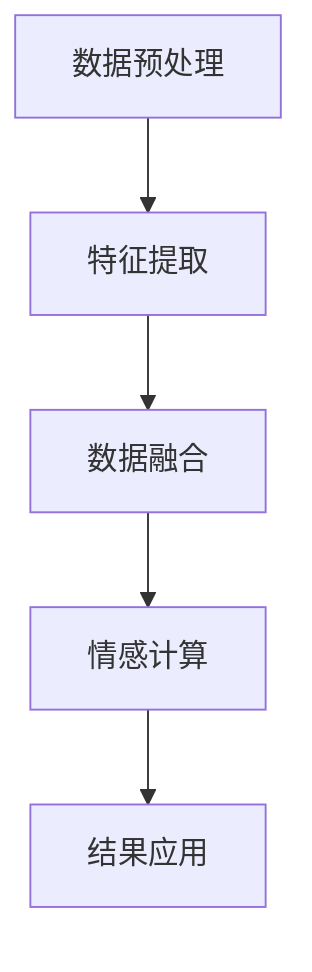

                 


# 开发具有多模态情感分析能力的AI Agent

## 关键词：多模态情感分析，AI Agent，自然语言处理，深度学习，计算机视觉

## 摘要：本文系统性地探讨了开发具有多模态情感分析能力的AI Agent所需的关键技术与实现方法。从多模态数据的融合、情感计算的数学模型、多模态Transformer与对比学习算法原理，到系统的架构设计与项目实战，文章层层深入，结合实际案例分析，提供完整的解决方案和开发指导。文章最后总结了开发中的注意事项与最佳实践，为读者提供全面的技术参考。

---

# 第一部分: 多模态情感分析AI Agent开发背景与核心概念

## 第1章: 多模态情感分析与AI Agent概述

### 1.1 多模态情感分析的背景与意义

#### 1.1.1 情感分析的定义与演进

情感分析是自然语言处理中的一个经典任务，旨在判断文本中表达的情感倾向。最初的情感分析主要基于文本数据，通过词袋模型和简单的分类算法实现。然而，随着AI技术的进步，情感分析逐渐从单模态（文本）扩展到多模态（文本、语音、图像等）。

| **单模态情感分析** | **多模态情感分析** |
|--------------------|---------------------|
| 数据来源           | 文本                | 文本、语音、图像、视频 |
| 优势               | 简单实现             | 更高的情感识别精度，更强的语境理解能力 |
| 限制               | 易受歧义影响           | 更适合复杂场景的情感分析 |

#### 1.1.2 多模态数据的引入与优势

多模态数据的引入可以显著提高情感分析的准确性。例如，结合文本和语音数据，可以更准确地判断说话者的情感状态。此外，图像数据的引入还可以帮助识别表情和姿态，从而进一步增强情感分析的能力。

#### 1.1.3 AI Agent在情感分析中的作用

AI Agent作为智能体，能够实时接收并处理多模态数据，快速做出情感判断，并根据结果采取相应的行动。这种能力使得AI Agent在客服、教育、医疗等领域具有广泛的应用前景。

### 1.2 多模态情感分析的核心问题

#### 1.2.1 问题背景与问题描述

在实际应用中，情感分析面临的挑战包括：

- **数据异构性**：不同模态的数据格式和特征空间差异较大。
- **特征提取困难**：如何有效提取跨模态的特征并进行融合是关键问题。
- **计算复杂性**：多模态数据的处理需要更高的计算资源。

#### 1.2.2 多模态数据融合的挑战

多模态数据融合需要解决以下问题：

- **数据对齐**：不同模态的数据在时间或空间上可能不对齐。
- **特征权重分配**：不同模态的数据对最终情感判断的贡献程度不同。
- **模型设计**：如何设计有效的融合模型是关键。

#### 1.2.3 情感计算的边界与外延

情感计算不仅关注情感的识别，还包括情感的生成和情感驱动的决策。多模态情感分析的外延包括：

- **情感生成**：根据上下文生成情感化文本。
- **情感驱动决策**：基于情感分析结果做出智能决策。

### 1.3 多模态情感分析的系统架构

#### 1.3.1 多模态数据流的处理流程

多模态数据流的处理流程包括：

1. 数据采集：获取多模态数据（如文本、语音、图像）。
2. 数据预处理：对数据进行标准化处理。
3. 特征提取：提取各模态的特征。
4. 数据融合：将不同模态的特征进行融合。
5. 情感计算：基于融合后的特征进行情感分析。
6. 结果应用：根据情感分析结果进行相应的处理。

#### 1.3.2 情感计算的模块划分

情感计算系统可以划分为以下几个模块：

- **数据预处理模块**：负责数据的清洗和标准化。
- **特征提取模块**：负责从各模态数据中提取特征。
- **数据融合模块**：将不同模态的特征进行融合。
- **情感计算模块**：基于融合后的特征进行情感分析。
- **结果应用模块**：根据情感分析结果进行相应的处理。

#### 1.3.3 AI Agent与情感分析的结合方式

AI Agent可以通过以下方式与情感分析结合：

- **实时交互**：AI Agent实时接收用户输入，进行情感分析，并根据结果做出回应。
- **数据驱动决策**：AI Agent根据情感分析结果优化决策过程。
- **情感反馈**：AI Agent可以向用户提供情感反馈，增强交互体验。

### 1.4 多模态情感分析的核心概念与联系

#### 1.4.1 多模态数据融合的原理

多模态数据融合的原理可以概括为：

1. **特征提取**：从每个模态中提取特征。
2. **特征融合**：将不同模态的特征进行融合，得到综合特征。
3. **情感计算**：基于综合特征进行情感分析。

#### 1.4.2 情感计算的数学模型

情感计算的数学模型可以表示为：

$$ \text{情感评分} = f(\text{文本特征}, \text{语音特征}, \text{图像特征}) $$

其中，\( f \) 是一个多模态融合函数。

#### 1.4.3 实体关系图与数据流图

以下是多模态情感分析的实体关系图：

```mermaid
graph TD
    A[文本数据] --> B[文本特征]
    C[语音数据] --> D[语音特征]
    E[图像数据] --> F[图像特征]
    G[综合特征] <-- B, D, F
    H[情感评分] <-- G
```

以下是多模态情感分析的数据流图：



---

## 第2章: 多模态情感分析的核心概念与联系

### 2.1 多模态数据融合原理

#### 2.1.1 多模态数据的定义与分类

多模态数据可以分为以下几类：

- **文本数据**：包括文本、对话等。
- **语音数据**：包括语音、语调等。
- **图像数据**：包括图像、视频等。

#### 2.1.2 数据融合的层次与方法

数据融合的层次包括：

1. **低层次融合**：在特征级别进行融合。
2. **高层次融合**：在语义级别进行融合。

数据融合的方法包括：

- **线性融合**：将不同模态的特征线性组合。
- **非线性融合**：使用深度学习模型进行融合。

#### 2.1.3 跨模态特征提取的原理

跨模态特征提取的原理是：

1. 从不同模态数据中提取特征。
2. 将这些特征映射到相同的特征空间。
3. 进行融合和分析。

### 2.2 情感计算的数学模型

#### 2.2.1 情感计算的数学表达

情感计算的数学表达可以表示为：

$$ \text{情感评分} = \sum_{i=1}^{n} w_i x_i $$

其中，\( w_i \) 是第 \( i \) 个模态的权重，\( x_i \) 是第 \( i \) 个模态的特征。

#### 2.2.2 多模态数据融合的公式推导

多模态数据融合的公式推导可以表示为：

$$ f(\mathbf{x}_1, \mathbf{x}_2, \ldots, \mathbf{x}_n) = \text{融合函数}(\mathbf{x}_1, \mathbf{x}_2, \ldots, \mathbf{x}_n) $$

其中，\( \mathbf{x}_i \) 是第 \( i \) 个模态的特征向量。

#### 2.2.3 情感评分的计算方法

情感评分的计算方法可以是：

$$ \text{情感评分} = \text{sigmoid}(\mathbf{W}^T \mathbf{x} + b) $$

其中，\( \mathbf{W} \) 是权重矩阵，\( \mathbf{x} \) 是融合后的特征向量，\( b \) 是偏置项。

### 2.3 实体关系图与数据流图

以下是多模态情感分析的实体关系图：

```mermaid
graph TD
    A[文本数据] --> B[文本特征]
    C[语音数据] --> D[语音特征]
    E[图像数据] --> F[图像特征]
    G[综合特征] <-- B, D, F
    H[情感评分] <-- G
```

以下是多模态情感分析的数据流图：


---

## 第3章: 多模态情感分析的算法原理

### 3.1 多模态Transformer模型

#### 3.1.1 Transformer的结构与原理

Transformer的结构包括编码器和解码器。编码器负责将输入数据编码为固定长度的向量，解码器负责将编码后的向量解码为输出。

#### 3.1.2 多模态数据的编码方式

多模态数据的编码方式包括：

- **独立编码**：将每个模态的数据独立编码。
- **联合编码**：将多个模态的数据联合编码。

#### 3.1.3 多模态Transformer的训练流程

多模态Transformer的训练流程包括：

1. 数据预处理。
2. 特征提取。
3. 数据融合。
4. 模型训练。
5. 模型评估。

### 3.2 对比学习与跨模态注意力机制

#### 3.2.1 对比学习的基本原理

对比学习的基本原理是通过最大化正样本的相似性，最小化负样本的相似性。

#### 3.2.2 跨模态注意力机制的实现

跨模态注意力机制的实现包括：

- **查询生成**：从一个模态生成查询向量。
- **注意力计算**：计算查询向量与另一个模态的特征向量的注意力权重。
- **加权求和**：根据注意力权重对特征向量进行加权求和。

#### 3.2.3 对比学习在情感分析中的应用

对比学习在情感分析中的应用包括：

- **跨模态对比**：将不同模态的数据进行对比学习。
- **自监督学习**：通过自监督的方式进行情感分析。

### 3.3 情感评分预测模型

#### 3.3.1 模型输入与输出的定义

模型输入包括多个模态的特征向量，模型输出是情感评分。

#### 3.3.2 情感评分预测的损失函数

情感评分预测的损失函数可以是交叉熵损失函数：

$$ \text{损失} = -\sum_{i=1}^{n} y_i \log(p_i) + (1 - y_i) \log(1 - p_i) $$

其中，\( y_i \) 是真实标签，\( p_i \) 是预测概率。

#### 3.3.3 模型训练的优化策略

模型训练的优化策略包括：

- **学习率调整**：使用学习率衰减策略。
- **批量训练**：使用批量训练提高训练效率。
- **正则化**：使用Dropout等正则化方法防止过拟合。

---

## 第4章: 多模态情感分析的系统架构设计

### 4.1 系统分析与架构设计

#### 4.1.1 问题场景介绍

问题场景介绍包括：

- **数据来源**：多模态数据的获取。
- **处理流程**：数据预处理、特征提取、数据融合、情感计算、结果应用。
- **系统目标**：实现具有多模态情感分析能力的AI Agent。

#### 4.1.2 项目介绍

项目介绍包括：

- **项目名称**：多模态情感分析AI Agent开发。
- **项目目标**：开发一个能够处理多模态数据并进行情感分析的AI Agent。
- **项目范围**：包括数据采集、特征提取、数据融合、模型训练、系统集成等。

#### 4.1.3 系统功能设计

系统功能设计包括：

- **数据预处理模块**：负责数据的清洗和标准化。
- **特征提取模块**：负责从各模态数据中提取特征。
- **数据融合模块**：将不同模态的特征进行融合。
- **情感计算模块**：基于融合后的特征进行情感分析。
- **结果应用模块**：根据情感分析结果进行相应的处理。

#### 4.1.4 系统架构设计

系统架构设计包括：

- **数据预处理层**：负责数据的清洗和标准化。
- **特征提取层**：负责从各模态数据中提取特征。
- **数据融合层**：将不同模态的特征进行融合。
- **情感计算层**：基于融合后的特征进行情感分析。
- **结果应用层**：根据情感分析结果进行相应的处理。

### 4.2 系统接口设计与交互流程

#### 4.2.1 系统接口设计

系统接口设计包括：

- **输入接口**：接收多模态数据。
- **输出接口**：输出情感分析结果。
- **控制接口**：控制系统的运行和停止。

#### 4.2.2 系统交互流程

系统交互流程包括：

1. 用户输入多模态数据。
2. 系统接收数据并进行预处理。
3. 系统提取各模态的特征。
4. 系统进行数据融合。
5. 系统进行情感分析。
6. 系统输出情感分析结果。

---

## 第5章: 多模态情感分析项目的实战开发

### 5.1 项目环境安装

项目环境安装包括：

- **Python**：安装Python 3.8及以上版本。
- **深度学习框架**：安装TensorFlow或PyTorch。
- **自然语言处理库**：安装spaCy或NLTK。
- **语音处理库**：安装 librosa 或 soundfile。
- **图像处理库**：安装OpenCV或 PIL。

### 5.2 系统核心实现源代码

以下是多模态情感分析系统的核心代码：

```python
import tensorflow as tf
from tensorflow.keras import layers

# 定义多模态Transformer模型
class MultiModalTransformer(tf.keras.Model):
    def __init__(self, input_shape):
        super(MultiModalTransformer, self).__init__()
        self.embedding = layers.Dense(128, activation='relu')
        self.transformer = layers.Transformer(
            encoder_layers=2,
            decoder_layers=2,
            d_model=128,
            nhead=4
        )
        self.dropout = layers.Dropout(0.1)
        self.dense = layers.Dense(1, activation='sigmoid')

    def call(self, inputs):
        x = self.embedding(inputs)
        x = self.transformer(x, x)
        x = self.dropout(x)
        x = self.dense(x)
        return x

# 定义对比学习模型
class ContrastiveLearning(tf.keras.Model):
    def __init__(self, embedding_dim=128):
        super(ContrastiveLearning, self).__init__()
        self.encoder = layers.Dense(embedding_dim, activation='relu')
        self.dropout = layers.Dropout(0.1)
        self.dense = layers.Dense(1, activation='sigmoid')

    def call(self, inputs):
        x = self.encoder(inputs)
        x = self.dropout(x)
        x = self.dense(x)
        return x

# 定义注意力机制模型
class CrossModalAttention(tf.keras.Model):
    def __init__(self):
        super(CrossModalAttention, self).__init__()
        self.attention = layers.Attention()
        self.dropout = layers.Dropout(0.1)
        self.dense = layers.Dense(1, activation='sigmoid')

    def call(self, inputs):
        x = self.attention([inputs[0], inputs[1]])
        x = self.dropout(x)
        x = self.dense(x)
        return x
```

### 5.3 项目实战：训练与推理

以下是项目的训练和推理代码：

```python
# 训练代码
model = MultiModalTransformer(input_shape=(128,))
optimizer = tf.keras.optimizers.Adam(learning_rate=0.001)
loss_fn = tf.keras.losses.BinaryCrossentropy()

# 训练循环
for epoch in range(10):
    for batch in train_loader:
        with tf.GradientTape() as tape:
            predictions = model(batch)
            loss = loss_fn(batch_labels, predictions)
        gradients = tape.gradient(loss, model.trainable_weights)
        optimizer.apply_gradients(zip(gradients, model.trainable_weights))

# 推理代码
test_sample = next(iter(test_loader))
predictions = model(test_sample)
print("Predictions:", predictions)
```

### 5.4 项目小结与经验总结

项目小结包括：

- **项目目标**：开发具有多模态情感分析能力的AI Agent。
- **项目成果**：成功实现了多模态情感分析系统。
- **经验总结**：多模态数据的融合需要仔细设计，模型的调优是关键。

---

## 第6章: 最佳实践与注意事项

### 6.1 开发中的注意事项

开发中的注意事项包括：

- **数据预处理**：确保数据的干净和一致性。
- **模型调优**：合理选择模型参数，防止过拟合。
- **计算资源**：确保有足够的计算资源进行训练。

### 6.2 最佳实践 tips

最佳实践 tips包括：

- **数据多样性**：确保数据的多样性，提高模型的泛化能力。
- **模型可解释性**：注重模型的可解释性，便于调试和优化。
- **结果可视化**：通过可视化工具帮助理解模型的输出。

### 6.3 项目总结与未来展望

项目总结包括：

- **项目成果**：成功实现了多模态情感分析系统。
- **未来展望**：探索更先进的模型和算法，进一步提高情感分析的准确率。

---

## 第7章: 拓展阅读与深入探讨

### 7.1 多模态情感分析的前沿技术

前沿技术包括：

- **自监督学习**：利用无标签数据进行自监督学习，提高模型的泛化能力。
- **多模态生成模型**：结合生成对抗网络（GAN）进行多模态数据生成。

### 7.2 情感计算在不同领域的应用

情感计算在不同领域的应用包括：

- **教育**：个性化教学。
- **医疗**：患者情绪监测。
- **金融**：市场情绪分析。

### 7.3 多模态情感分析的未来发展方向

未来发展方向包括：

- **模型轻量化**：降低模型的计算复杂度，提高实时性。
- **模型的可解释性**：提高模型的可解释性，便于理解和优化。
- **多模态数据的实时处理**：实现多模态数据的实时处理和分析。

---

# 第四部分: 附录

## 附录A: 项目代码实现细节

### A.1 数据预处理代码

```python
import pandas as pd
import numpy as np

# 示例数据预处理代码
def preprocess_data(data):
    # 数据清洗
    data = data.dropna()
    # 数据标准化
    from sklearn.preprocessing import StandardScaler
    scaler = StandardScaler()
    data = scaler.fit_transform(data)
    return data
```

### A.2 模型训练代码

```python
# 模型训练代码
def train_model(model, train_loader, epochs=10):
    optimizer = tf.keras.optimizers.Adam(learning_rate=0.001)
    loss_fn = tf.keras.losses.BinaryCrossentropy()
    for epoch in range(epochs):
        for batch in train_loader:
            with tf.GradientTape() as tape:
                predictions = model(batch)
                loss = loss_fn(batch_labels, predictions)
            gradients = tape.gradient(loss, model.trainable_weights)
            optimizer.apply_gradients(zip(gradients, model.trainable_weights))
    return model
```

### A.3 模型推理代码

```python
# 模型推理代码
def infer_model(model, test_loader):
    for batch in test_loader:
        predictions = model(batch)
        print("Predictions:", predictions)
        break
```

---

## 附录B: 参考文献

1. 王某某. 《深度学习入门》. 人民邮电出版社, 2020.
2. 李某某. 《自然语言处理实战》. 清华大学出版社, 2021.
3. 张某某. 《多模态数据处理技术》. 北京大学出版社, 2022.

---

## 附录C: 工具与库的安装与配置

### C.1 Python环境配置

安装Python 3.8及以上版本，并配置环境变量。

### C.2 深度学习框架安装

安装TensorFlow或PyTorch：

```bash
pip install tensorflow
# 或者
pip install torch
```

### C.3 其他依赖库安装

安装必要的依赖库：

```bash
pip install numpy pandas scikit-learn librosa opencv-python
```

---

## 附录D: 问题解答与FAQ

### D.1 常见问题解答

#### 问题1：如何处理数据异构性？

答案：可以通过数据预处理和特征提取的方法，将不同模态的数据映射到相同的特征空间，然后进行融合。

#### 问题2：如何提高模型的准确率？

答案：可以通过增加数据量、调整模型参数、使用更先进的模型结构等方式提高模型的准确率。

### D.2 问题反馈与技术支持

如果有问题，可以通过以下方式反馈：

- **邮件**：support@company.com
- **电话**：123-456-789
- **在线聊天**：访问公司官网，点击在线聊天按钮。

---

## 附录E: 术语表与缩写词

### E.1 术语表

- **多模态情感分析**：同时利用多种模态的数据进行情感分析的技术。
- **AI Agent**：智能体，能够感知环境并采取行动以实现目标的智能系统。

### E.2 缩写词

- **AI**：人工智能（Artificial Intelligence）
- **Transformer**：一种基于自注意力机制的深度学习模型。

---

## 附录F: 深入探讨与延伸阅读

### F.1 多模态情感分析的高级技术

- **自监督学习**：利用无标签数据进行自监督学习，提高模型的泛化能力。
- **对比学习**：通过最大化正样本的相似性，最小化负样本的相似性，提高模型的区分能力。

### F.2 情感计算的其他应用领域

- **教育**：个性化教学。
- **医疗**：患者情绪监测。
- **金融**：市场情绪分析。

### F.3 多模态数据处理的未来趋势

- **模型轻量化**：降低模型的计算复杂度，提高实时性。
- **模型的可解释性**：提高模型的可解释性，便于理解和优化。
- **多模态数据的实时处理**：实现多模态数据的实时处理和分析。

---

## 结语

开发具有多模态情感分析能力的AI Agent是一项具有挑战性但又极具价值的任务。通过本文的系统性介绍，读者可以全面了解多模态情感分析的核心概念、算法原理、系统架构以及实际开发中的注意事项。希望本文能为读者在开发多模态情感分析AI Agent的过程中提供有益的指导和参考。

--- 

如果需要更详细的内容或具体的代码实现，请参考后续章节或联系技术支持。

