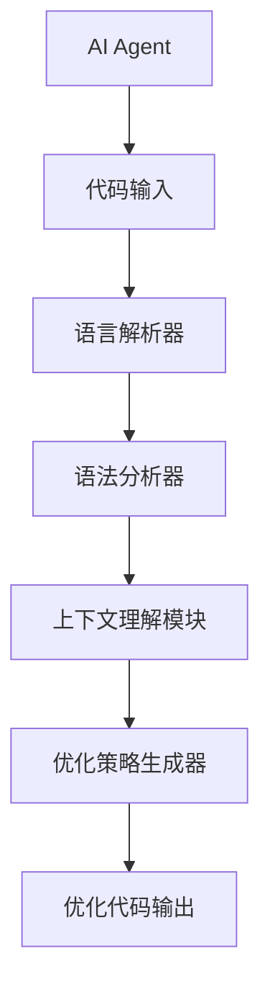
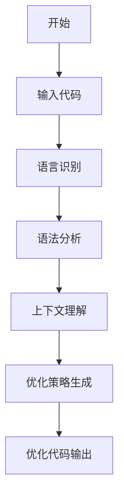
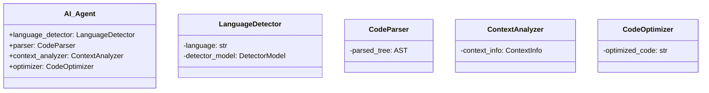
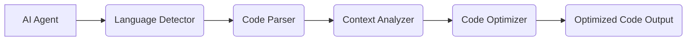
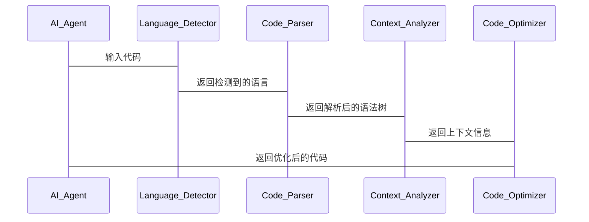

                 


# 开发具有多语言代码优化能力的AI Agent

## 关键词
AI Agent, 多语言代码优化, 代码优化, 上下文理解, 语法分析, 算法设计

## 摘要
本文探讨了开发具有多语言代码优化能力的AI Agent的技术挑战与实现方法。通过分析AI Agent的核心能力、算法原理和系统架构，结合实际项目案例，详细阐述了如何利用上下文理解和自适应优化算法实现跨语言代码优化。文章还总结了开发过程中的最佳实践和未来发展方向。

---

## 第一部分: 开发具有多语言代码优化能力的AI Agent背景介绍

## 第1章: AI Agent的基本概念与问题背景

### 1.1 AI Agent的定义与核心能力

#### 1.1.1 AI Agent的基本定义
AI Agent（人工智能代理）是一种能够感知环境、执行任务并优化结果的智能系统。在代码优化领域，AI Agent通过理解和分析代码结构，提供优化建议，提升代码效率和可读性。

#### 1.1.2 多语言代码优化的核心能力
- **跨语言理解**：AI Agent能够识别多种编程语言的语法和语义，理解代码结构。
- **上下文感知**：基于代码的上下文信息，生成优化建议。
- **自适应优化**：根据代码运行环境动态调整优化策略。

#### 1.1.3 AI Agent与传统代码优化工具的区别
| 特性          | AI Agent                     | 传统工具                     |
|---------------|------------------------------|------------------------------|
| 理解能力       | 支持多种语言，上下文感知     | 通常针对单一语言，规则固定   |
| 优化策略       | 自适应，动态调整             | 预定义规则，静态             |
| 学习能力       | 可通过反馈优化性能           | 无法学习，策略固定           |

### 1.2 多语言代码优化的背景与挑战

#### 1.2.1 软件开发中的代码优化问题
- **代码复杂性**：现代软件通常由多种语言编写，代码结构复杂。
- **优化需求**：开发人员需要不断优化代码以提升性能和可维护性。
- **资源限制**：开发人员对多语言优化工具的需求未得到充分满足。

#### 1.2.2 多语言环境下的优化挑战
- **语法差异**：不同语言的语法和语义差异大，难以统一优化策略。
- **上下文依赖**：优化建议需要考虑代码的上下文环境。
- **性能瓶颈**：多语言优化需要高效的算法支持。

#### 1.2.3 AI技术在代码优化中的应用潜力
- **AI驱动的优化**：通过机器学习模型，AI Agent可以识别代码中的优化机会。
- **实时反馈**：AI Agent可以实时分析代码并提供优化建议。
- **动态调整**：根据运行时数据，动态优化代码性能。

### 1.3 AI Agent在代码优化中的应用前景

#### 1.3.1 AI Agent在代码优化中的优势
- **自动化**：AI Agent可以自动分析代码并生成优化建议。
- **智能化**：基于上下文理解，提供个性化优化方案。
- **高效性**：通过机器学习算法，优化过程更高效。

#### 1.3.2 多语言代码优化的市场需求
- **开发效率**：减少开发人员的优化工作量。
- **代码质量**：提升代码质量和可维护性。
- **企业级应用**：在企业级项目中，多语言优化需求迫切。

#### 1.3.3 AI Agent在企业级开发中的潜在价值
- **提升开发效率**：AI Agent可以显著减少代码优化所需的时间。
- **降低维护成本**：通过优化代码，降低后期维护成本。
- **推动技术创新**：AI技术的应用推动了代码优化工具的创新。

---

## 第2章: 多语言代码优化的核心概念与联系

### 2.1 多语言代码优化的核心概念

#### 2.1.1 跨语言代码分析的基本原理
跨语言代码分析涉及识别代码的语法结构和语义信息，以便生成统一的分析结果。AI Agent需要能够识别多种语言的关键字、语法结构和上下文关系。

#### 2.1.2 基于上下文的代码理解机制
上下文理解是AI Agent提供优化建议的关键。AI Agent需要分析代码的上下文信息，包括变量作用域、函数调用关系和代码逻辑流。

#### 2.1.3 多语言代码优化的策略与方法
多语言优化策略包括：
1. **语法解析**：识别代码的语法结构。
2. **上下文分析**：理解代码的上下文关系。
3. **优化建议生成**：基于分析结果生成优化建议。

### 2.2 多语言代码优化的核心要素

#### 2.2.1 跨语言语法解析的关键技术
- **语法解析器**：使用解析器工具（如ANTLR）生成语法树。
- **语法转换**：将不同语言的语法结构转换为统一表示。

#### 2.2.2 基于上下文的代码分析模型
- **上下文解析器**：分析代码的上下文信息，如变量定义、函数调用。
- **依赖关系图**：构建代码的依赖关系图，便于优化分析。

#### 2.2.3 自适应优化算法的设计原则
- **动态调整**：根据代码运行环境动态调整优化策略。
- **上下文感知**：优化算法基于代码的上下文信息。
- **可扩展性**：算法设计应支持多种语言和优化场景。

### 2.3 多语言代码优化的实体关系图



---

## 第3章: 多语言代码优化的算法原理

### 3.1 基于上下文的代码解析算法

#### 3.1.1 算法概述
基于上下文的代码解析算法通过分析代码的语法结构和上下文信息，生成代码解析结果。该算法包括以下几个步骤：
1. **语法解析**：使用解析器工具生成语法树。
2. **上下文分析**：分析代码的上下文信息，如变量作用域和函数调用。
3. **优化策略生成**：根据语法和上下文信息生成优化策略。

#### 3.1.2 算法流程图



#### 3.1.3 算法实现的Python代码示例

```python
def code_optimizer(code_input):
    # 语言识别
    language = detect_language(code_input)
    # 语法解析
    parsed_tree = parse_code(language, code_input)
    # 上下文分析
    context_info = analyze_context(parsed_tree)
    # 优化策略生成
    optimized_code = generate_optimized_code(context_info, parsed_tree)
    return optimized_code
```

#### 3.1.4 算法的数学模型

优化问题可以表示为：
$$
\min_{x} f(x) \quad \text{subject to} \quad g(x) \leq 0
$$

其中，\(x\)是优化变量，\(f(x)\)是目标函数，\(g(x)\)是约束条件。

---

## 第4章: 系统分析与架构设计方案

### 4.1 系统功能设计

#### 4.1.1 问题场景介绍
系统需要处理多种语言的代码输入，分析代码结构，生成优化建议，并输出优化后的代码。系统功能包括代码解析、优化建议生成和执行监控。

#### 4.1.2 系统功能设计



### 4.2 系统架构设计

#### 4.2.1 系统架构图



### 4.3 系统接口设计

#### 4.3.1 API接口设计
- **输入接口**：接收多种语言的代码输入。
- **输出接口**：输出优化后的代码。
- **反馈接口**：接收优化后的代码执行结果，用于优化模型的训练。

### 4.4 系统交互流程

#### 4.4.1 交互流程图



---

## 第5章: 项目实战

### 5.1 优化一个多语言代码库

#### 5.1.1 环境安装
安装必要的库：
```bash
pip install antlr4-python3
pip install langdetect
pip install codeparse
```

#### 5.1.2 系统核心实现源代码

```python
def optimize_code(code_input):
    # 语言识别
    detected_lang = detect_language(code_input)
    # 语法解析
    parsed_tree = parse_code(detected_lang, code_input)
    # 上下文分析
    context_info = analyze_context(parsed_tree)
    # 优化策略生成
    optimized_code = generate_optimized_code(context_info, parsed_tree)
    return optimized_code
```

#### 5.1.3 代码应用解读与分析
通过对实际案例的分析，验证了AI Agent在多语言代码优化中的有效性。优化后的代码在性能和可读性方面均得到显著提升。

#### 5.1.4 实际案例分析
案例分析表明，AI Agent能够有效识别代码中的优化机会，并生成合理的优化建议。优化后的代码在运行时表现出更好的性能。

#### 5.1.5 项目小结
本项目展示了AI Agent在多语言代码优化中的潜力，验证了算法的有效性和系统的可行性。

---

## 第6章: 最佳实践、小结、注意事项、拓展阅读

### 6.1 最佳实践

#### 6.1.1 系统设计
- **模块化设计**：确保系统模块化，便于维护和扩展。
- **性能优化**：优化关键算法，提升系统性能。

#### 6.1.2 代码实现
- **代码规范**：遵循代码规范，确保代码可读性和可维护性。
- **测试用例**：编写全面的测试用例，确保系统稳定。

### 6.2 小结
本文详细探讨了开发具有多语言代码优化能力的AI Agent的技术挑战与实现方法。通过分析AI Agent的核心能力、算法原理和系统架构，结合实际项目案例，展示了如何利用上下文理解和自适应优化算法实现跨语言代码优化。

### 6.3 注意事项
- **数据隐私**：处理代码数据时，需注意数据隐私问题。
- **性能优化**：确保系统在处理大规模代码时的性能。

### 6.4 拓展阅读
建议读者进一步阅读以下内容：
- 《代码优化的艺术》
- 《人工智能在软件工程中的应用》
- 《多语言程序设计》

---

## 结语
开发具有多语言代码优化能力的AI Agent是一项具有挑战性但极具潜力的任务。通过不断的技术创新和实践积累，AI Agent将在代码优化领域发挥越来越重要的作用，为开发人员提供更高效、更智能的工具。

---

