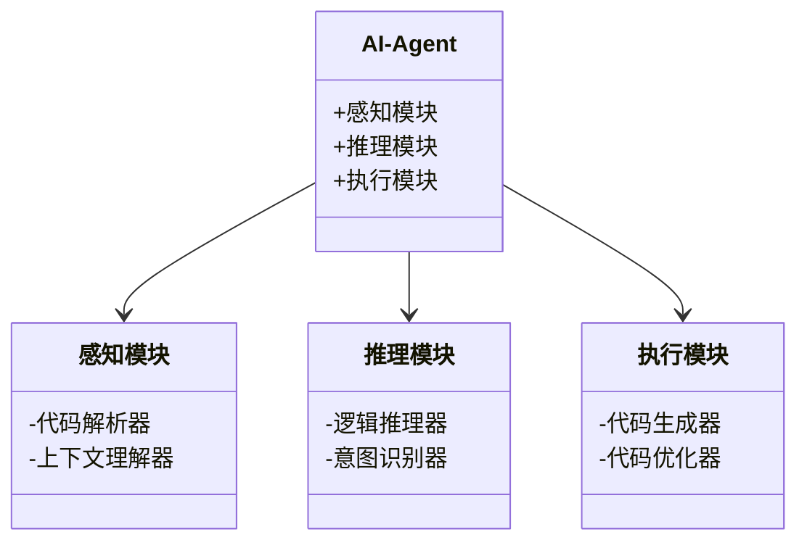
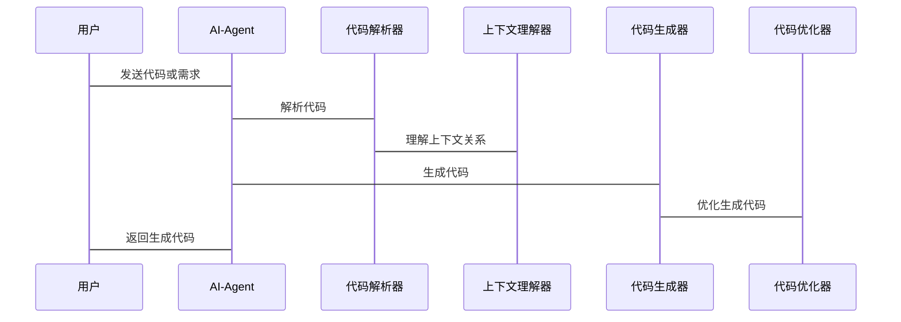

                 


# 开发具有多语言代码理解与生成能力的AI Agent

## 关键词：AI Agent，多语言代码理解，代码生成，自然语言处理，机器学习

## 摘要：本文详细探讨了开发具有多语言代码理解与生成能力的AI Agent的关键技术。从问题背景、核心概念、算法原理到系统架构设计，结合实际案例，全面分析了AI Agent在代码处理中的潜力与实现方法。通过详细的技术分析和代码实现，展示了如何构建一个多语言代码理解与生成的AI Agent系统。

---

# 正文

## 第一部分: 多语言代码理解与生成AI Agent的背景与核心概念

### 第1章: 多语言代码理解与生成的背景与问题

#### 1.1 问题背景与描述

##### 1.1.1 软件开发中的代码理解和生成问题
在软件开发中，代码理解和生成是两个关键任务。代码理解涉及分析代码的结构、逻辑和意图，而代码生成则需要根据特定需求自动生成代码片段或完整的程序。然而，现有的工具和方法在处理多语言代码时存在诸多限制，例如难以跨语言理解代码结构和意图，生成代码的质量和可维护性也有待提高。

##### 1.1.2 多语言代码处理的挑战
不同编程语言具有不同的语法、语义和结构。AI Agent需要能够理解多种编程语言的语法和语义，并在生成代码时考虑目标语言的特性。此外，跨语言代码转换和生成需要处理语言间的差异和潜在的兼容性问题。

##### 1.1.3 AI Agent在代码处理中的潜力
AI Agent可以通过自然语言处理（NLP）、机器学习（ML）和深度学习（DL）等技术，实现代码理解和生成的自动化。AI Agent能够分析代码的上下文、意图和逻辑关系，并根据用户需求生成高质量的代码，从而提高开发效率和代码质量。

#### 1.2 问题解决与边界

##### 1.2.1 AI Agent的核心目标
AI Agent的目标是通过理解和生成多语言代码，辅助开发者完成代码分析、优化、生成和维护任务。AI Agent需要具备以下核心功能：
1. 代码理解：解析代码结构、分析代码逻辑、识别代码意图。
2. 代码生成：根据用户需求生成符合目标语言语法和语义的代码。
3. 代码优化：优化生成代码的性能、可读性和可维护性。

##### 1.2.2 多语言代码理解的边界
多语言代码理解的边界包括：
1. 支持的编程语言范围：AI Agent需要支持多种编程语言，如Python、Java、C++等。
2. 代码理解的深度：AI Agent需要理解代码的语法、语义和上下文关系。
3. 生成代码的质量：AI Agent生成的代码需要符合编程语言的规范，并满足用户需求。

##### 1.2.3 生成代码的适用场景与限制
生成代码的适用场景包括：
1. 快速原型开发：根据用户需求快速生成代码。
2. 代码补全：帮助开发者完成未完成的代码片段。
3. 代码转换：将一种语言的代码转换为目标语言的代码。
生成代码的限制包括：
1. 生成代码的正确性依赖于AI模型的训练数据和生成策略。
2. 生成代码的可维护性需要进一步优化。

#### 1.3 核心概念与结构

##### 1.3.1 多语言代码理解与生成的系统架构
多语言代码理解与生成的系统架构包括以下模块：
1. 代码理解模块：负责解析代码结构、分析代码逻辑、识别代码意图。
2. 代码生成模块：根据用户需求生成符合目标语言语法和语义的代码。
3. 代码优化模块：优化生成代码的性能、可读性和可维护性。

##### 1.3.2 AI Agent的功能模块组成
AI Agent的功能模块包括：
1. 感知模块：负责接收用户输入的代码或需求，并进行解析和理解。
2. 推理模块：负责分析代码逻辑、识别代码意图，并生成生成代码的逻辑和结构。
3. 执行模块：负责根据生成的逻辑和结构生成目标语言的代码，并进行验证和优化。

##### 1.3.3 系统的核心要素与关系
系统的核心要素包括：
1. 多语言模型：支持多种编程语言的语法和语义理解。
2. 代码解析器：负责解析代码结构和上下文关系。
3. 代码生成器：根据生成逻辑生成目标语言的代码。
4. 优化模块：优化生成代码的性能、可读性和可维护性。

### 第2章: 多语言代码理解与生成的核心概念

#### 2.1 AI Agent的基本原理

##### 2.1.1 感知模块: 代码解析与上下文理解
感知模块负责接收用户输入的代码或需求，并进行解析和理解。代码解析包括解析代码的语法、结构和上下文关系。上下文理解包括理解代码的意图和逻辑关系。

##### 2.1.2 推理模块: 代码逻辑推理与意图识别
推理模块负责分析代码逻辑、识别代码意图，并生成生成代码的逻辑和结构。代码逻辑推理包括分析代码的控制流、数据流和依赖关系。意图识别包括识别用户的开发目标和需求。

##### 2.1.3 执行模块: 代码生成与验证
执行模块负责根据生成的逻辑和结构生成目标语言的代码，并进行验证和优化。代码生成包括生成代码的语法和语义符合目标语言的要求。代码验证包括验证生成代码的正确性和可维护性。

#### 2.2 多语言模型的特点

##### 2.2.1 多语言模型的训练策略
多语言模型的训练策略包括：
1. 预训练：使用大规模多语言代码数据进行预训练，学习多种编程语言的语法和语义。
2. 微调：在特定任务上进行微调，优化模型在多语言代码理解和生成上的表现。

##### 2.2.2 不同语言代码的特征对比
不同编程语言的代码特征包括语法、语义、结构和编程范式。例如，Python使用动态类型，而Java使用静态类型；Python支持面向对象编程，而C++支持更复杂的模板和指针操作。

##### 2.2.3 多语言模型的通用性与专精性
多语言模型需要在通用性和专精性之间找到平衡。通用性是指模型能够理解多种编程语言的语法和语义，而专精性是指模型在特定编程语言上的理解和生成能力。

#### 2.3 模型之间的关系

##### 2.3.1 代码理解模型与生成模型的对比
代码理解模型主要用于理解代码的语法和语义，而生成模型主要用于生成代码。代码理解模型和生成模型在训练目标和应用场景上有很大差异。

##### 2.3.2 不同语言模型之间的关联
不同语言模型之间可以通过共享特征和参数进行关联。例如，使用多语言模型进行跨语言代码理解，可以通过共享特征和参数来提高模型的通用性。

##### 2.3.3 模型的可扩展性与组合性
多语言模型可以通过模块化设计进行扩展和组合。例如，可以将不同的编程语言模型组合在一起，形成一个多语言代码理解和生成的AI Agent。

### 第3章: 多语言代码理解与生成的算法原理

#### 3.1 模型训练流程

##### 3.1.1 预训练阶段
预训练阶段使用大规模多语言代码数据进行训练，学习代码的语法、语义和上下文关系。预训练目标包括：
1. 代码解析：解析代码的语法和结构。
2. 代码理解：理解代码的意图和逻辑关系。

##### 3.1.2 微调阶段
微调阶段在特定任务上进行微调，优化模型在多语言代码理解和生成上的表现。微调目标包括：
1. 代码生成：生成符合目标语言语法和语义的代码。
2. 代码优化：优化生成代码的性能、可读性和可维护性。

##### 3.1.3 生成阶段
生成阶段根据用户需求生成代码。生成过程包括：
1. 输入解析：解析用户输入的需求。
2. 逻辑推理：分析代码逻辑和意图。
3. 代码生成：生成目标语言的代码。
4. 代码验证：验证生成代码的正确性和可维护性。

#### 3.2 感知模块的实现

##### 3.2.1 代码解析算法
代码解析算法包括：
1. 语法解析：解析代码的语法结构。
2. 结构解析：解析代码的结构和层次关系。
3. 上下文解析：解析代码的上下文关系，例如变量的定义和使用。

##### 3.2.2 上下文理解方法
上下文理解方法包括：
1. 语义分析：分析代码的语义，识别代码意图。
2. 逻辑推理：推理代码的逻辑关系和依赖关系。
3. 相关性计算：计算代码之间的相关性，例如变量之间的依赖关系。

##### 3.2.3 代码特征提取
代码特征提取包括：
1. 语法特征：提取代码的语法特征，例如关键字、语法结构。
2. 语义特征：提取代码的语义特征，例如函数的用途、变量的用途。
3. 上下文特征：提取代码的上下文特征，例如变量的定义和使用。

#### 3.3 推理模块的实现

##### 3.3.1 逻辑推理算法
逻辑推理算法包括：
1. 基于规则的推理：根据预定义的规则进行推理。
2. 基于模式的推理：根据代码的模式和结构进行推理。
3. 基于深度学习的推理：使用深度学习模型进行推理。

##### 3.3.2 意图识别方法
意图识别方法包括：
1. 基于关键词的意图识别：根据代码中的关键词识别意图。
2. 基于上下文的意图识别：根据代码的上下文关系识别意图。
3. 基于深度学习的意图识别：使用深度学习模型进行意图识别。

##### 3.3.3 关联性计算
关联性计算包括：
1. 变量之间的关联性：计算变量之间的关联性，例如变量之间的依赖关系。
2. 函数之间的关联性：计算函数之间的关联性，例如函数的调用关系。
3. 类之间的关联性：计算类之间的关联性，例如继承关系。

#### 3.4 生成模块的实现

##### 3.4.1 代码生成策略
代码生成策略包括：
1. 基于模板的生成：根据预定义的模板生成代码。
2. 基于规则的生成：根据预定义的规则生成代码。
3. 基于深度学习的生成：使用深度学习模型生成代码。

##### 3.4.2 生成结果验证
生成结果验证包括：
1. 语法验证：验证生成代码的语法是否正确。
2. 语义验证：验证生成代码的语义是否正确。
3. 性能验证：验证生成代码的性能是否符合要求。

##### 3.4.3 优化调整
优化调整包括：
1. 代码优化：优化生成代码的性能、可读性和可维护性。
2. 参数调整：调整模型的参数，优化生成代码的质量。

## 第二部分: 系统分析与架构设计方案

### 第4章: 系统分析与架构设计

#### 4.1 问题场景介绍
本节将介绍AI Agent在多语言代码理解与生成中的应用场景和问题场景。例如，AI Agent可以帮助开发者快速生成代码，优化代码性能，进行代码转换等。

#### 4.2 项目介绍
本节将介绍AI Agent项目的整体架构和设计目标。例如，AI Agent需要支持多种编程语言，具备代码理解和生成能力，能够根据用户需求生成高质量的代码。

#### 4.3 系统功能设计

##### 4.3.1 领域模型mermaid类图


##### 4.3.2 系统架构设计mermaid架构图


#### 4.4 系统接口设计

##### 4.4.1 用户接口
用户接口包括：
1. 输入接口：接收用户的代码或需求。
2. 输出接口：返回生成的代码或结果。

##### 4.4.2 系统接口
系统接口包括：
1. 感知模块接口：解析代码和上下文关系。
2. 推理模块接口：分析代码逻辑和意图。
3. 执行模块接口：生成代码并进行优化。

#### 4.5 系统交互mermaid序列图


## 第三部分: 项目实战

### 第5章: 项目实战

#### 5.1 环境安装与配置

##### 5.1.1 安装Python
```bash
python --version
```

##### 5.1.2 安装Hugging Face库
```bash
pip install transformers
```

#### 5.2 系统核心实现

##### 5.2.1 代码解析器实现
```python
class CodeParser:
    def __init__(self):
        self.tokenizer = AutoTokenizer.from_pretrained("codBERT")
    def parse_code(self, code):
        tokens = self.tokenizer.tokenize(code)
        return tokens
```

##### 5.2.2 上下文理解器实现
```python
class ContextUnderstanding:
    def __init__(self):
        self.model = AutoModel.from_pretrained("codBERT")
    def understand_context(self, code):
        inputs = self.tokenizer.encode_plus(code, return_tensors="pt")
        outputs = self.model(**inputs)
        return outputs
```

##### 5.2.3 代码生成器实现
```python
class CodeGenerator:
    def __init__(self):
        self.model = AutoModelWithLMHead.from_pretrained("codBERT")
    def generate_code(self, code, target_language):
        inputs = self.tokenizer.encode_plus(code, return_tensors="pt")
        outputs = self.model.generate(**inputs)
        return outputs
```

#### 5.3 功能测试与优化

##### 5.3.1 功能测试
```python
parser = CodeParser()
understander = ContextUnderstanding()
generator = CodeGenerator()

code_input = "输入代码或需求"
parsed_code = parser.parse_code(code_input)
context_output = understander.understand_context(parsed_code)
generated_code = generator.generate_code(context_output, target_language="Python")
print(generated_code)
```

##### 5.3.2 性能优化
```python
# 优化代码生成速度
generator.model.enable_fast_tokenization()
# 优化代码生成质量
generator.model.set_param("temperature", 0.7)
generator.model.set_param("top_p", 0.9)
```

## 第四部分: 总结与展望

### 第6章: 总结与展望

#### 6.1 总结
本文详细探讨了开发具有多语言代码理解与生成能力的AI Agent的关键技术。从问题背景、核心概念、算法原理到系统架构设计，结合实际案例，全面分析了AI Agent在代码处理中的潜力与实现方法。

#### 6.2 展望
未来的研究方向包括：
1. 提高多语言模型的准确性和生成代码的质量。
2. 增强AI Agent的自我学习和适应能力。
3. 扩展AI Agent的应用场景，例如支持更多编程语言和代码优化任务。

#### 6.3 注意事项
在实际应用中，需要注意以下几点：
1. 代码生成的正确性依赖于模型的训练数据和生成策略。
2. 代码优化需要结合具体的编程语言特性和开发需求。
3. AI Agent的性能和效果需要持续优化和改进。

#### 6.4 拓展阅读
推荐读者阅读以下资料：
1. 《CodeBERT: Preparing Code for Pre-training》
2. 《The Role of Code in NLP》
3. 《Generating Code with Pre-trained Language Models》

---

# 结语

开发具有多语言代码理解与生成能力的AI Agent是一项具有挑战性的任务，但通过不断的研究和实践，我们可以构建出一个高效、准确的AI Agent，帮助开发者提高开发效率和代码质量。

