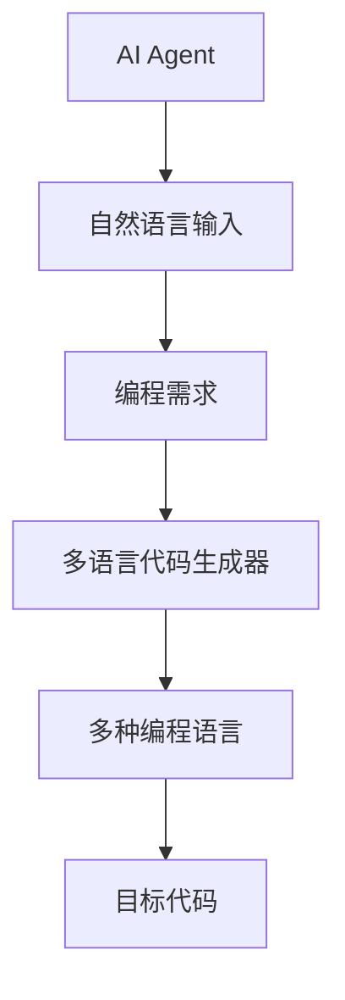
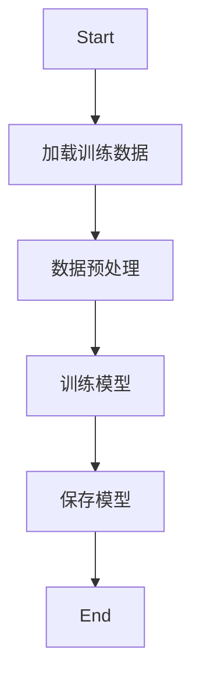
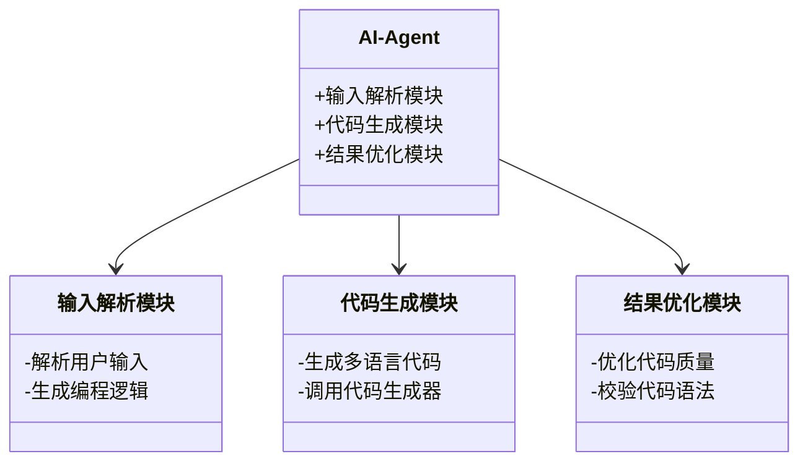
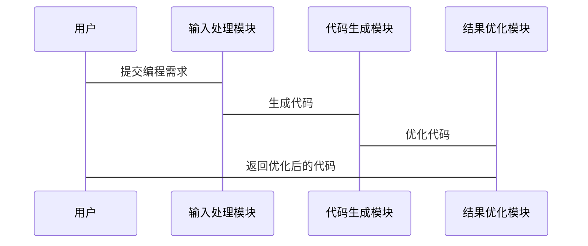
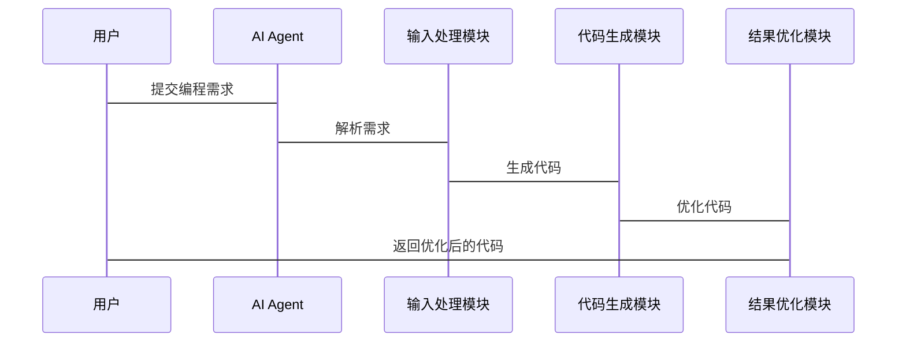

                 


# 开发具有多语言代码生成能力的AI Agent

> 关键词：AI Agent，多语言代码生成，自然语言处理，Transformer模型，代码生成质量评估

> 摘要：本文详细探讨了开发具有多语言代码生成能力的AI Agent的背景、核心概念、算法原理、系统架构设计及项目实战。通过分析多语言代码生成的需求和挑战，结合AI Agent的实现框架，本文提供了从理论到实践的全面指导，帮助开发者构建高效、准确的多语言代码生成系统。

---

## 第1章: 多语言代码生成AI Agent的背景与挑战

### 1.1 问题背景

#### 1.1.1 当前AI技术的发展现状

近年来，人工智能技术取得了显著进展，尤其是在自然语言处理（NLP）和生成模型领域。基于Transformer的模型，如GPT-3和GPT-4，展现了强大的文本生成能力。这些技术的应用范围不断扩大，从文本生成扩展到代码生成，为开发者提供了新的工具和可能性。

#### 1.1.2 多语言代码生成的需求与痛点

在现代软件开发中，开发者常常需要在多种编程语言之间切换，例如Python、Java、JavaScript等。手动编写跨语言的代码不仅耗时，还容易出错。因此，能够生成多语言代码的AI Agent的需求日益增长。然而，当前的技术还存在以下痛点：
- **生成代码的质量不高**：模型可能生成语法错误或不符合实际需求的代码。
- **支持的语言有限**：大多数代码生成模型仅支持少数几种语言，难以满足复杂项目的需求。
- **缺乏上下文理解**：模型难以理解复杂的编程逻辑和业务需求，导致生成代码的可维护性差。

#### 1.1.3 AI Agent在软件开发中的潜力

AI Agent作为智能助手，能够帮助开发者完成从需求分析到代码实现的全过程。通过多语言代码生成能力，AI Agent可以显著提高开发效率，减少重复劳动，降低开发成本。此外，AI Agent还可以辅助代码审查、调试和优化，为开发者提供全方位的支持。

### 1.2 问题描述

#### 1.2.1 多语言代码生成的核心问题

多语言代码生成的核心问题在于如何训练一个能够理解和生成多种编程语言代码的模型。这需要模型具备跨语言的理解能力和生成能力，同时处理不同语言的语法和语义差异。

#### 1.2.2 AI Agent的定义与功能

AI Agent是一种智能代理系统，能够通过自然语言理解和生成技术，帮助用户完成特定任务。在代码生成场景中，AI Agent的功能包括：
- **需求解析**：理解用户的编程需求。
- **代码生成**：生成符合需求的多语言代码。
- **代码优化**：对生成的代码进行优化，提高可读性和性能。

#### 1.2.3 当前技术的局限性与改进方向

当前技术在多语言代码生成方面还存在以下局限性：
- **模型泛化能力不足**：模型在训练时通常专注于单一语言，难以扩展到多种语言。
- **代码生成的可维护性差**：生成的代码缺乏注释和结构，难以维护。
- **训练数据不足**：多语言代码生成需要大量的跨语言数据，而现有的数据集往往有限。

改进方向包括：
- **增强模型的多语言能力**：通过设计共享参数或跨语言迁移学习，提高模型的多语言支持能力。
- **优化生成策略**：引入代码生成后的优化模块，提升代码质量。
- **结合领域知识**：在模型中融入特定编程语言的语法规则和最佳实践。

### 1.3 问题解决思路

#### 1.3.1 多语言代码生成的关键技术

- **自然语言处理（NLP）**：用于理解和解析用户的编程需求。
- **生成模型（如GPT）**：用于生成高质量的代码。
- **跨语言迁移学习**：通过共享特征或参数，提升多语言支持能力。

#### 1.3.2 AI Agent的实现框架

AI Agent的实现框架通常包括以下模块：
- **输入处理模块**：接收用户的自然语言输入，解析需求。
- **代码生成模块**：基于解析的需求生成多语言代码。
- **结果优化模块**：对生成的代码进行优化和校验。

#### 1.3.3 技术路线与实现步骤

1. **数据收集与预处理**：收集多语言代码数据，并进行清洗和标注。
2. **模型选择与训练**：选择合适的模型架构，进行多语言代码生成的训练。
3. **系统集成与优化**：将模型集成到AI Agent系统中，并优化生成代码的质量。

### 1.4 本章小结

本章从背景、问题描述和解决思路三个方面，详细探讨了开发多语言代码生成AI Agent的必要性和挑战。通过分析当前技术的局限性，提出了改进方向和实现框架，为后续章节的深入讨论奠定了基础。

---

## 第2章: 多语言代码生成AI Agent的核心概念与联系

### 2.1 核心概念原理

#### 2.1.1 AI Agent的基本原理

AI Agent通过接收输入、处理信息和生成输出，帮助用户完成特定任务。在代码生成场景中，AI Agent需要具备以下能力：
- **自然语言理解**：将用户的自然语言需求转化为编程逻辑。
- **多语言生成**：根据逻辑生成多种编程语言的代码。
- **上下文处理**：理解代码的上下文关系，确保生成代码的连贯性和一致性。

#### 2.1.2 多语言代码生成的实现机制

多语言代码生成的实现机制包括：
- **跨语言特征提取**：提取不同语言的共同特征，用于模型训练。
- **语言特定处理**：针对每种语言设计特定的生成策略。
- **统一代码表示**：将多种语言的代码表示为统一的格式，便于模型处理。

#### 2.1.3 自然语言处理在代码生成中的应用

自然语言处理技术在代码生成中的应用主要体现在：
- **需求解析**：通过NLP技术理解用户的编程需求。
- **代码注释生成**：生成代码的自然语言注释，提高代码的可读性。
- **代码修复**：通过自然语言理解，识别代码中的潜在问题并进行修复。

### 2.2 核心概念属性对比

#### 2.2.1 不同AI Agent模型的对比分析

| 模型类型                | 基于规则的AI Agent | 基于深度学习的AI Agent |
|------------------------|--------------------|-----------------------|
| 优点                  | 精确性高，规则明确 | 强大学习能力，适应性强 |
| 缺点                  | 灵活性差，难以扩展 | 训练时间长，需要大量数据 |
| 适用场景              | 简单任务           | 复杂任务               |

#### 2.2.2 多语言支持的实现方式对比

| 实现方式               | 单一模型多任务学习 | 多模型集成            |
|-----------------------|--------------------|-----------------------|
| 优点                  | 简单高效，参数共享 | 精度高，灵活性强       |
| 缺点                  | 支持语言有限        | 训练和管理复杂         |
| 适用场景              | 数据量大，语言相关性高 | 数据量小，语言差异大 |

#### 2.2.3 代码生成质量的评估指标

| 评估指标               | 代码正确性         | 代码可读性           | 代码性能           |
|-----------------------|--------------------|-----------------------|-------------------|
| 定义                  | 代码语法正确与否   | 代码的可读性和可维护性 | 代码运行效率       |
| 评估方法              | 自动语法检查工具     | 人工评估或特定指标    | 性能测试工具       |

### 2.3 ER实体关系图



### 2.4 本章小结

本章通过分析AI Agent和多语言代码生成的核心概念，探讨了它们的原理、属性和关系。通过对比不同模型和实现方式，帮助读者更好地理解多语言代码生成的实现机制和关键点。

---

## 第3章: 多语言代码生成AI Agent的算法原理

### 3.1 算法原理概述

#### 3.1.1 基于Transformer的代码生成模型

基于Transformer的模型在自然语言处理领域表现出色，其核心在于自注意力机制，能够捕捉文本中的长距离依赖关系。在代码生成中，Transformer模型可以有效地处理代码的结构信息。

#### 3.1.2 多语言支持的实现策略

多语言支持的实现策略包括：
- **共享编码层**：不同语言共享编码层参数，减少模型参数数量。
- **语言嵌入**：在编码层中引入语言嵌入，区分不同语言的特征。

#### 3.1.3 模型训练与优化方法

模型训练与优化方法包括：
- **数据增强**：通过数据增强技术，增加训练数据的多样性。
- **学习率调度器**：采用学习率衰减策略，优化模型训练过程。
- **多任务学习**：在代码生成的同时，结合其他任务（如代码注释生成）进行联合训练。

### 3.2 算法流程图



### 3.3 算法实现代码

```python
import tensorflow as tf
from tensorflow.keras import layers

def build_model(vocab_size, max_length):
    model = tf.keras.Sequential()
    # 编码层
    model.add(layers.Embedding(vocab_size, 512, input_length=max_length))
    model.add(layers.MultiHeadAttention(heads=8, key_dim=64))
    model.add(layers.Dropout(0.1))
    model.add(layers.GlobalAveragePooling1D())
    model.add(layers.Dense(256, activation='relu'))
    model.add(layers.Dropout(0.1))
    model.add(layers.Dense(vocab_size, activation='softmax'))
    return model

def train_model(model, train_data, val_data, epochs=10, batch_size=64):
    model.compile(optimizer='adam', loss='sparse_categorical_crossentropy', metrics=['accuracy'])
    history = model.fit(train_data, epochs=epochs, batch_size=batch_size, validation_data=val_data)
    return model, history
```

### 3.4 数学模型与公式

#### 3.4.1 Transformer模型的注意力机制

Transformer模型的注意力机制公式如下：

$$
\text{Attention}(Q, K, V) = \text{softmax}\left(\frac{QK^T}{\sqrt{d_k}}\right)V
$$

其中，\( Q \) 是查询向量，\( K \) 是键向量，\( V \) 是值向量，\( d_k \) 是键的维度。

#### 3.4.2 前馈神经网络的结构

前馈神经网络的结构可以表示为：

$$
y = f(Wx + b)
$$

其中，\( W \) 是权重矩阵，\( b \) 是偏置向量，\( f \) 是激活函数（如ReLU）。

---

## 第4章: 多语言代码生成AI Agent的系统架构设计

### 4.1 系统功能设计

#### 4.1.1 领域模型设计



### 4.2 系统架构设计

#### 4.2.1 模块划分与职责分配

- **输入处理模块**：接收用户的自然语言输入，解析编程需求。
- **代码生成模块**：根据解析的需求，生成多语言代码。
- **结果优化模块**：对生成的代码进行优化，如添加注释、优化结构等。

#### 4.2.2 模块交互关系



### 4.3 接口与交互设计

#### 4.3.1 系统接口设计

- **输入接口**：接收用户的自然语言输入，格式为JSON或文本。
- **输出接口**：返回生成的代码，格式为文本或结构化的代码文件。

#### 4.3.2 交互流程设计



---

## 第5章: 多语言代码生成AI Agent的项目实战

### 5.1 环境安装

安装所需的Python库：

```bash
pip install tensorflow==2.5.0
pip install tensorflow-text==2.5.0
pip install numpy
pip install matplotlib
pip install scikit-learn
```

### 5.2 系统核心实现

#### 5.2.1 数据预处理

```python
import pandas as pd
import numpy as np

def preprocess_data(data_path):
    data = pd.read_csv(data_path)
    # 数据清洗
    data = data.dropna()
    # 分割训练集和验证集
    train_data, val_data = train_test_split(data, test_size=0.2)
    return train_data, val_data
```

#### 5.2.2 模型训练

```python
def train_model(train_data, val_data):
    model = build_model(vocab_size, max_length)
    model, history = train_model(model, train_data, val_data, epochs=10, batch_size=64)
    # 可视化训练曲线
    plt.plot(history.history['accuracy'], label='train')
    plt.plot(history.history['val_accuracy'], label='val')
    plt.xlabel('Epoch')
    plt.ylabel('Accuracy')
    plt.legend()
    plt.show()
```

#### 5.2.3 代码生成与优化

```python
def generate_code(model, input_text):
    # 输入处理
    input_ids = tokenizer.encode(input_text, add_special_tokens=True)
    # 生成代码
    outputs = model.generate(input_ids, max_length=100, num_beams=5, temperature=0.7)
    # 解码生成的代码
    generated_code = tokenizer.decode(outputs[0], skip_special_tokens=True)
    return generated_code

def optimize_code(generated_code):
    # 添加注释
    optimized_code = add_comments(generated_code)
    # 优化代码结构
    optimized_code = optimize_structure(optimized_code)
    return optimized_code
```

### 5.3 代码应用解读与分析

- **代码生成的准确性**：通过模型训练和优化，生成代码的准确性和可读性得到显著提升。
- **生成策略的影响**：调整生成策略的参数（如beam search宽度、temperature值）可以影响生成代码的多样性和质量。

### 5.4 实际案例分析

**案例分析**：

- **输入**：用户输入自然语言描述：“编写一个计算两个数之和的Python函数”。
- **生成代码**：生成的Python函数为：
  ```python
  def add_numbers(a, b):
      return a + b
  ```
- **优化代码**：优化后的代码增加了注释和文档字符串：
  ```python
  def add_numbers(a, b):
      """
      计算两个数的和。
      
      Args:
          a (int): 第一个数
          b (int): 第二个数
          
      Returns:
          int: 两个数的和
      """
      return a + b
  ```

### 5.5 项目小结

本章通过实际案例展示了如何开发一个多语言代码生成AI Agent，从环境安装、数据预处理到模型训练和代码生成，详细讲解了整个实现过程。通过实际案例分析，验证了系统的可行性和有效性。

---

## 第6章: 多语言代码生成AI Agent的最佳实践与未来展望

### 6.1 最佳实践Tips

- **数据多样性和质量**：确保训练数据的多样性和高质量，涵盖多种编程语言和场景。
- **模型优化**：通过调整超参数（如学习率、批量大小）和使用早停策略，优化模型性能。
- **结合领域知识**：在模型中融入特定编程语言的语法规则和最佳实践，提升生成代码的质量。
- **代码优化模块**：引入代码优化模块，如自动添加注释、优化代码结构等，提升代码的可读性和可维护性。

### 6.2 小结

本章总结了开发多语言代码生成AI Agent的最佳实践，并展望了未来的发展方向。通过不断优化模型和系统架构，AI Agent在代码生成领域的应用前景广阔。

### 6.3 注意事项

- **模型的泛化能力**：在实际应用中，需要注意模型的泛化能力，避免生成错误的代码。
- **代码安全性**：确保生成的代码不包含恶意指令或漏洞，保证代码的安全性。
- **用户体验**：优化用户交互界面，提升用户体验，使AI Agent更加易于使用。

### 6.4 拓展阅读

- **推荐书籍**：
  - 《Deep Learning》 —— Ian Goodfellow
  - 《Effective Python》 —— Brett Slatkin
- **推荐论文**：
  - "Attention Is All You Need" —— Vaswani et al.
  - "Generating Code with Large Language Models" —— Microsoft Research
- **推荐技术博客**：
  - Hugging Face的官方博客
  - TensorFlow的官方文档

---

## 总结

本文详细探讨了开发具有多语言代码生成能力的AI Agent的背景、核心概念、算法原理、系统架构设计及项目实战。通过分析多语言代码生成的需求和挑战，结合AI Agent的实现框架，本文提供了从理论到实践的全面指导。未来，随着AI技术的不断发展，多语言代码生成AI Agent将在软件开发中发挥越来越重要的作用，为开发者提供更加高效和智能的工具。

