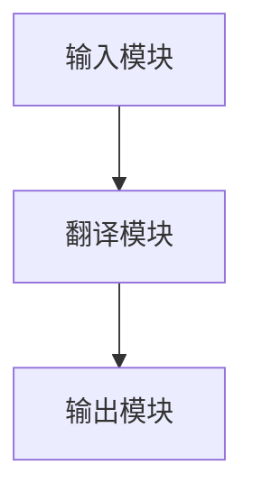
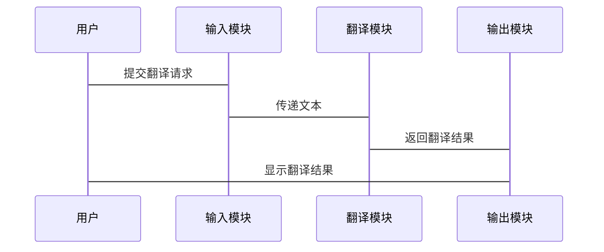

                 


# 开发具有多语言翻译能力的AI Agent

## 关键词：AI Agent, 多语言翻译, 自然语言处理, 神经机器翻译, Seq2Seq模型

## 摘要：  
随着全球化的发展，多语言翻译的需求日益增长。开发一个具有多语言翻译能力的AI Agent，可以有效提升跨语言交流的效率。本文将从技术背景、算法原理、系统架构到项目实战，全面解析开发一个多语言翻译AI Agent的全过程，帮助读者掌握其核心技术和实现方法。

---

## 第一部分：多语言翻译AI Agent的背景与概念

### 第1章：多语言翻译AI Agent的背景与概念

#### 1.1 问题背景与需求分析

##### 1.1.1 多语言翻译的挑战与现状
在当今全球化的社会中，跨语言交流变得越来越频繁。然而，语言障碍仍然是信息传递的主要障碍。传统的翻译工具通常依赖于规则和词典，难以处理复杂的语境和语义关系。随着人工智能技术的发展，特别是自然语言处理（NLP）技术的进步，开发一个多语言翻译AI Agent成为可能。

##### 1.1.2 AI Agent在多语言翻译中的作用
AI Agent（智能代理）是一种能够感知环境并执行任务的智能系统。在多语言翻译中，AI Agent可以实时接收用户的输入，利用NLP技术进行翻译，并通过自然的交互方式将结果反馈给用户。AI Agent的优势在于其智能化和自动化，能够处理复杂的翻译需求，例如上下文理解、语境适应等。

##### 1.1.3 用户需求与场景分析
多语言翻译AI Agent的目标用户包括跨国企业、教育机构、旅行者等。用户需求主要集中在以下几点：
- 实时翻译：快速准确地将一种语言翻译成另一种语言。
- 语境理解：根据上下文调整翻译结果。
- 多语言支持：支持多种语言的翻译，覆盖全球主要语言。

#### 1.2 多语言翻译AI Agent的核心概念

##### 1.2.1 AI Agent的基本定义
AI Agent是一种能够感知环境、理解用户需求并执行任务的智能系统。它通常具有以下特点：
- 智能性：能够理解和推理复杂的信息。
- 自主性：能够在没有人工干预的情况下执行任务。
- 交互性：能够与用户或其他系统进行交互。

##### 1.2.2 多语言翻译的核心原理
多语言翻译是指将一种语言的文本转换为另一种语言的过程。AI Agent通过自然语言处理技术，理解输入文本的语义，并利用翻译模型生成目标语言的文本。

##### 1.2.3 多语言翻译与传统翻译的区别
与传统翻译相比，多语言翻译AI Agent具有以下优势：
- 高效性：能够快速处理大量文本。
- 精确性：利用机器学习模型，翻译结果更准确。
- 智能性：能够理解上下文，提供更自然的翻译结果。

#### 1.3 多语言翻译AI Agent的边界与外延

##### 1.3.1 功能边界
多语言翻译AI Agent的主要功能包括：
- 接收用户输入：通过文本或语音形式接收用户的输入。
- 翻译处理：利用NLP技术进行翻译。
- 反馈结果：将翻译结果以文本或语音形式反馈给用户。

##### 1.3.2 技术边界
多语言翻译AI Agent的技术边界包括：
- 支持的语言种类：通常支持几十种语言，具体取决于模型训练数据。
- 翻译质量：取决于所采用的NLP技术和模型参数。
- 响应时间：取决于系统性能和网络条件。

##### 1.3.3 应用场景的外延
多语言翻译AI Agent的应用场景包括：
- 跨国企业通信：帮助员工进行跨语言沟通。
- 教育培训：辅助学习者进行语言学习。
- 旅行服务：为旅行者提供实时翻译服务。

#### 1.4 多语言翻译AI Agent的核心要素

##### 1.4.1 自然语言处理技术
自然语言处理（NLP）是实现多语言翻译的核心技术。NLP技术包括文本分割、词性标注、句法分析等。

##### 1.4.2 翻译模型
翻译模型是多语言翻译AI Agent的核心组件。常用的翻译模型包括基于统计的翻译模型和基于神经网络的翻译模型。

##### 1.4.3 AI Agent的交互机制
交互机制是AI Agent与用户进行交流的方式。常用的交互方式包括文本输入、语音输入和手势输入。

---

## 第二部分：多语言翻译AI Agent的技术实现

### 第2章：多语言翻译的自然语言处理基础

#### 2.1 自然语言处理（NLP）基础

##### 2.1.1 NLP的核心任务
NLP的核心任务包括：
- 词性标注：识别文本中每个词的词性。
- 句法分析：分析句子的语法结构。
- 语义理解：理解文本的语义含义。

##### 2.1.2 NLP的关键技术
NLP的关键技术包括：
- 词袋模型（Bag of Words）：将文本表示为词的集合。
- 词嵌入（Word Embedding）：将词表示为低维向量。
- 神经网络：用于处理复杂的语言模式。

##### 2.1.3 NLP的应用领域
NLP的应用领域包括：
- 机器翻译：将一种语言翻译成另一种语言。
- 情感分析：分析文本的情感倾向。
- 信息抽取：从文本中提取特定信息。

#### 2.2 多语言翻译的挑战与解决方案

##### 2.2.1 多语言翻译的难点
多语言翻译的难点包括：
- 不同语言的语法结构差异。
- 语言之间的语义差异。
- 小语种数据不足的问题。

##### 2.2.2 现有的多语言翻译技术
现有的多语言翻译技术包括：
- 基于规则的翻译：依赖于语言学家制定的规则。
- 基于统计的翻译：依赖于大量的双语对照数据。
- 基于神经网络的翻译：利用深度学习模型进行翻译。

##### 2.2.3 基于AI Agent的多语言翻译优势
基于AI Agent的多语言翻译优势包括：
- 高度自动化：能够自动接收输入并输出翻译结果。
- 实时性：能够快速响应用户的请求。
- 智能性：能够根据上下文调整翻译结果。

### 第3章：多语言翻译AI Agent的算法原理

#### 3.1 神经机器翻译（NMT）原理

##### 3.1.1 NMT的基本概念
神经机器翻译（NMT）是一种基于神经网络的翻译技术。NMT的核心思想是将翻译问题视为一个序列到序列（Seq2Seq）的转换问题。

##### 3.1.2 NMT的模型结构
NMT的模型结构包括编码器（Encoder）和解码器（Decoder）。编码器将源语言的文本表示为一个向量，解码器将该向量转换为目标语言的文本。

##### 3.1.3 NMT的训练过程
NMT的训练过程包括以下步骤：
1. 数据预处理：将双语对照数据进行清洗和格式化。
2. 模型训练：利用训练数据训练编码器和解码器。
3. 模型优化：通过调整模型参数优化翻译质量。

#### 3.2 基于Seq2Seq模型的翻译算法

##### 3.2.1 Seq2Seq模型的结构
Seq2Seq模型的结构包括编码器和解码器。编码器将源语言的文本表示为一个向量，解码器将该向量转换为目标语言的文本。

##### 3.2.2 注意力机制在翻译中的应用
注意力机制是一种用于Seq2Seq模型的技术，用于计算解码器在生成每个词时对编码器输出的注意力权重。注意力机制可以提高翻译的准确性和流畅性。

##### 3.2.3 Seq2Seq模型的优缺点
Seq2Seq模型的优点包括：
- 能够处理长文本。
- 可以生成流畅的翻译结果。
Seq2Seq模型的缺点包括：
- 训练时间较长。
- 对计算资源要求较高。

#### 3.3 多语言翻译的算法优化

##### 3.3.1 跨语言迁移学习
跨语言迁移学习是一种利用多种语言的数据来提高翻译质量的技术。通过跨语言迁移学习，可以在小语种数据不足的情况下提高翻译效果。

##### 3.3.2 多任务学习在翻译中的应用
多任务学习是一种同时学习多个任务的技术。在翻译中，可以通过多任务学习同时学习多种语言的翻译任务，从而提高翻译的通用性。

##### 3.3.3 模型压缩与轻量化
模型压缩与轻量化是一种通过减少模型参数数量来降低计算资源消耗的技术。通过模型压缩，可以在资源有限的设备上运行翻译模型。

---

## 第三部分：多语言翻译AI Agent的系统架构与实现

### 第4章：多语言翻译AI Agent的系统架构设计

#### 4.1 系统功能设计

##### 4.1.1 用户需求分析
用户需求包括：
- 支持多种语言的翻译。
- 提供实时翻译服务。
- 提供高质量的翻译结果。

##### 4.1.2 系统功能模块划分
系统功能模块包括：
- 输入模块：接收用户的输入。
- 翻译模块：执行翻译任务。
- 输出模块：反馈翻译结果。

##### 4.1.3 功能模块之间的交互关系
功能模块之间的交互关系如下：
1. 用户通过输入模块输入需要翻译的文本。
2. 输入模块将文本传递给翻译模块。
3. 翻译模块对文本进行翻译。
4. 翻译结果传递给输出模块。
5. 输出模块将翻译结果反馈给用户。

#### 4.2 系统架构设计

##### 4.2.1 模块化设计原则
模块化设计原则包括：
- 高内聚：每个模块的功能单一且紧密。
- 低耦合：模块之间的依赖关系最小化。
- 可扩展性：模块设计易于扩展和维护。

##### 4.2.2 系统架构图（Mermaid）


##### 4.2.3 架构设计的优缺点
架构设计的优点包括：
- 明确的功能划分。
- 便于模块化开发。
架构设计的缺点包括：
- 模块之间的依赖关系可能较为复杂。
- 需要协调不同模块的接口和通信方式。

#### 4.3 系统接口设计

##### 4.3.1 输入接口设计
输入接口设计包括：
- 支持多种输入方式：文本输入、语音输入。
- 提供输入格式的规范。

##### 4.3.2 翻译接口设计
翻译接口设计包括：
- 提供翻译功能的调用接口。
- 支持多种语言的翻译。

##### 4.3.3 输出接口设计
输出接口设计包括：
- 提供翻译结果的输出方式：文本输出、语音输出。
- 支持多种格式的输出结果。

#### 4.4 系统交互流程

##### 4.4.1 系统交互流程图（Mermaid）


---

## 第四部分：多语言翻译AI Agent的项目实战

### 第5章：多语言翻译AI Agent的项目实现

#### 5.1 项目环境安装

##### 5.1.1 开发工具安装
- 安装Python：建议使用Python 3.8及以上版本。
- 安装深度学习框架：例如TensorFlow或PyTorch。

##### 5.1.2 依赖库安装
- 使用pip安装以下依赖库：
  ```bash
  pip install numpy
  pip install matplotlib
  pip install jieba
  ```

#### 5.2 系统核心实现源代码

##### 5.2.1 编码器模块实现
```python
class Encoder:
    def __init__(self, input_size, hidden_size):
        self.input_size = input_size
        self.hidden_size = hidden_size
        self.weight = np.random.randn(input_size, hidden_size)
        
    def forward(self, input):
        return np.dot(input, self.weight)
```

##### 5.2.2 解码器模块实现
```python
class Decoder:
    def __init__(self, hidden_size, output_size):
        self.hidden_size = hidden_size
        self.output_size = output_size
        self.weight = np.random.randn(hidden_size, output_size)
        
    def forward(self, hidden):
        return np.dot(hidden, self.weight)
```

##### 5.2.3 翻译模型实现
```python
class Translator:
    def __init__(self, encoder, decoder):
        self.encoder = encoder
        self.decoder = decoder
        
    def translate(self, input):
        hidden = self.encoder.forward(input)
        output = self.decoder.forward(hidden)
        return output
```

#### 5.3 代码应用解读与分析

##### 5.3.1 代码功能说明
- `Encoder`类：负责将输入文本编码为向量。
- `Decoder`类：负责将编码后的向量解码为目标语言的文本。
- `Translator`类：负责整体的翻译过程。

##### 5.3.2 代码实现细节
- 输入文本通过编码器转换为向量。
- 编码后的向量通过解码器生成目标语言的文本。
- 翻译模型通过`Translator`类实现整体的翻译过程。

#### 5.4 项目小结

##### 5.4.1 项目总结
- 通过本项目，我们实现了具有多语言翻译能力的AI Agent。
- 项目涵盖了从环境安装到代码实现的全过程。
- 通过本项目的实践，我们掌握了多语言翻译的核心技术和实现方法。

##### 5.4.2 注意事项
- 在实际应用中，需要注意模型的训练数据质量和数量。
- 需要根据具体需求调整模型的参数和结构。
- 在实际部署中，需要考虑系统的性能和响应时间。

---

## 第五部分：多语言翻译AI Agent的优化与扩展

### 第6章：多语言翻译AI Agent的优化与扩展

#### 6.1 算法优化

##### 6.1.1 增量学习
增量学习是一种通过逐步增加新的数据来优化模型的技术。通过增量学习，可以在模型部署后继续优化翻译质量。

##### 6.1.2 模型蒸馏
模型蒸馏是一种通过将小模型的参数迁移到大模型的技术。通过模型蒸馏，可以在资源有限的设备上运行高效的翻译模型。

##### 6.1.3 并行计算
并行计算是一种通过利用多核处理器或GPU加速模型训练的技术。通过并行计算，可以显著提高模型的训练效率。

#### 6.2 系统扩展

##### 6.2.1 支持更多语言
通过增加更多的语言数据，可以进一步扩展翻译模型的支持语言种类。

##### 6.2.2 实现实时语音翻译
通过集成语音识别和语音合成技术，可以实现实时的语音翻译功能。

##### 6.2.3 引入用户反馈机制
通过引入用户反馈机制，可以进一步优化翻译模型的性能。

#### 6.3 最佳实践Tips

##### 6.3.1 模型选择
- 根据具体需求选择合适的翻译模型。
- 对于小语种数据不足的情况，可以考虑使用预训练的多语言模型。

##### 6.3.2 数据预处理
- 对数据进行清洗和格式化，确保数据质量。
- 对数据进行分块和归档，方便模型训练。

##### 6.3.3 模型调优
- 通过调整模型参数和超参数，优化翻译质量。
- 通过交叉验证和测试集验证，确保模型的泛化能力。

---

## 结语

开发具有多语言翻译能力的AI Agent是一项复杂而有意义的工程。通过本文的介绍，我们掌握了多语言翻译的核心技术和实现方法。未来，随着NLP技术的不断发展，多语言翻译AI Agent将具有更广泛的应用场景和更高的翻译质量。希望本文的内容能够为读者提供有价值的参考和启示。

