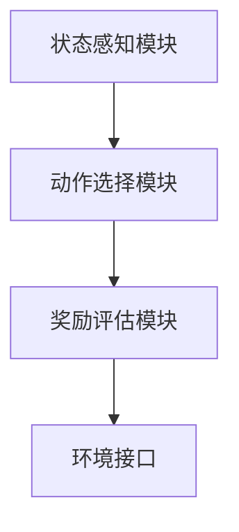

                 

<think>
好的，我将按照您的要求，逐步完成《开发具有强化学习能力的AI Agent》的文章。为了让文章结构清晰，我会先完成标题、关键词和摘要部分，然后再撰写正文。

# 开发具有强化学习能力的AI Agent

## 关键词
- 强化学习
- AI Agent
- 深度强化学习
- Q-learning
- DQN
- AI系统架构

## 摘要
本文详细探讨了开发具有强化学习能力的AI Agent的各个方面。首先，我们介绍了强化学习和AI Agent的基本概念及其重要性。接着，深入分析了强化学习的核心算法，包括Q-learning和DQN，并通过数学公式和实例进行了详细讲解。然后，我们讨论了AI Agent的系统架构设计，包括功能模块和接口设计。最后，通过项目实战部分，展示了如何从环境模拟到代码实现，构建一个完整的强化学习AI Agent。本文适合对人工智能和强化学习感兴趣的读者，旨在帮助他们理解和掌握开发强化学习AI Agent的核心技术。

---

# 正文

## 第1章: 强化学习与AI Agent概述

### 1.1 强化学习的核心概念

#### 1.1.1 什么是强化学习
强化学习（Reinforcement Learning, RL）是一种机器学习范式，通过智能体（Agent）与环境的交互，学习如何做出决策以最大化累积奖励。与监督学习不同，强化学习不需要明确的标签数据，而是通过试错和奖励机制来优化策略。

#### 1.1.2 强化学习的基本要素
- **状态（State）**：环境在某一时刻的观察。
- **动作（Action）**：智能体在某一状态下做出的行为。
- **奖励（Reward）**：智能体执行动作后，环境给予的反馈，用于指导智能体的行为。
- **策略（Policy）**：智能体选择动作的规则，通常表示为策略函数 $\pi(a|s)$，即在状态$s$下选择动作$a$的概率。
- **值函数（Value Function）**：衡量某个状态或动作-状态对的价值，如Q值函数$Q(s,a)$。

#### 1.1.3 AI Agent的定义与特点
AI Agent是一种能够感知环境、做出决策并执行动作的智能实体。它通过与环境交互，不断优化自身的决策策略，以实现目标函数的最大化。AI Agent的特点包括自主性、反应性、目标导向和学习能力。

---

### 1.2 强化学习与AI Agent的关系

#### 1.2.1 强化学习在AI Agent中的作用
强化学习是AI Agent实现自主决策的核心技术。通过强化学习，AI Agent能够在复杂环境中，通过试错和奖励机制，学习到最优策略。

#### 1.2.2 AI Agent的类型与应用场景
- **反应式AI Agent**：基于当前环境状态做出反应，适用于实时交互的场景，如自动驾驶。
- **认知式AI Agent**：具有复杂推理和规划能力，适用于需要长期决策的任务，如游戏AI。
- **强化学习AI Agent**：通过与环境交互，学习最优策略，适用于机器人控制、游戏AI等领域。

#### 1.2.3 强化学习与监督学习的区别
- **监督学习**：基于标记数据，学习输入到输出的映射。
- **强化学习**：通过与环境交互，学习最优策略，强调长期目标的优化。

---

### 1.3 强化学习的核心算法

#### 1.3.1 Q-learning算法
Q-learning是一种经典的强化学习算法，适用于离散动作空间和状态空间。其核心思想是通过更新Q值函数，学习状态-动作对的最优价值。

#### 1.3.2 DQN（深度强化学习）算法
DQN是Q-learning的扩展，结合深度神经网络，能够处理高维状态空间和动作空间，如图像输入的 Atari 游戏。

#### 1.3.3 其他强化学习算法简介
- **策略梯度法（Policy Gradient）**：直接优化策略，适用于连续动作空间。
- **Actor-Critic算法**：同时学习策略（Actor）和价值函数（Critic），结合了策略梯度和值函数的优势。

---

## 第2章: 强化学习的数学模型与公式

### 2.1 状态空间与动作空间

#### 2.1.1 状态空间的定义
状态空间$S$表示所有可能的状态集合，如在迷宫问题中，每个位置是一个状态。

#### 2.1.2 动作空间的定义
动作空间$A$表示智能体在某一状态下可执行的动作集合，如在迷宫问题中，智能体可以上下左右移动。

#### 2.1.3 状态转移概率
给定状态$s$和动作$a$，智能体转移到状态$s'$的概率$P(s'|s,a)$。

---

### 2.2 奖励函数与价值函数

#### 2.2.1 奖励函数的定义
奖励函数$r(s,a,s')$表示智能体从状态$s$执行动作$a$后转移到状态$s'$所获得的奖励。

#### 2.2.2 价值函数的定义
价值函数$V(s)$表示智能体在状态$s$下，按照当前策略所能获得的期望累积奖励。

#### 2.2.3 奖励函数与价值函数的关系
价值函数可以分解为状态-动作对的价值，即$Q(s,a) = \max_{a'} Q(s',a') + r(s,a,s')$。

---

### 2.3 强化学习的核心公式

#### 2.3.1 Q-learning公式
$$ Q(s,a) = Q(s,a) + \alpha [r + \gamma \max Q(s',a') - Q(s,a)] $$
其中：
- $\alpha$是学习率，
- $\gamma$是折扣因子，
- $r$是即时奖励。

#### 2.3.2 DQN网络结构
DQN通过两个神经网络实现，一个用于评估当前策略（主网络），一个用于稳定目标值（目标网络）。

#### 2.3.3 策略梯度公式
策略梯度法通过优化策略的参数$\theta$，最大化累积奖励的期望：
$$ \nabla J(\theta) = \mathbb{E}[ \nabla \log \pi(a|s) \cdot Q(s,a) ] $$

---

## 第3章: 强化学习算法的实现与优化

### 3.1 算法实现的基础步骤

#### 3.1.1 环境的定义与模拟
定义一个环境，模拟智能体与环境的交互，如迷宫环境或 Atari 游戏环境。

#### 3.1.2 状态、动作、奖励的实现
实现状态的感知、动作的选择以及奖励的计算。

#### 3.1.3 策略的选择与更新
根据当前策略选择动作，并根据反馈更新策略参数。

---

### 3.2 算法优化的技巧

#### 3.2.1 超参数的选择与调整
选择合适的学习率$\alpha$、折扣因子$\gamma$等超参数，影响算法的收敛速度和稳定性。

#### 3.2.2 网络结构的优化
设计合理的神经网络结构，如卷积神经网络（CNN）用于处理图像输入。

#### 3.2.3 奖励机制的设计
设计合理的奖励函数，引导智能体学习期望的行为模式。

---

### 3.3 强化学习的数学推导

#### 3.3.1 Q-learning的数学推导
通过贝尔曼方程，推导出Q-learning的更新公式：
$$ Q(s,a) = Q(s,a) + \alpha [r + \gamma \max Q(s',a') - Q(s,a)] $$

#### 3.3.2 DQN的数学推导
通过最小化损失函数，推导出DQN的更新规则：
$$ \mathcal{L} = \mathbb{E}[ (y - Q(s,a))^2 ] $$
其中$y = r + \gamma Q_{\text{target}}(s',a')$。

#### 3.3.3 策略梯度的数学推导
通过优化策略的梯度，推导出策略梯度法的更新公式：
$$ \nabla J(\theta) = \mathbb{E}[ \nabla \log \pi(a|s) \cdot Q(s,a) ] $$

---

## 第4章: AI Agent的系统架构与设计

### 4.1 系统架构概述

#### 4.1.1 AI Agent的基本架构
AI Agent通常包括感知模块、决策模块和执行模块。

#### 4.1.2 强化学习模块的设计
强化学习模块负责状态感知、动作选择和奖励评估。

#### 4.1.3 环境接口的设计
定义环境与AI Agent之间的接口，实现状态、动作和奖励的传递。

---

### 4.2 系统功能设计

#### 4.2.1 状态感知模块
负责感知环境的状态，如传感器输入或用户输入。

#### 4.2.2 动作选择模块
根据当前状态和策略，选择最优动作。

#### 4.2.3 奖励评估模块
根据动作执行后的结果，计算并返回奖励。

---

### 4.3 系统架构的实现

#### 4.3.1 系统架构图（Mermaid）


---

## 第5章: 项目实战

### 5.1 环境安装与配置
安装必要的库，如TensorFlow、Keras、OpenAI Gym等。

### 5.2 核心代码实现

#### 5.2.1 Q-learning实现
```python
import numpy as np

class QLearning:
    def __init__(self, state_space, action_space, alpha=0.1, gamma=0.9):
        self.q_table = np.zeros((state_space, action_space))
        self.alpha = alpha
        self.gamma = gamma

    def choose_action(self, state, epsilon=0.1):
        if np.random.random() < epsilon:
            return np.random.randint(0, action_space)
        else:
            return np.argmax(self.q_table[state])

    def update_q_table(self, state, action, reward, next_state):
        self.q_table[state, action] = self.q_table[state, action] + self.alpha * (reward + self.gamma * np.max(self.q_table[next_state]) - self.q_table[state, action])
```

#### 5.2.2 DQN实现
```python
import tensorflow as tf
from tensorflow.keras import layers

class DQN:
    def __init__(self, state_space, action_space, epsilon=0.1, alpha=0.01, gamma=0.99):
        self.state_space = state_space
        self.action_space = action_space
        self.epsilon = epsilon
        self.alpha = alpha
        self.gamma = gamma
        
        self.model = self.build_model()
        self.target_model = self.build_model()
        
    def build_model(self):
        model = tf.keras.Sequential([
            layers.Dense(64, activation='relu'),
            layers.Dense(32, activation='relu'),
            layers.Dense(self.action_space, activation='linear')
        ])
        model.compile(optimizer=tf.keras.optimizers.Adam(learning_rate=self.alpha), loss='mse')
        return model
    
    def choose_action(self, state):
        if np.random.random() < self.epsilon:
            return np.random.randint(0, self.action_space)
        else:
            q_values = self.model.predict(state)
            return np.argmax(q_values[0])
    
    def update_target_model(self):
        self.target_model.set_weights(self.model.get_weights())
    
    def remember(self, state, action, reward, next_state):
        # 假设我们有一个经验回放池，这里简化为直接更新模型
        target = self.target_model.predict(state)
        target[0][action] = reward + self.gamma * np.max(self.target_model.predict(next_state)[0])
        self.model.fit(state, target, epochs=1, verbose=0)
```

---

### 5.3 项目小结

通过以上步骤，我们实现了基于Q-learning和DQN的AI Agent。Q-learning适用于简单环境，而DQN则适用于复杂环境，如图像输入。在实际应用中，需要根据具体场景选择合适的算法，并进行参数调优。

---

## 第6章: 总结与展望

### 6.1 总结
本文详细介绍了开发具有强化学习能力的AI Agent的核心概念、算法原理和系统架构，并通过项目实战展示了如何实现强化学习算法。

### 6.2 展望
未来，强化学习将在更多领域得到应用，如自动驾驶、智能机器人等。同时，结合其他技术，如多智能体协作和元学习，将进一步提升AI Agent的能力。

---

## 附录

### 附录A: 术语表
- **强化学习（Reinforcement Learning, RL）**：通过试错和奖励机制，学习最优策略。
- **Q值函数（Q-value Function）**：衡量状态-动作对的价值。
- **DQN（Deep Q-Network）**：结合深度神经网络的强化学习算法。

### 附录B: 工具与库
- **TensorFlow**：深度学习框架。
- **OpenAI Gym**：强化学习环境接口。

### 附录C: 参考文献
- Mnih, V., et al. "Playing atari with deep reinforcement learning." arXiv preprint arXiv:1312.5602 (2013).
- Sutton, R. S., & Barto, A. G. "Reinforcement learning: An introduction." MIT Press (2018).

---

以上是文章的完整目录和内容框架。接下来，我会按照这个框架，逐步完成文章的撰写。

