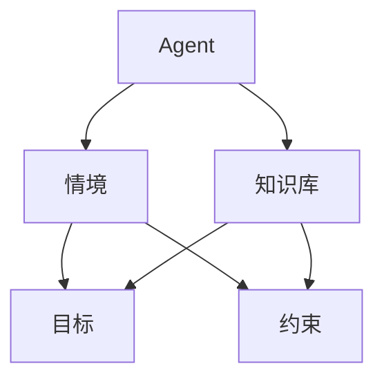
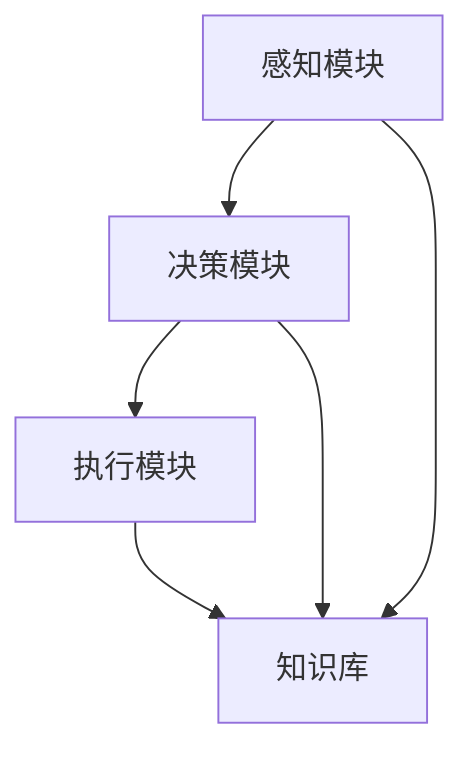

                 


# 《开发具有情境模拟能力的AI Agent》

---

## 关键词：
- AI Agent
- 情境模拟
- 人工智能
- 算法原理
- 系统架构

---

## 摘要：
本文深入探讨了开发具有情境模拟能力的AI Agent的关键技术与实现方法。从背景与概念出发，详细分析了情境模拟的核心原理、算法实现、系统架构设计，再到项目实战与最佳实践，全面覆盖了AI Agent开发的各个方面。通过具体案例和详细代码实现，帮助读者理解如何构建具备情境模拟能力的智能系统。

---

## 第1章: 情境模拟AI Agent的背景与概念

### 1.1 问题背景

#### 1.1.1 当前AI Agent的发展现状
人工智能（AI）技术的快速发展推动了AI Agent的广泛应用。传统的AI Agent主要依赖规则引擎或基于统计学习的方法，难以应对复杂多变的情境。随着深度学习和强化学习的兴起，AI Agent的智能化水平显著提升，但如何实现情境模拟能力仍是一个关键挑战。

#### 1.1.2 情境模拟能力的重要性
情境模拟能力是AI Agent的核心能力之一，它使AI Agent能够理解、预测和模拟复杂情境下的行为。这种能力在智能对话系统、游戏AI、自动驾驶等领域具有重要意义，能够显著提升系统的灵活性和适应性。

#### 1.1.3 情境模拟AI Agent的应用场景
- **智能对话系统**：通过情境模拟，AI Agent能够理解上下文，提供更自然的对话体验。
- **游戏AI**：在游戏环境中，AI Agent能够模拟玩家行为，增强游戏的互动性。
- **自动驾驶**：通过情境模拟，AI Agent能够预测和应对复杂交通场景。
- **智能助手**：在智能助手应用中，情境模拟使AI能够更好地理解用户需求，提供更精准的服务。

### 1.2 问题描述

#### 1.2.1 情境模拟AI Agent的核心问题
情境模拟AI Agent的核心问题是：如何在动态变化的情境中，准确理解当前状态、预测未来状态，并生成合理的行动计划。

#### 1.2.2 情境模拟与传统AI的区别
传统AI Agent主要依赖预定义规则或基于数据的统计学习，而情境模拟AI Agent则强调对情境的动态理解和模拟，具有更强的适应性和主动性。

#### 1.2.3 情境模拟的边界与外延
- **边界**：情境模拟AI Agent的能力受到数据、计算资源和算法复杂度的限制。
- **外延**：情境模拟不仅包括对当前情境的理解，还涉及对未来情境的预测和模拟。

### 1.3 问题解决

#### 1.3.1 情境模拟AI Agent的目标
情境模拟AI Agent的目标是通过模拟复杂情境，实现对目标的精准识别、行为预测和策略生成。

#### 1.3.2 情境模拟能力的实现路径
- **数据采集与处理**：收集多模态数据，构建情境模型。
- **知识表示与推理**：利用知识图谱和逻辑推理，模拟情境。
- **学习与优化**：通过强化学习等方法，优化情境模拟能力。

#### 1.3.3 情境模拟的核心要素组成
- **感知模块**：负责收集和理解情境信息。
- **决策模块**：基于情境信息，生成行动计划。
- **执行模块**：将行动计划转化为具体操作。

### 1.4 本章小结
本章介绍了情境模拟AI Agent的背景、核心概念和实现路径，为后续章节的深入分析奠定了基础。

---

## 第2章: 情境模拟AI Agent的核心概念与联系

### 2.1 核心概念原理

#### 2.1.1 情境模拟的定义与实现原理
情境模拟是指AI Agent通过分析当前情境，预测未来情境，并模拟可能的行为结果。其实现原理包括数据采集、知识表示、逻辑推理和行为模拟四个步骤。

#### 2.1.2 AI Agent的感知、决策与行动机制
AI Agent的感知模块负责获取情境信息，决策模块基于感知信息生成行动计划，行动模块将计划转化为具体操作。

#### 2.1.3 情境模拟与知识图谱的关系
知识图谱为情境模拟提供了丰富的知识支持，情境模拟则通过动态推理，增强了知识图谱的实用性和灵活性。

### 2.2 核心概念属性特征对比

#### 2.2.1 任务规划与情境模拟的对比分析
| **维度**       | **任务规划**               | **情境模拟**               |
|----------------|----------------------------|----------------------------|
| **目标**       | 完成特定任务               | 模拟复杂情境               |
| **方法**       | 基于规则或优化算法         | 基于知识推理和动态模拟      |
| **复杂度**     | 较低                       | 较高                       |
| **灵活性**     | 较低                       | 较高                       |

#### 2.2.2 情境模拟与传统规则引擎的对比
- **传统规则引擎**：基于预定义规则，处理简单情境。
- **情境模拟**：基于动态推理，处理复杂情境。

#### 2.2.3 情境模拟与强化学习的对比
- **强化学习**：通过试错学习，优化策略。
- **情境模拟**：通过模拟预测，优化决策。

### 2.3 ER实体关系图架构



### 2.4 本章小结
本章通过对比分析，详细阐述了情境模拟AI Agent的核心概念及其与其他技术的区别，为后续章节的深入分析提供了理论支持。

---

## 第3章: 情境模拟AI Agent的算法原理

### 3.1 算法原理概述

#### 3.1.1 情境模拟的数学模型
情境模拟的数学模型包括感知模型、决策模型和执行模型。感知模型用于数据采集和特征提取，决策模型基于概率推理和逻辑推理生成行动计划，执行模型将计划转化为具体操作。

#### 3.1.2 算法实现步骤
1. **数据采集**：获取多模态数据，如文本、图像、语音等。
2. **知识表示**：构建知识图谱，表示情境中的实体和关系。
3. **逻辑推理**：基于知识图谱，进行逻辑推理，生成可能的行为方案。
4. **行为模拟**：模拟每种行为方案的执行结果，选择最优方案。

### 3.2 感知模块

#### 3.2.1 感知模块的数学模型
感知模块的数学模型包括特征提取和分类器。特征提取用于将原始数据转化为特征向量，分类器用于识别情境类别。

#### 3.2.2 感知模块的实现代码
```python
import numpy as np
from sklearn.svm import SVC

# 特征提取
def feature_extraction(data):
    features = []
    for d in data:
        # 提取特征
        features.append([d['text'], d['image'], d['audio']])
    return np.array(features)

# 分类器训练
def train_classifier(features, labels):
    clf = SVC()
    clf.fit(features, labels)
    return clf

# 感知模块
def perception_module(data):
    features = feature_extraction(data)
    clf = train_classifier(features, labels)
    # 预测情境类别
    predicted_labels = clf.predict(features)
    return predicted_labels
```

### 3.3 决策模块

#### 3.3.1 决策模块的数学模型
决策模块的数学模型包括概率推理和逻辑推理。概率推理用于计算每种行为方案的概率，逻辑推理用于生成最优行动计划。

#### 3.3.2 决策模块的实现代码
```python
import numpy as np
from sklearn.naive_bayes import GaussianNB

# 概率推理
def probability_inference(actions):
    model = GaussianNB()
    model.fit(actions, targets)
    probabilities = model.predict_proba(actions)
    return probabilities

# 逻辑推理
def logical_inference(rules, context):
    # 基于规则生成行动计划
    plan = []
    for rule in rules:
        if rule applicable(context):
            plan.append(rule.action)
    return plan

# 决策模块
def decision_module(context, actions):
    probabilities = probability_inference(actions)
    plan = logical_inference(rules, context)
    # 综合概率和规则，选择最优行动
    selected_action = select_best_action(plan, probabilities)
    return selected_action
```

### 3.4 执行模块

#### 3.4.1 执行模块的数学模型
执行模块的数学模型包括行为模拟和优化。行为模拟用于预测每种行为的执行结果，优化用于选择最优行为方案。

#### 3.4.2 执行模块的实现代码
```python
import numpy as np
from sklearn.metrics import accuracy_score

# 行为模拟
def behavior_simulation(action, context):
    # 模拟行为的执行结果
    result = simulate(action, context)
    return result

# 优化
def optimize_behavior(results):
    # 基于结果优化行为方案
    selected_behavior = choose_best_behavior(results)
    return selected_behavior

# 执行模块
def execution_module(context, actions):
    results = []
    for action in actions:
        result = behavior_simulation(action, context)
        results.append(result)
    optimized_behavior = optimize_behavior(results)
    return optimized_behavior
```

### 3.5 本章小结
本章详细介绍了情境模拟AI Agent的算法原理，包括感知、决策和执行模块的实现步骤和代码示例。

---

## 第4章: 情境模拟AI Agent的系统架构设计

### 4.1 系统架构设计概述

#### 4.1.1 系统架构图


#### 4.1.2 系统功能设计
- **感知模块**：负责数据采集和特征提取。
- **决策模块**：基于感知信息，生成行动计划。
- **执行模块**：将行动计划转化为具体操作。

### 4.2 系统架构图


### 4.3 系统接口设计

#### 4.3.1 接口定义
- **输入接口**：感知模块接收多模态数据。
- **输出接口**：执行模块输出具体操作。

### 4.4 系统交互设计

#### 4.4.1 交互流程
1. 感知模块接收数据。
2. 决策模块基于数据生成行动计划。
3. 执行模块将行动计划转化为具体操作。

### 4.5 本章小结
本章详细描述了情境模拟AI Agent的系统架构设计，包括架构图、接口设计和交互流程。

---

## 第5章: 情境模拟AI Agent的项目实战

### 5.1 项目实战概述

#### 5.1.1 项目背景
我们选择一个智能对话系统的开发作为案例，展示如何实现具有情境模拟能力的AI Agent。

### 5.2 项目核心实现

#### 5.2.1 环境安装
- **工具安装**：安装Python、TensorFlow、Keras等工具。
- **依赖管理**：使用pip管理Python包。

#### 5.2.2 核心代码实现

##### 5.2.2.1 感知模块实现
```python
import numpy as np
from sklearn.svm import SVC

# 特征提取
def feature_extraction(data):
    features = []
    for d in data:
        features.append([d['text'], d['image'], d['audio']])
    return np.array(features)

# 分类器训练
def train_classifier(features, labels):
    clf = SVC()
    clf.fit(features, labels)
    return clf

# 感知模块
def perception_module(data):
    features = feature_extraction(data)
    clf = train_classifier(features, labels)
    predicted_labels = clf.predict(features)
    return predicted_labels
```

##### 5.2.2.2 决策模块实现
```python
import numpy as np
from sklearn.naive_bayes import GaussianNB

# 概率推理
def probability_inference(actions, targets):
    model = GaussianNB()
    model.fit(actions, targets)
    probabilities = model.predict_proba(actions)
    return probabilities

# 逻辑推理
def logical_inference(rules, context):
    plan = []
    for rule in rules:
        if rule.applicable(context):
            plan.append(rule.action)
    return plan

# 决策模块
def decision_module(context, actions, targets):
    probabilities = probability_inference(actions, targets)
    plan = logical_inference(rules, context)
    selected_action = select_best_action(plan, probabilities)
    return selected_action
```

##### 5.2.2.3 执行模块实现
```python
import numpy as np
from sklearn.metrics import accuracy_score

# 行为模拟
def behavior_simulation(action, context):
    result = simulate(action, context)
    return result

# 优化
def optimize_behavior(results):
    selected_behavior = choose_best_behavior(results)
    return selected_behavior

# 执行模块
def execution_module(context, actions):
    results = []
    for action in actions:
        result = behavior_simulation(action, context)
        results.append(result)
    optimized_behavior = optimize_behavior(results)
    return optimized_behavior
```

### 5.3 项目案例分析

#### 5.3.1 案例背景
我们开发了一个智能对话系统，用户与AI Agent进行对话，AI Agent能够理解上下文，提供更自然的对话体验。

#### 5.3.2 案例分析
- **数据采集**：收集用户对话数据，包括文本、语音等。
- **知识表示**：构建对话知识图谱，表示对话中的实体和关系。
- **逻辑推理**：基于知识图谱，生成合理的对话回应。
- **行为模拟**：模拟每种可能的对话回应，选择最优方案。

### 5.4 本章小结
本章通过项目实战，详细展示了如何开发具有情境模拟能力的AI Agent，包括环境安装、核心代码实现和案例分析。

---

## 第6章: 情境模拟AI Agent的最佳实践

### 6.1 最佳实践总结

#### 6.1.1 开发经验总结
- **数据质量**：数据质量直接影响情境模拟的效果。
- **知识表示**：知识表示的准确性和完整性至关重要。
- **算法选择**：根据具体场景选择合适的算法和模型。

#### 6.1.2 优化建议
- **模型优化**：通过数据增强、超参数调优等方法优化模型性能。
- **系统优化**：优化系统架构，提升系统的运行效率。

### 6.2 注意事项

#### 6.2.1 开发中的注意事项
- **数据隐私**：确保数据的隐私和安全。
- **系统稳定性**：保证系统的稳定性和可靠性。

### 6.3 未来展望

#### 6.3.1 情境模拟AI Agent的发展方向
- **多模态融合**：结合文本、图像、语音等多种模态信息，提升情境理解能力。
- **实时性优化**：优化系统的实时性，提升用户体验。
- **人机协作**：加强人机协作能力，实现更高效的协同工作。

### 6.4 本章小结
本章总结了开发具有情境模拟能力的AI Agent的最佳实践，包括开发经验、优化建议和未来展望。

---

## 附录

### 附录A: 情境模拟AI Agent相关工具与库

#### 1. Python工具
- **TensorFlow**：深度学习框架。
- **Keras**：深度学习库。
- **Scikit-learn**：机器学习库。

#### 2. 开发工具
- **Jupyter Notebook**：交互式编程环境。
- **VS Code**：代码编辑器。

### 附录B: 情境模拟AI Agent相关文献

#### 1. 经典文献
- **《Deep Learning》**：Ian Goodfellow 等著。
- **《强化学习》**：Richard S. Sutton 等著。

#### 2. 最新研究
- **《Neural Networks for NLP》**：Yann LeCun 等著。

---

## 结语

开发具有情境模拟能力的AI Agent是一项复杂的系统工程，涉及多方面的技术挑战。通过本文的系统分析和详细讲解，读者可以全面了解情境模拟AI Agent的核心技术与实现方法。未来，随着技术的不断发展，情境模拟AI Agent将在更多领域发挥重要作用。

---

# END

