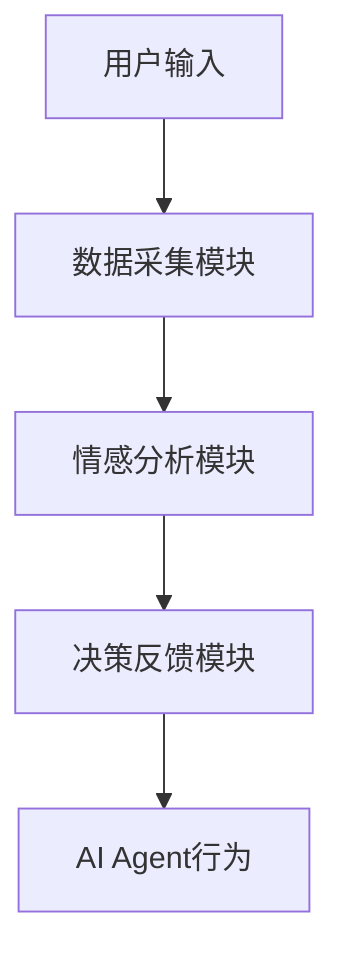
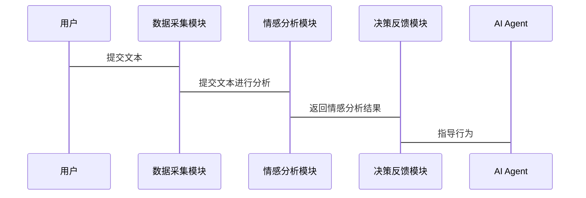

                 


# 开发具有情感分析能力的AI Agent

> 关键词：AI Agent、情感分析、自然语言处理、机器学习、深度学习

> 摘要：情感分析是自然语言处理中的一个重要领域，AI Agent需要具备理解和处理情感的能力，以便更好地与用户交互。本文将详细介绍如何开发具有情感分析能力的AI Agent，涵盖情感分析的核心概念、算法原理、系统架构设计、项目实战以及最佳实践等内容。

---

# 第1章: 情感分析与AI Agent概述

## 1.1 情感分析的基本概念

### 1.1.1 情感分析的定义与背景
情感分析（Sentiment Analysis），又称情绪分析，是自然语言处理（NLP）中的一个重要任务，旨在识别和分类文本中的情感倾向。情感分析可以帮助我们了解文本内容是正面、负面还是中性。随着社交媒体的普及，情感分析在舆情监控、产品评价分析、客户反馈处理等领域具有广泛的应用。

### 1.1.2 情感分析的核心问题
情感分析的核心问题包括：
1. **文本表示**：如何将文本转换为计算机可以理解的表示形式。
2. **特征提取**：如何从文本中提取有用的特征，用于分类。
3. **分类算法**：选择合适的算法对文本进行分类。
4. **数据标注**：如何对数据进行标注以训练模型。

### 1.1.3 情感分析的应用场景
情感分析的应用场景包括：
- 社交媒体分析：分析用户对某一话题的情感倾向。
- 产品评价分析：分析用户对产品或服务的评价。
- 客户反馈处理：通过分析客户反馈，优化产品或服务。
- 电影评论分析：分析观众对电影的评价。

## 1.2 AI Agent的基本概念

### 1.2.1 AI Agent的定义
AI Agent（人工智能代理）是一种能够感知环境、自主决策并执行任务的智能实体。AI Agent可以是软件程序，也可以是硬件设备，它能够通过与用户的交互或环境的感知，完成特定的任务。

### 1.2.2 AI Agent的核心特征
AI Agent的核心特征包括：
1. **自主性**：能够自主决策。
2. **反应性**：能够感知环境并做出实时反应。
3. **社交能力**：能够与用户或其他系统进行交互。
4. **学习能力**：能够通过经验改进自己的性能。

### 1.2.3 情感分析在AI Agent中的作用
情感分析在AI Agent中的作用是通过理解用户的情感倾向，帮助AI Agent更好地与用户交互。例如，在智能客服系统中，AI Agent可以通过情感分析理解用户的情绪，提供更加个性化的服务。

## 1.3 情感分析与AI Agent的结合

### 1.3.1 情感分析在AI Agent中的应用
情感分析在AI Agent中的应用包括：
- 智能客服：通过分析用户的语言，理解用户的情绪，提供更加贴心的服务。
- 智能助手：通过分析用户的指令，理解用户的情感倾向，提供更加智能的响应。
- 社交机器人：通过分析社交媒体上的文本，生成情感倾向的回复。

### 1.3.2 AI Agent如何利用情感分析技术
AI Agent利用情感分析技术的方式包括：
1. **情感识别**：通过情感分析技术识别用户的语言中的情感倾向。
2. **情感分类**：将用户的情感倾向分为正面、负面或中性。
3. **情感反馈**：根据用户的情感倾向，生成相应的反馈。

### 1.3.3 情感分析对AI Agent性能的提升
情感分析对AI Agent性能的提升体现在以下几个方面：
1. **提高交互效率**：通过理解用户的情感倾向，AI Agent可以更快速地理解用户的需求。
2. **提升用户体验**：通过情感分析，AI Agent可以提供更加个性化的服务，提升用户体验。
3. **优化决策能力**：情感分析可以帮助AI Agent更好地理解用户的需求，从而做出更准确的决策。

## 1.4 本章小结

---

# 第2章: 情感分析的核心概念与原理

## 2.1 情感分析的核心概念

### 2.1.1 情感分析的分类
情感分析的分类包括：
1. **二元分类**：将情感分为正面和负面。
2. **多分类**：将情感分为正面、负面和中性。
3. **细粒度情感分析**：将情感分为多个类别，如非常正面、正面、中性、负面和非常负面。

### 2.1.2 情感分析的特征
情感分析的特征包括：
- 文本长度：文本的长度可能会影响情感分类的准确性。
- 文本中情感词的数量：文本中情感词的数量越多，情感倾向越明显。
- 文本的上下文：文本的上下文关系可能会影响情感分类的结果。

### 2.1.3 情感分析的挑战
情感分析的挑战包括：
1. **歧义性**：文本中的某些词语可能具有多种含义，导致情感分析的困难。
2. **数据稀疏性**：某些情感类别可能缺乏足够的训练数据。
3. **语言的复杂性**：不同语言的语法和表达方式不同，增加了情感分析的难度。

## 2.2 情感分析的算法原理

### 2.2.1 基于规则的情感分析
基于规则的情感分析是通过预定义的规则对文本进行情感分类。例如，可以使用情感词典来判断文本中的情感倾向。

### 2.2.2 基于机器学习的情感分析
基于机器学习的情感分析是通过训练模型对文本进行情感分类。常用的算法包括朴素贝叶斯、支持向量机（SVM）等。

### 2.2.3 基于深度学习的情感分析
基于深度学习的情感分析是通过神经网络模型对文本进行情感分类。常用的模型包括卷积神经网络（CNN）、循环神经网络（RNN）和长短期记忆网络（LSTM）。

## 2.3 情感分析与AI Agent的关系

### 2.3.1 情感分析在AI Agent中的输入
情感分析在AI Agent中的输入包括用户输入的文本、语音或图像等。

### 2.3.2 情感分析在AI Agent中的输出
情感分析在AI Agent中的输出包括情感倾向的分类结果和情感强度的度量值。

### 2.3.3 情感分析对AI Agent决策的影响
情感分析对AI Agent决策的影响体现在以下几个方面：
1. **决策依据**：情感分析结果可以作为AI Agent决策的依据。
2. **行为调整**：根据情感分析结果，AI Agent可以调整其行为方式。
3. **反馈生成**：根据情感分析结果，AI Agent可以生成更加个性化的反馈。

## 2.4 本章小结

---

# 第3章: 情感分析算法的数学模型与公式

## 3.1 情感分析的数学模型

### 3.1.1 文本表示模型
文本表示模型包括词袋模型（Bag of Words, BoW）、词嵌入模型（Word Embedding）等。

### 3.1.2 分类模型
分类模型包括线性回归模型、支持向量机（SVM）、朴素贝叶斯（Naive Bayes）等。

### 3.1.3 深度学习模型
深度学习模型包括卷积神经网络（CNN）、循环神经网络（RNN）、长短期记忆网络（LSTM）等。

## 3.2 情感分析的数学公式

### 3.2.1 朴素贝叶斯分类公式
朴素贝叶斯分类公式：
$$ P(c|x) = \frac{P(x|c)P(c)}{P(x)} $$

### 3.2.2 线性回归模型公式
线性回归模型公式：
$$ y = \beta_0 + \beta_1x_1 + ... + \beta_nx_n $$

### 3.2.3 LSTM模型公式
LSTM模型公式：
$$ f(x) = \text{LSTM}(x) $$

## 3.3 情感分析的算法流程

### 3.3.1 数据预处理
数据预处理包括文本清洗、分词、去除停用词等。

### 3.3.2 特征提取
特征提取包括将文本转换为向量表示，如词袋模型、TF-IDF等。

### 3.3.3 模型训练
模型训练包括使用训练数据对分类模型进行训练，得到最优模型参数。

### 3.3.4 模型评估
模型评估包括使用测试数据对模型进行评估，计算准确率、召回率、F1值等指标。

## 3.4 本章小结

---

# 第4章: 情感分析的系统分析与架构设计

## 4.1 系统需求分析

### 4.1.1 功能需求
功能需求包括：
- 文本情感分析功能
- 情感倾向分类功能
- 情感强度度量功能

### 4.1.2 性能需求
性能需求包括：
- 处理速度：系统需要在合理时间内完成情感分析任务。
- 精度要求：系统需要达到较高的情感分类准确率。

### 4.1.3 接口需求
接口需求包括：
- API接口设计
- 输入输出格式定义

## 4.2 系统功能设计

### 4.2.1 数据采集模块
数据采集模块负责从各种数据源中采集文本数据，包括社交媒体、客户评价等。

### 4.2.2 情感分析模块
情感分析模块负责对采集的文本数据进行情感分析，输出情感倾向和强度。

### 4.2.3 决策反馈模块
决策反馈模块根据情感分析结果生成相应的反馈，指导AI Agent的行为。

## 4.3 系统架构设计

### 4.3.1 系统架构图


### 4.3.2 系统交互序列图


## 4.4 本章小结

---

# 第5章: 情感分析的项目实战

## 5.1 环境安装

### 5.1.1 Python安装
需要安装Python 3.6或更高版本。

### 5.1.2 依赖库安装
安装必要的依赖库：
```bash
pip install numpy
pip install scikit-learn
pip install tensorflow
pip install keras
```

## 5.2 核心代码实现

### 5.2.1 数据预处理
```python
import numpy as np
from sklearn.feature_extraction.text import TfidfVectorizer
from sklearn.naive_bayes import MultinomialNB
from sklearn.pipeline import Pipeline
```

### 5.2.2 情感分类模型
```python
model = Pipeline([
    ('tfidf', TfidfVectorizer()),
    ('clf', MultinomialNB())
])
model.fit(X_train, y_train)
```

### 5.2.3 模型评估
```python
from sklearn.metrics import accuracy_score
y_pred = model.predict(X_test)
print("Accuracy:", accuracy_score(y_test, y_pred))
```

## 5.3 案例分析

### 5.3.1 数据集选择
选择合适的公开数据集，例如IMDB电影评论数据集。

### 5.3.2 模型训练
对数据集进行训练，得到情感分类模型。

### 5.3.3 模型测试
使用测试数据对模型进行评估，查看准确率、召回率等指标。

## 5.4 项目总结

---

# 第6章: 总结与展望

## 6.1 本章总结
情感分析是AI Agent的重要组成部分，通过情感分析，AI Agent可以更好地理解用户的情感倾向，提供更加智能的服务。

## 6.2 未来展望
未来，情感分析技术将更加智能化和精细化，AI Agent也将更加智能化和个性化。

## 6.3 小结

---

# 结语

开发具有情感分析能力的AI Agent是一项具有挑战性的任务，但也是一项非常有意义的工作。通过本文的详细介绍，读者可以掌握情感分析的核心概念、算法原理、系统架构设计以及项目实战等内容。希望本文能够为读者提供有价值的参考和启发。

--- 

* 注意：以上内容为简化版，完整文章需要根据具体要求进一步扩展和详细描述。

