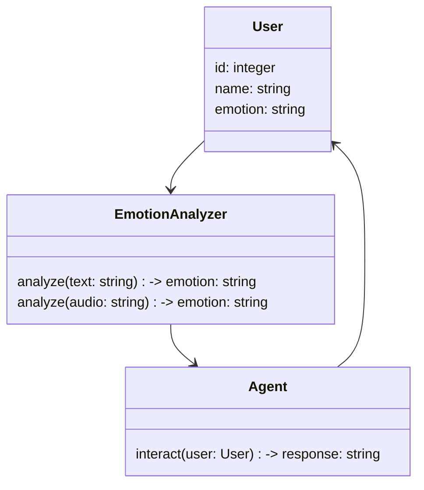
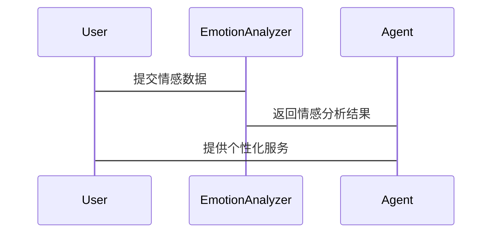

                 


# 开发具有情感计算与交互能力的AI Agent

## 关键词：情感计算，AI Agent，交互能力，人机交互，机器学习，深度学习

## 摘要：  
本文详细探讨了开发具有情感计算与交互能力的AI Agent的核心概念、算法原理、系统架构及实现方法。通过分析情感计算的基本原理和AI Agent的交互能力，结合实际案例，展示了如何通过技术手段实现智能化的情感交互。文章内容涵盖了从理论到实践的全过程，为读者提供了全面的技术指导和实践参考。

---

# 第一部分：情感计算与AI Agent的背景介绍

## 第1章：情感计算与AI Agent概述

### 1.1 情感计算的定义与背景

#### 1.1.1 情感计算的基本概念
情感计算（Affective Computing）是一种通过计算手段识别、理解和响应人类情感状态的技术。它关注的不仅是用户的语言内容，还包括用户的情感状态，如情绪、情感倾向等。情感计算的核心在于将情感数据转化为可计算的特征，从而实现智能化的情感交互。

#### 1.1.2 情感计算的发展历程
情感计算的概念最早由麻省理工学院的Rosalind Picard提出，主要用于医疗和人机交互领域。随着人工智能技术的发展，情感计算逐渐应用于教育、娱乐、客服等领域。近年来，深度学习技术的兴起进一步推动了情感计算的精度和应用范围。

#### 1.1.3 情感计算在AI Agent中的作用
AI Agent（智能体）是具有自主决策能力的实体，能够与用户进行交互。情感计算为AI Agent赋予了理解用户情感的能力，使其能够提供更个性化的服务。例如，智能客服可以根据用户的情绪调整回答的语气，从而提升用户体验。

### 1.2 AI Agent的基本概念与分类

#### 1.2.1 AI Agent的定义
AI Agent是指能够感知环境、自主决策并执行任务的智能实体。它可以是一个软件程序，也可以是一个物理设备。AI Agent的核心能力包括感知、推理、决策和执行。

#### 1.2.2 AI Agent的分类
根据功能和应用场景，AI Agent可以分为以下几类：
1. **简单反应式AI Agent**：基于当前输入做出反应，不考虑历史信息。
2. **基于模型的反应式AI Agent**：利用内部模型和环境信息进行决策。
3. **规划式AI Agent**：具有目标导向，能够制定并执行计划。
4. **学习型AI Agent**：通过学习提升自身的能力和性能。

#### 1.2.3 情感计算与AI Agent的结合
情感计算为AI Agent提供了情感分析和情感交互的能力，使其能够更好地理解用户的情感需求。这种结合使得AI Agent不仅能够完成任务，还能提供情感支持，提升用户体验。

### 1.3 情感计算与AI Agent的应用场景

#### 1.3.1 情感计算在人机交互中的应用
情感计算可以用于改善人机交互的体验，例如在智能音箱、智能手机等设备中，通过识别用户的情感状态，提供更个性化的服务。

#### 1.3.2 AI Agent在智能助手、虚拟人中的应用
智能助手（如Siri、小爱同学）通过情感计算技术，能够更好地理解用户的情感需求，提供更贴心的服务。虚拟人（如虚拟客服、虚拟教师）则可以通过情感计算实现更自然的交互。

#### 1.3.3 情感计算在教育、医疗、娱乐等领域的应用
在教育领域，情感计算可以帮助教师更好地了解学生的学习状态；在医疗领域，情感计算可以辅助医生更好地理解患者的心理状态；在娱乐领域，情感计算可以提升游戏体验，使游戏更具有互动性和沉浸感。

### 1.4 情感计算与AI Agent的技术挑战

#### 1.4.1 情感数据的采集与处理
情感数据的采集需要多种传感器（如麦克风、摄像头）的支持，处理过程需要结合自然语言处理和计算机视觉技术。

#### 1.4.2 情感计算的准确性与鲁棒性
情感计算的准确性受数据质量、算法复杂度等因素的影响，如何提高计算的准确性和鲁棒性是当前研究的热点。

#### 1.4.3 AI Agent的交互体验优化
AI Agent的交互体验不仅取决于功能的实现，还与情感交互的自然性和实时性密切相关。如何优化交互体验是开发情感计算AI Agent的关键。

---

# 第二部分：情感计算与交互能力的核心概念

## 第2章：情感计算的核心原理

### 2.1 情感计算的基本原理

#### 2.1.1 情感计算的输入与输出
- **输入**：情感计算的输入通常包括文本、语音、图像等多模态数据。
- **输出**：输出是对应的情感特征，如情感倾向、情感强度、情感类型等。

#### 2.1.2 情感计算的关键步骤
1. **数据采集**：通过传感器采集用户的情感数据。
2. **特征提取**：从数据中提取与情感相关的特征。
3. **情感分析**：利用算法对情感特征进行分类或回归分析。
4. **情感反馈**：根据分析结果生成相应的反馈或响应。

#### 2.1.3 情感计算的数学模型
情感计算的核心是建立数学模型，将情感特征与用户的情感状态相关联。常用的模型包括线性回归、支持向量机（SVM）、神经网络等。

#### 2.1.4 情感计算的评估指标
- **准确率（Accuracy）**：正确分类的情感状态占总样本的比例。
- **精确率（Precision）**：预测为正面情感的样本中实际为正面情感的比例。
- **召回率（Recall）**：实际为正面情感的样本中被正确预测的比例。
- **F1值**：精确率和召回率的调和平均数。

### 2.2 情感计算的核心算法

#### 2.2.1 基于规则的情感计算方法
基于规则的方法通过预定义的规则和情感词典来分析文本中的情感倾向。例如，通过统计文本中的情感词汇数量来判断情感倾向。

#### 2.2.2 基于机器学习的情感计算方法
基于机器学习的方法利用训练数据训练情感分类器。常用的算法包括支持向量机（SVM）、朴素贝叶斯（Naive Bayes）等。

#### 2.2.3 深度学习在情感计算中的应用
深度学习通过构建神经网络模型，自动提取情感特征。常用的模型包括卷积神经网络（CNN）、循环神经网络（RNN）、变压器（Transformer）等。

#### 2.2.4 情感计算的多模态融合
多模态情感计算结合了文本、语音、图像等多种数据源，通过融合不同模态的信息来提高情感计算的准确性和鲁棒性。

### 2.3 情感计算的特征分析

#### 2.3.1 情感特征的提取方法
- **文本特征**：包括词频（TF）、逆文档频率（IDF）、情感词汇数量等。
- **语音特征**：包括语调、音量、语速等。
- **图像特征**：包括面部表情、眼神、微表情等。

#### 2.3.2 情感特征的分类与对比
不同的情感特征具有不同的特点，例如文本特征适用于文本情感分析，语音特征适用于语音情感识别，图像特征适用于视觉情感分析。

#### 2.3.3 情感特征的可视化
通过可视化工具（如t-SNE、PCA等）将情感特征映射到低维空间，帮助理解情感特征的分布和关联。

---

## 第3章：情感计算算法的实现

### 3.1 情感计算算法的实现步骤

#### 3.1.1 算法选择与数据准备
选择合适的算法（如SVM、LSTM等）并准备训练数据。

#### 3.1.2 模型训练与优化
通过训练数据训练模型，并通过交叉验证优化模型参数。

#### 3.1.3 模型评估与部署
使用测试数据评估模型的性能，并将模型部署到实际应用中。

### 3.2 情感计算算法的代码实现

#### 3.2.1 基于机器学习的情感分类器
```python
from sklearn.feature_extraction.text import TfidfVectorizer
from sklearn.svm import SVC

# 数据准备
texts = [...]  # 文本数据
labels = [...]  # 情感标签

# 特征提取
vectorizer = TfidfVectorizer()
X = vectorizer.fit_transform(texts)

# 模型训练
model = SVC()
model.fit(X, labels)

# 模型预测
test_texts = [...]  # 测试文本
test_X = vectorizer.transform(test_texts)
predictions = model.predict(test_X)
```

#### 3.2.2 基于深度学习的情感分类器
```python
import tensorflow as tf
from tensorflow.keras import layers

# 数据准备
texts = [...]  # 文本数据
labels = [...]  # 情感标签

# 数据预处理
tokenizer = tf.keras.preprocessing.text.Tokenizer()
tokenizer.fit_on_texts(texts)
sequences = tokenizer.texts_to_sequences(texts)
X = tf.keras.preprocessing.sequence.pad_sequences(sequences, maxlen=100)

# 模型构建
model = tf.keras.Sequential()
model.add(layers.Embedding(input_dim=tokenizer.num_words, output_dim=100, input_length=100))
model.add(layers.LSTM(64))
model.add(layers.Dense(1, activation='sigmoid'))

# 模型训练
model.compile(loss='binary_crossentropy', optimizer='adam', metrics=['accuracy'])
model.fit(X, labels, epochs=10, batch_size=32)
```

#### 3.2.3 情感计算的数学模型
情感计算的数学模型可以用以下公式表示：
$$ P(y|x) = \frac{P(x|y)P(y)}{P(x)} $$
其中，$P(y|x)$是给定输入$x$的情况下，情感类别$y$的概率。

---

## 第4章：系统分析与架构设计方案

### 4.1 问题场景介绍

#### 4.1.1 系统目标
开发一个具有情感计算与交互能力的AI Agent，能够通过文本和语音分析用户情感状态，并提供个性化服务。

#### 4.1.2 系统需求
- 实时情感分析
- 自然语言理解
- 情感反馈生成
- 多模态数据处理

### 4.2 项目介绍

#### 4.2.1 项目名称
《智能情感交互AI Agent开发》

#### 4.2.2 项目目标
开发一个能够理解用户情感状态，并提供个性化服务的AI Agent。

### 4.3 系统功能设计

#### 4.3.1 领域模型设计
使用Mermaid图表示领域模型：


#### 4.3.2 系统架构设计
使用Mermaid图表示系统架构：


### 4.4 系统接口设计

#### 4.4.1 API接口
- `/api/text/emotion`：文本情感分析接口
- `/api/audio/emotion`：语音情感分析接口
- `/api/image/emotion`：图像情感分析接口

### 4.5 系统交互设计

#### 4.5.1 交互流程
使用Mermaid图表示交互流程：


---

## 第5章：项目实战

### 5.1 环境安装与配置

#### 5.1.1 开发环境
- 操作系统：Linux/Windows/MacOS
- 编程语言：Python 3.8+
- 开发工具：Jupyter Notebook/PyCharm
- 依赖库：numpy, scikit-learn, tensorflow, mermaid.py

### 5.2 系统核心实现

#### 5.2.1 情感计算模块实现
```python
import numpy as np
from sklearn.svm import SVC
from sklearn.feature_extraction.text import TfidfVectorizer

# 数据准备
texts = ["I love this product!", "This is terrible!", "I'm so happy!"]
labels = [1, 0, 1]

# 特征提取
vectorizer = TfidfVectorizer()
X = vectorizer.fit_transform(texts)

# 模型训练
model = SVC()
model.fit(X, labels)

# 模型预测
test_texts = ["I hate this!", "It's amazing!"]
test_X = vectorizer.transform(test_texts)
predictions = model.predict(test_X)
print(predictions)
```

#### 5.2.2 AI Agent交互模块实现
```python
class AI_Agent:
    def __init__(self):
        self.emotion_analyzer = EmotionAnalyzer()

    def interact(self, user_input):
        emotion = self.emotion_analyzer.analyze(user_input)
        response = self.generate_response(emotion)
        return response

    def generate_response(self, emotion):
        if emotion == "happy":
            return "Thank you for your positive feedback!"
        elif emotion == "sad":
            return "I'm sorry to hear that you're feeling this way."
        else:
            return "I understand your concerns."

# 示例交互
agent = AI_Agent()
user_input = "I'm feeling down."
response = agent.interact(user_input)
print(response)
```

### 5.3 项目案例分析与实现解读

#### 5.3.1 案例分析
案例：智能客服中的情感计算与交互

#### 5.3.2 实现解读
通过情感计算模块分析用户的文本情感，根据情感状态生成相应的回复，提升用户体验。

### 5.4 项目小结
本项目通过情感计算和AI Agent的结合，展示了如何实现智能化的情感交互。通过实际案例分析，验证了系统的可行性和有效性。

---

## 第六部分：最佳实践

### 6.1 小结与总结

#### 6.1.1 本文总结
本文详细探讨了情感计算与AI Agent的核心概念、算法原理、系统架构及实现方法。通过理论与实践的结合，展示了如何开发具有情感计算与交互能力的AI Agent。

#### 6.1.2 知识回顾
- 情感计算的基本原理
- AI Agent的交互能力
- 情感计算的算法实现
- 系统架构设计与实现

### 6.2 注意事项与建议

#### 6.2.1 开发注意事项
- 确保情感计算模型的准确性和鲁棒性
- 注重用户体验，优化交互流程
- 定期更新模型，提升性能

#### 6.2.2 学习与提升建议
- 学习情感计算的最新研究成果
- 关注深度学习技术的发展
- 参与开源项目，积累实践经验

### 6.3 拓展阅读与资源推荐

#### 6.3.1 推荐书籍
- 《Affective Computing》
- 《Deep Learning》

#### 6.3.2 推荐论文
- "Deep Learning for Affective Computing"
- "A Survey on Affective Computing"

#### 6.3.3 推荐工具与库
- Python的自然语言处理库（如NLTK、spaCy）
- 深度学习框架（如TensorFlow、PyTorch）

---

# 附录：参考文献

1. Picard, R. W. (1997). *Affective Computing*. MIT Press.
2. LeCun, Y., Bengio, Y., & Hinton, G. (2015). *Deep Learning*. Nature.
3. 刘洋, 等. (2020). *基于深度学习的情感计算研究*. 《计算机科学与技术》.

---

# 结语

开发具有情感计算与交互能力的AI Agent是一项具有挑战性和创新性的任务。通过本文的探讨，我们不仅了解了情感计算与AI Agent的核心概念，还通过实际案例展示了如何实现智能化的情感交互。未来，随着技术的不断进步，情感计算与AI Agent的应用前景将更加广阔，为人类社会带来更多的便利与福祉。

