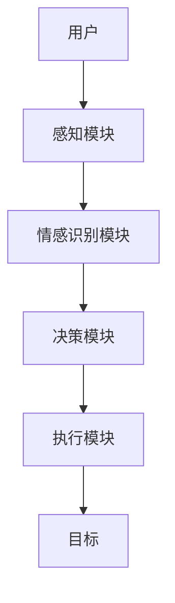
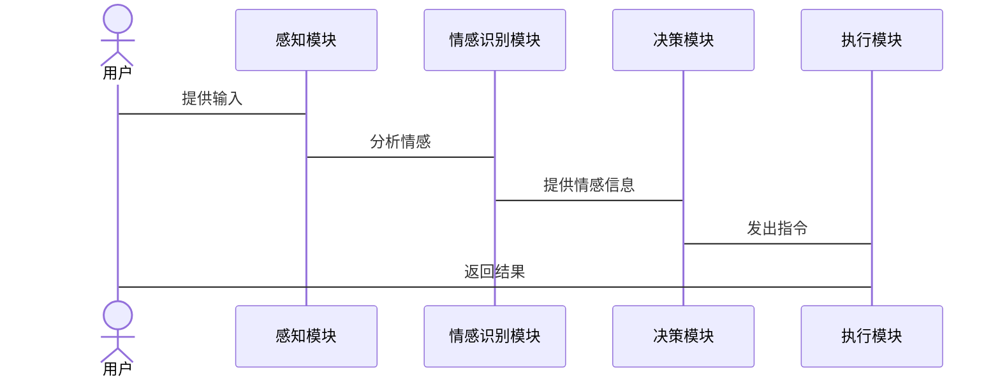

                 


# 开发具有情感计算能力的AI Agent

> 关键词：情感计算、AI Agent、深度学习、自然语言处理、多模态数据

> 摘要：本文探讨了如何开发具有情感计算能力的AI Agent，通过详细分析情感计算的核心技术、AI Agent的架构设计、系统实现以及实际项目案例，展示了如何将情感计算应用于智能交互系统中，以提升用户体验。

---

## 第一部分: 情感计算与AI Agent基础

### 第1章: 情感计算与AI Agent概述

#### 1.1 情感计算的定义与背景

##### 1.1.1 情感计算的定义
情感计算（Affective Computing）是指计算机系统能够识别、理解和响应人类情感的能力。它不仅关注用户的输入内容，还关注用户的情感状态，从而提供更智能和个性化的服务。

##### 1.1.2 情感计算的发展历程
情感计算的研究可以追溯到20世纪60年代，但真正的发展始于2000年后，随着人工智能和机器学习技术的进步，情感计算在多个领域得到了广泛应用。

##### 1.1.3 情感计算的应用场景
情感计算广泛应用于智能助手、教育科技、心理健康辅助、游戏开发等领域，帮助计算机更好地理解和满足用户的情感需求。

#### 1.2 AI Agent的基本概念

##### 1.2.1 AI Agent的定义
AI Agent（人工智能代理）是指能够感知环境、自主决策并执行任务的智能实体。它可以是一个软件程序或物理设备，具备目标导向的行为能力。

##### 1.2.2 AI Agent的核心特征
- **自主性**：能够自主决策和行动。
- **反应性**：能够实时感知环境并做出反应。
- **目标导向**：具有明确的目标和任务。

##### 1.2.3 AI Agent与传统AI的区别
AI Agent强调自主性和目标导向，而传统AI更多关注数据处理和模式识别。AI Agent具备更强的适应性和动态性。

#### 1.3 情感计算与AI Agent的结合

##### 1.3.1 情感计算在AI Agent中的作用
情感计算使AI Agent能够理解用户的情感状态，从而提供更个性化的服务。

##### 1.3.2 情感计算与AI Agent的融合方式
通过整合情感识别模块，AI Agent能够实时分析用户情感，优化交互体验。

##### 1.3.3 情感计算驱动的AI Agent的优势
提升用户体验，增强AI Agent的智能性和适应性，使其能够处理复杂的情感交互。

---

### 第2章: 情感计算的核心技术

#### 2.1 情感识别技术

##### 2.1.1 文本情感分析
通过自然语言处理技术分析文本内容，判断情感倾向（如正面、负面、中性）。

##### 2.1.2 语音情感识别
分析语音特征（如音调、语速、停顿）来识别情感状态。

##### 2.1.3 图像情感识别
基于图像处理和计算机视觉技术，识别图像中隐含的情感信息。

#### 2.2 情感计算的算法原理

##### 2.2.1 基于规则的情感计算方法
通过预定义的规则和情感词典进行情感分析，适用于简单场景。

##### 2.2.2 基于机器学习的情感计算方法
利用训练数据，通过分类模型（如SVM、随机森林）进行情感预测。

##### 2.2.3 基于深度学习的情感计算方法
使用神经网络（如CNN、RNN）处理多模态数据，提升情感识别的准确性。

#### 2.3 情感计算的挑战与解决方案

##### 2.3.1 数据获取与标注的挑战
情感数据标注需要专业知识，且标注成本高。

##### 2.3.2 情感计算的模型优化
通过数据增强、迁移学习等技术优化模型性能。

##### 2.3.3 情感计算的可解释性问题
通过可视化技术提高模型决策的透明度和可解释性。

---

### 第3章: AI Agent的架构与设计

#### 3.1 AI Agent的架构设计

##### 3.1.1 基于模块化设计的AI Agent架构
将AI Agent划分为感知模块、决策模块和执行模块，各模块协同工作。

##### 3.1.2 基于事件驱动的AI Agent架构
根据事件触发相应的模块，增强系统的动态响应能力。

##### 3.1.3 基于知识图谱的AI Agent架构
利用知识图谱表示和推理，提升AI Agent的理解和决策能力。

#### 3.2 情感计算在AI Agent中的实现

##### 3.2.1 情感计算模块的设计
设计专门的情感识别模块，集成到AI Agent的整体架构中。

##### 3.2.2 情感计算与决策模块的交互
通过接口传递情感信息，指导决策模块优化交互策略。

##### 3.2.3 情感计算对用户体验的优化
根据用户情感状态调整交互方式，提升用户体验。

#### 3.3 多模态情感计算

##### 3.3.1 文本、语音和图像的多模态融合
综合分析多种模态的情感信息，提高情感识别的准确性。

##### 3.3.2 多模态情感计算的优势
能够捕捉更多的情感信息，适用于复杂的情感交互场景。

##### 3.3.3 多模态情感计算的实现方法
使用深度学习模型（如多模态CNN）进行联合分析。

---

### 第4章: 情感计算驱动的AI Agent系统实现

#### 4.1 系统设计与实现

##### 4.1.1 系统功能模块划分
- 情感识别模块
- 决策模块
- 执行模块

##### 4.1.2 数据预处理与特征提取
- 文本清洗、分词
- 语音特征提取
- 图像特征提取

##### 4.1.3 模型训练与部署
- 训练情感识别模型
- 集成到AI Agent系统中

#### 4.2 系统架构设计

##### 4.2.1 系统架构图


##### 4.2.2 系统接口设计
- 情感识别接口
- 决策控制接口
- 执行反馈接口

##### 4.2.3 系统交互流程


#### 4.3 项目实战

##### 4.3.1 项目背景与需求分析
开发一个具有情感识别能力的客服AI Agent，提升用户体验。

##### 4.3.2 系统设计与实现
```python
import numpy as np
from sklearn.svm import SVC
from sklearn.feature_extraction.text import TfidfVectorizer

# 文本情感分析
def text_emotion_analysis(text):
    vectorizer = TfidfVectorizer()
    X = vectorizer.fit_transform([text])
    model = SVC()
    model.fit(X, [1, 0])  # 1表示正面，0表示负面
    return "正面" if model.predict(X)[0] == 1 else "负面"

# 语音情感识别（示例）
def voice_emotion_analysis(voice_features):
    model = SVC()
    model.fit(voice_features, ['angry', 'happy', 'neutral'])
    return model.predict([voice_features])[0]
```

##### 4.3.3 系统测试与优化
通过实际数据测试系统性能，优化情感识别模型和交互流程。

---

## 第五部分: 进阶与展望

### 第5章: 情感计算驱动的AI Agent进阶

#### 5.1 当前技术的局限性
- 情感识别的准确率有待提高
- 多模态数据的处理复杂
- 情感计算的可解释性不足

#### 5.2 未来的研究方向
- 提升情感识别的准确性和鲁棒性
- 优化多模态情感计算模型
- 提高情感计算的可解释性

#### 5.3 情感计算与AI Agent的结合展望
情感计算将更加智能化和个性化，AI Agent将在更多领域发挥重要作用。

---

## 附录

### 附录A: 工具安装指南
- 安装Python和相关库（如scikit-learn、tensorflow）
- 安装情感计算相关工具（如 nltk、spaCy）

### 附录B: 数据集介绍
- 情感分析数据集（如IMDB、Twitter）
- 多模态数据集（如AffectNet）

### 附录C: 术语表
- 情感计算（Affective Computing）
- AI Agent（Artificial Intelligence Agent）
- 多模态数据（Multimodal Data）

---

通过以上结构，我们可以系统地开发具有情感计算能力的AI Agent，结合理论与实践，推动智能交互技术的发展。

