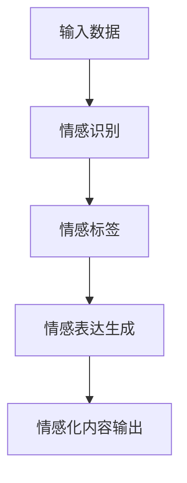
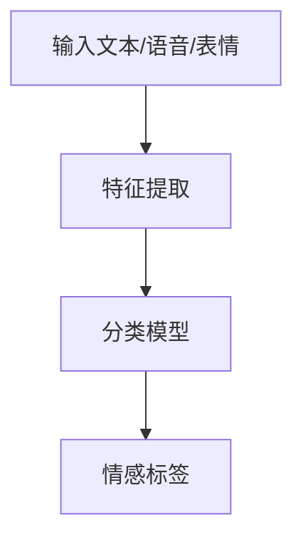
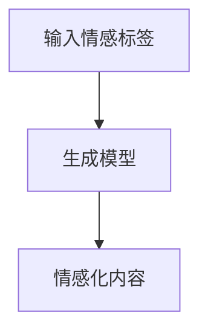
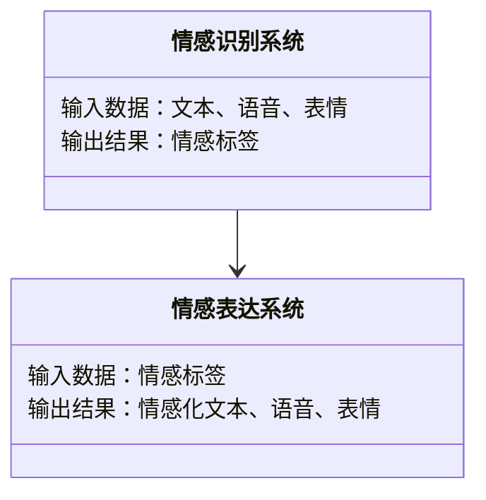
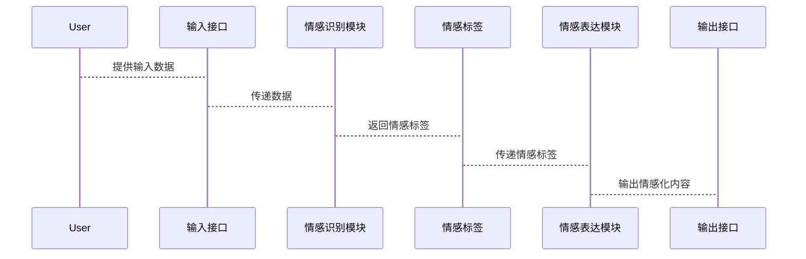

                 


# 开发具有情感识别与表达能力的AI Agent

> 关键词：情感识别、情感表达、AI Agent、深度学习、自然语言处理、计算机视觉、语音识别

> 摘要：本文将详细探讨如何开发一个具有情感识别与表达能力的AI Agent。从背景介绍、核心概念、算法原理、系统架构设计到项目实战，逐步分析实现过程。通过具体的代码示例、数学模型和系统图解，深入剖析情感识别与表达的关键技术，并结合实际案例进行详细解读。

---

# 第一部分: 情感识别与表达的背景与核心概念

## 第1章: 情感识别与表达的背景介绍

### 1.1 问题背景与问题描述

#### 1.1.1 情感计算的定义与研究现状

情感计算（Affective Computing）是人工智能领域的重要分支，旨在通过计算机技术识别、理解、模拟和影响人类情感。近年来，随着深度学习和自然语言处理技术的快速发展，情感计算在智能客服、情感陪护机器人、情感化推荐系统等领域得到了广泛应用。

#### 1.1.2 AI Agent在情感交互中的角色

AI Agent（智能体）是一种能够感知环境、自主决策并执行任务的实体。在情感交互中，AI Agent不仅需要理解用户的情感状态，还需要通过适当的方式进行情感反馈。这种能力使得AI Agent能够与人类进行更自然、更深层次的互动。

#### 1.1.3 情感识别与表达的实际应用场景

- 智能客服：通过识别用户情绪，提供更贴心的服务。
- 情感陪护机器人：帮助用户缓解压力，提供情感支持。
- 情感化推荐系统：根据用户情感状态推荐相关内容。

### 1.2 问题解决与边界分析

#### 1.2.1 情感识别与表达的核心问题

- 如何准确识别用户的情感状态？
- 如何生成符合情感状态的反馈？

#### 1.2.2 系统边界与外延

- 仅关注情感识别与表达，不涉及其他功能（如任务执行）。
- 系统边界：输入为多模态数据（文本、语音、表情），输出为情感状态或情感表达。

#### 1.2.3 核心概念与要素组成

- 输入数据：文本、语音、表情。
- 核心算法：情感识别算法、情感表达生成算法。
- 输出结果：情感标签、情感表达内容。

### 1.3 本章小结

本章介绍了情感识别与表达的背景，明确了AI Agent在情感交互中的角色，并分析了其实现的核心问题和系统边界。通过本章，读者可以理解情感识别与表达的重要性和其实现的基本框架。

---

## 第2章: 情感识别与表达的核心概念与联系

### 2.1 核心概念原理

#### 2.1.1 情感识别的原理与方法

情感识别主要基于多模态数据，通过机器学习算法对情感特征进行分类。常用方法包括：

- 文本分析：基于自然语言处理的情感分析。
- 语音分析：基于语音特征提取的情感分析。
- 图像分析：基于面部表情分析的情感识别。

#### 2.1.2 情感表达的实现机制

情感表达是通过生成文本、语音或表情来反馈情感状态。其实现机制包括：

- 文本生成：基于预训练语言模型生成情感化文本。
- 语音合成：基于TTS技术生成情感化的语音。
- 表情生成：基于图像生成技术生成情感化的表情。

#### 2.1.3 情感识别与表达的关联性分析

情感识别与表达是相互关联的，识别结果影响表达内容，而表达内容又需要符合识别结果。

### 2.2 情感识别与表达的特征对比

#### 2.2.1 情感识别的特征表

| 特征 | 描述 |
|------|------|
| 输入数据 | 文本、语音、表情 |
| 输出结果 | 情感标签（如快乐、悲伤） |
| 算法类型 | 分类模型、深度学习模型 |

#### 2.2.2 情感表达的特征表

| 特征 | 描述 |
|------|------|
| 输入数据 | 情感标签 |
| 输出结果 | 情感化文本、语音、表情 |
| 算法类型 | 生成模型、预训练模型 |

#### 2.2.3 特征对比分析表

| 特征 | 情感识别 | 情感表达 |
|------|----------|----------|
| 输入数据 | 多模态数据 | 情感标签 |
| 输出结果 | 情感标签 | 情感化内容 |
| 算法类型 | 分类模型 | 生成模型 |

### 2.3 实体关系图与流程图

#### 2.3.1 情感识别与表达的ER实体关系图

```mermaid
erDiagram
    class 情感识别系统 {
        文本数据
        语音数据
        表情数据
        情感标签
    }
    class 情感表达系统 {
        情感标签
        情感化文本
        情感化语音
        情感化表情
    }
    情感识别系统 --> 情感表达系统
```

#### 2.3.2 情感识别与表达的流程图



---

## 第3章: 情感识别与表达的算法原理

### 3.1 情感识别算法原理

#### 3.1.1 基于文本的情感分析算法

- **方法**：使用预训练的情感分析模型（如BERT）对文本进行情感分类。
- **流程**：
  1. 输入文本数据。
  2. 提取文本特征。
  3. 通过分类模型预测情感标签。

#### 3.1.2 基于语音的情感分析算法

- **方法**：提取语音特征（如音调、语速），通过机器学习模型进行情感分类。
- **流程**：
  1. 输入语音数据。
  2. 提取语音特征。
  3. 通过分类模型预测情感标签。

#### 3.1.3 基于表情的情感分析算法

- **方法**：使用计算机视觉技术对面部表情进行识别。
- **流程**：
  1. 输入图像数据。
  2. 提取面部特征。
  3. 通过分类模型预测情感标签。

### 3.2 情感表达算法原理

#### 3.2.1 文本生成算法

- **方法**：基于预训练语言模型（如GPT）生成情感化文本。
- **流程**：
  1. 输入情感标签。
  2. 生成情感化文本。

#### 3.2.2 语音合成算法

- **方法**：使用TTS技术生成情感化语音。
- **流程**：
  1. 输入情感标签。
  2. 调整语音参数（如音调、语速）。
  3. 生成情感化语音。

#### 3.2.3 表情生成算法

- **方法**：使用生成对抗网络（GAN）生成情感化表情。
- **流程**：
  1. 输入情感标签。
  2. 通过GAN生成表情图像。

### 3.3 算法流程图与代码实现

#### 3.3.1 情感识别流程图



#### 3.3.2 情感表达流程图



#### 3.3.3 Python实现示例代码

```python
import torch
from transformers import AutoTokenizer, AutoModelForSequenceClassification

# 情感识别代码示例
tokenizer = AutoTokenizer.from_pretrained('bert-base-uncased')
model = AutoModelForSequenceClassification.from_pretrained('bert-base-uncased')

def predict_emotion(text):
    inputs = tokenizer.encode(text, return_tensors='pt')
    outputs = model(inputs)[0]
    prediction = torch.argmax(outputs).item()
    return prediction

# 情感表达代码示例
from gtts import gTTS
import os

def generate_speech(text, language='en'):
    speech = gTTS(text=text, lang=language)
    speech.save("output.mp3")
    os.system("output.mp3")
```

### 3.4 情感识别的数学模型

#### 3.4.1 基于概率论的情感分类模型

情感分类可以通过贝叶斯定理进行概率计算：

$$ P(y|x) = \frac{P(x|y)P(y)}{P(x)} $$

其中，$y$ 是情感标签，$x$ 是输入数据。

#### 3.4.2 基于深度学习的情感分类模型

深度学习模型（如LSTM、BERT）通过多层神经网络提取特征并进行分类。例如，BERT的损失函数为：

$$ \mathcal{L} = -\sum_{i=1}^{n} \log P(y_i|x_i) $$

---

## 第4章: 情感识别与表达的数学模型与公式

### 4.1 情感识别的数学模型

#### 4.1.1 基于概率论的情感分类模型

- **条件概率**：$P(y|x)$ 表示在给定输入 $x$ 的情况下，输出情感 $y$ 的概率。
- **先验概率**：$P(y)$ 表示情感 $y$ 的先验概率。
- **似然概率**：$P(x|y)$ 表示在情感 $y$ 下，输入 $x$ 的概率。

#### 4.1.2 基于深度学习的情感分类模型

- **模型结构**：多层感知机、LSTM、BERT等。
- **损失函数**：交叉熵损失函数：

$$ \mathcal{L} = -\sum_{i=1}^{n} \log P(y_i|x_i) $$

### 4.2 情感表达的数学模型

#### 4.2.1 文本生成模型

- **生成模型**：基于语言模型的生成概率：

$$ P(\text{文本}|y) $$

其中，$y$ 是情感标签。

#### 4.2.2 语音合成模型

- **语音生成模型**：基于TTS的语音合成，通过调整语音参数生成情感化语音。

---

# 第二部分: 系统分析与架构设计

## 第5章: 系统分析与架构设计

### 5.1 问题场景介绍

本系统旨在开发一个具有情感识别与表达能力的AI Agent，能够通过多模态输入数据识别用户情感，并生成相应的情感化反馈。

### 5.2 系统功能设计

#### 5.2.1 领域模型



#### 5.2.2 系统架构设计


### 5.3 系统接口设计

#### 5.3.1 接口描述

- 输入接口：接收文本、语音、表情数据。
- 输出接口：输出情感标签或情感化内容。

#### 5.3.2 交互流程图



---

# 第三部分: 项目实战

## 第6章: 项目实战

### 6.1 环境安装

- 安装Python：`python --version`
- 安装依赖：`pip install transformers gtts`

### 6.2 系统核心实现源代码

#### 6.2.1 情感识别代码

```python
from transformers import AutoTokenizer, AutoModelForSequenceClassification
import torch

tokenizer = AutoTokenizer.from_pretrained('bert-base-uncased')
model = AutoModelForSequenceClassification.from_pretrained('bert-base-uncased')

def predict_emotion(text):
    inputs = tokenizer.encode(text, return_tensors='pt')
    outputs = model(inputs)[0]
    prediction = torch.argmax(outputs).item()
    return prediction
```

#### 6.2.2 情感表达代码

```python
from gtts import gTTS
import os

def generate_speech(text, language='en'):
    speech = gTTS(text=text, lang=language)
    speech.save("output.mp3")
    os.system("output.mp3")
```

### 6.3 代码应用解读与分析

- **情感识别代码**：使用BERT模型对输入文本进行情感分类。
- **情感表达代码**：使用gTTS生成情感化语音。

### 6.4 实际案例分析

#### 6.4.1 情感识别案例

输入文本："我感到非常开心。"
输出情感标签：快乐。

#### 6.4.2 情感表达案例

输入情感标签：快乐。
生成语音："听起来你今天心情很好，真是太棒了！"

### 6.5 项目小结

通过本章的实战，读者可以了解如何利用现有的工具库快速实现情感识别与表达功能，并结合实际案例理解其应用。

---

# 第四部分: 总结与展望

## 第7章: 总结与展望

### 7.1 最佳实践 tips

- 使用预训练模型可以快速实现情感识别与表达功能。
- 多模态输入可以提高情感识别的准确性。
- 情感表达需要结合具体场景进行优化。

### 7.2 本章小结

本文详细介绍了情感识别与表达的核心技术，并通过具体案例展示了其实现过程。通过本文的学习，读者可以掌握情感识别与表达的基本方法，并能够将其应用于实际场景中。

### 7.3 注意事项

- 情感识别的准确性依赖于训练数据的质量。
- 情感表达的内容需要符合情感标签。
- 系统需要根据实际需求进行优化。

### 7.4 拓展阅读

- 深度学习在情感计算中的应用。
- 多模态情感识别与表达技术。

---

# 结语

开发具有情感识别与表达能力的AI Agent是一个复杂而有趣的过程。通过本文的学习，读者可以掌握其核心技术和实现方法，并能够在此基础上进行进一步的研究与探索。希望本文能够为相关领域的研究者和开发者提供有价值的参考。

