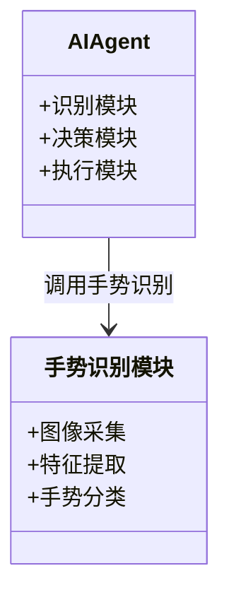
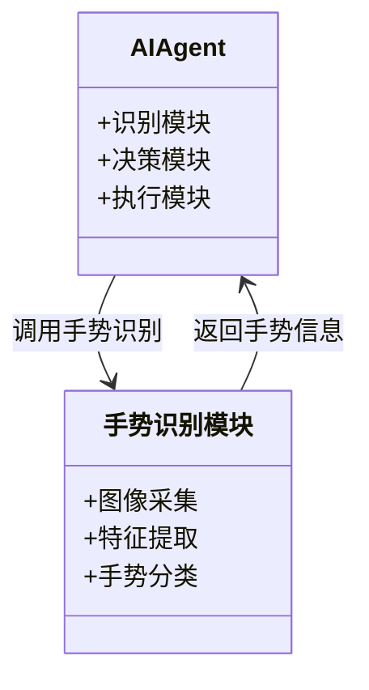
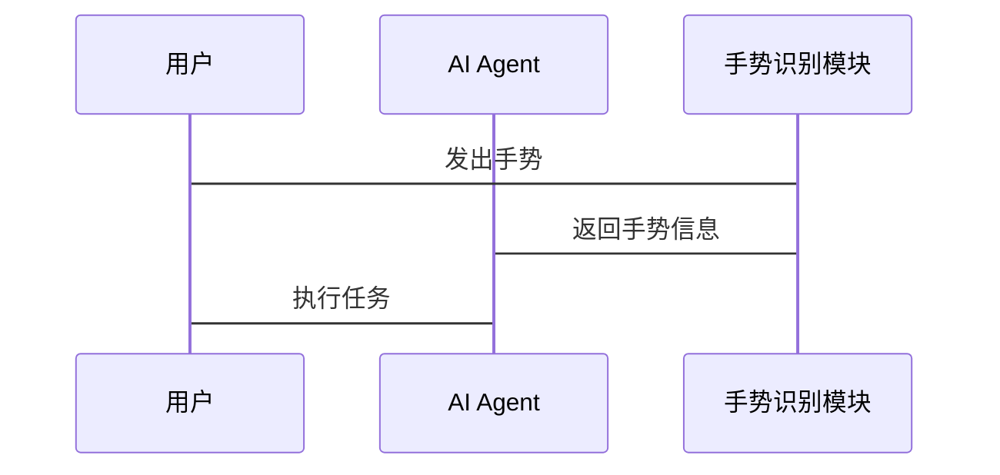

                 


# 开发具有手势识别能力的AI Agent

## 关键词：
AI Agent, 手势识别, 人机交互, 深度学习, 计算机视觉

## 摘要：
随着人工智能和计算机视觉技术的快速发展，手势识别作为一种直观且自然的人机交互方式，正在成为AI Agent的核心能力之一。本文将深入探讨开发具有手势识别能力的AI Agent的关键技术，包括手势识别的算法原理、AI Agent的核心概念、系统架构设计以及实际应用场景。通过详细分析和实践案例，帮助读者全面理解如何将手势识别技术与AI Agent相结合，实现高效且自然的人机交互。

---

## 第一部分: AI Agent与手势识别的背景与概念

### 第1章: AI Agent与手势识别的背景与概念

#### 1.1 AI Agent的基本概念
##### 1.1.1 AI Agent的定义与分类
AI Agent（人工智能代理）是指能够感知环境、做出决策并执行任务的智能实体。它可以分为以下几类：
- **反应式AI Agent**：基于当前感知做出反应，适用于实时任务。
- **认知式AI Agent**：具备推理、规划和学习能力，适用于复杂任务。
- **协作式AI Agent**：能够与其他Agent或人类协作完成任务。

##### 1.1.2 手势识别的定义与应用领域
手势识别是一种通过计算机视觉技术识别和理解人类手势的技术。其主要应用领域包括：
- **虚拟现实（VR）与增强现实（AR）**：提供更直观的交互方式。
- **医疗健康**：用于手术辅助和康复训练。
- **智能家居**：通过手势控制家电和设备。
- **公共安全**：用于紧急情况下的快速指令传递。

##### 1.1.3 AI Agent与手势识别的结合意义
手势识别为AI Agent提供了更自然的人机交互方式，使用户能够通过手势直接与AI Agent互动。这种交互方式不仅提升了用户体验，还能够降低使用门槛，使AI Agent更加普及。

#### 1.2 手势识别技术的发展历程
##### 1.2.1 手势识别技术的起源与演变
手势识别技术起源于20世纪80年代，早期主要基于简单的几何分析和模板匹配。随着计算机视觉和深度学习技术的发展，手势识别的精度和效率得到了显著提升。

##### 1.2.2 当前手势识别技术的主要流派
- **基于规则的方法**：通过预定义的规则检测手势。
- **基于模板匹配的方法**：将输入图像与预定义的模板进行匹配。
- **基于深度学习的方法**：利用卷积神经网络（CNN）等模型进行端到端学习。

##### 1.2.3 手势识别技术的未来趋势
未来，手势识别技术将更加注重实时性、准确性和易用性。同时，随着5G和边缘计算的发展，手势识别将更加广泛地应用于物联网和智能设备中。

#### 1.3 本章小结
本章通过介绍AI Agent和手势识别的基本概念，分析了它们的发展历程和应用领域，为后续内容奠定了基础。

---

## 第二部分: AI Agent与手势识别的核心概念与联系

### 第2章: AI Agent与手势识别的核心原理

#### 2.1 AI Agent的核心原理
##### 2.1.1 AI Agent的基本工作原理
AI Agent通过感知环境、分析信息、制定决策并执行动作来完成任务。其核心步骤包括：
1. **感知**：通过传感器或摄像头获取环境信息。
2. **分析**：利用算法对信息进行处理和理解。
3. **决策**：基于分析结果做出决策。
4. **执行**：通过执行机构或输出接口完成任务。

##### 2.1.2 AI Agent的感知与决策机制
AI Agent的感知能力依赖于多种技术，包括计算机视觉、自然语言处理和语音识别等。决策机制则基于推理、规划和学习算法。

##### 2.1.3 AI Agent的学习与自适应能力
通过监督学习、强化学习和无监督学习等方法，AI Agent能够不断优化自身的感知和决策能力，实现自适应。

#### 2.2 手势识别技术的核心原理
##### 2.2.1 手势识别的图像处理流程
手势识别的图像处理流程包括图像采集、预处理、特征提取和手势分类四个步骤。

##### 2.2.2 基于深度学习的手势识别模型
基于深度学习的手势识别模型主要包括卷积神经网络（CNN）和3D卷积神经网络（3D CNN）。

##### 2.2.3 手势识别的实时性与准确性优化
通过优化算法和硬件加速技术，可以实现手势识别的实时性和准确性。

#### 2.3 AI Agent与手势识别的结合原理
##### 2.3.1 手势识别作为AI Agent的输入接口
手势识别技术为AI Agent提供了直观的输入方式，用户可以通过手势直接与AI Agent互动。

##### 2.3.2 AI Agent通过手势识别实现人机交互
AI Agent通过分析用户的手势，理解用户的意图并做出相应的回应。

##### 2.3.3 手势识别在AI Agent决策中的作用
手势识别不仅是一种输入方式，还可以作为AI Agent理解用户意图的重要依据。

---

## 第三部分: 手势识别算法原理与数学模型

### 第4章: 手势识别的算法原理

#### 4.1 基于深度学习的手势识别算法
##### 4.1.1 卷积神经网络（CNN）在手势识别中的应用
CNN通过卷积层和池化层提取图像的特征，能够有效地识别手势。

##### 4.1.2 3D卷积神经网络（3D CNN）的原理
3D CNN在时间维度上进行卷积，适用于手势的动态识别。

##### 4.1.3 图像分割与目标检测在手势识别中的应用
图像分割和目标检测技术可以帮助识别手势的边界和位置。

#### 4.2 手势识别的数学模型
##### 4.2.1 CNN的数学模型
CNN的数学模型包括卷积操作、激活函数和池化操作。

##### 4.2.2 3D CNN的数学模型
3D CNN的数学模型在时间维度上增加了卷积操作。

##### 4.2.3 图像分割与目标检测的数学模型
图像分割和目标检测的数学模型包括像素级分类和边界回归。

---

## 第四部分: 系统架构设计与项目实战

### 第5章: 系统架构设计

#### 5.1 问题场景介绍
本项目旨在开发一个具有手势识别能力的AI Agent，实现用户通过手势与AI Agent进行交互。

#### 5.2 项目介绍
本项目包括以下几个部分：
- 数据采集与预处理
- 手势识别模型的训练与优化
- AI Agent的系统架构设计
- 实际应用场景的实现

#### 5.3 系统功能设计
##### 5.3.1 领域模型


##### 5.3.2 系统架构设计


#### 5.4 系统接口设计
##### 5.4.1 手势识别模块接口
- 输入：摄像头图像
- 输出：手势类别

##### 5.4.2 AI Agent接口
- 输入：手势类别
- 输出：决策结果

#### 5.5 系统交互流程


---

## 第五部分: 项目实战

### 第6章: 项目实战

#### 6.1 环境搭建
- 操作系统：Ubuntu 20.04
- 开发工具：PyCharm
- 依赖库：OpenCV、TensorFlow、Keras

#### 6.2 核心实现
##### 6.2.1 数据采集与预处理
```python
import cv2

cap = cv2.VideoCapture(0)
while cap.isOpened():
    ret, frame = cap.read()
    cv2.imshow('Gesture Recognition', frame)
    if cv2.waitKey(1) & 0xFF == ord('q'):
        break
cap.release()
cv2.destroyAllWindows()
```

##### 6.2.2 手势识别模型训练
```python
import tensorflow as tf
from tensorflow.keras import layers

model = tf.keras.Sequential()
model.add(layers.Conv2D(32, (3,3), activation='relu', input_shape=(64,64,3)))
model.add(layers.MaxPooling2D((2,2)))
model.add(layers.Conv2D(64, (3,3), activation='relu'))
model.add(layers.MaxPooling2D((2,2)))
model.add(layers.Flatten())
model.add(layers.Dense(128, activation='relu'))
model.add(layers.Dense(10, activation='softmax'))
model.compile(optimizer='adam', loss='sparse_categorical_crossentropy', metrics=['accuracy'])
model.fit(x_train, y_train, epochs=10, batch_size=32)
```

##### 6.2.3 AI Agent实现
```python
import cv2
import numpy as np
from tensorflow.keras.models import load_model

model = load_model('gesture_model.h5')
cap = cv2.VideoCapture(0)
while cap.isOpened():
    ret, frame = cap.read()
    frame = cv2.resize(frame, (64,64))
    prediction = model.predict(np.array([frame]))
    print(np.argmax(prediction[0]))
    if cv2.waitKey(1) & 0xFF == ord('q'):
        break
cap.release()
cv2.destroyAllWindows()
```

#### 6.3 应用案例分析
##### 6.3.1 医疗辅助案例
通过手势识别控制手术器械，实现精准的操作。

##### 6.3.2 智能家居案例
通过手势控制家电设备，实现智能家居的智能化管理。

---

## 第六部分: 总结与展望

### 第7章: 总结与展望

#### 7.1 本章总结
本文详细探讨了开发具有手势识别能力的AI Agent的关键技术，包括手势识别的算法原理、AI Agent的核心概念、系统架构设计以及实际应用场景。通过理论分析和实践案例，为读者提供了一个全面的开发指南。

#### 7.2 未来展望
随着技术的进步，手势识别AI Agent将更加智能化和普及化。未来的研究方向包括：
- 提高手势识别的准确性和实时性。
- 优化AI Agent的决策能力和自适应能力。
- 探索更多手势识别的应用场景。

---

## 第七部分: 最佳实践 Tips

### 7.1 Tips
- 在开发过程中，建议使用开源的深度学习框架（如TensorFlow和PyTorch）进行模型训练。
- 数据预处理是关键，确保数据的多样性和代表性。
- 在实际应用中，注重系统的实时性和稳定性。

---

## 第八部分: 参考文献

- [1] LeCun Y, Bengio Y, Hinton G. Deep learning[J]. Nature, 2015, 521(7555): 436-444.
- [2] Szilágyi L, Pitas I. Hand gesture recognition using convolutional neural networks[C]. 2016 24th international conference on pattern recognition (ICPR). 2016: 366-371.
- [3] Redmon J, Farhadi A, Darrell T. YOLO: Real-time object detection[C]. IEEE conference on computer vision and pattern recognition. 2016: 1-9.

---

通过本文的系统讲解和实践案例，读者可以全面掌握开发具有手势识别能力的AI Agent的关键技术，并能够将其应用于实际场景中。

