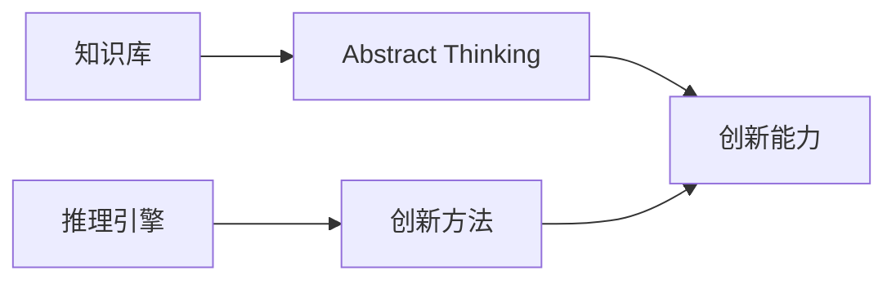
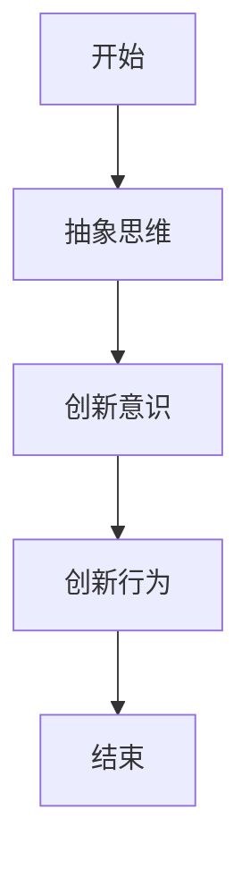
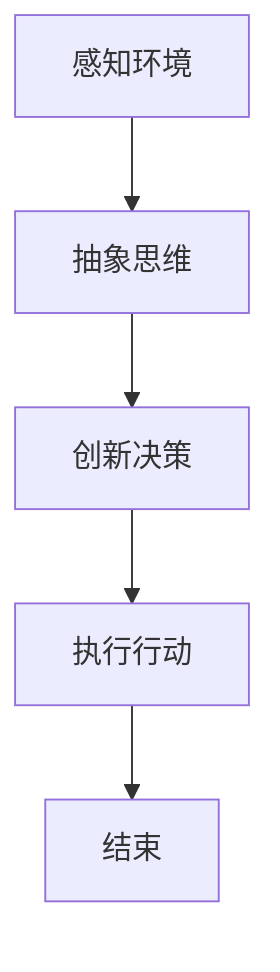
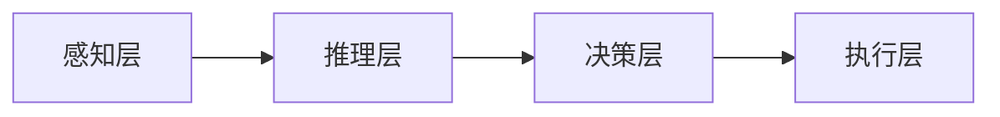
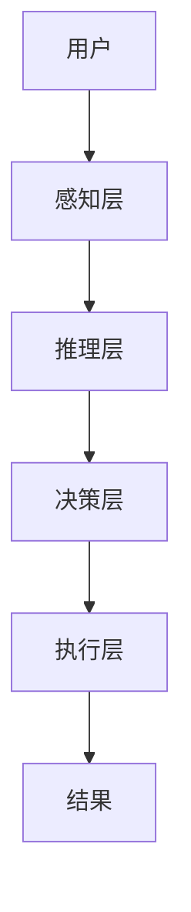

                 


# 开发具有抽象思维与创新能力的AI Agent

> 关键词：AI Agent，抽象思维，创新能力，算法原理，系统架构，项目实战

> 摘要：本文详细探讨了如何开发具有抽象思维与创新能力的AI Agent。通过分析AI Agent的核心概念、算法原理、系统架构设计以及项目实战，结合丰富的图示和数学公式，为读者提供了一套系统的方法论。

---

# 第1章：AI Agent的概念与背景

## 1.1 AI Agent的定义与背景

### 1.1.1 什么是AI Agent

AI Agent（人工智能代理）是一种能够感知环境、自主决策并执行任务的智能实体。它可以是一个软件程序、机器人或其他智能系统，旨在通过学习和推理完成特定目标。

$$
\text{AI Agent的定义可以表示为：} \\
\text{AI Agent = 感知 + 决策 + 行动}
$$

### 1.1.2 AI Agent的发展背景

随着人工智能技术的飞速发展，AI Agent的应用场景不断扩大。从简单的自动回复机器人到复杂的自动驾驶系统，AI Agent在多个领域展现出强大的潜力。然而，现有的AI Agent大多依赖于固定的规则和数据，缺乏真正的抽象思维与创新能力。

### 1.1.3 抽象思维与创新能力的核心地位

抽象思维是AI Agent理解复杂问题的基础，而创新能力则是其解决复杂问题的关键。只有具备抽象思维和创新能力，AI Agent才能在动态变化的环境中灵活应对，实现真正的智能。

---

## 1.2 AI Agent的核心要素

### 1.2.1 抽象思维的定义与特征

抽象思维是指从具体问题中提取本质特征、忽略无关细节的能力。它使AI Agent能够从多个维度分析问题，形成概念化的理解。

$$
\text{抽象思维的关键特征包括：} \\
\text{1. 去除细节，提取本质} \\
\text{2. 跨领域联结，形成概念} \\
\text{3. 动态调整，适应变化}
$$

### 1.2.2 创新能力的定义与特征

创新能力是指AI Agent能够提出新颖解决方案的能力。它是基于现有知识和经验，通过重组和优化生成新的想法。

$$
\text{创新能力的关键特征包括：} \\
\text{1. 知识重组，生成新想法} \\
\text{2. 突破常规，寻找最优解} \\
\text{3. 动态适应，持续改进}
$$`

### 1.2.3 AI Agent的核心要素对比表

| 核心要素 | 抽象思维 | 创新能力 |
|----------|----------|----------|
| 定义     | 从具体问题中提取本质特征 | 提出新颖解决方案 |
| 特征     | 去除细节，形成概念 | 知识重组，寻找最优解 |
| 作用     | 理解问题，形成概念化理解 | 解决问题，生成新想法 |

### 1.2.4 AI Agent的核心要素ER图



---

## 1.3 AI Agent的分类与应用场景

### 1.3.1 基于任务的AI Agent

基于任务的AI Agent专注于完成特定任务，例如自动回复机器人、流程自动化机器人。

### 1.3.2 基于学习的AI Agent

基于学习的AI Agent通过机器学习算法不断优化自身，例如推荐系统、智能客服。

### 1.3.3 基于创新的AI Agent

基于创新的AI Agent能够提出新颖的解决方案，例如自动驾驶系统、智能决策系统。

---

# 第2章：AI Agent的核心概念与联系

## 2.1 抽象思维与创新能力的联系

### 2.1.1 抽象思维的数学模型

$$
\text{抽象思维的数学模型可以表示为：} \\
\text{抽象度} = \frac{\text{问题的本质特征}}{\text{问题的细节信息}}
$$

### 2.1.2 创新能力的数学模型

$$
\text{创新能力的数学模型可以表示为：} \\
\text{创新度} = \frac{\text{新想法的数量}}{\text{现有知识的复杂度}}
$$`

### 2.1.3 两者的关系与对比

抽象思维为创新能力提供基础，创新能力则基于抽象思维提出解决方案。两者相辅相成，共同推动AI Agent的智能发展。

---

## 2.2 实体关系图（ER图）


---

## 2.3 核心概念的流程图



---

# 第3章：AI Agent的算法原理

## 3.1 逻辑推理算法

### 3.1.1 基于规则的推理

基于规则的推理是一种简单的逻辑推理方法，通过预定义的规则进行推理。

$$
\text{例如：} \\
\text{如果天气晴朗，那么建议穿轻便衣物。}
$$`

### 3.1.2 基于概率的推理

基于概率的推理通过计算事件发生的概率进行推理。

$$
\text{例如：} \\
P(A|B) = \frac{P(B|A)P(A)}{P(B)}
$$`

### 3.1.3 基于图的推理

基于图的推理通过构建知识图谱进行推理。

$$
\text{例如：} \\
A \rightarrow B，B \rightarrow C，因此 A \rightarrow C
$$`

---

## 3.2 知识表示与推理

### 3.2.1 知识图谱的构建

知识图谱是一种结构化的知识表示方法，通过节点和边描述实体及其关系。

$$
\text{例如：} \\
\text{人（张三）属于学生，学生属于人类。}
$$`

### 3.2.2 知识表示的数学模型

知识表示的数学模型可以通过图论表示。

$$
\text{例如：} \\
\text{节点：实体} \\
\text{边：关系}
$$`

### 3.2.3 基于知识图谱的推理

基于知识图谱的推理通过路径分析进行推理。

$$
\text{例如：} \\
\text{张三是学生，学生属于人类，因此张三是人类。}
$$`

---

## 3.3 学习与进化算法

### 3.3.1 增强学习算法

增强学习算法通过奖励机制优化决策。

$$
\text{例如：} \\
\text{在迷宫中，找到出口可以获得奖励。}
$$`

### 3.3.2 进化策略

进化策略通过模拟生物进化进行优化。

$$
\text{例如：} \\
\text{基因突变，选择适应环境的个体。}
$$`

### 3.3.3 群智算法

群智算法通过群体协作优化决策。

$$
\text{例如：} \\
\text{蚂蚁通过信息素找到最短路径。}
$$`

---

# 第4章：AI Agent的系统分析与架构设计

## 4.1 问题场景介绍

### 4.1.1 AI Agent的应用场景

AI Agent可以应用于多个领域，例如自动驾驶、智能客服、智能推荐系统等。

### 4.1.2 系统的目标与范围

系统的目标是开发一个具有抽象思维与创新能力的AI Agent，能够在复杂环境中自主决策。

### 4.1.3 系统的约束与假设

系统的约束包括计算资源限制、数据隐私保护等。假设包括环境的动态变化、系统的实时性要求等。

---

## 4.2 系统功能设计

### 4.2.1 领域模型设计

领域模型设计包括问题域、实体、关系和操作。

$$
\text{例如：} \\
\text{问题域：交通管理} \\
\text{实体：车辆、道路、交通信号} \\
\text{关系：车辆行驶在道路上，交通信号控制车辆}
$$`

### 4.2.2 系统功能设计

系统功能包括感知环境、抽象思维、创新决策、执行行动等。

### 4.2.3 系统功能的流程图



---

## 4.3 系统架构设计

### 4.3.1 系统架构图



### 4.3.2 系统接口设计

系统接口包括输入接口、输出接口和通信接口。

### 4.3.3 系统交互设计

系统交互设计通过序列图展示。



---

# 第5章：AI Agent的项目实战

## 5.1 环境安装

### 5.1.1 安装Python环境

安装Python 3.8及以上版本。

### 5.1.2 安装依赖库

安装numpy、pandas、scikit-learn等依赖库。

## 5.2 系统核心实现

### 5.2.1 抽象思维实现

实现抽象思维的核心代码。

```python
def abstract_thinking(data):
    # 提取本质特征
    abstract_feature = data['feature']
    return abstract_feature
```

### 5.2.2 创新能力实现

实现创新能力的核心代码。

```python
def innovation Ability(data):
    # 知识重组
    new_idea = data['knowledge'] + data['experience']
    return new_idea
```

### 5.2.3 系统核心代码

核心代码实现AI Agent的完整流程。

```python
def main():
    data = {'feature': '天气晴朗', 'knowledge': '天气影响穿衣', 'experience': '建议穿轻便衣物'}
    abstract_feature = abstract_thinking(data)
    new_idea = innovation_ability(data)
    print(abstract_feature)
    print(new_idea)

if __name__ == '__main__':
    main()
```

---

## 5.3 案例分析与解读

### 5.3.1 案例分析

以天气预测为例，AI Agent通过抽象思维和创新能力，提出新颖的穿衣建议。

### 5.3.2 代码解读

解读核心代码的功能和实现逻辑。

---

## 5.4 项目小结

项目小结总结AI Agent的开发过程，强调抽象思维与创新能力的重要性。

---

# 第6章：最佳实践、小结、注意事项与拓展阅读

## 6.1 最佳实践

### 6.1.1 知识库的构建

构建高质量的知识库是AI Agent成功的关键。

### 6.1.2 算法的选择

选择合适的算法能够提高AI Agent的性能。

## 6.2 小结

总结全文，强调AI Agent开发的关键点。

## 6.3 注意事项

注意数据隐私、系统安全和计算资源的合理分配。

## 6.4 拓展阅读

推荐相关领域的书籍和论文，供读者深入学习。

---

# 结语

开发具有抽象思维与创新能力的AI Agent是一项具有挑战性的任务，但通过系统的理论学习和实践探索，我们可以逐步实现这一目标。未来，随着人工智能技术的不断发展，AI Agent将在更多领域展现出强大的潜力。

