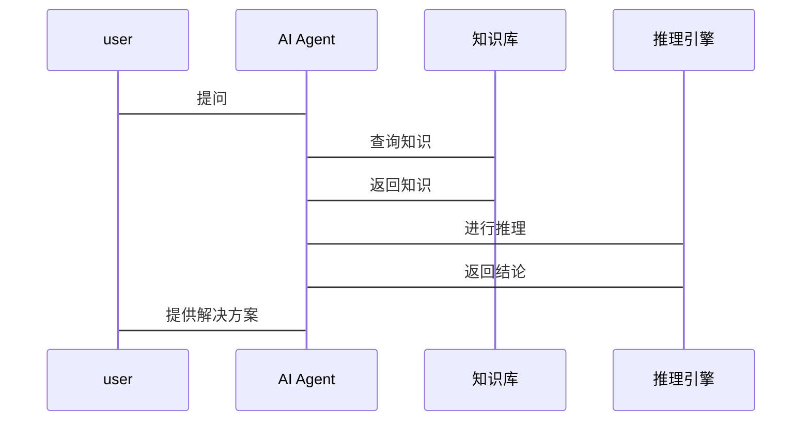

                 


# 开发具有抽象思维与推理能力的AI Agent

## 关键词：AI Agent, 抽象思维, 推理能力, 人工智能, 系统架构, 算法实现

## 摘要：  
本文详细探讨了如何开发具有抽象思维与推理能力的AI Agent。从理论基础到算法实现，从系统架构到项目实战，本文系统性地分析了AI Agent的核心概念、实现方法和应用场景。通过结合数学模型、算法流程图和实际代码示例，本文为读者提供了一套完整的开发思路，帮助读者从零开始理解并实现具有抽象思维与推理能力的AI Agent。

---

# 第一部分: 引言

## 第1章: AI Agent的基本概念与重要性

### 1.1 AI Agent的定义与特点

AI Agent（人工智能代理）是指在计算机系统中，能够感知环境并采取行动以实现目标的实体。AI Agent具有以下特点：

1. **自主性**：AI Agent能够独立决策，无需外部干预。
2. **反应性**：AI Agent能够根据环境输入做出实时反应。
3. **目标导向性**：AI Agent的所有行为都以实现特定目标为导向。
4. **推理能力**：AI Agent能够通过推理能力解决问题并做出决策。
5. **学习能力**：AI Agent能够通过学习不断优化自身性能。

### 1.2 抽象思维与推理能力的重要性

抽象思维是AI Agent实现高级智能的基础，它使AI Agent能够从具体问题中提取本质特征，形成一般性的解决方案。推理能力则是AI Agent解决问题的核心能力，它使AI Agent能够根据已有知识和逻辑规则，推导出新的结论。

### 1.3 AI Agent的应用场景

AI Agent的应用场景非常广泛，包括但不限于以下领域：

1. **智能助手**：如Siri、Alexa等，能够帮助用户完成日常任务。
2. **自动驾驶**：如自动驾驶汽车，能够实时感知环境并做出决策。
3. **智能客服**：能够自动理解用户需求并提供解决方案。
4. **智能推荐系统**：能够根据用户行为推荐个性化内容。

---

# 第二部分: 抽象思维与推理能力的理论基础

## 第2章: 抽象思维的定义与特征

### 2.1 抽象思维的定义

抽象思维是指从具体事物中抽取其本质特征，形成一般性的概念或规则的能力。在AI Agent中，抽象思维的核心在于将具体问题转化为通用模型，从而能够通过模型解决问题。

### 2.2 抽象思维的特征

抽象思维具有以下特征：

1. **抽象性**：能够从具体问题中提取一般性特征。
2. **形式化**：能够将抽象特征转化为形式化的数学模型。
3. **可计算性**：能够通过计算方法对抽象模型进行推理和求解。

### 2.3 抽象思维与具体思维的对比

| **特征**       | **具体思维**             | **抽象思维**             |
|----------------|--------------------------|--------------------------|
| **目标**       | 解决具体问题             | 解决一般性问题             |
| **输入**       | 具体问题描述             | 抽象问题模型             |
| **输出**       | 具体解决方案             | 一般性解决方案             |

## 第3章: 推理能力的定义与类型

### 3.1 推理能力的定义

推理能力是指根据已有知识和逻辑规则，推导出新的结论的能力。在AI Agent中，推理能力是其实现智能决策的核心能力。

### 3.2 推理能力的类型

1. **逻辑推理**：基于逻辑规则进行推理，如命题逻辑和谓词逻辑。
2. **概率推理**：基于概率论进行推理，如贝叶斯推理。
3. **类比推理**：基于类比关系进行推理，如通过类比推理解决新问题。

### 3.3 抽象思维与推理能力的结合

抽象思维为推理能力提供了问题模型，而推理能力则通过模型解决问题。两者的结合使AI Agent能够从具体问题中提取一般性特征，并通过推理能力解决问题。

---

# 第三部分: 抽象思维与推理能力的算法实现

## 第4章: 抽象思维的数学模型与公式

### 4.1 抽象思维的数学表示

抽象思维可以通过数学模型进行表示，例如：

- **命题逻辑**：将问题转化为命题逻辑公式。
- **谓词逻辑**：将问题转化为谓词逻辑公式。

### 4.2 推理能力的数学公式

1. **命题逻辑推理**：
   - 公式：$P \land Q \implies R$
   - 解释：如果P和Q都为真，则R必须为真。

2. **概率推理**：
   - 公式：$P(A|B) = \frac{P(B|A)P(A)}{P(B)}$
   - 解释：条件概率公式用于计算在B发生的条件下，A发生的概率。

### 4.3 抽象思维与推理能力的结合公式

1. **逻辑推理与知识表示**：
   - 公式：$f(x) = \text{如果} x > 0 \text{，则} f(x) = 1$
   - 解释：通过逻辑推理对函数进行定义。

---

## 第5章: 推理能力的算法实现

### 5.1 逻辑推理算法

1. **命题逻辑推理**：
   - 算法步骤：
     1. 将问题转化为命题逻辑公式。
     2. 使用真值表或推理规则进行推理。
   - 代码示例：
     ```python
     def logical_inference(knowledge, query):
         # knowledge是已知的知识库，query是推理的查询
         # 这里简化实现，仅考虑简单的命题逻辑推理
         return knowledge.get(query, False)
     ```

2. **谓词逻辑推理**：
   - 算法步骤：
     1. 将问题转化为谓词逻辑公式。
     2. 使用归结法或消解法进行推理。
   - 代码示例：
     ```python
     def predicate_inference(rules, query):
         # rules是已知的规则库，query是推理的查询
         for rule in rules:
             if rule.matches(query):
                 return rule.conclude()
         return False
     ```

### 5.2 概率推理算法

1. **贝叶斯推理**：
   - 算法步骤：
     1. 构建贝叶斯网络。
     2. 计算条件概率。
   - 代码示例：
     ```python
     def bayesian_inference(network, evidence):
         # network是贝叶斯网络，evidence是已知的证据
         return network.pagateEvidence(evidence)
     ```

---

# 第四部分: 系统分析与架构设计

## 第6章: 系统功能设计

### 6.1 问题场景介绍

假设我们开发一个智能客服系统，AI Agent需要能够理解用户的问题，并提供相应的解决方案。

### 6.2 系统功能设计

1. **问题理解**：通过自然语言处理技术理解用户的问题。
2. **知识表示**：将知识表示为形式化的数学模型。
3. **推理与决策**：根据知识模型进行推理，得出解决方案。

### 6.3 系统架构设计

1. **前端界面**：用户与AI Agent交互的界面。
2. **后端服务**：包括知识库、推理引擎和决策模块。
3. **接口设计**：定义前端与后端之间的接口。

### 6.4 交互序列图



---

## 第7章: 项目实战

### 7.1 环境安装

1. **Python环境**：安装Python 3.8及以上版本。
2. **依赖库安装**：安装numpy、pandas、scikit-learn等库。

### 7.2 核心代码实现

```python
# 知识表示模块
class KnowledgeBase:
    def __init__(self):
        self.knowledge = {}

    def add_knowledge(self, key, value):
        self.knowledge[key] = value

    def get_knowledge(self, key):
        return self.knowledge.get(key, None)

# 推理引擎模块
class ReasoningEngine:
    def __init__(self, knowledge_base):
        self.knowledge_base = knowledge_base

    def infer(self, query):
        # 这里简化实现，仅考虑简单的推理
        return self.knowledge_base.get(query, False)
```

### 7.3 案例分析

假设我们的AI Agent需要回答用户的问题：“如何提高学习效率？”

1. **问题理解**：AI Agent理解用户的问题是关于提高学习效率的。
2. **知识表示**：AI Agent从知识库中获取相关知识，例如：“学习效率 = 时间 × 效率”。
3. **推理与决策**：AI Agent通过推理得出结论：“提高学习效率的方法包括增加学习时间或提高学习效率”。
4. **解决方案**：AI Agent向用户提供建议，例如：“建议每天学习2小时，并尝试使用主动学习方法提高效率”。

---

## 第8章: 最佳实践与注意事项

### 8.1 最佳实践

1. **模块化设计**：将系统划分为多个模块，便于维护和扩展。
2. **数据处理**：确保数据的准确性和完整性。
3. **算法优化**：根据实际需求优化算法性能。

### 8.2 小结

本文详细探讨了如何开发具有抽象思维与推理能力的AI Agent，从理论到实践，从算法到系统架构，为读者提供了一套完整的开发思路。

### 8.3 注意事项

1. **数据隐私**：在实际应用中，需要注意数据隐私和安全问题。
2. **算法选择**：根据具体问题选择合适的算法，避免盲目追求复杂算法。
3. **系统测试**：在系统开发过程中，需要进行全面的测试，确保系统的稳定性和可靠性。

### 8.4 拓展阅读

1. **推荐书籍**：
   - 《人工智能：一种现代方法》
   - 《机器学习实战》
2. **推荐论文**：
   - "A Logical Theory of Case-Based Reasoning as a Basis for Script Psychiatrist"
   - "An Overview of Logic Programming"

---

# 第五部分: 总结

## 第9章: 总结

通过本文的详细讲解，读者可以系统性地了解如何开发具有抽象思维与推理能力的AI Agent。从理论到实践，从算法到系统架构，本文为读者提供了一套完整的开发思路。希望本文能够为AI Agent的研究和应用提供一定的参考和借鉴。

---

# 结语

开发具有抽象思维与推理能力的AI Agent是一个复杂而有趣的任务。它需要我们结合理论知识和实际应用，不断探索和实践。希望本文能够为读者提供有价值的指导，帮助他们在AI Agent的开发道路上走得更远。

