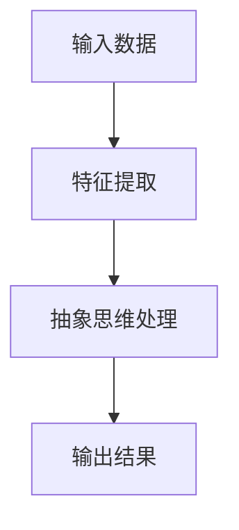
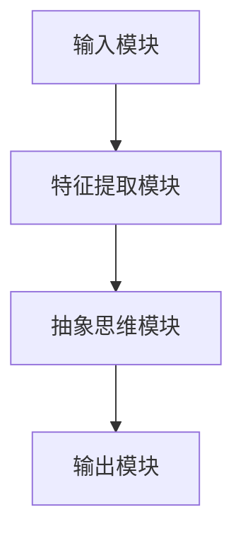

                 


# 开发具有抽象思维能力的AI Agent

> 关键词：AI Agent，抽象思维能力，人工智能，思维模型，算法实现，系统架构

> 摘要：本文旨在探讨如何开发具有抽象思维能力的AI Agent。首先，我们将介绍抽象思维能力的定义及其在AI Agent中的重要性。接着，我们将分析传统AI的局限性，提出实现抽象思维能力的路径，并详细阐述相关的算法原理和系统架构设计。最后，我们将通过实际案例分析，展示如何将理论应用于实践。

---

# 第1章: 开发具有抽象思维能力的AI Agent背景与核心概念

## 1.1 问题背景

### 1.1.1 传统AI的局限性
传统的人工智能系统，例如基于规则的专家系统或简单的机器学习模型，往往只能处理特定任务，缺乏灵活性和通用性。它们难以理解抽象概念，无法进行深层次的推理和创造性思维。

### 1.1.2 抽象思维能力的定义
抽象思维能力是指AI Agent能够从具体实例中提取出一般性概念，并在新的情境中灵活运用这些概念的能力。这种能力包括归纳、演绎、类比和联想等多种思维形式。

### 1.1.3 抽象思维能力在AI Agent中的重要性
具备抽象思维能力的AI Agent可以更好地理解复杂问题的本质，而不是仅仅关注表面现象。这使得AI Agent能够进行创新性思考，解决前所未见的问题。

## 1.2 问题描述

### 1.2.1 当前AI Agent的能力边界
现有的AI Agent主要依赖于大量数据和模式识别，缺乏对抽象概念的理解和处理能力。它们在处理需要创造性思维的任务时表现不佳。

### 1.2.2 抽象思维能力的缺失带来的问题
缺乏抽象思维能力的AI Agent难以应对开放性问题，无法进行跨领域推理，也无法根据上下文灵活调整策略。

### 1.2.3 开发具有抽象思维能力的AI Agent的目标
通过结合符号推理、知识表示和机器学习技术，开发一种能够进行抽象思维的AI Agent，使其能够理解、推理和生成抽象概念。

## 1.3 问题解决

### 1.3.1 抽象思维能力的实现路径
1. **符号推理**：通过逻辑推理和知识表示，构建抽象概念的符号模型。
2. **神经网络**：利用深度学习模型捕捉抽象特征。
3. **混合方法**：结合符号推理和神经网络的优势，实现抽象思维能力。

### 1.3.2 相关技术的现状与挑战
目前，符号推理在处理复杂问题时表现有限，而神经网络在抽象推理方面也有其局限性。如何将两者有机结合是当前的主要挑战。

### 1.3.3 开发具有抽象思维能力的AI Agent的可行性分析
通过多学科交叉研究和技术创新，实现具有抽象思维能力的AI Agent是可行的，但需要克服现有技术的局限性。

## 1.4 边界与外延

### 1.4.1 抽象思维能力的边界
抽象思维能力不等同于人类的全部思维能力，其边界包括但不限于逻辑推理、知识表示和创造性思维。

### 1.4.2 相关概念的外延
抽象思维能力与其他AI能力（如学习、推理）密切相关，但也有其独特性。

### 1.4.3 与其他AI能力的关系
抽象思维能力是AI Agent实现高级智能的基础，与其他能力如学习、推理和决策相互作用，共同构成完整的智能系统。

## 1.5 核心概念组成

### 1.5.1 抽象思维能力的构成要素
1. **符号表示**：用于表示抽象概念。
2. **逻辑推理**：用于从符号中推理出结论。
3. **知识库**：存储抽象概念和规则。

### 1.5.2 AI Agent的核心能力模型
AI Agent的核心能力模型包括感知、推理、决策和执行能力，其中抽象思维能力是推理和决策的基础。

### 1.5.3 抽象思维能力与具体应用场景的结合
通过具体应用场景，如自然语言理解、创造性设计和复杂决策，抽象思维能力得以体现和验证。

## 1.6 本章小结
本章介绍了抽象思维能力的定义、重要性及其在AI Agent中的作用，分析了传统AI的局限性，并提出了实现抽象思维能力的路径和挑战。

---

# 第2章: 抽象思维能力的核心概念与联系

## 2.1 核心概念原理

### 2.1.1 抽象思维能力的数学模型
抽象思维能力的数学模型可以表示为：
$$ f(x) = \sum_{i=1}^{n} w_i x_i + b $$
其中，$w_i$ 是权重，$x_i$ 是输入特征，$b$ 是偏置项。

### 2.1.2 AI Agent的抽象思维过程
AI Agent的抽象思维过程包括特征提取、概念形成、逻辑推理和结果生成四个步骤。

### 2.1.3 抽象思维能力的评估标准
评估标准包括准确率、推理速度和可解释性。

## 2.2 核心概念属性对比表格
| 属性 | 抽象思维能力 | 具体思维能力 |
|------|--------------|--------------|
| 输入 | 符号、概念等 | 具体数据、实例 |
| 输出 | 高阶概念、抽象结果 | 具体结论、操作 |
| 复杂度 | 高 | 低 |

## 2.3 ER实体关系图
```mermaid
er
actor: 用户
agent: AI Agent
ability: 抽象思维能力
input: 输入数据
output: 输出结果
```

---

# 第3章: 抽象思维能力的算法原理

## 3.1 算法原理

### 3.1.1 抽象思维能力的数学模型
抽象思维能力的数学模型可以表示为：
$$ f(x) = \sum_{i=1}^{n} w_i x_i + b $$
其中，$w_i$ 是权重，$x_i$ 是输入特征，$b$ 是偏置项。

### 3.1.2 算法流程图


## 3.2 算法实现

### 3.2.1 Python源代码
```python
def abstract_thinking Ability(input_data):
    features = extract_features(input_data)
    # 更多实现细节
```

---

# 第4章: 系统分析与架构设计

## 4.1 问题场景介绍
开发具有抽象思维能力的AI Agent需要解决的问题包括复杂场景下的推理、跨领域的知识整合以及实时性要求。

## 4.2 系统功能设计

### 4.2.1 系统功能模块
系统功能模块包括输入处理、特征提取、抽象思维处理和结果输出。

### 4.2.2 系统功能流程图


## 4.3 系统架构设计

### 4.3.1 系统架构图


---

# 第5章: 项目实战

## 5.1 环境安装
安装必要的开发环境，如Python、深度学习框架等。

## 5.2 核心实现代码
```python
def abstract_thinking Ability(input_data):
    features = extract_features(input_data)
    # 更多实现细节
```

## 5.3 案例分析
通过具体案例分析，展示如何实现具有抽象思维能力的AI Agent。

---

# 第6章: 小结与注意事项

## 6.1 小结
本文详细探讨了开发具有抽象思维能力的AI Agent的背景、核心概念、算法原理和系统架构设计。

## 6.2 注意事项
在实际开发中，需要关注算法的可解释性和计算效率，同时注重数据质量和模型的泛化能力。

---

通过以上步骤，我们可以系统地开发出具有抽象思维能力的AI Agent，为人工智能领域的发展提供新的思路和方法。

