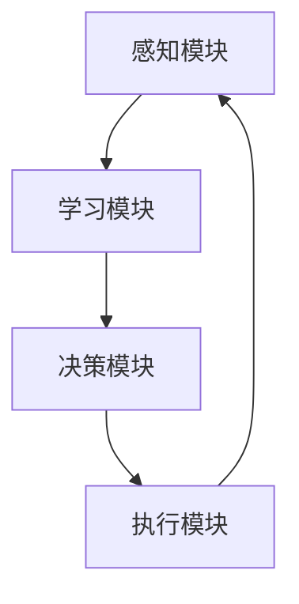
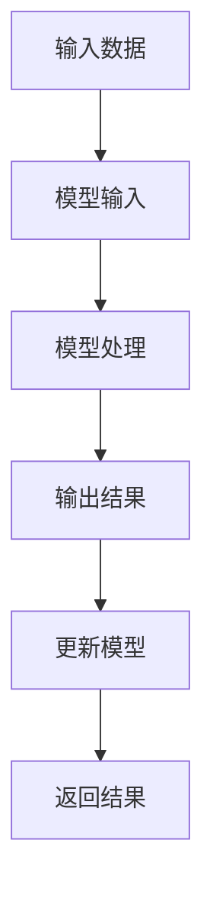
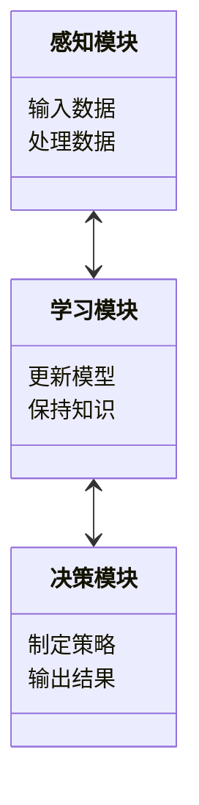
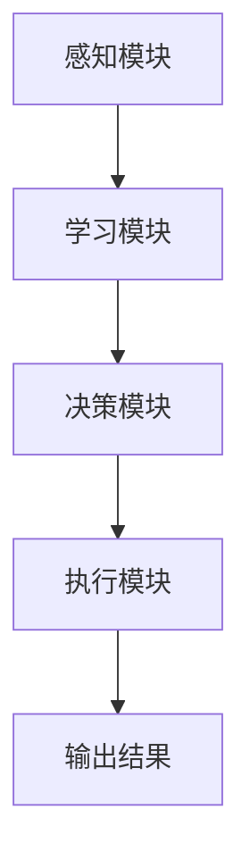
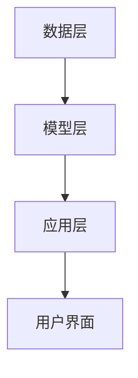
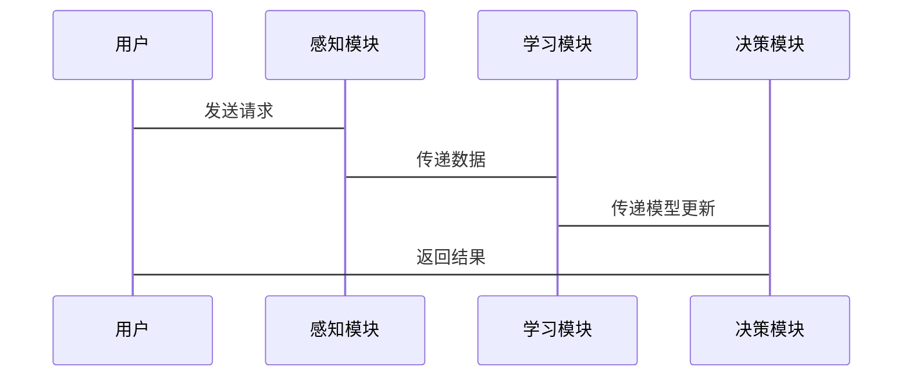

                 


# 开发具有持续学习能力的AI Agent

> 关键词：持续学习，AI Agent，机器学习，深度学习，算法优化，系统架构

> 摘要：本文深入探讨了开发具有持续学习能力的AI Agent的核心概念、算法原理、系统架构以及实战案例。通过详细分析，读者将理解如何设计和实现能够不断适应新数据和任务的智能代理。

---

## 第1章: 持续学习AI Agent的背景与概念

### 1.1 持续学习AI Agent的定义

#### 1.1.1 什么是持续学习
持续学习（Continual Learning）是指AI系统在面对新数据或任务时，能够不断更新和改进其模型，而无需从头开始训练的能力。与传统机器学习不同，持续学习强调模型的在线更新和适应性。

#### 1.1.2 AI Agent的基本概念
AI Agent是一种智能实体，能够感知环境、执行任务并做出决策。AI Agent可以是软件程序，也可以是物理机器人，其核心目标是通过与环境交互来实现特定目标。

#### 1.1.3 持续学习AI Agent的核心特点
- **在线学习**：实时更新模型，适应新数据。
- **任务迁移**：能够将已学习的知识迁移到新任务中。
- **动态调整**：根据环境变化动态调整行为策略。

### 1.2 持续学习的背景与重要性

#### 1.2.1 传统机器学习的局限性
传统机器学习模型在训练完成后，无法适应新数据或任务的变化。例如，图像分类模型在训练集中表现良好，但在新数据集上可能需要重新训练。

#### 1.2.2 持续学习的必要性
在现实场景中，数据和任务往往是动态变化的。持续学习使得AI Agent能够在不中断服务的情况下，逐步优化其性能。

#### 1.2.3 持续学习在AI Agent中的应用价值
- 提高系统的适应性。
- 降低维护成本。
- 实现更高效的资源利用。

### 1.3 持续学习AI Agent的应用场景

#### 1.3.1 在智能助手中的应用
智能助手需要不断适应用户的语言习惯和偏好，持续学习能够帮助其提供更精准的服务。

#### 1.3.2 在自动驾驶中的应用
自动驾驶系统需要实时处理新数据，持续学习能够提升其在复杂环境中的决策能力。

#### 1.3.3 在推荐系统中的应用
推荐系统需要根据用户行为动态调整推荐策略，持续学习能够提高推荐的准确性和多样性。

## 1.4 本章小结
本章介绍了持续学习AI Agent的基本概念、特点以及应用场景，为后续章节奠定了基础。

---

## 第2章: 持续学习AI Agent的核心概念与联系

### 2.1 持续学习模型的核心原理

#### 2.1.1 模型更新机制
模型更新机制是持续学习的核心，通过在线微调模型参数，使其适应新数据。

#### 2.1.2 任务迁移与知识保持
任务迁移（Task Transfer）是指将已学习的知识应用到新任务中，而知识保持（Knowledge Preservation）则是指在学习新任务时，保持原有知识不受影响。

#### 2.1.3 动态权重调整
动态权重调整是指根据任务的重要性，动态调整模型各部分的权重，以优化整体性能。

### 2.2 持续学习与传统机器学习的对比

#### 2.2.1 数据分布变化的对比
- **传统机器学习**：假设数据分布不变。
- **持续学习**：能够处理数据分布的变化。

#### 2.2.2 模型更新频率的对比
- **传统机器学习**：一次性训练。
- **持续学习**：支持在线更新。

#### 2.2.3 任务复杂度的对比
- **传统机器学习**：适合静态任务。
- **持续学习**：适合动态和复杂任务。

### 2.3 持续学习AI Agent的系统架构

#### 2.3.1 系统组成模块
- **感知模块**：负责数据采集和环境交互。
- **学习模块**：负责模型更新和任务迁移。
- **决策模块**：基于模型输出做出决策。

#### 2.3.2 模块之间的关系
模块之间通过数据和信号进行交互，形成一个动态调整的系统。

#### 2.3.3 系统功能流程图
使用Mermaid绘制系统功能流程图，展示模块之间的交互关系。



### 2.4 本章小结
本章分析了持续学习AI Agent的核心原理，并通过对比传统机器学习，明确了其独特优势。

---

## 第3章: 持续学习AI Agent的算法原理

### 3.1 持续学习算法的核心模型

#### 3.1.1 基于神经网络的持续学习模型
使用深度神经网络（DNN）构建模型，通过在线微调实现持续学习。

#### 3.1.2 基于记忆网络的持续学习模型
记忆增强网络（MemNN）通过外部存储器记录历史信息，帮助模型保持长期记忆。

#### 3.1.3 基于强化学习的持续学习模型
强化学习（Reinforcement Learning）通过奖励机制，指导模型优化其行为策略。

### 3.2 算法原理的详细讲解

#### 3.2.1 算法流程图
使用Mermaid绘制算法流程图，展示持续学习的基本流程。



#### 3.2.2 算法数学模型
持续学习的基本数学模型如下：

$$
\theta_{t+1} = \theta_t + \alpha \cdot \nabla L(\theta_t)
$$

其中，$\theta$ 表示模型参数，$\alpha$ 是学习率，$L$ 是损失函数。

#### 3.2.3 算法实现步骤
1. 输入新数据样本。
2. 前向传播，计算模型输出。
3. 计算损失，反向传播更新参数。
4. 输出结果，并准备下一次更新。

### 3.3 算法实现的代码示例

#### 3.3.1 环境安装
```bash
pip install numpy tensorflow matplotlib
```

#### 3.3.2 核心代码实现
```python
import tensorflow as tf
import numpy as np

# 定义模型
model = tf.keras.Sequential([
    tf.keras.layers.Dense(64, activation='relu'),
    tf.keras.layers.Dense(10, activation='softmax')
])

# 编译模型
model.compile(optimizer='adam', loss='sparse_categorical_crossentropy', metrics=['accuracy'])

# 模型训练
for batch in new_data_batches:
    x_train, y_train = next(batch)
    model.trainable = True
    model.fit(x_train, y_train, epochs=1, verbose=0)
```

#### 3.3.3 代码解读与分析
上述代码展示了如何使用TensorFlow实现一个简单的持续学习模型，通过在线微调更新模型参数。

### 3.4 本章小结
本章详细讲解了持续学习算法的核心模型及其实现原理，为后续章节奠定了算法基础。

---

## 第4章: 持续学习AI Agent的系统分析与架构设计

### 4.1 系统功能设计

#### 4.1.1 领域模型设计
使用Mermaid类图展示系统功能模块。



#### 4.1.2 功能模块划分
- **感知模块**：负责数据采集和预处理。
- **学习模块**：负责模型更新和知识保持。
- **决策模块**：负责根据模型输出制定策略。

#### 4.1.3 功能流程图
使用Mermaid绘制功能流程图，展示系统功能执行流程。



### 4.2 系统架构设计

#### 4.2.1 分层架构设计
系统架构采用分层设计，包括数据层、模型层和应用层。

#### 4.2.2 组件交互设计
组件之间通过接口进行交互，确保系统的模块化和可扩展性。

#### 4.2.3 系统架构图
使用Mermaid绘制系统架构图。



### 4.3 系统接口设计

#### 4.3.1 输入接口设计
定义输入数据格式和接口协议。

#### 4.3.2 输出接口设计
定义输出结果格式和接口协议。

#### 4.3.3 接口交互协议
使用HTTP协议进行接口交互，确保系统的兼容性和扩展性。

### 4.4 系统交互设计

#### 4.4.1 用户与系统的交互流程
用户输入请求，系统处理并返回结果。

#### 4.4.2 系统内部组件交互流程
各模块之间通过内部接口进行交互，确保系统的协同工作。

#### 4.4.3 交互序列图
使用Mermaid绘制交互序列图。



### 4.5 本章小结
本章详细分析了持续学习AI Agent的系统架构设计，为后续章节的实现提供了指导。

---

## 第5章: 持续学习AI Agent的项目实战

### 5.1 项目环境搭建

#### 5.1.1 安装依赖
```bash
pip install numpy pandas scikit-learn tensorflow
```

#### 5.1.2 配置环境变量
设置必要的环境变量，确保项目能够正常运行。

### 5.2 系统核心实现源代码

#### 5.2.1 感知模块实现
```python
class PerceiveModule:
    def __init__(self):
        self.data_processor = DataProcessor()

    def process_data(self, raw_data):
        return self.data_processor.preprocess(raw_data)
```

#### 5.2.2 学习模块实现
```python
class LearnModule:
    def __init__(self):
        self.model = self.build_model()

    def build_model(self):
        model = tf.keras.Sequential([
            tf.keras.layers.Dense(64, activation='relu'),
            tf.keras.layers.Dense(1, activation='sigmoid')
        ])
        return model

    def update_model(self, x_train, y_train):
        self.model.fit(x_train, y_train, epochs=1, verbose=0)
```

#### 5.2.3 决策模块实现
```python
class DecisionModule:
    def __init__(self):
        self.strategy = self.default_strategy()

    def default_strategy(self):
        return "greedy"

    def make_decision(self, model_output):
        if model_output > 0.5:
            return "execute"
        else:
            return "hold"
```

### 5.3 代码解读与分析

#### 5.3.1 感知模块
感知模块负责将原始数据进行预处理，确保数据符合模型输入要求。

#### 5.3.2 学习模块
学习模块负责构建和更新模型，通过在线微调实现持续学习。

#### 5.3.3 决策模块
决策模块根据模型输出制定决策策略，实现任务目标。

### 5.4 实际案例分析

#### 5.4.1 案例背景
假设我们开发一个智能客服系统，需要处理大量的用户咨询。

#### 5.4.2 数据准备
收集用户咨询数据，包括问题内容和标签。

#### 5.4.3 模型训练
使用收集的数据训练模型，实现对用户问题的分类和回答。

### 5.5 本章小结
本章通过实际案例展示了如何开发一个具有持续学习能力的AI Agent，为读者提供了实践指导。

---

## 第6章: 持续学习AI Agent的优化与部署

### 6.1 模型优化策略

#### 6.1.1 参数优化
通过调整学习率和优化算法，提高模型的训练效率。

#### 6.1.2 结构优化
通过网络结构调整，提升模型的性能和泛化能力。

#### 6.1.3 正则化技术
使用Dropout、Batch Normalization等技术，防止模型过拟合。

### 6.2 模型部署方案

#### 6.2.1 模型压缩
通过剪枝和量化技术，减少模型体积，提升推理速度。

#### 6.2.2 模型服务化
将模型部署为RESTful API，方便其他系统调用。

#### 6.2.3 模型监控
实时监控模型性能，及时发现并解决问题。

### 6.3 模型监控与维护

#### 6.3.1 性能监控
通过日志和指标监控模型的运行状态。

#### 6.3.2 模型更新
根据监控结果，定期更新模型，保持其性能。

#### 6.3.3 模型维护
定期检查和维护模型，确保其稳定性和可靠性。

### 6.4 本章小结
本章探讨了如何优化和部署持续学习AI Agent，确保其在实际应用中的高效和稳定。

---

## 第7章: 总结与展望

### 7.1 总结
本文全面介绍了开发具有持续学习能力的AI Agent的核心概念、算法原理、系统架构和实战案例，为读者提供了系统的知识框架。

### 7.2 展望
未来，随着人工智能技术的不断发展，持续学习AI Agent将在更多领域得到应用，推动智能系统的进一步发展。

---

## 参考文献
（此处列出相关的参考文献和拓展阅读资料）

---

通过以上目录结构和内容安排，读者可以系统地了解和掌握开发具有持续学习能力的AI Agent的理论与实践知识。

