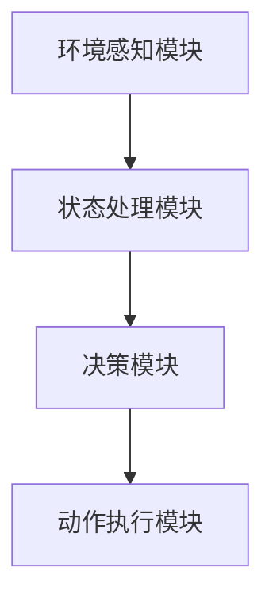
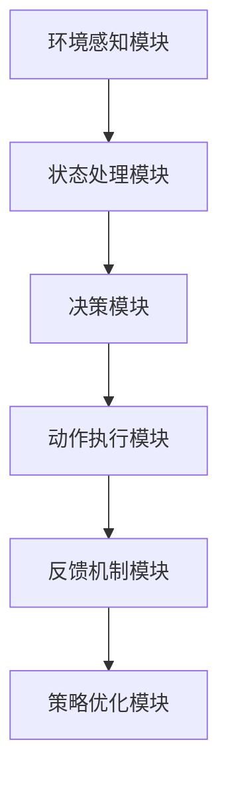

                 


# 开发具有持续适应能力的AI Agent

> 关键词：AI Agent, 持续适应能力, 强化学习, 环境感知, 系统架构

> 摘要：本文详细探讨了开发具有持续适应能力的AI Agent的核心概念、算法原理、系统架构设计及实际应用。通过结合强化学习和马尔可夫决策过程，本文提出了实现持续适应能力的数学模型和算法实现方法，并通过具体案例展示了如何构建和优化具备持续适应能力的AI Agent系统。

---

## 第1章: AI Agent与持续适应能力概述

### 1.1 AI Agent的基本概念

AI Agent（人工智能代理）是一种能够感知环境、自主决策并执行动作的智能实体。它通过与环境交互，实现特定目标或任务。AI Agent的核心特征包括自主性、反应性、目标导向性和社会性。自主性意味着AI Agent能够独立运作；反应性意味着它能够根据环境变化调整行为；目标导向性意味着它会为实现目标而优化决策；社会性则指它能够与其他实体（包括其他AI Agent或人类）进行交互。

### 1.2 持续适应能力的定义

持续适应能力是指AI Agent能够在动态变化的环境中，实时感知环境状态、调整策略并优化行为的能力。这种能力使AI Agent能够应对不确定性、噪声干扰以及环境目标的变化，从而在复杂场景中保持高效运作。

### 1.3 AI Agent的应用场景

AI Agent的应用场景广泛，包括但不限于：

1. **智能推荐系统**：根据用户行为动态调整推荐策略。
2. **自动驾驶系统**：实时感知环境并做出驾驶决策。
3. **智能交易系统**：根据市场变化动态调整交易策略。
4. **机器人控制**：在复杂环境中自主导航和执行任务。

---

## 第2章: 持续适应能力的数学模型

### 2.1 状态空间与动作空间

#### 2.1.1 状态空间的定义

状态空间是指AI Agent在某一时刻所处的所有可能状态的集合。每个状态代表了环境的一个具体配置。例如，在自动驾驶系统中，状态可能包括车辆的位置、速度、周围障碍物的位置等。

#### 2.1.2 动作空间的定义

动作空间是指AI Agent在某一状态下可以执行的所有可能动作的集合。例如，在智能交易系统中，动作可能包括“买入”、“卖出”或“持有”。

#### 2.1.3 状态与动作的关系

状态和动作之间的关系可以通过状态转移矩阵来描述。状态转移矩阵是一个二维数组，其中每个元素表示从一个状态执行一个动作后转移到下一个状态的概率。

$$
P(s' | s, a) = \text{从状态 } s \text{ 执行动作 } a \text{ 后转移到状态 } s' \text{ 的概率}
$$

### 2.2 奖励函数与目标函数

#### 2.2.1 奖励函数的定义

奖励函数是一个从状态-动作对到实数的映射，用于衡量AI Agent在某一状态下执行某一动作的价值。奖励函数通常表示为：

$$
r(s, a) = \text{在状态 } s \text{ 执行动作 } a \text{ 后获得的奖励}
$$

#### 2.2.2 目标函数的定义

目标函数是AI Agent试图优化的函数，通常表示为累积奖励的最大化。目标函数可以表示为：

$$
J(\pi) = \mathbb{E}\left[\sum_{t=0}^{\infty} \gamma^t r(s_t, \pi(s_t))\right]
$$

其中，$\gamma$ 是折扣因子，$\pi(s_t)$ 是在状态 $s_t$ 下的动作选择策略。

### 2.3 环境模型与策略优化

#### 2.3.1 环境模型的构建

环境模型是描述环境动态的数学模型，通常表示为状态转移概率矩阵和奖励函数。环境模型可以帮助AI Agent预测执行动作后的结果。

#### 2.3.2 策略优化的基本原理

策略优化的目标是找到一个策略 $\pi$，使得累积奖励最大化。策略优化可以通过强化学习算法实现，例如Q-learning、Deep Q-Network（DQN）等。

---

## 第3章: 基于强化学习的持续适应算法

### 3.1 强化学习的基本原理

强化学习是一种通过试错机制来优化策略的算法。AI Agent通过与环境交互，学习如何选择动作以最大化累积奖励。

#### 强化学习的基本流程

1. **初始化**：随机选择一个动作。
2. **执行动作**：根据当前状态选择一个动作，并执行该动作。
3. **观察结果**：观察环境对动作的反馈，包括新的状态和奖励。
4. **更新策略**：根据观察到的结果，更新策略以提高未来选择动作的收益。

### 3.2 基于马尔可夫决策过程的持续适应

#### 3.2.1 马尔可夫决策过程的定义

马尔可夫决策过程（MDP）是一个用于描述强化学习问题的数学模型，包括状态空间、动作空间、奖励函数和状态转移概率矩阵。

#### 3.2.2 马尔可夫决策过程与持续适应的关系

马尔可夫决策过程为持续适应能力的实现提供了理论基础。通过不断优化策略，AI Agent可以在动态环境中实现持续适应。

#### 3.2.3 马尔可夫决策过程的实现步骤

1. **初始化**：定义状态空间、动作空间、奖励函数和状态转移概率矩阵。
2. **选择动作**：根据当前策略选择一个动作。
3. **执行动作**：执行选择的动作，并观察环境的反馈。
4. **更新策略**：根据反馈更新策略，以最大化累积奖励。

### 3.3 算法实现的数学模型

#### 3.3.1 状态转移概率矩阵

状态转移概率矩阵描述了从一个状态执行一个动作后转移到下一个状态的概率。矩阵表示为：

$$
P(a, s, s') = \text{从状态 } s \text{ 执行动作 } a \text{ 后转移到状态 } s' \text{ 的概率}
$$

#### 3.3.2 奖励函数的数学表达

奖励函数可以表示为：

$$
r(s, a) = \text{在状态 } s \text{ 执行动作 } a \text{ 后获得的奖励}
$$

#### 3.3.3 策略优化的数学模型

策略优化的目标是找到一个策略 $\pi$，使得累积奖励最大化。策略优化可以通过以下步骤实现：

1. **定义目标函数**：
   $$
   J(\pi) = \mathbb{E}\left[\sum_{t=0}^{\infty} \gamma^t r(s_t, \pi(s_t))\right]
   $$

2. **计算梯度**：
   $$
   \nabla J(\pi) = \mathbb{E}\left[\sum_{t=0}^{\infty} \gamma^t \nabla \log \pi(a_t | s_t) Q(s_t, a_t)\right]
   $$

3. **更新策略**：
   $$
   \pi_{\text{new}} = \pi + \alpha \nabla J(\pi)
   $$

其中，$\alpha$ 是学习率。

---

## 第4章: 持续适应能力的系统架构设计

### 4.1 系统功能模块划分

#### 4.1.1 环境感知模块

环境感知模块负责获取环境的实时状态，例如传感器数据或用户输入。

#### 4.1.2 状态处理模块

状态处理模块负责对获取的状态进行处理，例如特征提取或数据预处理。

#### 4.1.3 动作执行模块

动作执行模块负责根据当前策略选择并执行动作。

#### 4.1.4 奖励机制模块

奖励机制模块负责根据执行结果计算奖励，并更新策略。

### 4.2 系统架构设计

#### 4.2.1 分层架构设计

分层架构将系统划分为感知层、决策层和执行层。感知层负责获取环境状态，决策层负责选择动作，执行层负责执行动作。

#### 4.2.2 模块之间交互关系

模块之间的交互关系可以通过mermaid图表示：



#### 4.2.3 系统架构的优化

系统架构的优化包括模块间的通信优化和资源分配优化，以提高系统的实时性和响应速度。

---

## 第5章: 项目实战——智能交易系统

### 5.1 环境配置

智能交易系统的环境配置包括数据源的选择、交易规则的定义和硬件资源的分配。

### 5.2 系统核心实现

#### 5.2.1 环境感知模块

环境感知模块通过API获取实时市场数据，例如股票价格、交易量等。

#### 5.2.2 状态处理模块

状态处理模块对市场数据进行特征提取，例如计算移动平均线、相对强弱指数等。

#### 5.2.3 动作选择模块

动作选择模块基于强化学习算法选择买入、卖出或持有。

#### 5.2.4 奖励机制模块

奖励机制模块根据交易结果计算奖励，并更新策略。

### 5.3 案例分析

通过具体案例分析，展示如何通过持续适应能力优化交易策略，提高交易收益。

### 5.4 项目总结

项目总结包括系统的性能评估、优化建议和未来改进方向。

---

## 第6章: 优化与未来趋势

### 6.1 系统优化方法

系统优化方法包括算法优化、硬件优化和策略优化。

### 6.2 未来技术挑战

未来技术挑战包括处理更复杂环境、提高系统的实时性和响应速度等。

### 6.3 发展方向

发展方向包括多智能体协作、人机协作和边缘计算等。

### 6.4 最佳实践 tips

- 确保系统的实时性和响应速度。
- 定期更新和优化策略。
- 做好风险控制和异常处理。

### 6.5 小结

本文详细探讨了开发具有持续适应能力的AI Agent的核心概念、算法原理、系统架构设计及实际应用。通过结合强化学习和马尔可夫决策过程，本文提出了实现持续适应能力的数学模型和算法实现方法，并通过具体案例展示了如何构建和优化具备持续适应能力的AI Agent系统。

---

## 附录

### 附录A: 强化学习算法的Python实现示例

```python
import numpy as np
import gym

# 初始化环境
env = gym.make('CartPole-v0')
env.seed(42)
np.random.seed(42)

# 定义超参数
num_states = env.observation_space.shape[0]
num_actions = env.action_space.n
learning_rate = 0.01
gamma = 0.99

# 初始化Q表
Q = np.zeros([num_states, num_actions])

# 训练过程
for episode in range(1000):
    state = env.reset()
    reward_total = 0
    while True:
        # 选择动作
        if np.random.random() < 0.9:
            action = np.argmax(Q[state])
        else:
            action = np.random.randint(0, num_actions)
        
        # 执行动作
        next_state, reward, done, _ = env.step(action)
        
        # 更新Q表
        Q[state][action] += learning_rate * (reward + gamma * np.max(Q[next_state]) - Q[state][action])
        
        # 累计奖励
        reward_total += reward
        
        # 终止条件
        if done:
            break
        
        state = next_state

env.close()
```

### 附录B: 系统架构的mermaid图



### 附录C: 数学公式总结

- 状态转移概率矩阵：
  $$
  P(a, s, s') = \text{从状态 } s \text{ 执行动作 } a \text{ 后转移到状态 } s' \text{ 的概率}
  $$

- 奖励函数：
  $$
  r(s, a) = \text{在状态 } s \text{ 执行动作 } a \text{ 后获得的奖励}
  $$

- 策略优化的目标函数：
  $$
  J(\pi) = \mathbb{E}\left[\sum_{t=0}^{\infty} \gamma^t r(s_t, \pi(s_t))\right]
  $$

---

通过以上内容，本文为开发具有持续适应能力的AI Agent提供了全面的理论和实践指导，帮助读者理解和实现具备持续适应能力的智能系统。

