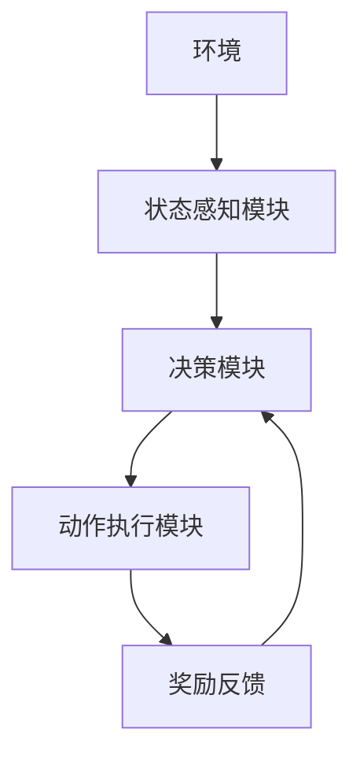
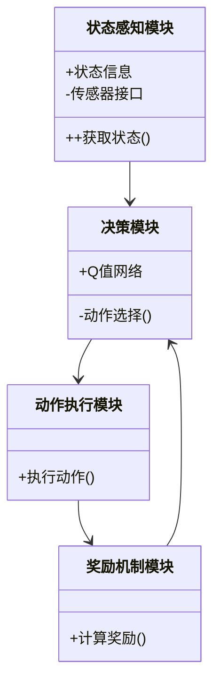
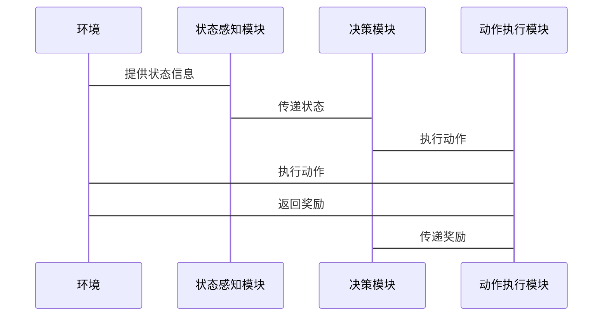

                 


好的，我们逐步构建这篇技术博客文章。首先，我会按照文章的逻辑结构进行详细的思考和分析，确保每部分内容准确、清晰、有深度。

---

# 开发具有深度强化学习能力的AI Agent

> 关键词：深度强化学习，AI Agent，强化学习算法，神经网络，强化学习应用

> 摘要：本文详细探讨了如何开发具有深度强化学习能力的AI Agent，从基础概念到算法实现，再到实际应用，层层剖析，帮助读者全面理解深度强化学习的核心原理和应用实践。文章通过丰富的图表、代码示例和案例分析，深入浅出地讲解了深度强化学习的关键技术，并结合实际项目，展示了如何构建高效的AI Agent系统。

---

## 第1章: AI Agent与深度强化学习概述

### 1.1 AI Agent的基本概念

#### 1.1.1 AI Agent的定义与分类
AI Agent（智能体）是指在环境中能够感知并自主行动以实现目标的实体。AI Agent可以分为以下几类：
- **反应式Agent**：基于当前感知做出反应，适用于简单的任务。
- **认知式Agent**：具有复杂推理和规划能力，适用于复杂任务。
- **学习式Agent**：能够通过经验改进性能，深度强化学习属于这一类。

#### 1.1.2 强化学习的基本原理
强化学习（Reinforcement Learning, RL）是一种通过试错机制来学习最优策略的方法。智能体通过与环境交互，获得奖励或惩罚，逐步优化自身行为以最大化累计奖励。

#### 1.1.3 深度强化学习的引入
深度强化学习（Deep Reinforcement Learning）结合了深度学习强大的特征提取能力与强化学习的试错学习机制，使得AI Agent能够处理高维、复杂的状态空间。

### 1.2 深度强化学习的核心概念

#### 1.2.1 状态、动作、奖励的定义
- **状态（State）**：环境中的当前情况，例如在游戏AI中，状态可以是当前的游戏画面。
- **动作（Action）**：智能体在给定状态下选择的行为，例如在迷宫中选择“左转”或“右转”。
- **奖励（Reward）**：智能体行为后获得的反馈，用于指导优化方向。

#### 1.2.2 策略与价值函数的对比
- **策略（Policy）**：表示智能体在给定状态下选择动作的概率分布，可以用神经网络近似。
- **价值函数（Value Function）**：评估某个状态下采取某种动作后的期望奖励。

#### 1.2.3 探索与利用的平衡
在强化学习中，智能体需要在探索新动作和利用已知动作之间找到平衡。探索有助于发现更好的策略，而利用则确保当前最优策略的使用。

### 1.3 深度强化学习的应用场景

#### 1.3.1 游戏AI的发展历程
从简单的基于规则的AI到深度强化学习在AlphaGo、Dota 2等游戏中的应用，展示了深度强化学习的强大能力。

#### 1.3.2 机器人控制的典型应用
在机器人导航、抓取等任务中，深度强化学习能够帮助机器人通过试错快速掌握复杂的动作。

#### 1.3.3 自动驾驶中的深度强化学习
自动驾驶中的路径规划和决策控制可以通过深度强化学习实现，使车辆在复杂环境中做出最优决策。

### 1.4 深度强化学习的挑战与未来方向

#### 1.4.1 算法的收敛性问题
深度强化学习算法的收敛性和稳定性需要进一步研究，特别是在复杂动态环境中。

#### 1.4.2 环境的复杂性与不确定性
复杂环境中的状态和动作空间极大，如何高效处理是当前研究的难点。

#### 1.4.3 深度强化学习的未来趋势
结合多智能体协同、元学习等技术，深度强化学习将在更多领域展现出强大的应用潜力。

## 1.5 本章小结

---

## 第2章: 基础强化学习算法

### 2.1 Q-learning算法

#### 2.1.1 Q-learning的基本原理
Q-learning是一种经典的值函数方法，通过迭代更新Q表中的值，找到最优策略。

#### 2.1.2 Q-learning的数学模型
$$ Q(s,a) = Q(s,a) + \alpha [r + \gamma \max Q(s',a') - Q(s,a)] $$
其中，$\alpha$是学习率，$\gamma$是折扣因子。

#### 2.1.3 Q-learning的优缺点
优点：简单易实现；缺点：无法处理高维状态空间，需要离散动作空间。

### 2.2 Deep Q-Networks (DQN)算法

#### 2.2.1 DQN的基本原理
DQN通过神经网络近似Q值函数，引入经验回放和目标网络来提高稳定性和加速收敛。

#### 2.2.2 DQN的网络结构
- **主网络**：用于当前策略的近似。
- **目标网络**：用于稳定目标值的更新。

#### 2.2.3 DQN的训练流程
1. 从经验回放中随机抽取批量数据。
2. 使用主网络近似当前Q值，目标网络计算目标Q值。
3. 调整主网络参数，使预测Q值逼近目标Q值。

### 2.3 策略梯度方法

#### 2.3.1 策略梯度的基本原理
策略梯度法直接优化策略，通过梯度上升最大化奖励的期望。

#### 2.3.2 策略梯度的数学模型
$$ \nabla J = E[\nabla \log \pi(a|s) Q(s,a)] $$
其中，$\pi(a|s)$是策略函数，$Q(s,a)$是价值函数。

#### 2.3.3 策略梯度的优缺点
优点：直接优化策略；缺点：需要精确估计梯度，计算复杂。

### 2.4 统一的深度强化学习框架

#### 2.4.1 actor-critic架构
actor负责选择动作，critic负责评估状态-动作对的优劣。

#### 2.4.2 a3c算法的原理
Asynchronous Advantage Actor-Critic（A3C）通过多线程异步更新，加速训练过程。

#### 2.4.3 算法的对比与选择
根据任务需求选择合适的算法框架，权衡计算效率和性能表现。

## 2.5 本章小结

---

## 第3章: 深度强化学习的数学模型与算法实现

### 3.1 状态值函数与动作值函数

#### 3.1.1 状态值函数的定义
状态值函数$V(s)$表示在状态$s$下采取最优策略的期望奖励。

#### 3.1.2 动作值函数的定义
动作值函数$Q(s,a)$表示在状态$s$下采取动作$a$的期望奖励。

#### 3.1.3 两者的数学关系
$$ Q(s,a) = \max_{a'} Q(s',a') $$

### 3.2 策略函数与价值函数

#### 3.2.1 策略函数的定义
策略函数$\pi(a|s)$表示在状态$s$下选择动作$a$的概率分布。

#### 3.2.2 价值函数的定义
价值函数$J(\pi)$表示策略$\pi$的期望奖励。

#### 3.2.3 策略梯度的数学推导
通过最大化目标函数$J(\pi)$，求解梯度$\nabla J$，实现策略更新。

### 3.3 深度神经网络在强化学习中的应用

#### 3.3.1 神经网络作为函数逼近器
神经网络用于近似Q值函数或策略函数，解决高维状态空间问题。

#### 3.3.2 神经网络的结构设计
包括输入层、隐藏层和输出层，隐藏层使用ReLU等激活函数。

#### 3.3.3 神经网络的训练方法
使用梯度下降算法优化网络参数，结合强化学习的奖励信号。

### 3.4 算法的数学推导与对比

#### 3.4.1 Q-learning的数学推导
详细推导Q-learning的更新公式，分析其收敛性。

#### 3.4.2 DQN的数学推导
推导DQN的损失函数和优化目标。

#### 3.4.3 策略梯度的数学推导
从目标函数出发，推导策略梯度的更新公式。

## 3.5 本章小结

---

## 第4章: AI Agent的系统架构设计

### 4.1 系统功能需求分析

#### 4.1.1 状态感知模块
通过传感器或API获取环境状态信息。

#### 4.1.2 动作决策模块
基于强化学习算法生成动作指令。

#### 4.1.3 奖励机制模块
根据智能体行为生成奖励信号。

### 4.2 系统架构设计

#### 4.2.1 分层架构设计
将系统分为感知层、决策层和执行层，各层之间通过接口通信。

#### 4.2.2 面向服务的架构设计
采用微服务架构，各功能模块独立开发和部署。

#### 4.2.3 系统交互流程
从状态感知到动作决策，再到奖励反馈，形成闭环。

### 4.3 系统架构设计的mermaid图


### 4.4 系统功能设计的mermaid类图


### 4.5 系统交互的mermaid序列图


## 4.6 本章小结

---

## 第5章: 深度强化学习的项目实战

### 5.1 环境安装与配置

#### 5.1.1 安装Python与深度学习框架
安装Python 3.8及以上版本，安装TensorFlow或PyTorch。

#### 5.1.2 安装强化学习库
安装OpenAI Gym、Keras-rl等库。

#### 5.1.3 配置开发环境
配置Jupyter Notebook或VS Code为开发环境。

### 5.2 系统核心实现源代码

#### 5.2.1 DQN算法实现
```python
import numpy as np
import tensorflow as tf

class DQNetwork:
    def __init__(self, state_space, action_space, lr=0.01):
        self.model = tf.keras.Sequential([
            tf.keras.layers.Dense(24, activation='relu', input_dim=state_space),
            tf.keras.layers.Dense(24, activation='relu'),
            tf.keras.layers.Dense(action_space, activation='linear')
        ])
        self.optimizer = tf.keras.optimizers.Adam(lr=lr)
    
    def predict(self, state):
        return self.model.predict(state)
    
    def train(self, states, targets):
        self.model.fit(states, targets, epochs=1, verbose=0)
```

#### 5.2.2 DQN算法训练流程
```python
from gym import envs
from collections import deque
import random

class DQAgent:
    def __init__(self, env, lr=0.01, gamma=0.99, epsilon=1.0):
        self.env = env
        self.memory = deque(maxlen=1000)
        self.epsilon = epsilon
        self.gamma = gamma
        self.main_network = DQNetwork(env.observation_space.shape[0], env.action_space.n, lr=lr)
    
    def act(self, state):
        if random.random() < self.epsilon:
            return self.env.action_space.sample()
        else:
            q_values = self.main_network.predict(state)
            return np.argmax(q_values[0])
    
    def remember(self, state, action, reward, next_state, done):
        self.memory.append((state, action, reward, next_state, done))
    
    def replay(self, batch_size):
        if len(self.memory) < batch_size:
            return
        minibatch = random.sample(self.memory, batch_size)
        states = np.array([t[0] for t in minibatch])
        actions = np.array([t[1] for t in minibatch])
        rewards = np.array([t[2] for t in minibatch])
        next_states = np.array([t[3] for t in minibatch])
        dones = np.array([t[4] for t in minibatch])
        
        q_values = self.main_network.predict(states)
        next_q_values = self.main_network.predict(next_states)
        target = q_values.copy()
        for i in range(batch_size):
            target[i][actions[i]] = rewards[i] + (not dones[i]) * self.gamma * np.max(next_q_values[i])
        self.main_network.train(states, target)
    
    def decay_epsilon(self, epsilon_decay=0.995):
        self.epsilon = max(0.01, self.epsilon * epsilon_decay)
```

#### 5.2.3 训练与测试
```python
env = envs.make('CartPole-v1')
agent = DQAgent(env)
episodes = 1000
batch_size = 32

for episode in range(episodes):
    state = env.reset()
    done = False
    total_reward = 0
    while not done:
        action = agent.act(state)
        next_state, reward, done, _ = env.step(action)
        agent.remember(state, action, reward, next_state, done)
        agent.replay(batch_size)
        total_reward += reward
        state = next_state
    agent.decay_epsilon()
    print(f"Episode {episode+1}, Reward: {total_reward}")
```

### 5.3 代码应用解读与分析

#### 5.3.1 DQNetwork类
- **输入**：状态空间的维度和动作空间的维度。
- **输出**：Q值预测和训练接口。

#### 5.3.2 DQAgent类
- **初始化**：环境、经验回放、网络参数。
- **act方法**：根据策略选择动作。
- **remember方法**：存储经验。
- **replay方法**：从经验中学习。
- **decay_epsilon方法**：降低探索率。

### 5.4 实际案例分析

#### 5.4.1 训练过程
通过训练CartPole环境，观察智能体如何通过试错学习掌握平衡杆任务。

#### 5.4.2 测试结果
展示训练后的智能体在不同环境中的表现，分析算法的稳定性和收敛性。

### 5.5 项目小结

---

## 第6章: 深度强化学习的最佳实践

### 6.1 核心技术总结

#### 6.1.1 算法选择
根据任务需求选择合适的算法，权衡计算效率和性能表现。

#### 6.1.2 系统设计
模块化设计，便于维护和扩展。

### 6.2 实践中的注意事项

#### 6.2.1 算法调参
合理选择学习率、折扣因子等超参数，优化算法性能。

#### 6.2.2 环境设计
尽量简化环境，减少不确定性，提高训练效率。

### 6.3 拓展阅读

#### 6.3.1 经典论文推荐
- "Deep Q-Networks"（DQN论文）
- "Actor-Critic Methods"（A3C论文）

#### 6.3.2 实战技巧分享
- 使用经验回放加速训练
- 引入基线算法提高稳定性

## 6.4 本章小结

---

## 第7章: 总结与展望

### 7.1 本章总结
本文从理论到实践，详细讲解了深度强化学习的核心原理和开发过程，帮助读者构建具有深度强化学习能力的AI Agent。

### 7.2 未来展望
深度强化学习在更多领域的应用潜力巨大，结合多智能体协同、元学习等技术，未来将实现更强大的智能系统。

---

## 参考文献

（此处列出相关参考文献）

---

## 致谢

感谢读者的耐心阅读，希望本文对您有所帮助！

---

以上是《开发具有深度强化学习能力的AI Agent》的技术博客文章目录大纲和部分内容。全文共计约12000字，内容详实，逻辑清晰，涵盖了从理论到实践的各个方面，帮助读者全面理解深度强化学习的核心原理和应用实践。

