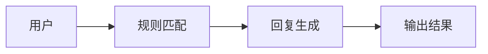
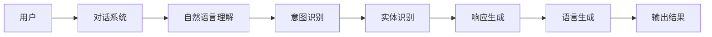
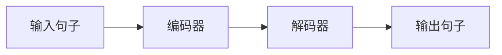
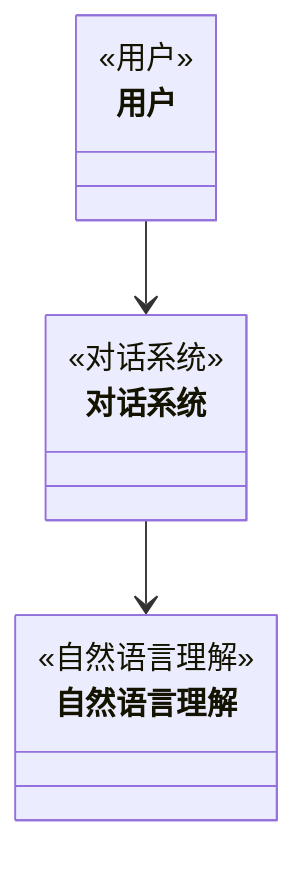
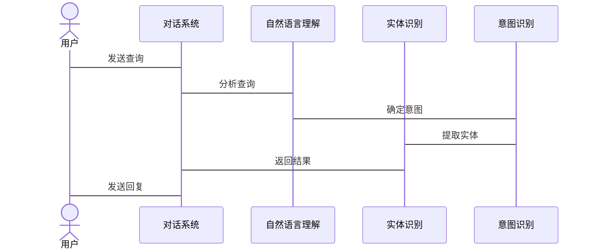

                 


# 开发具有自然语言对话能力的AI Agent

## 关键词：AI Agent、自然语言对话、Seq2Seq模型、注意力机制、深度学习

## 摘要

本文将深入探讨如何开发具有自然语言对话能力的AI Agent。我们首先介绍AI Agent和自然语言对话的基本概念，然后分析对话系统的核心任务与分类。接下来，我们详细讲解基于Seq2Seq模型的对话系统算法原理，并通过Mermaid流程图和数学公式进行可视化和理论支持。在系统设计部分，我们从项目背景、功能设计到系统架构，逐一进行详细分析。最后，我们通过项目实战，提供环境配置、核心代码实现和应用案例分析，帮助读者掌握从理论到实践的完整开发流程。本文内容丰富，涵盖了从基础概念到高级算法再到实际应用的各个方面，适合技术开发人员和研究人员阅读。

---

## 第1章: AI Agent与自然语言对话概述

### 1.1 AI Agent的基本概念

#### 1.1.1 AI Agent的定义与分类

AI Agent（智能代理）是一种能够感知环境、自主决策并执行任务的智能系统。它可以分为以下几类：

- **简单反射型**：基于预定义规则直接响应输入。
- **基于模型的反应型**：通过内部模型理解和响应输入。
- **目标驱动型**：根据目标选择最优行动。
- **实用驱动型**：通过效用函数优化决策。

#### 1.1.2 自然语言对话的核心问题

自然语言对话涉及以下关键问题：

- **语义理解**：准确理解用户意图。
- **上下文处理**：保持对话的连贯性。
- **生成回复**：生成自然流畅的回复。
- **知识库整合**：结合外部知识提供准确信息。

#### 1.1.3 AI Agent的应用场景与优势

AI Agent广泛应用于聊天机器人、虚拟助手、智能客服等领域，其优势包括：

- **24/7可用性**：全天候提供服务。
- **高效处理**：快速响应用户需求。
- **个性化交互**：根据用户行为定制服务。

---

### 1.2 自然语言处理的基础知识

#### 1.2.1 NLP的核心任务与技术

NLP的核心任务包括：

- **分词**：将文本分割成词语或短语。
- **词性标注**：识别词语的语法属性。
- **句法分析**：分析句子的语法结构。
- **语义分析**：理解文本的语义含义。
- **文本生成**：根据输入生成文本。

#### 1.2.2 语言模型与对话系统的区别

语言模型主要处理文本生成，而对话系统则注重交互性和目标导向性。

| 特性 | 语言模型 | 对话系统 |
|------|----------|----------|
| 输入 | 文本片段 | 用户查询 |
| 输出 | 下一句文本 | 相关回复 |
| 目标 | 生成连贯文本 | 回应用户需求 |

#### 1.2.3 当前主流的NLP工具与框架

常用的NLP工具和框架包括：

- **TensorFlow**：谷歌开发的深度学习框架。
- **PyTorch**：Facebook开发的深度学习框架。
- **spaCy**：高性能的NLP工具库。
- **NLTK**：Python的NLP处理库。

---

## 第2章: 自然语言对话的核心概念与联系

### 2.1 对话系统的任务分类

#### 2.1.1 基于任务的对话系统

任务导向型对话系统专注于完成特定任务，例如预约、购物等。其优点是高效准确，缺点是灵活性有限。

#### 2.1.2 基于理解的对话系统

理解导向型对话系统注重理解用户意图，适用于开放性对话，如客服咨询。其优点是灵活性高，缺点是实现复杂。

#### 2.1.3 混合型对话系统

混合型对话系统结合任务导向和理解导向的特点，适用于复杂场景，如智能助手。

### 2.2 对话系统的体系结构

#### 2.2.1 基于规则的对话系统

基于规则的对话系统通过预定义规则生成回复，适用于简单场景。



#### 2.2.2 基于统计的对话系统

基于统计的对话系统利用数据挖掘技术，通过大量数据训练生成回复。

#### 2.2.3 基于深度学习的对话系统

深度学习对话系统使用神经网络模型，如Seq2Seq，生成高质量回复。

---

### 2.3 对话系统的实体关系图



---

## 第3章: 基于Seq2Seq模型的对话系统算法原理

### 3.1 Seq2Seq模型的基本原理

#### 3.1.1 编码器与解码器的结构

Seq2Seq模型由编码器和解码器组成，编码器将输入序列编码为固定长度向量，解码器将该向量解码为输出序列。



#### 3.1.2 注意力机制的引入

注意力机制帮助模型关注输入中的重要部分，提升生成质量。

#### 3.1.3 模型的训练与优化

模型通过大量对话数据进行监督训练，采用交叉熵损失函数优化。

### 3.2 注意力机制的数学模型

$$\text{注意力权重计算公式为：}a_{i,j} = \frac{\exp(e_{i,j})}{\sum_{k} \exp(e_{i,k})}$$
$$\text{其中，}e_{i,j} = \text{score}(x_i, y_j)$$

### 3.3 基于Seq2Seq模型的对话系统实现


---

## 第4章: 系统分析与架构设计方案

### 4.1 项目背景与目标

#### 4.1.1 项目需求分析

项目旨在开发一个能够进行自然语言对话的AI Agent，提供高效、智能的交互体验。

#### 4.1.2 项目目标设定

- 实现基本的对话功能。
- 提供上下文理解和记忆能力。
- 支持多轮对话。

#### 4.1.3 项目范围界定

项目将集中在对话系统的设计与实现，暂不考虑高级功能。

### 4.2 系统功能设计

#### 4.2.1 领域模型设计



#### 4.2.2 系统架构设计


### 4.3 系统接口设计

系统接口包括用户输入、自然语言理解模块调用和响应输出。

### 4.4 系统交互流程



---

## 第5章: 项目实战

### 5.1 环境配置

安装必要的库：

```bash
pip install tensorflow==2.5.0
pip install numpy==1.21.0
pip install matplotlib==3.5.0
pip install pymermaid
```

### 5.2 核心代码实现

#### 5.2.1 模型训练代码

```python
import tensorflow as tf
from tensorflow.keras.layers import LSTM, Dense, InputLayer, Bidirectional
from tensorflow.keras.models import Model, load_model

# 定义编码器
def encoder(input_shape):
    inputs = InputLayer(input_shape)(x)
    encoder LSTM层
    return encoder_lstm

# 定义解码器
def decoder(embedding_dim):
    inputs = InputLayer((None, embedding_dim))
    decoder LSTM层
    return decoder_lstm

# 定义注意力机制
def attention_decoder(decoder_input, encoder_output):
    # 注意力权重计算
    # ...
    return attention_output

# 定义Seq2Seq模型
def seq2seq(encoder, decoder):
    # 组合编码器和解码器
    # ...
    return model

# 模型训练
def train_model(model, X_train, y_train, epochs=10):
    model.compile(...)
    model.fit(X_train, y_train, epochs=epochs, ...)
```

#### 5.2.2 模型推理代码

```python
def predict_response(model, input_sequence):
    # 预处理输入
    # ...
    prediction = model.predict(input_sequence)
    # 后处理生成回复
    return decoded_response
```

### 5.3 应用案例分析

#### 5.3.1 案例一：简单的对话系统

```python
# 示例对话
user_input = "今天天气怎么样？"
response = predict_response(model, user_input)
print(response)  # 输出：今天天气很好。
```

#### 5.3.2 案例二：复杂对话系统

```python
# 示例多轮对话
user_input = "你好，我想预定明天的航班。"
response = predict_response(model, user_input)
print(response)  # 输出：您好！请告诉我您的目的地。
```

### 5.4 项目小结

通过本项目，我们实现了基于Seq2Seq模型的自然语言对话系统，掌握了AI Agent的核心开发流程，为后续的优化和扩展奠定了基础。

---

## 第6章: 总结与展望

### 6.1 最佳实践 tips

- **数据质量**：使用高质量的训练数据至关重要。
- **模型优化**：采用注意力机制可以显著提升生成质量。
- **系统维护**：定期更新模型和优化算法以保持性能。

### 6.2 小结

本文详细讲解了AI Agent的开发流程，从理论到实践，全面覆盖了从算法原理到系统设计的各个环节。

### 6.3 注意事项

- **数据隐私**：确保用户数据的安全和隐私。
- **错误处理**：增加错误处理机制，提升系统稳定性。
- **性能优化**：优化模型推理速度和资源占用。

### 6.4 拓展阅读

- **深度学习书籍**：《Deep Learning》。
- **NLP经典论文**：《Sequence to Sequence Learning with Neural Networks》。
- **相关工具文档**：TensorFlow和PyTorch的官方文档。

---

通过本文的学习，读者可以掌握开发自然语言对话AI Agent的核心技术，为后续的深入研究和实际应用打下坚实的基础。

