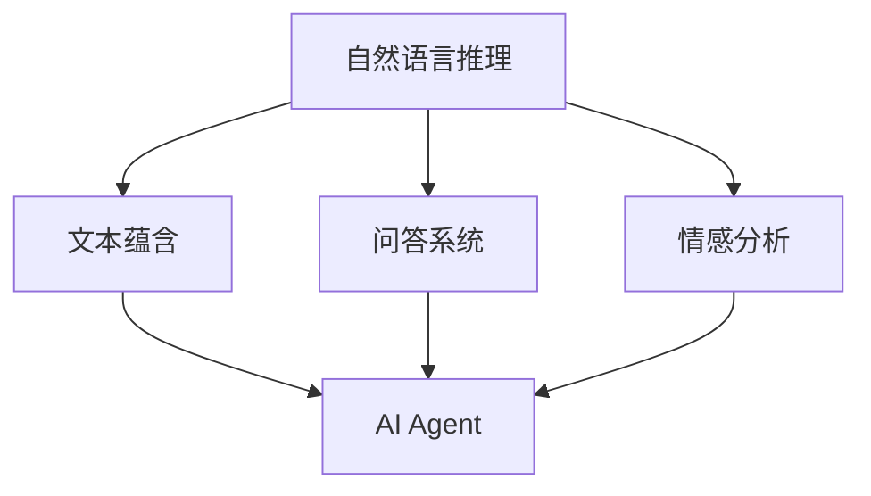
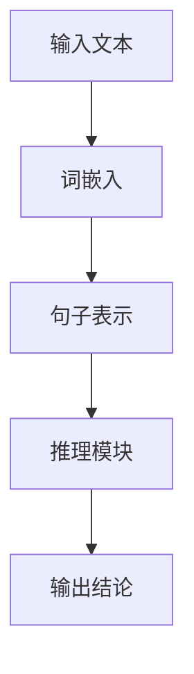
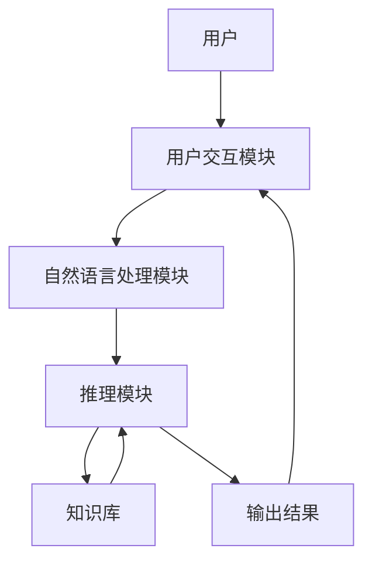

                 


# 开发具有自然语言推理能力的AI Agent

> **关键词**: 自然语言推理, AI Agent, 智能体, 人机交互, 深度学习, NLP

> **摘要**: 本文将详细介绍如何开发具有自然语言推理能力的AI Agent。从自然语言推理的基本概念到AI Agent的系统设计，从算法原理到项目实战，逐步引导读者掌握开发过程中的关键技术和实现细节。通过本文的学习，读者将能够理解自然语言推理在AI Agent中的作用，掌握相关算法的实现方法，并能够设计和实现一个简单的自然语言推理驱动的AI Agent系统。

---

## 第一部分: 自然语言推理与AI Agent概述

### 第1章: 自然语言推理与AI Agent的背景介绍

#### 1.1 自然语言推理的定义与核心概念

自然语言推理（Natural Language Inference, NLI）是人工智能领域中的一个重要研究方向，旨在让计算机能够理解自然语言文本的含义，并根据上下文进行推理。以下是自然语言推理的核心概念：

- **前提（Premise）**: 提供背景信息或前提条件的文本片段。
- **假设（Hypothesis）**: 需要验证的命题或陈述。
- **结论（Conclusion）**: 基于前提和假设得出的推理结果。

#### 1.2 AI Agent的基本概念与特点

AI Agent（智能体）是一种能够感知环境、执行任务并做出决策的实体。以下是AI Agent的核心属性特征对比表：

| 属性        | 描述                                                     |
|-------------|----------------------------------------------------------|
| 自主性       | 能够自主决策，无需外部干预                               |
| 反应性       | 能够感知环境并实时响应                                   |
| 社会性       | 能够与其他实体（包括用户和其他系统）进行交互             |
| 持续性       | 能够在长时间内保持稳定运行                                 |
| 可解释性     | 能够提供决策的依据和理由                                   |

### 第2章: 自然语言推理与AI Agent的结合

#### 2.1 自然语言推理在AI Agent中的作用

自然语言推理在AI Agent中的作用主要体现在以下几个方面：

- **文本蕴含（Text Entailment）**: 判断一个假设是否可以从一个或多个前提中推导出来。
- **问答系统（Question Answering）**: 根据上下文信息回答用户的问题。
- **情感分析（Sentiment Analysis）**: 推断文本中蕴含的情感倾向。

#### 2.2 自然语言推理与AI Agent的核心概念联系

通过以下Mermaid图，我们可以清晰地看到自然语言推理与AI Agent之间的关系：



---

## 第二部分: 自然语言推理的原理与算法

### 第3章: 自然语言推理的算法原理

#### 3.1 自然语言推理的主要任务类型

- **文本蕴含（Text Entailment）**: 判断一个假设是否可以从前提中推导出来。例如，给定前提“所有鸟都会飞”，假设“鸵鸟是鸟”，结论是“鸵鸟会飞”。
- **问答系统（Question Answering）**: 根据上下文信息回答用户的问题。例如，给定上下文“在办公室，员工不得将公司机密泄露给外部人员”，问题“员工可以泄露机密吗？”，答案是“不可以”。
- **情感分析（Sentiment Analysis）**: 推断文本中蕴含的情感倾向。例如，给定文本“这部电影太无聊了”，情感分析结果是“负面”。

#### 3.2 自然语言推理的模型结构

以下是一个基于深度学习的自然语言推理模型的结构图：



### 第4章: 自然语言推理的数学模型与公式

#### 4.1 核心数学模型

- **词嵌入模型（Word2Vec）**: 通过上下文预测单词，训练目标函数为：

  $$ \text{损失函数} = -\log p(w_i | w_{i-1}) $$

- **句子表示模型（BERT）**: 使用Transformer架构，通过自注意力机制捕捉上下文信息。

- **推理模型（逻辑回归）**: 在文本蕴含任务中，逻辑回归模型的输出为：

  $$ p(y=1 | x) = \frac{1}{1 + e^{-wx}} $$

---

## 第三部分: AI Agent的系统设计与实现

### 第5章: AI Agent的系统架构设计

#### 5.1 功能模块划分

AI Agent的系统架构可以划分为以下几个主要模块：

- **自然语言处理模块**: 负责文本的分词、语义分析和关键词提取。
- **推理模块**: 根据输入文本进行推理，生成结论。
- **知识库**: 存储必要的背景知识和上下文信息。
- **用户交互模块**: 处理用户输入和输出。

#### 5.2 系统架构设计

以下是一个基于微服务架构的AI Agent系统架构图：



### 第6章: AI Agent的系统实现

#### 6.1 环境安装

以下是实现AI Agent所需的环境依赖：

```bash
pip install python
pip install tensorflow
pip install huggingface-transformers
```

#### 6.2 核心代码实现

以下是一个简单的自然语言推理驱动的AI Agent的Python实现示例：

```python
from transformers import pipeline

# 初始化自然语言推理模型
nli_pipeline = pipeline("nli", model="facebook/bart-large-mnli")

def process_input(text):
    # 分割前提和假设
    premise, hypothesis = text.split('\n')
    # 进行推理
    result = nli_pipeline(premise=premise, hypothesis=hypothesis)
    return result

# 用户输入
user_input = "前提：所有鸟都会飞\n假设：鸵鸟是鸟"
output = process_input(user_input)
print(output)
```

#### 6.3 实际案例分析

以智能客服为例，用户输入“我的订单在哪里？”，AI Agent需要理解用户的需求，并根据知识库中的订单信息生成相应的回复。

---

## 第7章: 总结与展望

### 7.1 总结

本文详细介绍了如何开发具有自然语言推理能力的AI Agent，从理论基础到系统实现，为读者提供了全面的指导。

### 7.2 未来发展方向

未来，自然语言推理和AI Agent的研究将朝着以下几个方向发展：

- **模型的可解释性**: 提高推理过程的透明度，使用户能够理解AI Agent的决策依据。
- **多模态推理**: 结合图像、语音等多种模态信息，提升推理能力。
- **实时性**: 提高系统的实时响应能力，适用于更多实时应用场景。

---

通过本文的学习，读者将能够掌握自然语言推理的核心原理和AI Agent的系统设计方法，为开发更智能、更高效的AI Agent系统奠定坚实的基础。

