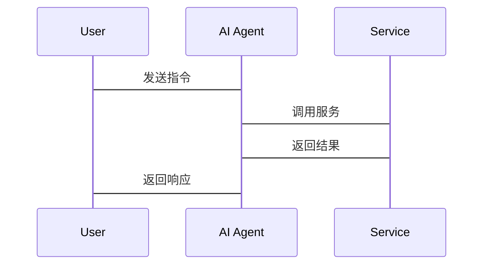

                 


# 开发具有自然语言理解能力的AI Agent

> 关键词：自然语言处理、AI Agent、机器学习、深度学习、自然语言理解

> 摘要：本文详细探讨了开发具有自然语言理解能力的AI Agent的核心技术，从自然语言理解（NLU）的原理到AI Agent的系统架构设计，再到实际项目的实现，逐步解析了如何构建一个能够理解人类语言并执行相应任务的智能代理。通过理论分析与实践案例相结合，本文为读者提供了一个全面的视角，帮助其掌握AI Agent开发的关键技术。

---

## 第一章：自然语言理解与AI Agent的背景介绍

### 1.1 问题背景与问题描述

#### 1.1.1 自然语言理解的核心问题
自然语言理解（NLU）是人工智能（AI）领域中的核心任务之一，旨在让计算机能够理解人类使用的自然语言。其核心问题包括：
- **语义解析**：从文本中提取意图、实体和其他语义信息。
- **上下文理解**：处理对话中的上下文关系，理解前后文的联系。
- **多语言支持**：支持多种语言的自然语言理解。

#### 1.1.2 AI Agent的定义与特点
AI Agent（智能代理）是一种能够感知环境、自主决策并执行任务的智能系统。其特点包括：
- **自主性**：能够独立运行，无需人工干预。
- **反应性**：能够实时感知环境并做出响应。
- **目标导向**：具备明确的目标，能够优化行为以达到目标。

#### 1.1.3 问题解决的目标与意义
开发具有自然语言理解能力的AI Agent的目标是实现人与AI之间的自然交互，使AI能够理解人类的语言指令并执行相应的任务。其意义在于：
- 提高人机交互的自然性和便捷性。
- 扩展AI的应用场景，使其能够在更多领域中发挥作用。
- 推动人工智能技术的进一步发展。

---

### 1.2 问题背景的外延与边界

#### 1.2.1 自然语言理解的边界
自然语言理解的边界主要体现在：
- **输入范围**：仅处理文本或语音输入，不涉及图像或视频等其他形式的数据。
- **任务范围**：专注于理解任务，不涉及生成任务（如文本生成）。
- **上下文深度**：通常处理有限的上下文关系，难以处理复杂的多轮对话。

#### 1.2.2 AI Agent的应用场景
AI Agent的应用场景包括：
- **智能助手**：如Siri、Alexa等，能够通过语音指令执行任务。
- **客服机器人**：通过自然语言理解客户需求，提供相应的服务。
- **智能监控**：实时监控环境并根据指令采取行动。

#### 1.2.3 技术实现的局限性与挑战
当前自然语言理解技术的局限性与挑战包括：
- **语义理解的深度**：难以处理复杂语义和隐含意图。
- **数据依赖性**：需要大量标注数据进行训练，数据获取成本高。
- **实时性**：在实时交互中，如何保证响应速度和准确性是一个挑战。

---

## 第二章：核心概念与联系

### 2.1 自然语言理解的原理

#### 2.1.1 语言模型的基本原理
语言模型通过统计方法预测下一个词的概率，常用的语言模型包括：
- **n-gram模型**：基于短语的统计模型。
- **隐马尔可夫模型（HMM）**：用于序列标注任务。
- **循环神经网络（RNN）**：通过递归结构处理序列数据。

#### 2.1.2 词嵌入的实现方式
词嵌入是将词语映射到高维连续向量空间的技术，常用的实现方式包括：
- **词袋模型（Bag-of-Words）**：基于词频的简单向量化方法。
- **TF-IDF**：基于词频和逆文档频率的加权方法。
- **Word2Vec**：通过神经网络训练词向量。

#### 2.1.3 序列标注的核心思想
序列标注任务包括分词、词性标注、命名实体识别等，其核心思想是：
- 使用动态规划或概率模型，基于上下文信息进行标注。

---

### 2.2 核心概念对比分析

#### 2.2.1 不同NLU模型的对比
| 模型类型      | 基础原理             | 优缺点                     |
|---------------|----------------------|----------------------------|
| 基于规则      | 基于预定义规则         | 实现简单，但灵活性差         |
| 统计模型      | 基于统计特征         | 精度较高，但依赖数据量       |
| 深度学习模型  | 基于神经网络结构       | 精度高，但需要大量数据和算力 |

#### 2.2.2 模型性能的评估指标
- **准确率（Accuracy）**：正确预测的比例。
- **召回率（Recall）**：正确预测的正例比例。
- **F1值（F1-Score）**：准确率和召回率的调和平均值。

#### 2.2.3 算法实现的优缺点
- **基于规则的NLU**：实现简单，但难以应对复杂语义。
- **统计模型的NLU**：精度较高，但依赖大量标注数据。
- **深度学习模型的NLU**：精度最高，但实现复杂且需要大量计算资源。

---

## 第三章：算法原理与实现

### 3.1 算法原理概述

#### 3.1.1 基于规则的NLU实现
基于规则的NLU通过预定义的规则和模板匹配输入文本，实现意图识别和实体提取。例如：
$$ \text{如果输入是“打开灯”，则识别意图是“打开”，实体是“灯”} $$

#### 3.1.2 统计模型的NLU实现
统计模型的NLU实现通过训练统计模型，如HMM，基于词频和上下文信息进行意图识别。例如：
$$ P(\text{intent}=i | x) = \prod_{j=1}^{n} P(x_j | \text{intent}=i) $$

#### 3.1.3 深度学习模型的NLU实现
深度学习模型的NLU实现通过训练神经网络，如RNN或Transformer，实现语义理解。例如：
$$ P(\text{intent}=i | x) = \text{softmax}(W_i x + b_i) $$

---

### 3.2 算法实现流程

#### 3.2.1 数据预处理与特征提取
- 数据清洗：去除噪声数据，如停用词、标点符号等。
- 特征提取：将文本转换为数值特征，如TF-IDF向量。

#### 3.2.2 模型训练与优化
- 模型训练：基于训练数据，优化模型参数。
- 模型调优：通过交叉验证和网格搜索优化模型性能。

#### 3.2.3 模型评估与调优
- 模型评估：通过准确率、召回率等指标评估模型性能。
- 模型调优：通过超参数优化进一步提升模型性能。

---

## 第四章：系统分析与架构设计

### 4.1 项目场景介绍

#### 4.1.1 项目目标与范围
本项目旨在开发一个能够理解用户自然语言指令的AI Agent，应用于智能助手和客服机器人。

#### 4.1.2 项目需求分析
- **功能需求**：支持意图识别和实体提取。
- **性能需求**：响应时间小于1秒，准确率大于90%。
- **接口需求**：提供RESTful API接口。

#### 4.1.3 项目可行性分析
- **技术可行性**：当前深度学习技术能够满足需求。
- **数据可行性**：需要大量标注数据进行训练。
- **资源可行性**：需要高性能计算资源。

---

### 4.2 系统功能设计

#### 4.2.1 领域模型设计
领域模型设计包括：
- **意图识别**：识别用户的意图。
- **实体识别**：提取文本中的实体信息。
- **对话管理**：管理对话流程。

#### 4.2.2 系统架构设计
系统架构设计包括：
- **前端层**：用户与AI Agent交互的界面。
- **服务层**：处理用户的请求并调用相应的服务。
- **数据层**：存储和管理训练数据。

#### 4.2.3 系统接口设计
系统接口设计包括：
- **输入接口**：接收用户的自然语言输入。
- **输出接口**：返回处理结果或执行任务。

---

### 4.3 系统交互设计

#### 4.3.1 系统交互流程
系统交互流程包括：
1. 用户输入自然语言指令。
2. AI Agent解析指令并识别意图和实体。
3. AI Agent执行相应任务或调用相关服务。
4. AI Agent返回处理结果。

#### 4.3.2 系统交互图


---

## 第五章：项目实战与实现

### 5.1 环境安装与配置

#### 5.1.1 开发环境搭建
- 操作系统：Linux或Windows。
- 开发工具：PyCharm或VS Code。
- 依赖管理：使用pip安装必要的库。

#### 5.1.2 依赖库安装
```bash
pip install numpy
pip install scikit-learn
pip install transformers
pip install pytorch
```

---

### 5.2 系统核心实现

#### 5.2.1 意图识别实现
```python
from sklearn.feature_extraction.text import TfidfVectorizer
from sklearn.svm import SVC

vectorizer = TfidfVectorizer()
model = SVC()

def train_model(X, y):
    model.fit(vectorizer.fit_transform(X), y)

def predict_intent(text):
    return model.predict(vectorizer.transform([text]))[0]
```

#### 5.2.2 实体识别实现
```python
from transformers import pipeline

ner = pipeline("ner")

def extract_entities(text):
    return ner(text)
```

---

### 5.3 实际案例分析

#### 5.3.1 案例分析
假设输入文本为“预订纽约的酒店”，AI Agent需要识别意图是“预订酒店”，实体是“纽约”。

#### 5.3.2 代码实现
```python
text = "预订纽约的酒店"
intent = predict_intent(text)  # 输出："预订酒店"
entities = extract_entities(text)  # 输出："纽约"
```

---

## 第六章：扩展阅读与最佳实践

### 6.1 最佳实践 tips

#### 6.1.1 数据预处理
- 确保数据质量，去除噪声数据。
- 对数据进行适当的清洗和标注。

#### 6.1.2 模型选择
- 根据任务需求选择合适的模型，如深度学习模型适合复杂任务，统计模型适合简单任务。

#### 6.1.3 系统优化
- 优化系统架构，提高系统的响应速度和准确性。
- 通过A/B测试优化系统性能。

---

### 6.2 小结与注意事项

#### 6.2.1 小结
本文详细介绍了开发具有自然语言理解能力的AI Agent的核心技术，从理论到实践，逐步解析了如何构建一个能够理解人类语言并执行任务的智能代理。

#### 6.2.2 注意事项
- 数据是模型性能的关键，确保数据质量。
- 模型的选择和调优对系统性能至关重要。
- 系统设计要考虑扩展性和可维护性。

---

## 第七章：结语

开发具有自然语言理解能力的AI Agent是一个复杂而有趣的任务，涉及自然语言处理、机器学习、深度学习等多方面的知识。通过本文的介绍，读者可以掌握AI Agent开发的关键技术，并在实际项目中应用这些技术。未来，随着人工智能技术的不断发展，AI Agent将具有更广泛的应用场景，为人类带来更多便利。

--- 

以上是《开发具有自然语言理解能力的AI Agent》的技术博客文章的完整目录和内容概要，涵盖了从理论到实践的各个方面，帮助读者全面理解并掌握相关技术。

