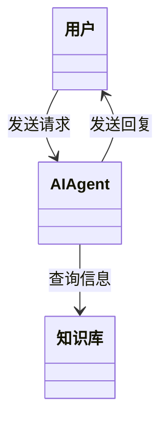
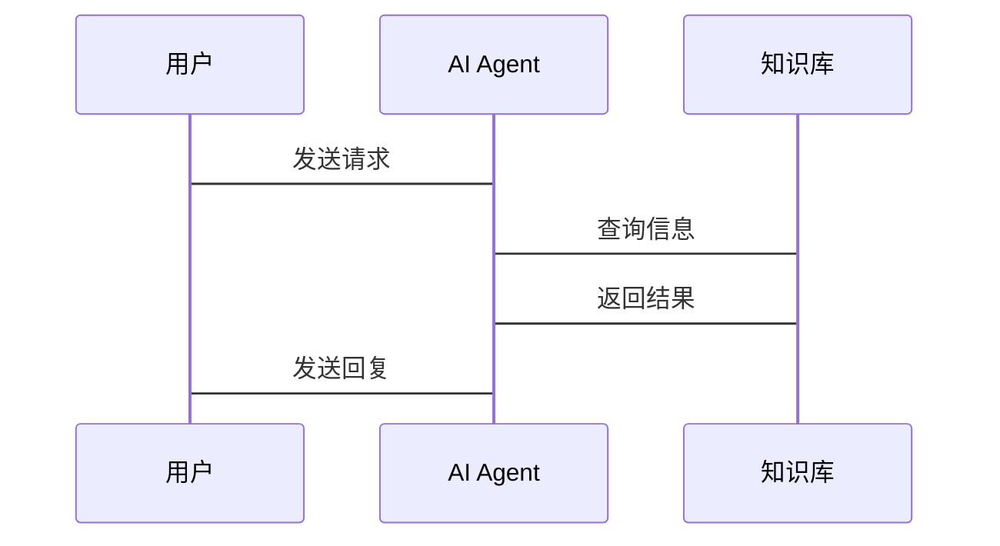

                 


# 开发具有自然语言生成能力的AI Agent

> 关键词：AI Agent，自然语言生成，深度学习，Transformer模型，生成式模型

> 摘要：本文详细探讨了开发具有自然语言生成能力的AI Agent的各个方面，从背景介绍到系统架构设计，再到项目实战，为读者提供了全面的指导。文章首先介绍了自然语言生成和AI Agent的核心概念，然后深入讲解了生成式模型的算法原理，接着分析了系统的架构设计，最后通过具体项目展示了如何实现这些技术。

---

# 第1章: 自然语言生成与AI Agent概述

## 1.1 问题背景与描述

### 1.1.1 当前自然语言处理技术的发展现状
自然语言处理（NLP）技术近年来取得了显著进展，特别是在生成任务方面。从基于规则的简单生成模型到复杂的深度学习模型，NLP技术在对话系统、文本摘要、机器翻译等领域得到了广泛应用。然而，现有的生成模型在生成自然、连贯的语言方面仍存在挑战。

### 1.1.2 AI Agent在实际应用中的需求
AI Agent（智能代理）是一种能够感知环境并采取行动以实现目标的智能系统。在实际应用中，AI Agent需要能够与人类用户进行自然的对话交互。这种交互不仅需要理解用户的意图，还需要生成自然、流畅的回复，这使得自然语言生成技术成为AI Agent开发中的关键部分。

### 1.1.3 自然语言生成在AI Agent中的重要性
自然语言生成（Natural Language Generation, NLG）是将结构化的数据转换为自然语言文本的过程。在AI Agent中，NLG技术用于将系统生成的结构化信息（如查询结果、任务分解步骤）转换为用户可理解的自然语言回复。这不仅提高了用户的使用体验，还使得AI Agent能够更好地与人类进行交互。

---

## 1.2 问题解决与边界

### 1.2.1 自然语言生成技术如何解决AI Agent的交互问题
自然语言生成技术使得AI Agent能够以自然、流畅的方式与用户进行对话。通过生成自然语言文本，AI Agent可以更好地理解用户的意图，并提供更个性化的回复。

### 1.2.2 AI Agent开发中的边界与限制
在开发AI Agent时，需要明确自然语言生成技术的边界。例如，生成的内容需要符合语法规则，避免敏感或不适当的内容生成。此外，生成的文本还需要与上下文相关，避免产生不连贯或不合理的回复。

### 1.2.3 自然语言生成能力的实现范围与外延
自然语言生成能力的实现范围包括文本生成、对话生成、文本摘要等。其外延则涉及多语言生成、情感生成、风格生成等高级功能。

---

## 1.3 核心概念与结构

### 1.3.1 自然语言生成的定义与核心要素
自然语言生成是指将结构化的数据转换为自然语言文本的过程。核心要素包括输入数据、生成模型、输出文本。

### 1.3.2 AI Agent的结构与功能模块
AI Agent的结构通常包括感知模块、推理模块和行动模块。自然语言生成功能主要在行动模块中实现，用于将推理结果转换为自然语言回复。

### 1.3.3 两者的结合与整体架构
自然语言生成与AI Agent的结合形成了一个完整的交互系统。系统的核心流程包括用户输入、意图识别、生成回复、反馈优化。

---

# 第2章: 自然语言生成原理

## 2.1 生成式模型的核心原理

### 2.1.1 基于统计的生成模型
基于统计的生成模型通过分析大量文本数据，学习语言的统计规律。例如，n-gram模型通过分析连续的单词序列，生成概率最高的下一个单词。

### 2.1.2 基于深度学习的生成模型
基于深度学习的生成模型，如循环神经网络（RNN）和变换器（Transformer），通过学习文本的上下文关系，生成更自然的语言。

### 2.1.3 现代大模型的生成机制
现代大模型，如GPT系列，通过自监督学习和大规模预训练，能够生成高质量的自然语言文本。

---

## 2.2 自然语言生成的实现步骤

### 2.2.1 数据预处理
数据预处理包括清洗数据、分词、去除停用词等。这些步骤旨在提高模型的训练效率和生成质量。

### 2.2.2 模型训练
模型训练通常采用最大似然估计（MLE）或对抗训练方法。通过训练模型，使其能够生成符合训练数据分布的文本。

### 2.2.3 模型推理
模型推理阶段，系统根据输入的上下文，生成相应的自然语言回复。推理过程通常采用贪心搜索或采样方法。

---

## 2.3 AI Agent中的自然语言生成

### 2.3.1 AI Agent的输入处理
AI Agent需要处理用户的输入，提取用户的意图和需求。这通常涉及自然语言理解（NLU）技术。

### 2.3.2 自然语言生成的输出处理
生成的回复需要进行质量评估和优化。常用的技术包括困惑度评估、BLEU分数评估等。

### 2.3.3 输出结果的优化与调整
通过用户反馈和系统优化，不断提升生成回复的质量和自然度。

---

# 第3章: AI Agent与自然语言生成的关系

## 3.1 AI Agent的核心功能

### 3.1.1 任务执行
AI Agent能够根据用户的指令执行特定任务，如设置提醒、查询信息等。

### 3.1.2 信息检索
AI Agent能够从知识库中检索信息，并以自然语言形式返回给用户。

### 3.1.3 交互对话
AI Agent能够与用户进行自然对话，提供个性化的交互体验。

---

## 3.2 自然语言生成在AI Agent中的作用

### 3.2.1 提供自然的对话体验
自然语言生成使得AI Agent的回复更加自然、流畅，增强了用户的使用体验。

### 3.2.2 支持复杂任务的描述
通过自然语言生成，AI Agent能够清晰地描述复杂任务的执行步骤，帮助用户更好地理解。

### 3.2.3 增强用户体验
自然语言生成使得AI Agent能够以更人性化的方式与用户交互，提升用户体验。

---

## 3.3 两者结合的实现机制

### 3.3.1 交互流程
AI Agent根据用户的输入生成回复，用户根据回复继续与AI Agent交互。

### 3.3.2 任务分解
AI Agent将复杂任务分解为多个简单任务，并通过自然语言生成向用户解释每个步骤。

### 3.3.3 输出生成
AI Agent根据任务分解结果，生成自然语言回复，完成与用户的交互。

---

# 第4章: 自然语言生成算法原理

## 4.1 大模型训练原理

### 4.1.1 监督学习
监督学习是通过标注数据训练模型，使其能够生成符合预期的文本。

### 4.1.2 强化学习
强化学习通过奖励机制，优化模型生成回复的质量。

### 4.1.3 对抗训练
对抗训练通过生成器和判别器的对抗，提升生成文本的质量。

---

## 4.2 生成式模型的数学模型

### 4.2.1 Transformer模型
Transformer模型由编码器和解码器组成，通过自注意力机制，生成高质量的文本。

### 4.2.2 GPT模型
GPT模型通过自监督学习，生成连贯的上下文文本。

---

## 4.3 解码器的结构

### 4.3.1 自然语言生成的解码过程
解码器根据输入的上下文，逐步生成回复文本。

### 4.3.2 解码器的优化
通过使用Beam Search或Top-k采样等方法，优化生成文本的质量。

---

## 4.4 模型优化与调优

### 4.4.1 模型优化方法
模型优化包括参数调整、损失函数优化等。

### 4.4.2 超参数调优
通过调整超参数，如学习率、批量大小等，提升模型的生成效果。

---

# 第5章: AI Agent系统架构设计

## 5.1 系统功能设计

### 5.1.1 领域模型设计
领域模型包括用户、AI Agent、知识库等核心概念。

### 5.1.2 领域模型的Mermaid类图


### 5.1.3 系统架构设计的Mermaid架构图


---

## 5.2 系统接口设计

### 5.2.1 系统接口的定义
系统接口包括用户输入接口、知识库查询接口、生成回复接口等。

### 5.2.2 系统接口的交互流程
用户通过输入接口发送请求，AI Agent通过知识库查询接口获取信息，最后通过生成回复接口返回回复。

---

## 5.3 系统交互流程的Mermaid序列图


---

# 第6章: 项目实战

## 6.1 环境配置

### 6.1.1 安装Python环境
使用Anaconda或virtualenv安装Python环境，并配置必要的依赖库，如TensorFlow、Keras、PyTorch等。

### 6.1.2 安装自然语言处理库
安装如NLTK、spaCy、Hugging Face Transformers等库，用于文本处理和模型训练。

---

## 6.2 系统核心实现源代码

### 6.2.1 数据预处理代码
```python
import numpy as np
from tensorflow.keras.preprocessing.text import Tokenizer
from tensorflow.keras.preprocessing.sequence import pad_sequences

# 数据预处理
text = "Hello, how are you?"
tokenizer = Tokenizer(num_words=1000)
tokenizer.fit_on_texts([text])
sequences = tokenizer.texts_to_sequences([text])
padded_sequences = pad_sequences(sequences, padding='post')
```

### 6.2.2 模型训练代码
```python
from tensorflow.keras.models import Model
from tensorflow.keras.layers import Input, LSTM, Dense

# 定义模型
inputs = Input(shape=(None,))
embeddings = Embedding(input_dim=1000, output_dim=64)(inputs)
lstm_layer = LSTM(64, return_sequences=True)(embeddings)
dense_layer = Dense(10, activation='softmax')(lstm_layer)
model = Model(inputs=inputs, outputs=dense_layer)
model.compile(loss='sparse_categorical_crossentropy', optimizer='adam')
model.fit(padded_sequences, np.array([0]), epochs=10)
```

---

## 6.3 代码应用解读与分析

### 6.3.1 数据预处理
数据预处理步骤包括分词、编码和填充。这些步骤确保输入数据格式统一，适合模型训练。

### 6.3.2 模型训练
模型训练采用LSTM结构，通过反向传播算法优化模型参数，使其能够生成符合预期的文本。

---

## 6.4 实际案例分析

### 6.4.1 案例分析
假设用户输入“今天天气怎么样？”，AI Agent需要生成自然语言回复，如“今天天气晴朗，温度适宜。”

### 6.4.2 模型优化
通过分析生成结果，不断优化模型参数和生成策略，提升回复的自然度和相关性。

---

## 6.5 项目小结

### 6.5.1 项目实现的关键点
关键点包括数据预处理、模型选择、生成策略优化。

### 6.5.2 项目实现的经验总结
经验总结包括数据质量的重要性、模型调优的技巧、生成结果的评估方法。

---

# 第7章: 总结与展望

## 7.1 总结

### 7.1.1 核心内容回顾
本文详细介绍了自然语言生成技术在AI Agent中的应用，从算法原理到系统架构，再到项目实战，为读者提供了全面的指导。

### 7.1.2 关键点回顾
关键点包括生成模型的选择、系统架构设计、项目实现中的优化技巧。

---

## 7.2 未来展望

### 7.2.1 自然语言生成技术的发展方向
未来，自然语言生成技术将朝着多语言生成、情感生成、风格生成等方向发展。

### 7.2.2 AI Agent的应用前景
随着技术的进步，AI Agent将在更多领域得到应用，如教育、医疗、金融等。

---

## 7.3 最佳实践 Tips

### 7.3.1 数据质量的重要性
高质量的数据是生成高质量文本的基础。

### 7.3.2 模型调优的技巧
通过调整超参数和优化算法，可以显著提升生成效果。

### 7.3.3 安全问题的注意事项
生成的内容需要避免敏感信息泄露和不适当内容的生成。

### 7.3.4 拓展阅读
推荐阅读相关领域的最新论文和技术博客，了解前沿技术和发展趋势。

---

通过以上步骤，您可以系统地开发具有自然语言生成能力的AI Agent，从理论到实践，全面掌握相关技术和方法。希望这篇文章对您有所帮助！

