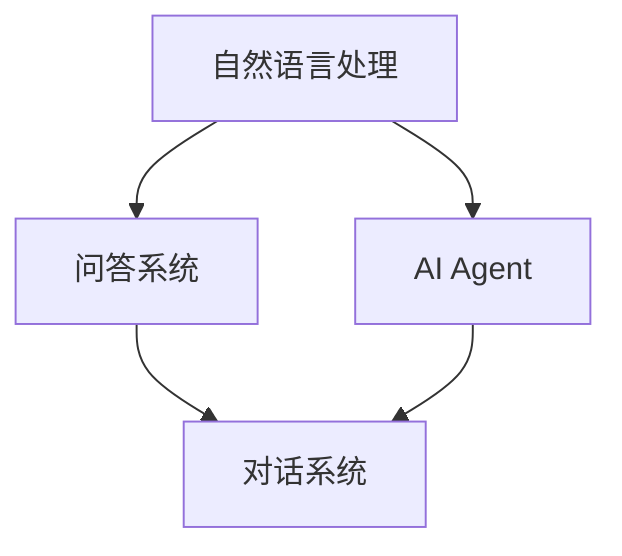
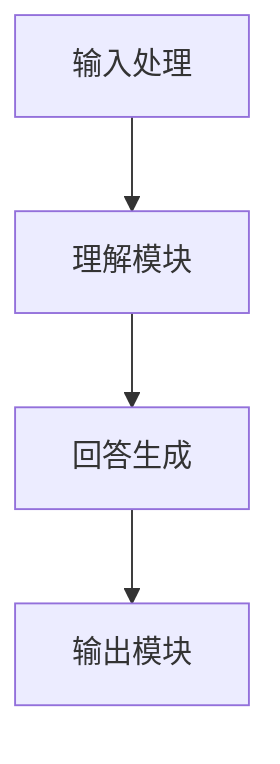
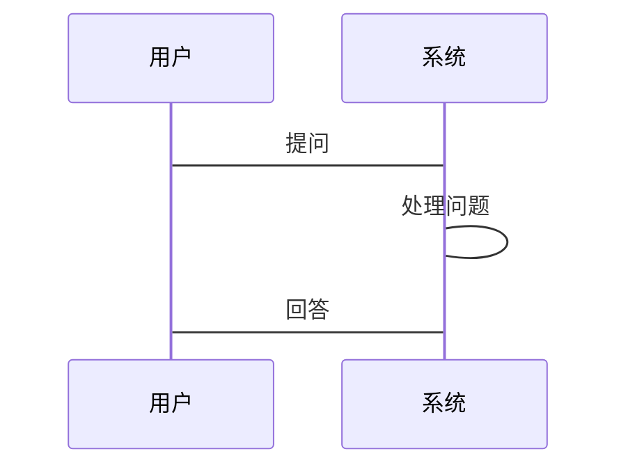

                 


# 开发具有自然语言问答能力的AI Agent

> 关键词：自然语言处理，问答系统，AI Agent，对话系统，Transformer，预训练模型

> 摘要：本文详细探讨了开发具有自然语言问答能力的AI Agent的各个方面，包括自然语言处理基础、问答系统的核心原理、对话系统的设计与实现，以及项目实战与优化。通过系统化的分析和实践，读者将能够掌握构建高效问答系统的完整流程。

---

# 第一部分: 自然语言问答与AI Agent概述

## 第1章: 自然语言问答能力的AI Agent概述

### 1.1 问题背景与描述

#### 1.1.1 当前AI Agent的发展现状
人工智能（AI）代理（Agent）正在快速发展，尤其是在自然语言处理（NLP）领域。AI Agent能够通过自然语言与人类进行交互，这使得它们在客服、教育、医疗等领域的应用越来越广泛。

#### 1.1.2 自然语言问答能力的重要性
自然语言问答（Question Answering, QA）是AI Agent的核心能力之一。通过问答系统，AI Agent能够理解用户的问题，并生成准确的回答，从而提供高效的交互体验。

#### 1.1.3 问题解决的核心目标
本文的核心目标是开发一个能够理解并回答用户问题的AI Agent，使其具备自然语言问答能力。这需要结合NLP技术、问答系统设计以及对话系统优化。

### 1.2 核心概念与边界

#### 1.2.1 自然语言处理的核心概念
自然语言处理（NLP）是AI Agent实现问答能力的基础。主要概念包括：
- **分词**：将自然语言文本分割成词语或符号。
- **词向量**：将词语表示为向量，以便计算机处理。
- **句法分析**：分析句子的语法结构。
- **语义理解**：理解文本的含义。

#### 1.2.2 AI Agent的定义与特征
AI Agent是一个智能实体，能够感知环境并执行任务。其主要特征包括：
- **自主性**：能够在没有人工干预的情况下运行。
- **反应性**：能够根据环境输入做出实时反应。
- **目标导向**：通过目标驱动行为。

#### 1.2.3 边界与外延分析
AI Agent的问答能力有限制和扩展范围。限制包括：
- 无法处理超出训练数据范围的问题。
- 对复杂问题的解答可能不够准确。
外延则包括：
- 集成其他AI技术（如计算机视觉）。
- 应用场景的扩展（如多语言支持）。

### 1.3 核心要素与概念结构

#### 1.3.1 关键要素对比分析
| 要素 | 描述 | 示例 |
|------|------|------|
| 语言模型 | 用于生成文本的模型 | GPT-3 |
| 问答系统 | 用于回答问题的系统 | IBM Watson |
| 对话系统 | 用于连续对话的系统 | 苏菲（Sofia） |

#### 1.3.2 概念结构图


### 1.4 本章小结
本章介绍了AI Agent的自然语言问答能力的重要性，分析了其核心概念和边界，并通过对比分析和概念结构图，明确了开发AI Agent的关键要素。

---

## 第2章: 自然语言处理基础

### 2.1 语言模型与预训练技术

#### 2.1.1 语言模型的定义与作用
语言模型（LM）用于预测文本序列的概率分布。其作用包括：
- **文本生成**：生成连贯的文本。
- **文本理解**：帮助理解上下文。

#### 2.1.2 预训练技术的核心原理
预训练技术（如BERT、GPT）通过在大规模数据上进行无监督学习，提取语言特征。其核心原理包括：
- **自监督学习**：通过预测任务学习语言表示。
- **上下文理解**：捕捉文本中的上下文信息。

#### 2.1.3 常见预训练模型对比
| 模型 | 架构 | 主要特点 |
|------|------|----------|
| BERT | 基于Transformer | 前向预测 |
| GPT  | 基于Transformer | 后向预测 |

### 2.2 分词与词向量表示

#### 2.2.1 分词的基本原理
分词是将文本分割成有意义的词汇。例如，将“自然语言处理”分割成“自然”、“语言”、“处理”。

#### 2.2.2 词向量的表示方法
词向量（Word Embedding）是将词语表示为低维向量的技术。常用方法包括：
- **One-Hot编码**：将每个词语表示为稀疏向量。
- **Word2Vec**：通过上下文预测单词，生成密集向量。
- **BERT**：通过预训练生成词向量。

#### 2.2.3 常见词向量模型对比
| 模型 | 输入 | 输出 |
|------|------|------|
| Word2Vec | 单词 | 向量 |
| BERT | 分句 | 向量 |

### 2.3 注意力机制与Transformer模型

#### 2.3.1 注意力机制的原理
注意力机制（Attention）用于捕捉文本中词语之间的关系。其原理包括：
- **查询（Query）**：表示输入的序列。
- **键（Key）**：用于匹配查询的关键词。
- **值（Value）**：根据键的结果进行加权。

#### 2.3.2 Transformer模型的结构
Transformer模型由编码器和解码器组成。编码器负责将输入文本转换为向量，解码器负责生成输出序列。

#### 2.3.3 Transformer在问答系统中的应用
Transformer广泛应用于问答系统，特别是在生成回答时。例如，BERT和GPT都基于Transformer架构。

### 2.4 本章小结
本章详细介绍了自然语言处理的基础，包括语言模型、分词、词向量表示以及注意力机制。这些技术为问答系统的实现提供了基础支持。

---

## 第3章: 问答系统的核心原理

### 3.1 基于检索的问答系统

#### 3.1.1 检索模型的原理
基于检索的问答系统通过匹配用户问题与预存的答案生成回答。其原理包括：
- **问题表示**：将用户问题转换为向量表示。
- **相似度计算**：通过余弦相似度等方法匹配最相关的答案。

#### 3.1.2 基于向量的相似度计算
余弦相似度公式：
$$ \text{similarity}(A, B) = \frac{A \cdot B}{\|A\| \|B\|} $$
其中，$A$ 和 $B$ 分别是两个向量。

#### 3.1.3 检索模型的优缺点
优点：
- 实现简单，计算效率高。
缺点：
- 依赖于训练数据，可能出现“答案漂移”问题。

### 3.2 基于生成的问答系统

#### 3.2.1 基于生成模型的问答系统原理
生成模型通过生成回答来回答问题。其原理包括：
- **编码器**：将问题转换为向量表示。
- **解码器**：根据向量生成回答。

#### 3.2.2 Transformer在生成任务中的应用
Transformer的解码器用于生成回答，例如在GPT模型中，解码器生成连续的文本序列。

#### 3.2.3 生成模型的优缺点
优点：
- 可生成多样化的回答。
缺点：
- 训练难度大，计算资源消耗高。

### 3.3 混合型问答系统

#### 3.3.1 混合型系统的定义
混合型系统结合检索和生成两种方法，根据具体情况选择最合适的回答生成方式。

#### 3.3.2 混合型系统的优势
- 可以根据问题类型选择最佳的生成方式。
- 提高回答的准确性和多样性。

#### 3.3.3 混合型系统的实现挑战
- 系统切换逻辑复杂。
- 需要平衡两种方法的优缺点。

### 3.4 本章小结
本章详细介绍了问答系统的三种主要实现方式：基于检索、生成和混合型系统，并分析了各自的优缺点及应用场景。

---

## 第4章: 对话系统的设计与实现

### 4.1 对话系统的整体架构

#### 4.1.1 对话系统的组成
对话系统由以下几个部分组成：
- **输入处理**：接收用户的输入。
- **理解模块**：理解用户的问题。
- **回答生成**：生成回答。
- **输出模块**：将回答输出给用户。

#### 4.1.2 对话系统的流程
1. 用户输入问题。
2. 系统理解问题。
3. 系统生成回答。
4. 系统输出回答。

### 4.2 对话系统的设计

#### 4.2.1 系统功能设计
| 功能模块 | 描述 |
|----------|------|
| 输入处理 | 接收用户输入 |
| 理解模块 | 分析用户意图 |
| 回答生成 | 生成回答 |
| 输出模块 | 输出回答 |

#### 4.2.2 系统架构设计


#### 4.2.3 系统接口设计
- **输入接口**：接收用户输入的文本。
- **输出接口**：输出回答的文本。

#### 4.2.4 系统交互


### 4.3 对话系统的实现

#### 4.3.1 代码实现
```python
def process_input(question):
    # 输入处理
    pass

def generate_response(question):
    # 回答生成
    pass

def main():
    while True:
        question = input("请输入问题：")
        process_input(question)
        response = generate_response(question)
        print(response)

if __name__ == "__main__":
    main()
```

#### 4.3.2 代码解读
- **process_input**：接收用户输入的问题。
- **generate_response**：根据问题生成回答。
- **main**：主函数，实现对话流程。

### 4.4 本章小结
本章详细介绍了对话系统的设计与实现，包括系统架构、功能模块以及代码实现。

---

## 第5章: 问答系统的优化与部署

### 5.1 模型优化

#### 5.1.1 模型调优
- **超参数优化**：调整学习率、批次大小等参数。
- **模型剪枝**：减少模型的复杂度，降低计算成本。

#### 5.1.2 模型压缩
- **知识蒸馏**：将大模型的知识迁移到小模型。
- **量化**：将模型参数量化，减少存储空间。

### 5.2 系统部署

#### 5.2.1 系统集成
- **API接口**：将问答系统集成到其他系统中。
- **前端界面**：设计用户友好的界面。

#### 5.2.2 部署方案
1. **服务器部署**：在服务器上部署问答系统。
2. **容器化**：使用Docker容器化部署，便于扩展和维护。

### 5.3 系统监控与维护

#### 5.3.1 性能监控
- **响应时间**：监控系统响应时间。
- **错误率**：监控系统的错误率。

#### 5.3.2 日志管理
- **日志收集**：收集系统日志，便于排查问题。
- **日志分析**：分析日志，优化系统性能。

### 5.4 本章小结
本章介绍了问答系统的优化与部署，包括模型优化、系统集成、部署方案以及系统监控。

---

## 第6章: 项目实战与案例分析

### 6.1 项目实战

#### 6.1.1 环境安装
- **Python**：安装Python 3.8以上版本。
- **库依赖**：安装TensorFlow、Keras等库。

#### 6.1.2 核心代码实现
```python
import tensorflow as tf
from tensorflow.keras import layers

model = tf.keras.Sequential()
model.add(layers.Embedding(input_dim=10000, output_dim=16))
model.add(layers.LSTM(64))
model.add(layers.Dense(1, activation='sigmoid'))
model.compile(loss='binary_crossentropy', optimizer='adam', metrics=['accuracy'])
```

#### 6.1.3 代码解读
- **Embedding层**：将输入的词向量转换为嵌入向量。
- **LSTM层**：用于处理序列数据。
- **Dense层**：输出层，使用sigmoid激活函数。

### 6.2 案例分析

#### 6.2.1 实际案例
- **客服问答系统**：用于处理客户咨询。
- **教育问答系统**：用于解答学生问题。

#### 6.2.2 案例分析
以客服问答系统为例，系统能够理解用户的问题，并生成相应的回答，提升客户满意度。

### 6.3 本章小结
本章通过项目实战和案例分析，展示了问答系统在实际应用中的具体实现和效果。

---

## 第7章: 总结与展望

### 7.1 本章总结
本文详细探讨了开发具有自然语言问答能力的AI Agent的各个方面，包括自然语言处理基础、问答系统的核心原理、对话系统的设计与实现，以及项目实战与优化。

### 7.2 未来展望
随着AI技术的不断发展，问答系统将更加智能化和多样化。未来的挑战包括：
- **多语言支持**：支持多种语言的问答系统。
- **实时性**：提高系统的实时响应能力。
- **可解释性**：提升系统的可解释性，让用户更容易理解AI的回答。

### 7.3 最佳实践Tips
- **数据质量**：确保训练数据的质量，避免偏差。
- **模型优化**：定期优化模型，提升性能。
- **用户反馈**：收集用户反馈，不断改进系统。

### 7.4 本章小结
本章总结了全文，并展望了未来的发展方向，同时提供了最佳实践的建议。

---

# 结语
通过本文的详细讲解，读者将能够掌握开发具有自然语言问答能力的AI Agent的完整流程，从理论到实践，逐步实现一个高效的问答系统。

