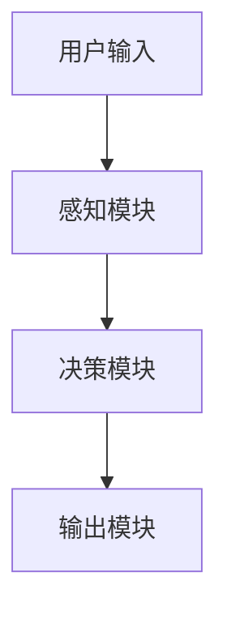
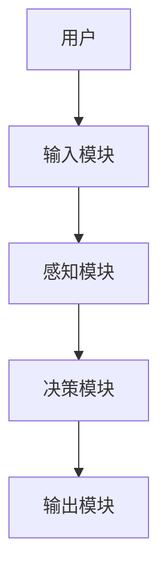

                 


# 开发具有虚拟现实交互能力的AI Agent

> 关键词：AI Agent，虚拟现实交互，人工智能，增强现实，机器学习，计算机视觉，人机交互

> 摘要：本文深入探讨了开发具有虚拟现实交互能力的AI Agent的技术细节。从AI Agent的基本原理到虚拟现实交互的核心机制，再到算法实现和系统设计，结合实际案例分析，为开发者提供从理论到实践的全面指导。通过本文，读者将能够理解并掌握如何构建一个能够与人类通过虚拟现实界面进行高效交互的智能代理系统。

---

## 第一部分：引言

### 1.1 AI Agent与虚拟现实交互概述

#### 1.1.1 AI Agent的基本概念
AI Agent（人工智能代理）是一种能够感知环境、自主决策并执行任务的智能实体。它可以分为简单反射型、基于模型的反应型、目标驱动型和效用驱动型四种类型。AI Agent的核心能力包括感知、决策和执行。

- **感知**：通过传感器或数据输入获取环境信息。
- **决策**：基于感知信息，通过算法做出选择。
- **执行**：通过执行机构或输出接口完成任务。

AI Agent广泛应用于自动驾驶、智能助手、机器人等领域。

#### 1.1.2 虚拟现实交互的基本概念
虚拟现实（VR）通过计算机生成的三维环境，提供沉浸式的体验。用户通过头显设备、手柄等输入设备与虚拟环境互动。VR交互的关键在于实现自然的人机交互，使用户能够以更直观的方式与虚拟世界中的元素互动。

#### 1.1.3 AI Agent与虚拟现实交互的结合意义
将AI Agent与虚拟现实交互结合，能够实现更智能化和个性化的用户体验。例如，在虚拟现实培训系统中，AI Agent可以作为虚拟教练，实时指导用户的操作；在虚拟现实游戏 中，AI Agent可以作为智能NPC（非玩家角色），提供动态交互体验。

### 1.2 问题背景与目标

#### 1.2.1 当前AI Agent的发展现状
AI Agent技术发展迅速，但在虚拟现实交互领域仍面临挑战。现有的AI Agent大多依赖于传统的图形用户界面（GUI），难以充分发挥虚拟现实环境的优势。

#### 1.2.2 虚拟现实交互在AI Agent中的应用需求
随着VR技术的普及，用户对更自然、更直观的交互方式的需求日益增长。传统的键盘鼠标输入方式在虚拟现实环境中显得笨拙，亟需通过AI Agent实现更高效的交互。

#### 1.2.3 本书的目标与范围
本书旨在系统地介绍开发具有虚拟现实交互能力的AI Agent的技术细节，涵盖从基础概念到算法实现，再到系统设计和项目实战的完整流程。目标读者包括AI开发人员、虚拟现实开发人员以及对人机交互感兴趣的读者。

---

## 第二部分：AI Agent与虚拟现实交互的核心概念

### 2.1 AI Agent的基本原理

#### 2.1.1 AI Agent的定义与分类
AI Agent是一种智能实体，能够感知环境、自主决策并执行任务。根据智能水平，AI Agent可以分为：

- **反应式AI Agent**：基于当前感知做出反应，不依赖于环境模型。
- **基于模型的AI Agent**：利用环境模型进行预测和规划。
- **目标驱动型AI Agent**：根据目标选择最优行动。
- **效用驱动型AI Agent**：通过最大化效用函数做出决策。

#### 2.1.2 AI Agent的核心能力：感知、决策、执行
- **感知**：AI Agent通过传感器或数据接口获取环境信息，例如计算机视觉、语音识别等技术。
- **决策**：基于感知信息，AI Agent利用算法（如强化学习、决策树等）做出选择。
- **执行**：AI Agent通过执行机构或输出接口（如VR手柄、语音合成等）完成任务。

#### 2.1.3 AI Agent的交互方式
AI Agent可以通过多种方式与用户交互，包括文本、语音、图形界面等。在虚拟现实环境中，AI Agent的交互方式更加丰富，例如通过手势、眼神追踪等方式实现自然交互。

### 2.2 虚拟现实交互的基本原理

#### 2.2.1 虚拟现实技术的定义与特点
虚拟现实（VR）是一种通过计算机生成的三维环境，用户通过VR设备（如头显、手柄）与虚拟环境互动。VR的特点包括沉浸性、交互性和构想性。

#### 2.2.2 虚拟现实中的交互方式
- **手柄交互**：用户通过手柄按钮或手势控制虚拟物体。
- **眼球追踪**：通过眼球运动实现选择或导航。
- **语音交互**：通过语音指令与虚拟环境互动。
- **全身动捕**：通过全身动作捕捉实现更自然的交互。

#### 2.2.3 虚拟现实中的用户行为分析
在虚拟现实中，用户的交互行为可以通过以下方式建模：
1. **用户输入**：手柄按钮点击、手势动作等。
2. **用户注意力**：通过眼球追踪或头部姿态判断用户关注的区域。
3. **用户意图**：基于用户行为推测用户的意图，例如用户可能想抓取某个物体。

### 2.3 AI Agent与虚拟现实交互的结合

#### 2.3.1 AI Agent在虚拟现实中的角色
AI Agent可以在虚拟现实中扮演多种角色，例如：
- **虚拟助手**：帮助用户完成任务，例如指导操作步骤。
- **虚拟教练**：提供实时反馈和指导。
- **虚拟角色**：作为游戏中的智能NPC，与用户互动。

#### 2.3.2 虚拟现实中的AI Agent交互流程
1. **用户输入**：用户通过VR设备发送交互信号。
2. **感知与理解**：AI Agent通过计算机视觉、语音识别等技术感知用户意图。
3. **决策与反馈**：AI Agent基于感知信息做出决策，并通过自然语言处理生成反馈。
4. **执行与输出**：AI Agent通过VR设备输出交互结果，例如通过语音合成或图形变化反馈用户的操作结果。

---

## 第三部分：AI Agent与虚拟现实交互的算法原理

### 3.1 强化学习在AI Agent中的应用

#### 3.1.1 强化学习的基本原理
强化学习是一种通过试错方式学习策略的算法。AI Agent通过与环境交互，学习如何采取最优行动以最大化累积奖励。

#### 3.1.2 强化学习在虚拟现实交互中的应用
在虚拟现实中，强化学习可以用于训练AI Agent的交互策略，例如训练AI Agent在虚拟环境中进行路径规划或与用户进行对话。

#### 3.1.3 强化学习的数学模型
强化学习的核心在于Q-learning算法，其数学模型如下：

$$ Q(s, a) = r + \gamma \max_{a'} Q(s', a') $$

其中，$s$表示当前状态，$a$表示当前动作，$r$表示奖励，$\gamma$表示折扣因子。

#### 3.1.4 强化学习的实现步骤
1. 初始化Q表。
2. 与环境交互，获取状态$s$。
3. 根据策略选择动作$a$。
4. 执行动作，观察新的状态$s'$和奖励$r$。
5. 更新Q表：$$ Q(s, a) = Q(s, a) + \alpha (r + \gamma Q(s', a') - Q(s, a)) $$

### 3.2 计算机视觉在虚拟现实交互中的应用

#### 3.2.1 计算机视觉的基本原理
计算机视觉通过图像处理和深度学习技术，使计算机能够理解图像或视频内容。

#### 3.2.2 计算机视觉在虚拟现实中的应用
在虚拟现实中，计算机视觉可以用于手势识别、面部表情识别、物体识别等任务。

#### 3.2.3 计算机视觉的实现步骤
1. 图像采集：获取用户的手势或面部图像。
2. 图像处理：进行降噪、边缘检测等预处理。
3. 特征提取：提取关键特征，例如手部关键点。
4. 模型训练：使用深度学习模型（如卷积神经网络）进行分类或回归。

---

## 第四部分：AI Agent与虚拟现实交互的系统设计

### 4.1 系统功能设计

#### 4.1.1 功能模块划分
AI Agent与虚拟现实交互系统可以划分为以下功能模块：
- **用户输入模块**：接收用户的交互指令。
- **感知模块**：通过计算机视觉、语音识别等技术感知用户意图。
- **决策模块**：基于感知信息做出决策。
- **输出模块**：通过VR设备输出交互结果。

#### 4.1.2 功能流程图


### 4.2 系统架构设计

#### 4.2.1 架构风格选择
AI Agent与虚拟现实交互系统可以采用微服务架构，各个功能模块独立开发和部署。

#### 4.2.2 系统架构图


#### 4.2.3 接口设计
系统需要定义清晰的接口规范，例如：
- 输入接口：接收用户的交互指令。
- 输出接口：发送交互结果到VR设备。

#### 4.2.4 交互设计
在虚拟现实中，AI Agent需要设计自然的交互方式，例如：
- 手势交互：用户通过手势选择选项。
- 语音交互：用户通过语音指令与AI Agent互动。

---

## 第五部分：项目实战

### 5.1 环境安装

#### 5.1.1 开发环境选择
建议使用以下开发环境：
- **操作系统**：Windows 10 或更高版本。
- **开发工具**：PyCharm 或 Visual Studio。
- **VR设备**：Oculus Rift 或 PlayStation VR。
- **开发框架**：Python 的 OpenCV、TensorFlow 框架，以及VR开发框架如Unity。

#### 5.1.2 依赖安装
安装必要的Python库：
```bash
pip install numpy
pip install tensorflow
pip install opencv-python
```

### 5.2 核心代码实现

#### 5.2.1 感知模块实现
使用OpenCV实现手势识别：
```python
import cv2

# 初始化摄像头
cap = cv2.VideoCapture(0)

while True:
    ret, frame = cap.read()
    cv2.imshow('Gesture Recognition', frame)
    if cv2.waitKey(1) & 0xFF == ord('q'):
        break

cap.release()
cv2.destroyAllWindows()
```

#### 5.2.2 决策模块实现
使用强化学习算法实现决策：
```python
import numpy as np

# 初始化Q表
Q = np.zeros((10, 10), dtype=np.float32)

# 训练过程
for _ in range(100):
    state = np.random.randint(0, 10)
    action = np.random.randint(0, 10)
    next_state = np.random.randint(0, 10)
    reward = np.random.randn() * 0.1
    Q[state, action] += 0.1 * (reward + 0.99 * np.max(Q[next_state, :]) - Q[state, action])

print(Q)
```

#### 5.2.3 输出模块实现
使用Python的语音合成库实现反馈：
```python
import pyttsx3

engine = pyttsx3.init()
engine.say("任务完成！")
engine.runAndWait()
```

### 5.3 案例分析

#### 5.3.1 项目实现细节
在虚拟现实中实现一个简单的手势识别应用：
1. 用户通过手势选择选项。
2. AI Agent通过强化学习算法做出决策。
3. AI Agent通过语音合成模块反馈结果。

#### 5.3.2 项目小结
通过本项目，读者可以掌握AI Agent与虚拟现实交互的基本实现方法，包括感知、决策和执行的完整流程。

---

## 第六部分：高级应用与未来展望

### 6.1 高级应用

#### 6.1.1 多模态交互
结合多种交互方式（如手势、语音、面部表情）实现更自然的交互。

#### 6.1.2 边缘计算与AI Agent
在边缘计算环境下，AI Agent可以实现更低延迟、更高效的交互。

### 6.2 未来展望

#### 6.2.1 技术趋势
随着AI和VR技术的不断发展，AI Agent在虚拟现实中的应用将更加广泛，例如在教育、医疗、娱乐等领域的深度应用。

#### 6.2.2 挑战与机遇
- **挑战**：AI Agent的实时性、交互的自然性等问题仍需解决。
- **机遇**：随着5G、边缘计算等技术的发展，AI Agent在虚拟现实中的应用将更加高效和智能化。

---

## 第七部分：最佳实践与小结

### 7.1 小结
通过本文，读者可以系统地了解开发具有虚拟现实交互能力的AI Agent的技术细节，包括核心概念、算法实现、系统设计和项目实战等内容。

### 7.2 最佳实践 tips
- 在开发过程中，建议从简单场景入手，逐步增加复杂度。
- 注意实时性优化，确保交互的流畅性。
- 积极探索新技术，如多模态交互、边缘计算等。

### 7.3 注意事项
- 在选择开发框架时，要考虑性能和易用性。
- 在设计交互方式时，要充分考虑用户体验。

### 7.4 拓展阅读
建议读者进一步阅读以下内容：
- 强化学习的经典论文。
- 计算机视觉领域的最新研究成果。
- 虚拟现实交互设计的最佳实践。

---

通过本文的学习，读者将能够系统地掌握开发具有虚拟现实交互能力的AI Agent的技术细节，并能够在实际项目中应用这些知识。希望本文能为AI与虚拟现实交互领域的发展提供有价值的参考。

