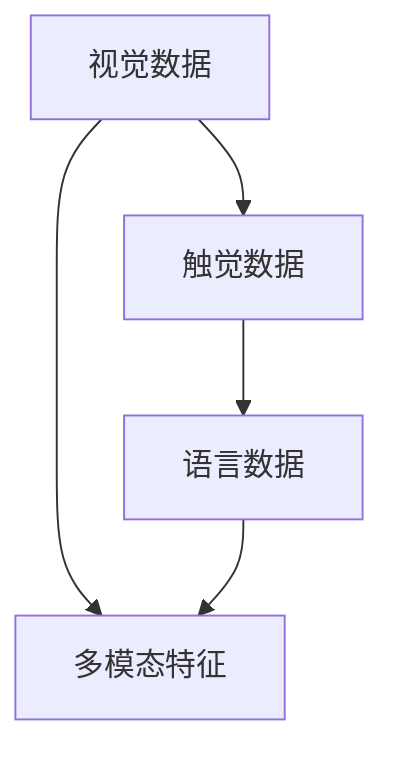
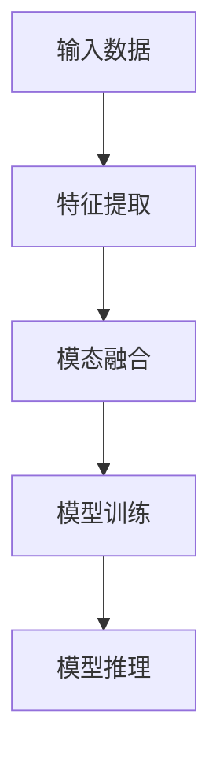
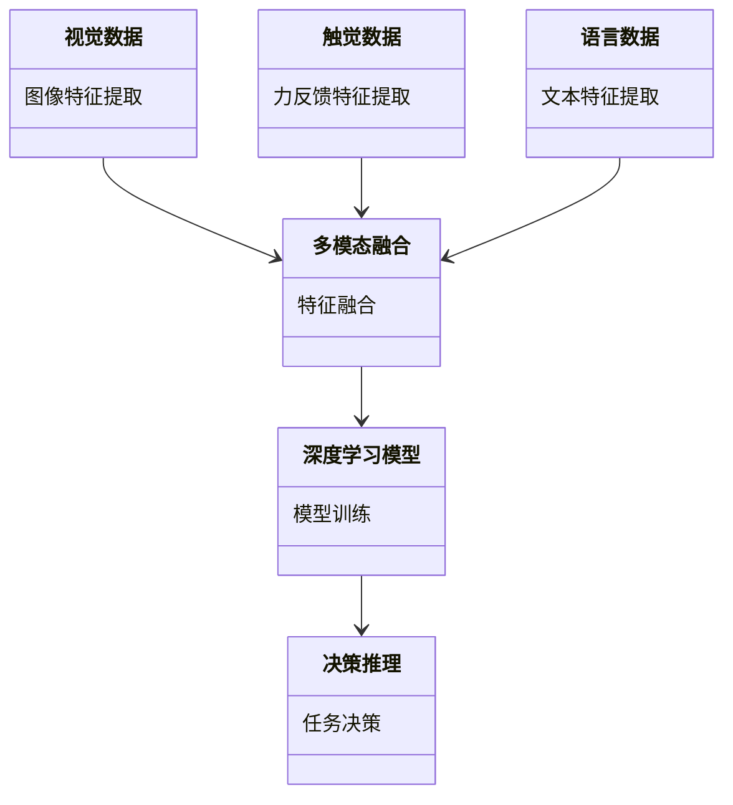
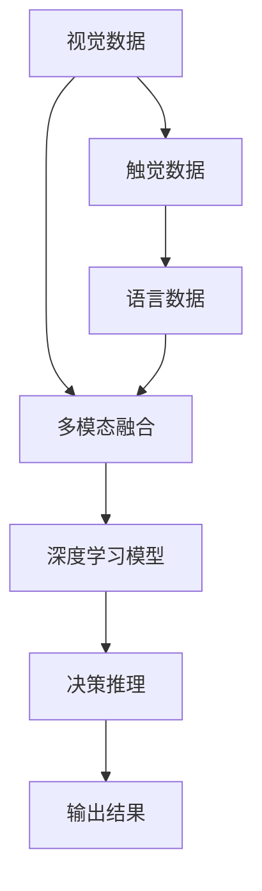
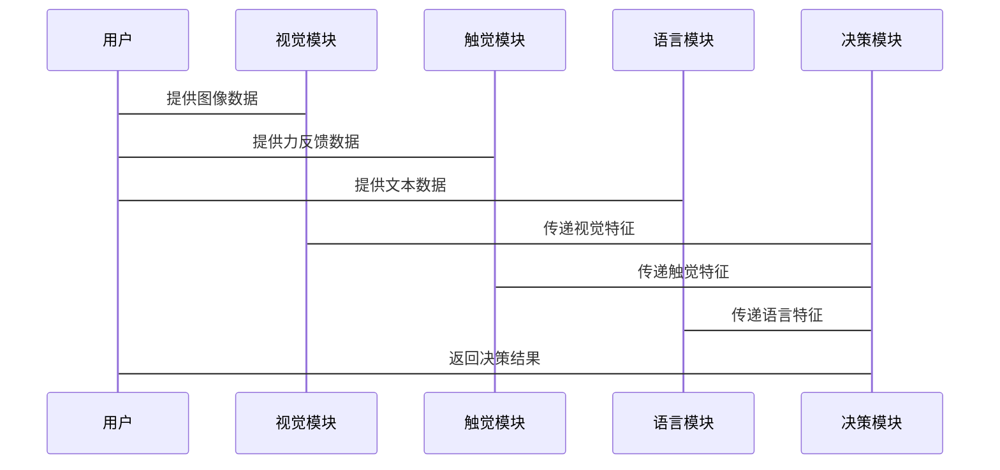

                 


# 开发具有视觉-触觉-语言多模态学习能力的AI Agent

## 关键词：视觉、触觉、语言、多模态、AI Agent、深度学习、端到端学习

## 摘要：  
本文探讨了开发具有视觉、触觉和语言三重模态学习能力的AI Agent的核心技术与方法。通过分析多模态数据的整合、融合与学习机制，结合实际应用场景，提出了基于多模态Transformer的模型架构，并详细阐述了系统的架构设计、实现步骤与实际案例。文章还总结了开发过程中需要注意的关键点与未来发展方向，为读者提供了全面的技术指导。

---

## 第一章: 多模态学习与AI Agent背景介绍

### 1.1 多模态学习的背景与意义  
多模态学习是人工智能领域的重要研究方向，旨在通过整合多种感官数据（如视觉、触觉、语言）来提升AI Agent的理解与决策能力。传统的单一模态学习在处理复杂任务时存在局限性，例如仅依赖视觉信息的AI Agent难以处理需要触觉或语言反馈的任务。通过结合多模态数据，AI Agent能够更好地理解环境、做出更准确的判断。

#### 1.1.1 多模态学习的定义与特点  
多模态学习是指同时利用多种类型的数据（如图像、文本、语音等）来提升模型的学习能力。其核心特点包括：  
1. **信息互补性**：不同模态的数据能够提供互补的信息，帮助模型更全面地理解任务。  
2. **任务相关性**：多模态数据通常与任务目标高度相关，能够提高模型的性能。  
3. **复杂性与挑战性**：整合多种模态数据需要解决数据异构性、特征对齐等问题，增加了开发的复杂性。

#### 1.1.2 多模态学习在AI Agent中的作用  
AI Agent需要与真实世界的交互，单一模态的学习难以应对复杂场景的需求。例如：  
- 视觉数据可以帮助AI Agent识别物体的位置与形状。  
- 触觉数据可以提供物体的材质、重量等物理属性。  
- 语言数据可以实现人与AI Agent之间的自然交互。  
通过整合这三种模态的数据，AI Agent能够更好地理解环境、完成复杂的任务。

#### 1.1.3 多模态学习的必要性与优势  
多模态学习的必要性体现在以下几个方面：  
1. **提升任务性能**：通过整合多种模态数据，AI Agent可以更准确地理解输入信息，从而提高任务的完成质量。  
2. **增强鲁棒性**：单一模态数据可能在某些情况下无法提供足够的信息，而多模态数据能够弥补这一不足。  
3. **扩展应用场景**：多模态学习使得AI Agent能够应用于更广泛、更复杂的场景。

---

### 1.2 多模态AI Agent的定义与特点  
多模态AI Agent是指能够同时处理多种模态数据（如视觉、触觉、语言）的智能体。其特点包括：  
1. **多感官输入**：能够接收并处理多种类型的数据输入。  
2. **跨模态理解**：能够理解不同模态数据之间的关系，并进行跨模态推理。  
3. **端到端学习**：通过端到端的深度学习模型，实现从多模态输入到目标输出的直接映射。  

#### 1.2.1 多模态AI Agent的定义  
多模态AI Agent是一种能够同时利用视觉、触觉和语言等多种模态数据的智能体，其核心目标是通过整合这些数据来实现更强大的感知、理解和决策能力。

#### 1.2.2 多模态AI Agent的核心要素  
多模态AI Agent的核心要素包括：  
1. **多模态数据采集**：通过传感器、摄像头等设备采集多种模态的数据。  
2. **数据融合与对齐**：将不同模态的数据进行融合，并确保数据的时间对齐与空间对齐。  
3. **跨模态学习模型**：通过深度学习模型实现跨模态的理解与推理。  
4. **任务驱动的决策**：基于多模态数据的综合理解，做出任务相关的决策。

#### 1.2.3 多模态AI Agent与传统AI Agent的区别  
与传统AI Agent相比，多模态AI Agent在以下几个方面存在显著差异：  
- **输入数据的多样性**：传统AI Agent通常仅依赖单一模态的数据，而多模态AI Agent能够处理多种模态的数据。  
- **跨模态理解能力**：多模态AI Agent具备理解不同模态数据之间关系的能力，而传统AI Agent则不具备这种能力。  
- **任务灵活性**：多模态AI Agent能够适应更广泛的任务场景，而传统AI Agent在单一任务场景下表现更佳。

---

### 1.3 多模态学习的现状与挑战  
尽管多模态学习在理论和应用上都取得了显著进展，但仍面临诸多挑战。  

#### 1.3.1 当前多模态学习的研究热点  
当前，多模态学习的研究热点包括：  
1. **跨模态检索**：如何在不同模态之间建立有效的映射关系。  
2. **多模态生成模型**：如何利用多模态数据生成高质量的内容（如图像、文本）。  
3. **端到端多模态学习**：如何通过端到端的深度学习模型实现多模态数据的高效处理。  

#### 1.3.2 多模态学习的主要挑战  
多模态学习的主要挑战包括：  
1. **数据异构性**：不同模态的数据具有不同的特征空间，难以直接进行融合。  
2. **特征对齐问题**：如何在不同模态之间对齐特征，以实现有效的跨模态理解。  
3. **计算复杂性**：多模态数据的处理通常需要大量的计算资源。  
4. **模型解释性**：多模态模型的决策过程往往缺乏透明性，难以解释。  

#### 1.3.3 多模态学习的未来发展方向  
未来，多模态学习的发展方向可能包括：  
1. **更高效的模型架构**：设计更高效的模型架构，以降低计算复杂性。  
2. **跨模态对齐技术**：研究更有效的跨模态对齐方法，以提高模型的性能。  
3. **多模态生成模型**：探索如何利用多模态数据生成高质量的内容。  
4. **模型解释性**：研究如何提高模型的可解释性，以便更好地理解和应用多模态模型。

---

## 第二章: 多模态学习的核心概念与联系  

### 2.1 多模态数据的整合与融合  
多模态数据的整合与融合是多模态学习的核心任务之一。  

#### 2.1.1 视觉、触觉、语言三者的特征对比  
- **视觉数据**：图像、视频等，提供物体的外观信息。  
- **触觉数据**：力反馈、材质、温度等，提供物体的物理属性。  
- **语言数据**：文本、语音等，提供语义信息。  

#### 2.1.2 多模态数据的整合方式  
多模态数据的整合方式可以分为以下几种：  
1. **特征级融合**：在特征提取阶段，将不同模态的特征进行融合。  
2. **决策级融合**：在决策阶段，将不同模态的输出结果进行融合。  
3. **混合式融合**：结合特征级与决策级的融合方法。  

#### 2.1.3 多模态数据融合的优缺点分析  
- **优点**：能够充分利用不同模态数据的互补性，提高模型的性能。  
- **缺点**：需要解决数据异构性、特征对齐等问题，增加了开发的复杂性。  

#### 2.1.4 多模态数据融合的ER实体关系图  


---

### 2.2 多模态学习的数学模型与公式  
多模态学习的数学模型通常涉及多种模态数据的表示与融合。  

#### 2.2.1 多模态数据的表示方法  
- **视觉数据**：可以表示为高维向量或图像张量。  
- **触觉数据**：可以表示为力反馈向量或物理属性向量。  
- **语言数据**：可以表示为词向量、句向量或文本张量。  

#### 2.2.2 多模态学习的数学模型  
多模态学习的数学模型可以表示为：  
$$ z = f(x_v, x_t, x_l) $$  
其中，$x_v$ 表示视觉数据，$x_t$ 表示触觉数据，$x_l$ 表示语言数据，$f$ 是融合函数，$z$ 是输出结果。  

#### 2.2.3 多模态学习的公式推导  
以多模态Transformer模型为例，其注意力机制可以表示为：  
$$ \text{Attention}(Q, K, V) = \text{softmax}\left(\frac{QK^T}{\sqrt{d_k}}\right)V $$  
其中，$Q$、$K$、$V$ 分别表示查询、键、值矩阵，$d_k$ 是键的维度。  

---

### 2.3 多模态学习的核心概念与联系  
多模态学习的核心概念包括：  
1. **模态对齐**：确保不同模态的数据在空间或时间上对齐。  
2. **模态权重**：根据任务需求，赋予不同模态数据不同的权重。  
3. **模态交互**：研究不同模态数据之间的相互作用。  

---

## 第三章: 多模态AI Agent的算法原理  

### 3.1 多模态Transformer模型  
多模态Transformer模型是一种常用的多模态学习算法，其核心思想是通过自注意力机制实现跨模态的特征交互。  

#### 3.1.1 多模态Transformer的结构  
多模态Transformer的结构通常包括编码器和解码器两部分。编码器负责将多模态输入数据转换为隐层表示，解码器负责将隐层表示解码为目标输出。  

#### 3.1.2 多模态Transformer的训练过程  
1. **输入数据预处理**：对视觉、触觉和语言数据进行预处理，提取特征。  
2. **特征融合**：将不同模态的特征进行融合，生成多模态的表示。  
3. **模型训练**：通过反向传播算法训练模型，优化损失函数。  
4. **模型推理**：将新的输入数据输入模型，生成目标输出。  

#### 3.1.3 多模态Transformer的优缺点  
- **优点**：能够有效捕捉不同模态数据之间的关系，具有较强的泛化能力。  
- **缺点**：计算复杂性较高，需要大量的计算资源。  

#### 3.1.4 多模态Transformer的Mermaid流程图  


---

### 3.2 多模态学习的算法流程  
多模态学习的算法流程可以分为以下几个步骤：  
1. **数据采集**：通过传感器、摄像头等设备采集多模态数据。  
2. **数据预处理**：对数据进行清洗、归一化等预处理操作。  
3. **特征提取**：提取每种模态的特征，例如视觉特征、触觉特征、语言特征。  
4. **模态融合**：将不同模态的特征进行融合，生成多模态的表示。  
5. **模型训练**：通过深度学习模型对融合后的数据进行训练，优化模型参数。  
6. **模型推理**：将新的输入数据输入模型，生成目标输出。  

---

### 3.3 多模态学习的数学模型  
多模态学习的数学模型通常涉及以下内容：  
- **输入数据的表示**：视觉、触觉和语言数据的表示方法。  
- **融合函数的设计**：如何将不同模态的数据进行融合。  
- **损失函数的定义**：如何衡量模型输出与真实值之间的差距。  

---

## 第四章: 多模态AI Agent的系统架构设计  

### 4.1 系统功能设计  
多模态AI Agent的系统功能设计包括以下几个方面：  
1. **数据采集模块**：负责采集视觉、触觉和语言数据。  
2. **特征提取模块**：对采集到的数据进行特征提取。  
3. **模态融合模块**：将不同模态的特征进行融合。  
4. **模型训练模块**：通过深度学习模型对融合后的数据进行训练。  
5. **决策推理模块**：根据模型的输出做出决策。  

#### 4.1.1 多模态AI Agent的领域模型  


---

### 4.2 系统架构设计  
多模态AI Agent的系统架构设计需要考虑以下几点：  
1. **数据流的组织**：如何组织和处理多模态数据流。  
2. **模块的交互**：不同模块之间的接口设计与数据交互。  
3. **系统的可扩展性**：系统是否能够方便地扩展新的模态或任务。  

#### 4.2.1 多模态AI Agent的系统架构图  


---

### 4.3 系统接口设计  
系统接口设计需要明确各个模块之间的接口规范，例如：  
- **视觉数据接口**：提供图像数据的输入接口。  
- **触觉数据接口**：提供力反馈数据的输入接口。  
- **语言数据接口**：提供文本或语音数据的输入接口。  

---

### 4.4 系统交互设计  
系统交互设计需要考虑以下几点：  
1. **用户交互**：如何与用户进行交互，例如通过语音指令或触控操作。  
2. **模块交互**：不同模块之间的交互流程。  
3. **任务流程**：如何根据任务需求调整交互流程。  

#### 4.4.1 多模态AI Agent的交互序列图  


---

## 第五章: 多模态AI Agent的项目实战  

### 5.1 环境安装与配置  
在开发多模态AI Agent之前，需要先配置开发环境。推荐使用以下工具和库：  
- **Python**：编程语言。  
- **深度学习框架**：如TensorFlow、PyTorch。  
- **视觉库**：如OpenCV。  
- **触觉库**：如ROS（Robot Operating System）。  
- **语言处理库**：如自然语言处理库（如spaCy、NLTK）。  

#### 5.1.1 安装环境配置代码  
```bash
pip install numpy
pip install tensorflow
pip install pytorch
pip install opencv-python
pip install ROS
pip install spacy
```

---

### 5.2 系统核心实现  
以下是多模态AI Agent的核心实现代码：  

#### 5.2.1 数据加载与预处理  
```python
import numpy as np
import cv2
import spacy

def load_visual_data(image_path):
    image = cv2.imread(image_path)
    return image

def load_tactile_data(force_sensor_data):
    return np.array(force_sensor_data)

def load_language_data(text):
    nlp = spacy.load("en_core_web_sm")
    doc = nlp(text)
    return np.array([token.vector for token in doc])
```

---

#### 5.2.2 模态融合与模型训练  
```python
import torch
import torch.nn as nn

class MultiModalTransformer(nn.Module):
    def __init__(self, input_size_v, input_size_t, input_size_l, output_size):
        super().__init__()
        self.v_embedding = nn.Linear(input_size_v, d_model)
        self.t_embedding = nn.Linear(input_size_t, d_model)
        self.l_embedding = nn.Linear(input_size_l, d_model)
        self.transformer = nn.Transformer(d_model=d_model, nhead=n_head)
        self.classifier = nn.Linear(d_model, output_size)

    def forward(self, x_v, x_t, x_l):
        v_emb = self.v_embedding(x_v)
        t_emb = self.t_embedding(x_t)
        l_emb = self.l_embedding(x_l)
        fused_features = self.transformer(v_emb + t_emb + l_emb)
        output = self.classifier(fused_features)
        return output

# 初始化模型
model = MultiModalTransformer(input_size_v, input_size_t, input_size_l, output_size)
criterion = nn.CrossEntropyLoss()
optimizer = torch.optim.Adam(model.parameters(), lr=learning_rate)
```

---

#### 5.2.3 模型推理与结果解读  
```python
# 模型推理
with torch.no_grad():
    output = model(x_v, x_t, x_l)
    prediction = torch.argmax(output, dim=1)

# 结果解读
print(f"预测结果：{prediction.item()}")
```

---

### 5.3 实际案例分析  
以一个多模态AI Agent在智能家居中的应用为例，详细分析其工作流程：  
1. **数据采集**：AI Agent通过摄像头采集图像数据，通过力传感器采集触觉数据，通过麦克风采集语音数据。  
2. **数据预处理**：对图像、力反馈和语音数据进行预处理，提取特征。  
3. **模态融合**：将视觉、触觉和语言特征进行融合，生成多模态的表示。  
4. **模型训练**：通过深度学习模型对融合后的数据进行训练，优化模型参数。  
5. **模型推理**：将新的输入数据输入模型，生成目标输出。  

---

## 第六章: 多模态AI Agent的最佳实践  

### 6.1 小结  
本文详细探讨了开发具有视觉-触觉-语言多模态学习能力的AI Agent的核心技术与方法。通过分析多模态数据的整合、融合与学习机制，结合实际应用场景，提出了基于多模态Transformer的模型架构，并详细阐述了系统的架构设计、实现步骤与实际案例。

### 6.2 注意事项  
在开发多模态AI Agent时，需要注意以下几点：  
1. **数据质量**：确保多模态数据的质量，避免噪声干扰。  
2. **模型解释性**：提高模型的可解释性，以便更好地理解和应用模型。  
3. **计算资源**：多模态模型通常需要大量的计算资源，需要优化模型结构以降低计算复杂性。  

### 6.3 拓展阅读  
1. **多模态Transformer模型**：深入研究多模态Transformer的结构与优化方法。  
2. **跨模态对齐技术**：探索如何在不同模态之间实现有效的特征对齐。  
3. **多模态生成模型**：研究如何利用多模态数据生成高质量的内容。  

---

## 总结  
通过本文的探讨，读者可以全面了解开发具有视觉-触觉-语言多模态学习能力的AI Agent的核心技术与方法。从背景介绍到系统架构设计，再到项目实战与最佳实践，本文为读者提供了从理论到实践的完整指导。希望本文能够为相关领域的研究者和开发者提供有价值的参考。

