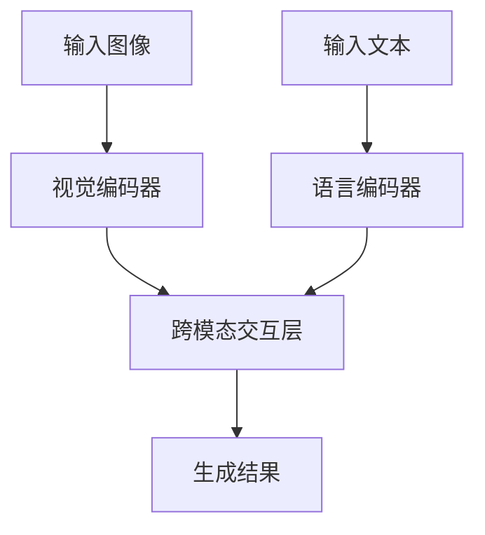
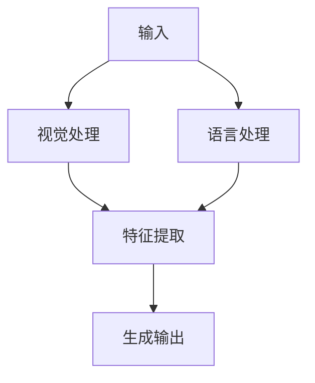
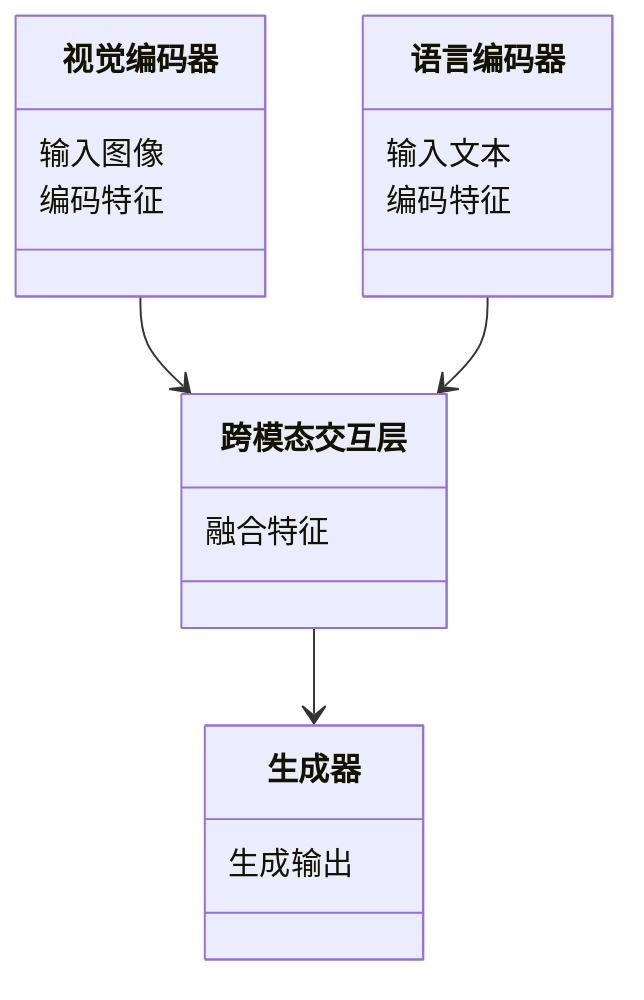
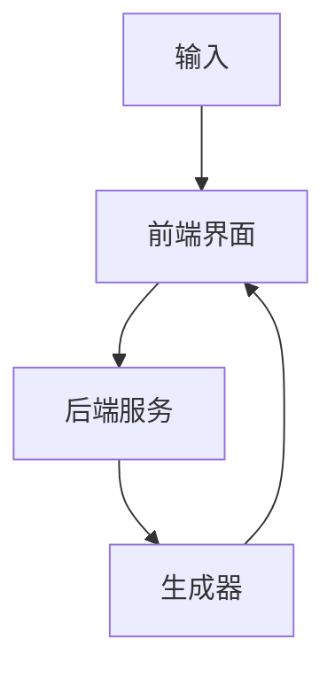
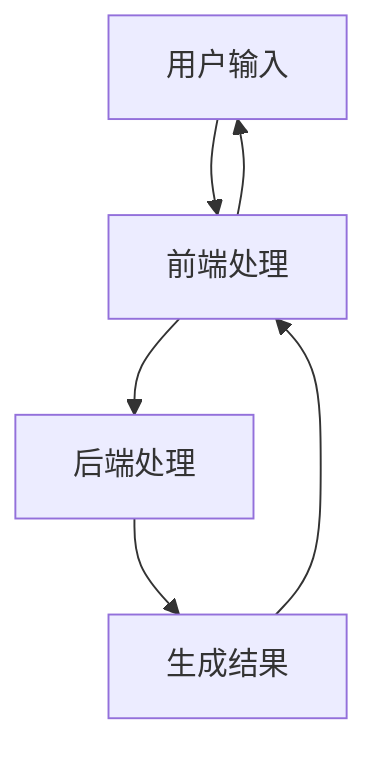

                 


# 开发具有视觉-语言多模态生成能力的AI Agent

> 关键词：视觉-语言，多模态生成，AI Agent，深度学习，生成式AI，自然语言处理

> 摘要：本文深入探讨了开发具有视觉-语言多模态生成能力的AI Agent的关键技术与实现方法。通过分析视觉和语言模态的融合机制、多模态生成模型的算法原理、系统架构设计以及实际应用场景，本文为读者提供了从理论到实践的全面指导，帮助开发者构建具备强大多模态生成能力的智能系统。

---

# 第一部分: 开发具有视觉-语言多模态生成能力的AI Agent概述

## 第1章: 视觉-语言多模态生成AI Agent概述

### 1.1 问题背景与目标
#### 1.1.1 多模态生成AI Agent的定义
多模态生成AI Agent是指能够同时处理视觉和语言输入，并生成与输入内容相关联的视觉或语言输出的智能系统。这种AI Agent能够理解用户提供的图像、文本或其他形式的输入，并根据输入生成相应的多模态输出，如图像描述、图像生成、对话生成等。

#### 1.1.2 问题背景
在人工智能领域，单一模态的生成模型（如纯文本生成或纯图像生成）已经取得了显著进展，但实际应用场景中，用户往往需要系统能够同时处理多种模态的信息，并根据输入生成对应的多种模态输出。例如，用户可以通过输入一段文字生成一张相关的图片，或者通过输入一张图片生成一段描述性的文本。

#### 1.1.3 技术目标
- 实现视觉和语言模态的深度融合，使AI Agent能够理解多模态输入并生成相应的多模态输出。
- 提供高效的多模态生成算法，确保生成结果的准确性和多样性。
- 研究多模态生成模型的训练方法，包括预训练和微调策略。

### 1.2 核心概念与问题描述
#### 1.2.1 多模态生成的基本原理
多模态生成是指将多种模态的信息（如视觉、语言、音频等）进行融合，并根据输入生成对应的多种模态输出。本文主要关注视觉和语言模态的生成问题。

#### 1.2.2 视觉与语言模态的交互机制
视觉模态和语言模态之间的交互可以通过以下方式实现：
- **模态间注意力机制**：通过注意力机制，使模型能够关注输入中不同模态的重要信息，并将其用于生成目标模态的输出。
- **跨模态编码器-解码器结构**：通过编码器将输入的视觉或语言信息编码为通用表示，然后通过解码器生成目标模态的输出。

#### 1.2.3 生成任务的边界与外延
- **生成任务的边界**：明确生成任务的输入和输出范围，例如输入为图像，输出为描述性文本；输入为文本，输出为生成图像。
- **生成任务的外延**：扩展生成任务的应用场景，例如结合音频模态，实现跨模态的语音生成或图像生成。

### 1.3 问题解决与技术路线
#### 1.3.1 多模态生成的主要技术路线
1. **多模态数据的预处理**：对输入的视觉和语言数据进行标准化处理，提取特征。
2. **多模态编码器的设计**：设计能够同时处理视觉和语言模态的编码器，提取跨模态特征。
3. **多模态生成模型的训练**：通过预训练和微调策略，训练生成模型，使其能够根据输入生成目标模态的输出。
4. **生成结果的优化**：通过损失函数设计和生成策略优化，提高生成结果的质量和多样性。

#### 1.3.2 视觉-语言模型的核心要素
- **视觉编码器**：将图像编码为视觉特征向量。
- **语言编码器**：将文本编码为语言特征向量。
- **跨模态注意力机制**：实现视觉和语言特征之间的交互。
- **生成器**：根据输入的跨模态特征生成目标模态的输出。

#### 1.3.3 生成能力的实现方式
- **基于预训练的生成模型**：利用大规模多模态数据进行预训练，然后在特定任务上进行微调。
- **基于微调的生成模型**：在特定任务上进行针对性训练，优化生成效果。

### 1.4 本章小结
本章主要介绍了多模态生成AI Agent的定义、核心概念、问题背景和技术目标。通过分析视觉和语言模态的交互机制，明确了多模态生成任务的实现方式和优化方向。

---

## 第2章: 多模态生成的核心概念

### 2.1 多模态生成的原理
#### 2.1.1 视觉模态的处理流程
1. **图像输入**：输入一张图像。
2. **图像编码**：通过视觉编码器将图像编码为视觉特征向量。
3. **特征提取**：提取图像中的关键特征，例如物体、场景等信息。
4. **跨模态交互**：将视觉特征与语言特征进行交互，生成目标模态的输出。

#### 2.1.2 语言模态的处理流程
1. **文本输入**：输入一段文本。
2. **文本编码**：通过语言编码器将文本编码为语言特征向量。
3. **特征提取**：提取文本中的关键信息，例如关键词、主题等。
4. **跨模态交互**：将语言特征与视觉特征进行交互，生成目标模态的输出。

#### 2.1.3 视觉-语言模态的融合方式
- **特征级融合**：在特征层面将视觉和语言特征进行融合，例如通过加权求和或注意力机制进行融合。
- **决策级融合**：在决策层面进行融合，例如通过多模态模型的输出进行融合。

### 2.2 视觉-语言模型的实体关系
#### 2.2.1 实体关系图的构建


#### 2.2.2 模态间的关系分析
- **视觉到语言的映射**：通过视觉特征生成语言描述。
- **语言到视觉的映射**：通过语言特征生成视觉图像。

### 2.3 多模态生成的流程图


#### 2.3.1 流程图的详细说明
1. **输入处理**：接收视觉和语言输入。
2. **模态处理**：分别对视觉和语言输入进行编码，提取特征。
3. **跨模态交互**：将视觉和语言特征进行融合，生成跨模态特征。
4. **生成输出**：根据跨模态特征生成目标模态的输出。

### 2.4 本章小结
本章详细介绍了多模态生成的核心原理，包括视觉和语言模态的处理流程以及模态间的融合方式。通过构建实体关系图和流程图，明确了多模态生成的整体架构和实现步骤。

---

## 第3章: 多模态生成模型的算法原理

### 3.1 多模态预训练
#### 3.1.1 预训练的目标函数
$$ L = L_{\text{text}} + L_{\text{image}} + L_{\text{cross}} $$
其中，$L_{\text{text}}$ 是语言模态的损失函数，$L_{\text{image}}$ 是视觉模态的损失函数，$L_{\text{cross}}$ 是跨模态的损失函数。

#### 3.1.2 模态间的交叉注意力机制
通过交叉注意力机制，模型能够关注输入中不同模态的重要信息，并将其用于生成目标模态的输出。例如，在生成图像描述时，模型需要关注图像中的关键物体，并根据这些物体生成对应的描述文本。

#### 3.1.3 预训练的流程


### 3.2 多模态微调
#### 3.2.1 微调的目标函数
$$ L = \lambda_1 L_{\text{text}} + \lambda_2 L_{\text{image}} + \lambda_3 L_{\text{cross}} $$
其中，$\lambda_1, \lambda_2, \lambda_3$ 是权重系数，用于调节不同损失项的贡献。

#### 3.2.2 微调的策略
1. **冻结预训练参数**：在微调过程中，可以冻结预训练模型的部分参数，仅对特定层进行微调。
2. **调整学习率**：根据任务需求，调整微调阶段的学习率，以优化生成效果。

### 3.3 生成模型的数学模型
#### 3.3.1 生成模型的数学公式
$$ P(y|x) = \text{Generator}(x) $$
其中，$x$ 是输入，$y$ 是生成的输出。

#### 3.3.2 损失函数的数学表达
$$ L_{\text{loss}} = -\sum_{i=1}^{N} \log P(y_i|x_i) $$
其中，$N$ 是训练样本的数量。

### 3.4 本章小结
本章详细介绍了多模态生成模型的算法原理，包括预训练和微调的流程，以及生成模型的数学表达。通过分析损失函数和注意力机制，明确了多模态生成模型的核心算法。

---

## 第4章: 系统分析与架构设计

### 4.1 项目场景介绍
#### 4.1.1 项目背景
在实际应用中，多模态生成AI Agent可以用于图像描述生成、图像生成、对话生成等场景。

#### 4.1.2 项目目标
通过开发具有视觉-语言多模态生成能力的AI Agent，实现以下目标：
- 提供高效的多模态生成服务。
- 支持多种生成任务，例如图像描述生成、图像生成等。

### 4.2 系统功能设计
#### 4.2.1 领域模型设计


#### 4.2.2 系统架构设计


#### 4.2.3 接口设计
- **输入接口**：接收视觉和语言输入。
- **输出接口**：输出生成的多模态结果。

#### 4.2.4 交互流程图


### 4.3 本章小结
本章通过对项目场景的分析，设计了系统的功能模块和架构。通过类图和流程图，明确了系统各模块之间的关系和交互流程。

---

## 第5章: 项目实战

### 5.1 环境安装
#### 5.1.1 安装Python
```bash
python --version
```
#### 5.1.2 安装深度学习框架
```bash
pip install torch
pip install transformers
```
#### 5.1.3 安装其他依赖
```bash
pip install numpy
pip install matplotlib
```

### 5.2 核心代码实现
#### 5.2.1 视觉编码器
```python
import torch
import torch.nn as nn

class VisualEncoder(nn.Module):
    def __init__(self, input_dim, hidden_dim):
        super(VisualEncoder, self).__init__()
        self.encoder = nn.Sequential(
            nn.Conv2d(input_dim, hidden_dim, kernel_size=3, stride=2),
            nn.ReLU(),
            nn.Conv2d(hidden_dim, hidden_dim, kernel_size=3, stride=2),
            nn.ReLU()
        )
    
    def forward(self, x):
        return self.encoder(x)
```

#### 5.2.2 语言编码器
```python
class TextEncoder(nn.Module):
    def __init__(self, vocab_size, embedding_dim, hidden_dim):
        super(TextEncoder, self).__init__()
        self.embedding = nn.Embedding(vocab_size, embedding_dim)
        self.lstm = nn.LSTM(embedding_dim, hidden_dim, batch_first=True)
    
    def forward(self, x):
        embedded = self.embedding(x)
        output, _ = self.lstm(embedded)
        return output[:, -1, :]
```

#### 5.2.3 跨模态交互层
```python
class CrossModalInteraction(nn.Module):
    def __init__(self, visual_dim, text_dim, hidden_dim):
        super(CrossModalInteraction, self).__init__()
        self.visual_proj = nn.Linear(visual_dim, hidden_dim)
        self.text_proj = nn.Linear(text_dim, hidden_dim)
        self.attention = nn.MultiheadAttention(hidden_dim, 1)
    
    def forward(self, visual_features, text_features):
        visual_proj = self.visual_proj(visual_features)
        text_proj = self.text_proj(text_features)
        interaction = self.attention(visual_proj, text_proj)
        return interaction
```

#### 5.2.4 生成器
```python
class Generator(nn.Module):
    def __init__(self, input_dim, output_dim):
        super(Generator, self).__init__()
        self.generator = nn.Sequential(
            nn.Linear(input_dim, output_dim),
            nn.Sigmoid()
        )
    
    def forward(self, x):
        return self.generator(x)
```

### 5.3 案例分析
#### 5.3.1 案例一：图像描述生成
```python
# 输入图像
image = torch.randn(1, 3, 224, 224)

# 视觉编码器
visual_encoder = VisualEncoder(3, 64)
visual_features = visual_encoder(image)

# 语言编码器
text_encoder = TextEncoder(vocab_size=10000, embedding_dim=256, hidden_dim=512)
text_features = text_encoder(text_input)

# 跨模态交互层
cross_modal = CrossModalInteraction(64, 512, 256)
interaction = cross_modal(visual_features, text_features)

# 生成器
generator = Generator(256, 1000)
generated_output = generator(interaction)
```

#### 5.3.2 案例二：图像生成
```python
# 输入文本
text_input = torch.randint(0, 10000, (1, 10))

# 语言编码器
text_encoder = TextEncoder(vocab_size=10000, embedding_dim=256, hidden_dim=512)
text_features = text_encoder(text_input)

# 跨模态交互层
cross_modal = CrossModalInteraction(512, 512, 256)
interaction = cross_modal(None, text_features)

# 生成器
generator = Generator(256, 3*224*224)
generated_image = generator(interaction)
```

### 5.4 本章小结
本章通过实际案例，详细介绍了多模态生成AI Agent的实现过程。从环境安装到核心代码实现，再到案例分析，为读者提供了从理论到实践的全面指导。

---

## 第6章: 最佳实践与小结

### 6.1 最佳实践
#### 6.1.1 模型优化技巧
- **调整学习率**：根据任务需求，调整模型的 learning rate。
- **数据增强**：在训练过程中，可以使用数据增强技术，提高模型的泛化能力。
- **模型调参**：通过调参，优化模型的性能，例如调整注意力机制的参数。

#### 6.1.2 生成结果的评估方法
- **生成结果的质量评估**：通过人工评估或自动评估指标（如BLEU、ROUGE等）对生成结果的质量进行评估。
- **生成结果的多样性评估**：通过生成多个结果，评估模型的多样性。

### 6.2 小结
本文详细介绍了开发具有视觉-语言多模态生成能力的AI Agent的关键技术与实现方法。通过分析多模态生成的原理、算法实现、系统架构设计以及实际案例，为读者提供了从理论到实践的全面指导。

### 6.3 注意事项
- **数据隐私**：在实际应用中，需要注意数据隐私问题，确保数据的安全性。
- **模型性能**：在实际应用中，需要注意模型的性能问题，例如计算资源的消耗。

### 6.4 拓展阅读
- **多模态生成的前沿技术**：了解多模态生成领域的最新研究，例如基于扩散模型的多模态生成、基于 transformers 的多模态生成等。
- **实际应用案例**：学习多模态生成技术在实际应用中的案例，例如图像描述生成、图像生成等。

---

# 结语

开发具有视觉-语言多模态生成能力的AI Agent是一项具有挑战性的任务，但也是一项具有广阔应用前景的技术。通过本文的介绍，读者可以深入了解多模态生成的核心原理、算法实现以及系统架构设计。希望本文能够为读者提供有价值的参考，帮助他们在实际开发中取得更好的成果。

