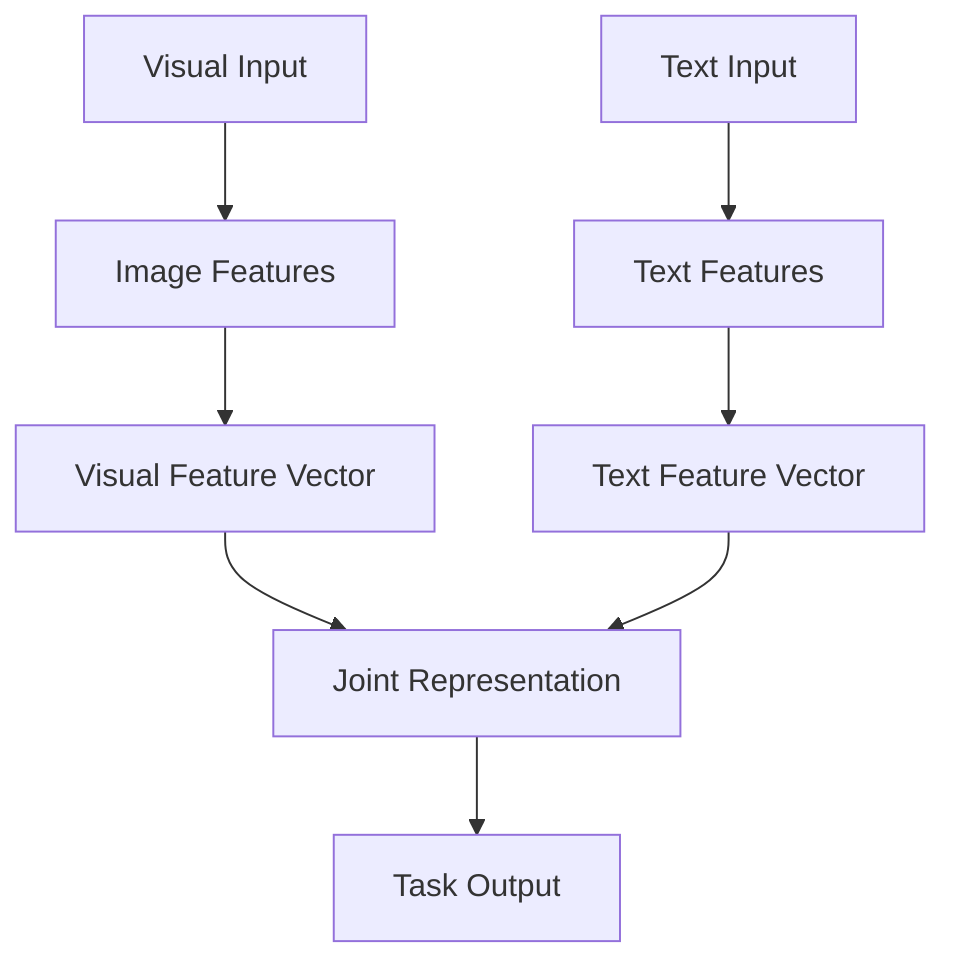
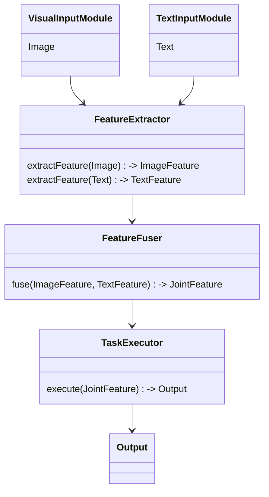
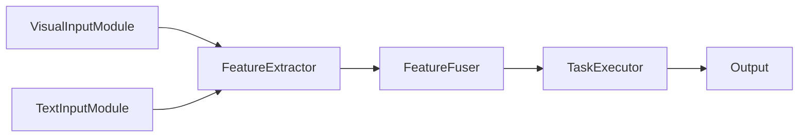
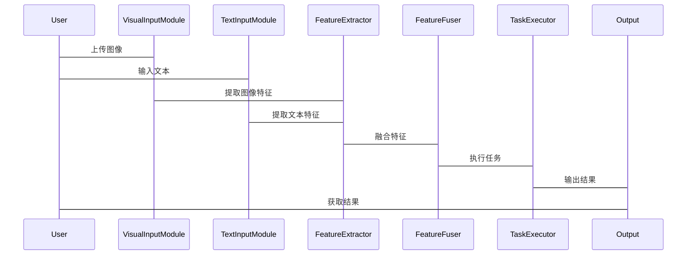

                 


# 开发具有视觉-语言理解能力的AI Agent

---

## 关键词：AI Agent, 视觉-语言理解, 多模态模型, 端到端学习, 系统架构, 项目实战

---

## 摘要：  
本文详细探讨了开发具有视觉-语言理解能力的AI Agent的核心技术与实现方法。首先，我们从问题背景出发，分析了视觉-语言理解的现实需求及其在AI Agent中的重要性。接着，我们深入讲解了多模态模型、视觉-语言联合理解和端到端学习等核心概念，并通过对比分析和实体关系图帮助读者理解这些概念之间的联系。随后，我们详细介绍了主流的算法原理，包括多模态模型的架构、注意力机制和损失函数，并通过代码示例和数学公式进行深入剖析。在系统设计部分，我们从问题场景出发，设计了系统的功能模块、架构和交互流程，并通过Mermaid图展示了系统的整体结构。最后，我们通过项目实战，从环境搭建到代码实现，逐步指导读者完成一个具有视觉-语言理解能力的AI Agent的开发，并结合实际案例分析了其应用场景。本文还总结了开发过程中的最佳实践，为读者提供了宝贵的实践经验。

---

# 第1章: 背景介绍

## 1.1 问题背景

### 1.1.1 多模态AI的发展趋势
近年来，AI技术的快速发展推动了多模态技术的广泛应用。从图像识别到自然语言处理，AI系统逐渐从单一模态向多模态方向发展，以更好地理解和处理真实世界中的复杂信息。视觉-语言理解作为多模态AI的核心技术之一，正在成为AI Agent开发的重要方向。

### 1.1.2 视觉-语言理解的现实需求
在现实场景中，许多任务需要同时处理图像和文本信息。例如，在智能客服系统中，用户可能上传一张商品图片并询问其相关信息，系统需要同时理解图像内容和文本描述，才能准确回答问题。类似的需求在电子商务、医疗影像分析、智能助手等领域普遍存在。

### 1.1.3 AI Agent的核心问题
AI Agent作为一种智能体，需要具备感知环境、理解输入、决策并执行任务的能力。视觉-语言理解能力是AI Agent实现复杂任务的核心能力之一，它使得AI Agent能够同时处理图像和文本信息，从而更好地理解用户需求并执行相应的操作。

## 1.2 问题描述

### 1.2.1 视觉-语言理解的定义
视觉-语言理解是指AI系统能够同时处理图像和文本信息，并通过两者之间的关联来理解输入的内容。例如，给定一张图片和一段文本，系统能够识别图片中的物体并将其与文本内容进行关联，从而实现对输入的全面理解。

### 1.2.2 AI Agent的定义与特点
AI Agent是一种智能体，能够感知环境、理解输入、决策并执行任务。AI Agent的特点包括自主性、反应性、主动性、社会性和学习性。视觉-语言理解能力是AI Agent实现复杂任务的核心能力之一。

### 1.2.3 视觉-语言理解在AI Agent中的作用
视觉-语言理解能力使得AI Agent能够同时处理图像和文本信息，从而更好地理解用户需求并执行相应的操作。例如，在智能客服系统中，AI Agent可以通过理解用户上传的图片和输入的文本，提供更精准的服务。

## 1.3 问题解决

### 1.3.1 多模态数据处理的挑战
多模态数据处理的核心挑战在于如何将图像和文本等不同模态的数据进行有效融合。传统的单一模态方法难以同时处理多种数据类型，而多模态方法需要解决数据异构性和模态间关联性的问题。

### 1.3.2 视觉-语言联合理解的解决方案
视觉-语言联合理解的解决方案主要包括以下几种：
1. **模态对齐**：通过将图像和文本的特征进行对齐，使得两者能够在同一个语义空间中进行交互。
2. **注意力机制**：利用注意力机制来捕捉图像和文本之间的关联性，从而实现更精准的理解。
3. **端到端学习**：通过端到端的深度学习模型，直接从多模态输入中学习联合表示，从而实现视觉-语言的联合理解。

### 1.3.3 AI Agent的实现路径
AI Agent的实现路径主要包括以下步骤：
1. **数据采集与预处理**：收集多模态数据（图像、文本等），并对数据进行清洗和标注。
2. **模型训练**：基于多模态数据训练视觉-语言理解模型，使其能够同时理解图像和文本信息。
3. **系统集成**：将训练好的模型集成到AI Agent系统中，实现对用户输入的实时理解和响应。

## 1.4 边界与外延

### 1.4.1 视觉-语言理解的边界
视觉-语言理解的边界主要在于如何处理图像和文本之间的关联性。当前的技术主要关注图像和文本的联合理解，但尚未完全解决跨模态推理和复杂场景下的理解问题。

### 1.4.2 AI Agent的应用场景
AI Agent的应用场景包括智能客服、智能助手、智能安防、电子商务等领域。在这些场景中，AI Agent需要具备视觉-语言理解能力，以实现对用户需求的精准识别和响应。

### 1.4.3 相关技术的对比与区分
视觉-语言理解与单一模态的理解（如图像识别、自然语言处理）相比，其核心区别在于能够同时处理多种模态的数据，并通过模态间的关联性实现更全面的理解。

---

# 第2章: 核心概念与联系

## 2.1 多模态模型

### 2.1.1 多模态模型的定义
多模态模型是指能够同时处理多种模态数据（如图像、文本、语音等）的模型。多模态模型的核心思想是通过将不同模态的数据进行融合，从而实现对输入的更全面理解。

### 2.1.2 多模态模型的类型
多模态模型的类型主要包括以下几种：
1. **单任务多模态模型**：专注于单一任务，如图像描述生成。
2. **多任务多模态模型**：能够同时处理多个任务，如图像分类和文本生成。
3. **端到端多模态模型**：通过端到端的深度学习模型，直接从多模态输入中学习联合表示。

### 2.1.3 多模态模型的核心特征对比表
| 特征             | 单任务多模态模型           | 多任务多模态模型           | 端到端多模态模型           |
|------------------|--------------------------|--------------------------|--------------------------|
| 处理任务         | 单一任务                 | 多个任务                 | 多个任务                 |
| 模型结构         | 专用结构                 | 多层结构                 | 统一结构                 |
| 灵活性           | 较低                     | 较高                     | 较高                     |
| 适用场景         | 专用场景                 | 多场景                   | 多场景                   |

### 2.1.4 多模态模型的核心要素组成
多模态模型的核心要素包括：
1. **模态编码器**：将不同模态的数据（如图像、文本）转换为统一的特征表示。
2. **模态融合器**：将不同模态的特征进行融合，生成联合表示。
3. **任务解码器**：根据联合表示生成任务输出（如文本描述、标签等）。

---

## 2.2 视觉-语言联合理解

### 2.2.1 视觉-语言联合理解的定义
视觉-语言联合理解是指AI系统能够同时理解图像和文本信息，并通过两者之间的关联性实现对输入的全面理解。

### 2.2.2 视觉-语言联合理解的实现流程
视觉-语言联合理解的实现流程主要包括以下步骤：
1. **图像特征提取**：通过卷积神经网络（CNN）提取图像的视觉特征。
2. **文本特征提取**：通过循环神经网络（RNN）或变换器（Transformer）提取文本的语义特征。
3. **特征融合**：通过注意力机制或其他融合方法，将图像和文本的特征进行融合，生成联合表示。
4. **任务输出**：根据联合表示生成任务输出（如图像描述、问答等）。

### 2.2.3 视觉-语言联合理解的ER实体关系图


---

## 2.3 端到端学习

### 2.3.1 端到端学习的定义
端到端学习是指直接从输入到输出的整个过程通过一个深度学习模型完成，而不需要手动设计中间的特征提取步骤。

### 2.3.2 端到端学习的特点
端到端学习的特点包括：
1. **自动化特征学习**：模型能够自动从输入数据中学习有用的特征，而不需要手动设计特征提取器。
2. **简化开发流程**：通过端到端的模型，可以简化整个开发流程，减少人工干预。
3. **提高模型性能**：端到端模型能够更好地捕捉输入数据中的复杂关系，从而提高模型的性能。

### 2.3.3 端到端学习的核心要素
端到端学习的核心要素包括：
1. **深度学习模型**：如卷积神经网络（CNN）、循环神经网络（RNN）和变换器（Transformer）等。
2. **损失函数**：用于衡量模型输出与真实输出之间的差异。
3. **优化算法**：如随机梯度下降（SGD）、Adam等，用于优化模型参数。

---

## 2.4 视觉-语言理解的数学模型

### 2.4.1 图像特征提取
图像特征提取通常通过卷积神经网络（CNN）完成。假设输入图像的尺寸为 $H \times W \times 3$，经过一系列卷积操作后，提取出图像的视觉特征，表示为 $F \in \mathbb{R}^{d \times h \times w}$，其中 $d$ 是通道数，$h$ 和 $w$ 是特征图的尺寸。

### 2.4.2 文本特征提取
文本特征提取通常通过变换器（Transformer）完成。假设输入文本的长度为 $n$，经过编码器的自注意力机制后，生成文本的语义特征，表示为 $T \in \mathbb{R}^{n \times d}$，其中 $d$ 是特征维度。

### 2.4.3 特征融合
特征融合可以通过将图像和文本的特征进行拼接、加权或注意力机制等方式完成。例如，利用自注意力机制对图像和文本的特征进行加权融合，生成联合表示 $J \in \mathbb{R}^{d}$。

### 2.4.4 任务输出
任务输出可以根据具体的任务需求进行设计。例如，在图像描述生成任务中，联合表示 $J$ 可以通过解码器生成对应的文本描述。

---

## 2.5 视觉-语言理解的挑战与解决方案

### 2.5.1 模态异构性
模态异构性是指不同模态的数据具有不同的特征维度和表示方式。解决方案包括：
1. **模态对齐**：通过将不同模态的数据映射到同一个语义空间中，消除模态异构性。
2. **跨模态注意力机制**：通过注意力机制捕捉不同模态之间的关联性，从而实现模态间的有效融合。

### 2.5.2 跨模态推理
跨模态推理是指在不同模态数据之间进行推理和关联。解决方案包括：
1. **跨模态注意力机制**：通过注意力机制捕捉图像和文本之间的关联性，从而实现跨模态推理。
2. **端到端学习**：通过端到端的深度学习模型，直接从多模态输入中学习联合表示，从而实现跨模态推理。

---

# 第3章: 视觉-语言理解的算法原理

## 3.1 多模态模型的架构设计

### 3.1.1 多模态模型的输入
多模态模型的输入包括图像和文本。例如，在图像描述生成任务中，输入可能是一张图片和一段描述，目标是生成与图片相关的文本描述。

### 3.1.2 多模态模型的输出
多模态模型的输出包括任务相关的结果，如图像描述、问答等。

### 3.1.3 多模态模型的架构
多模态模型的架构通常包括以下几个部分：
1. **图像编码器**：用于提取图像的视觉特征。
2. **文本编码器**：用于提取文本的语义特征。
3. **特征融合器**：用于将图像和文本的特征进行融合，生成联合表示。
4. **任务解码器**：用于根据联合表示生成任务输出。

### 3.1.4 多模态模型的代码实现
以下是一个简单的多模态模型的Python代码示例：
```python
import torch
import torch.nn as nn

# 图像编码器
class ImageEncoder(nn.Module):
    def __init__(self, img_size, channels, hidden_size):
        super(ImageEncoder, self).__init__()
        self.conv = nn.Sequential(
            nn.Conv2d(channels, hidden_size, kernel_size=3, padding=1),
            nn.ReLU(),
            nn.Conv2d(hidden_size, hidden_size, kernel_size=3, padding=1),
            nn.ReLU()
        )
    
    def forward(self, x):
        return self.conv(x)

# 文本编码器
class TextEncoder(nn.Module):
    def __init__(self, vocab_size, embed_size, hidden_size):
        super(TextEncoder, self).__init__()
        self.embedding = nn.Embedding(vocab_size, embed_size)
        self.lstm = nn.LSTM(embed_size, hidden_size, batch_first=True)
    
    def forward(self, x):
        embed = self.embedding(x)
        output, _ = self.lstm(embed)
        return output[:, -1, :]

# 特征融合器
class FeatureFuser(nn.Module):
    def __init__(self, visual_size, text_size, joint_size):
        super(FeatureFuser, self).__init__()
        self.visual_proj = nn.Linear(visual_size, joint_size)
        self.text_proj = nn.Linear(text_size, joint_size)
        self.joint_layer = nn.Sequential(
            nn.Linear(joint_size, joint_size),
            nn.ReLU()
        )
    
    def forward(self, visual, text):
        visual_proj = self.visual_proj(visual)
        text_proj = self.text_proj(text)
        joint = visual_proj + text_proj
        joint = self.joint_layer(joint)
        return joint

# 多模态模型
class MultiModalModel(nn.Module):
    def __init__(self, img_size, channels, vocab_size, embed_size, hidden_size):
        super(MultiModalModel, self).__init__()
        self.image_encoder = ImageEncoder(img_size, channels, hidden_size)
        self.text_encoder = TextEncoder(vocab_size, embed_size, hidden_size)
        self.feature_fuser = FeatureFuser(hidden_size, hidden_size, hidden_size)
    
    def forward(self, img, text):
        visual = self.image_encoder(img)
        text_embed = self.text_encoder(text)
        joint = self.feature_fuser(visual, text_embed)
        return joint
```

### 3.1.5 多模态模型的数学模型
多模态模型的数学模型可以表示为：
$$
J = f_{\text{fuse}}(F, T)
$$
其中，$F$ 是图像的视觉特征，$T$ 是文本的语义特征，$f_{\text{fuse}}$ 是特征融合函数，$J$ 是联合表示。

---

## 3.2 注意力机制

### 3.2.1 注意力机制的定义
注意力机制是一种用于捕捉序列中不同位置之间关系的机制。它通过计算序列中每个位置的注意力权重，从而实现对重要位置的聚焦。

### 3.2.2 注意力机制的实现
注意力机制的实现通常包括以下几个步骤：
1. **计算查询（Query）、键（Key）和值（Value）**：
   $$ Q = W_q X $$
   $$ K = W_k X $$
   $$ V = W_v X $$
2. **计算注意力权重**：
   $$ \text{score}(i,j) = Q_i K_j^T $$
3. **归一化注意力权重**：
   $$ \alpha_{ij} = \frac{\exp(\text{score}(i,j))}{\sum_{k} \exp(\text{score}(i,k))} $$
4. **计算加权和**：
   $$ \text{Attention}(i) = \sum_{j} \alpha_{ij} V_j $$

### 3.2.3 注意力机制在视觉-语言理解中的应用
注意力机制在视觉-语言理解中的应用主要体现在以下两个方面：
1. **图像注意力机制**：用于捕捉图像中重要的区域，从而实现对图像内容的精确定位。
2. **文本注意力机制**：用于捕捉文本中重要的词语或短语，从而实现对文本内容的精确定位。

---

## 3.3 损失函数

### 3.3.1 损失函数的定义
损失函数用于衡量模型输出与真实输出之间的差异。在视觉-语言理解任务中，常用的损失函数包括交叉熵损失、均方误差损失等。

### 3.3.2 损失函数的实现
交叉熵损失的数学表达式为：
$$
L = -\sum_{i=1}^{n} y_i \log(p_i) + (1 - y_i) \log(1 - p_i)
$$
其中，$y_i$ 是真实标签，$p_i$ 是模型预测的概率。

### 3.3.3 损失函数的优化
损失函数的优化通常通过反向传播算法完成。在反向传播过程中，模型的参数会被调整，以最小化损失函数的值。

---

## 3.4 模型训练与优化

### 3.4.1 模型训练
模型训练的过程包括以下几个步骤：
1. **数据预处理**：对输入数据进行归一化、裁剪等预处理操作。
2. **数据加载**：将预处理后的数据加载到训练器中。
3. **前向传播**：将输入数据通过模型，计算出模型的输出。
4. **计算损失**：根据模型输出和真实标签计算损失。
5. **反向传播**：通过反向传播算法计算模型参数的梯度。
6. **优化参数**：根据梯度更新模型参数。

### 3.4.2 模型优化
模型优化的目标是通过调整模型的参数，使得模型的性能达到最优。常用的优化算法包括随机梯度下降（SGD）、Adam等。

---

# 第4章: 系统分析与架构设计

## 4.1 问题场景介绍

### 4.1.1 系统目标
本系统的目标是开发一个具有视觉-语言理解能力的AI Agent，能够同时处理图像和文本信息，并通过两者之间的关联性实现对用户需求的精准识别和响应。

### 4.1.2 系统输入
系统的输入包括图像和文本。例如，用户可能上传一张图片并输入一段文本，系统需要同时理解图像和文本内容。

### 4.1.3 系统输出
系统的输出包括任务相关的结果，如图像描述、问答等。

## 4.2 系统功能设计

### 4.2.1 领域模型设计
以下是系统的领域模型设计：


### 4.2.2 系统架构设计
以下是系统的架构设计：


### 4.2.3 系统接口设计
系统的接口设计包括以下几个部分：
1. **输入接口**：接收图像和文本输入。
2. **输出接口**：输出任务相关的结果。
3. **特征提取接口**：提取图像和文本的特征。
4. **特征融合接口**：将图像和文本的特征进行融合，生成联合表示。
5. **任务执行接口**：根据联合表示生成任务输出。

### 4.2.4 系统交互流程
以下是系统的交互流程：


---

## 4.3 系统实现

### 4.3.1 系统模块划分
系统的模块划分包括以下几个部分：
1. **输入模块**：负责接收图像和文本输入。
2. **特征提取模块**：负责提取图像和文本的特征。
3. **特征融合模块**：负责将图像和文本的特征进行融合，生成联合表示。
4. **任务执行模块**：负责根据联合表示生成任务输出。

### 4.3.2 系统功能实现
系统的功能实现包括以下几个步骤：
1. **数据预处理**：对输入数据进行归一化、裁剪等预处理操作。
2. **特征提取**：通过卷积神经网络（CNN）提取图像的视觉特征，通过变换器（Transformer）提取文本的语义特征。
3. **特征融合**：通过注意力机制将图像和文本的特征进行融合，生成联合表示。
4. **任务执行**：根据联合表示生成任务输出（如图像描述、问答等）。

---

# 第5章: 项目实战

## 5.1 环境搭建

### 5.1.1 开发工具与框架
开发工具包括Python、PyTorch、TensorFlow等深度学习框架，以及Jupyter Notebook等开发环境。

### 5.1.2 数据集准备
数据集可以从公开的数据集（如ImageNet、COCO等）中获取，或者根据具体需求自行收集和标注。

### 5.1.3 依赖安装
安装所需的依赖库：
```bash
pip install torch torchvision transformers
```

---

## 5.2 系统核心实现

### 5.2.1 图像特征提取代码
以下是一个简单的图像特征提取代码示例：
```python
import torch
import torch.nn as nn
import torch.nn.functional as F

class ImageFeatureExtractor(nn.Module):
    def __init__(self, img_size, channels, hidden_size):
        super(ImageFeatureExtractor, self).__init__()
        self.conv1 = nn.Conv2d(channels, hidden_size, kernel_size=3, padding=1)
        self.conv2 = nn.Conv2d(hidden_size, hidden_size, kernel_size=3, padding=1)
        self.relu = nn.ReLU()
    
    def forward(self, x):
        x = self.conv1(x)
        x = self.relu(x)
        x = self.conv2(x)
        x = self.relu(x)
        return x
```

### 5.2.2 文本特征提取代码
以下是一个简单的文本特征提取代码示例：
```python
class TextFeatureExtractor(nn.Module):
    def __init__(self, vocab_size, embed_size, hidden_size):
        super(TextFeatureExtractor, self).__init__()
        self.embedding = nn.Embedding(vocab_size, embed_size)
        self.lstm = nn.LSTM(embed_size, hidden_size, batch_first=True)
    
    def forward(self, x):
        embed = self.embedding(x)
        output, _ = self.lstm(embed)
        return output[:, -1, :]
```

### 5.2.3 特征融合代码
以下是一个简单的特征融合代码示例：
```python
class FeatureFuser(nn.Module):
    def __init__(self, visual_size, text_size, joint_size):
        super(FeatureFuser, self).__init__()
        self.visual_proj = nn.Linear(visual_size, joint_size)
        self.text_proj = nn.Linear(text_size, joint_size)
        self.joint_layer = nn.Sequential(
            nn.Linear(joint_size, joint_size),
            nn.ReLU()
        )
    
    def forward(self, visual, text):
        visual_proj = self.visual_proj(visual)
        text_proj = self.text_proj(text)
        joint = visual_proj + text_proj
        joint = self.joint_layer(joint)
        return joint
```

### 5.2.4 模型训练代码
以下是一个简单的模型训练代码示例：
```python
def train(model, optimizer, criterion, train_loader, epochs=10):
    for epoch in range(epochs):
        for batch_data in train_loader:
            img, text, labels = batch_data
            img = img.to(device)
            text = text.to(device)
            labels = labels.to(device)
            
            optimizer.zero_grad()
            
            outputs = model(img, text)
            loss = criterion(outputs, labels)
            
            loss.backward()
            optimizer.step()
```

---

## 5.3 代码应用解读与分析

### 5.3.1 图像特征提取代码解读
图像特征提取代码通过卷积神经网络提取图像的视觉特征。首先，输入图像经过两个卷积层和激活函数处理，生成图像的视觉特征。

### 5.3.2 文本特征提取代码解读
文本特征提取代码通过嵌入层和LSTM提取文本的语义特征。首先，文本经过嵌入层转换为向量表示，然后通过LSTM生成文本的语义特征。

### 5.3.3 特征融合代码解读
特征融合代码通过将图像和文本的特征进行投影和融合，生成联合表示。联合表示通过一个简单的前馈神经网络进一步处理，生成最终的联合特征。

---

## 5.4 实际案例分析

### 5.4.1 案例背景
假设我们有一个图像描述生成任务，用户上传了一张猫的图片，并输入了“这只猫是什么颜色？”的问题。

### 5.4.2 案例分析
系统首先提取图像的视觉特征，识别出猫的颜色是灰色。然后提取文本的语义特征，理解用户的问题是关于猫的颜色。通过特征融合，系统生成联合表示，并通过解码器生成回答“这只猫是灰色的。”

### 5.4.3 案例总结
通过上述案例，我们可以看到视觉-语言理解能力在AI Agent中的重要作用。系统能够同时处理图像和文本信息，并通过两者之间的关联性实现对用户需求的精准识别和响应。

---

## 5.5 项目小结

### 5.5.1 项目实现的关键点
项目实现的关键点包括：
1. **数据预处理**：对输入数据进行归一化、裁剪等预处理操作。
2. **特征提取**：通过卷积神经网络（CNN）提取图像的视觉特征，通过变换器（Transformer）提取文本的语义特征。
3. **特征融合**：通过注意力机制将图像和文本的特征进行融合，生成联合表示。
4. **任务执行**：根据联合表示生成任务输出。

### 5.5.2 项目实现的难点
项目实现的难点包括：
1. **模态异构性**：不同模态的数据具有不同的特征维度和表示方式，如何进行有效融合是一个挑战。
2. **跨模态推理**：如何在不同模态数据之间进行推理和关联，是视觉-语言理解的核心难点。

### 5.5.3 项目实现的注意事项
项目实现的注意事项包括：
1. **数据质量**：确保输入数据的质量，避免噪声干扰。
2. **模型调优**：通过参数调整和模型优化，提高模型的性能。
3. **系统集成**：将训练好的模型集成到实际系统中，实现对用户输入的实时理解和响应。

---

# 第6章: 最佳实践与经验分享

## 6.1 开发过程中的经验总结

### 6.1.1 数据处理
在数据处理过程中，需要注意以下几点：
1. **数据清洗**：对输入数据进行清洗，去除噪声和冗余信息。
2. **数据增强**：通过数据增强技术（如随机裁剪、翻转等）提高模型的鲁棒性。
3. **数据平衡**：确保不同类别的数据分布均衡，避免模型偏向某一类别。

### 6.1.2 模型优化
在模型优化过程中，需要注意以下几点：
1. **参数调优**：通过网格搜索等方法，找到最优的模型参数。
2. **模型剪枝**：通过模型剪枝技术，减少模型的复杂度，提高模型的推理速度。
3. **模型融合**：通过模型融合技术，结合多个模型的优势，提高模型的性能。

### 6.1.3 系统集成
在系统集成过程中，需要注意以下几点：
1. **接口设计**：确保系统的接口设计合理，便于后续的扩展和维护。
2. **性能优化**：通过优化系统的架构和算法，提高系统的运行效率。
3. **安全性保障**：确保系统的安全性，防止数据泄露和攻击。

---

## 6.2 小结与总结

### 6.2.1 核心知识点回顾
本文的核心知识点包括：
1. **多模态模型**：介绍了多模态模型的定义、类型和核心特征。
2. **视觉-语言理解**：探讨了视觉-语言理解的实现流程和数学模型。
3. **端到端学习**：分析了端到端学习的特点和优化方法。
4. **系统架构设计**：详细讲解了系统的功能设计、架构设计和交互流程。
5. **项目实战**：通过实际案例分析，展示了如何开发一个具有视觉-语言理解能力的AI Agent。

### 6.2.2 开发注意事项
在开发过程中，需要注意以下几点：
1. **数据质量**：确保输入数据的质量，避免噪声干扰。
2. **模型调优**：通过参数调整和模型优化，提高模型的性能。
3. **系统集成**：将训练好的模型集成到实际系统中，实现对用户输入的实时理解和响应。

---

## 6.3 展望与未来方向

### 6.3.1 未来研究方向
未来的研究方向包括：
1. **跨模态推理**：如何在不同模态数据之间进行推理和关联，是视觉-语言理解的核心难点。
2. **模型优化**：通过模型剪枝、知识蒸馏等技术，提高模型的性能和推理速度。
3. **实际应用**：将视觉-语言理解技术应用于更多的实际场景，如智能客服、智能助手、智能安防等。

### 6.3.2 技术发展趋势
技术发展趋势包括：
1. **多模态融合**：随着技术的进步，多模态融合将更加精准和高效。
2. **端到端学习**：端到端学习将继续成为多模态模型的核心技术，推动模型的自动化和智能化。
3. **实时应用**：随着计算能力的提升，视觉-语言理解技术将更加注重实时性和响应速度。

---

## 6.4 拓展阅读与学习资源

### 6.4.1 推荐书籍
1. 《Deep Learning》—— Ian Goodfellow
2. 《Python深度学习》—— Aurélien Géron
3. 《Transformer in Action》—— Shun Xiang

### 6.4.2 推荐论文
1. “Attention Is All You Need”（Vaswani et al., 2017）
2. “Image Descriptions Using Visual and Semantic Attention”（Zhou et al., 2016）
3. “Multimodal Transformer for Unpaired Image-Text Pre-training”（Yao et al., 2021）

### 6.4.3 推荐博客与技术文章
1. [Awesome AI](https://github.com/psaavedra/awesome-ai)
2. [Medium - AI Articles](https://medium.com/ai)
3. [Towards Data Science](https://towardsdatascience.com)

---

## 6.5 项目源代码与资源分享

### 6.5.1 代码仓库
项目的源代码可以通过以下链接获取：
```
https://github.com/yourusername/multimodal-agent
```

### 6.5.2 数据集资源
数据集资源可以通过以下链接获取：
```
https://www.kaggle.com/yourusername/multimodal-dataset
```

### 6.5.3 在线演示
在线演示可以通过以下链接访问：
```
https://yourdomain.com/multimodal-agent-demo
```

---

## 6.6 结语

通过本文的详细讲解，我们希望能够帮助读者全面理解开发具有视觉-语言理解能力的AI Agent的核心技术与实现方法。从理论到实践，从算法到系统，我们一步步深入探讨了这一领域的关键技术，并通过实际案例分析和项目实战，帮助读者掌握开发视觉-语言理解AI Agent的实战技巧。未来，随着技术的不断发展，视觉-语言理解将更加精准和高效，为AI Agent的发展注入更多可能性。

