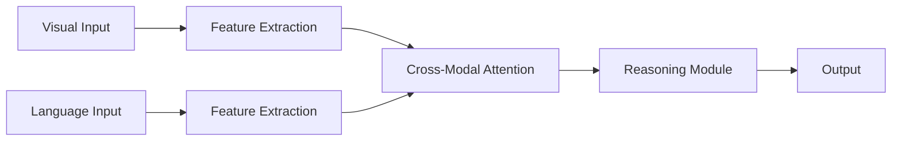
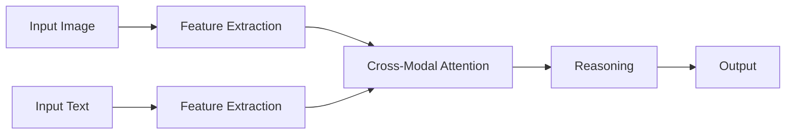
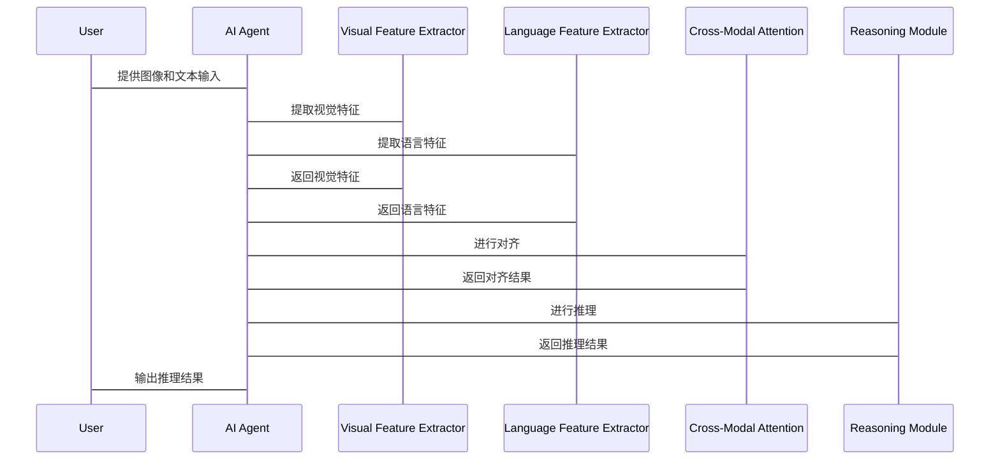

                 


# 开发具有视觉-语言跨模态推理能力的AI Agent

> 关键词：视觉-语言跨模态推理，AI Agent，深度学习，多模态对齐，知识图谱

> 摘要：本文详细探讨了开发具有视觉-语言跨模态推理能力的AI Agent的关键技术，包括跨模态推理的背景与核心概念、算法原理、系统架构设计、项目实战以及扩展与总结。通过理论与实践结合，为读者提供一个全面的指导框架，帮助理解并实现具有跨模态推理能力的AI Agent。

---

# 第一部分: 背景介绍与核心概念

## 第1章: 跨模态推理与AI Agent概述

### 1.1 跨模态推理的背景与问题背景

#### 1.1.1 跨模态推理的定义与问题背景
跨模态推理是指在多个信息模态（如视觉、语言、听觉等）之间建立关联并进行推理的过程。在AI Agent领域，跨模态推理的核心问题是：如何通过结合不同模态的信息，使AI Agent能够理解复杂的现实场景并做出合理的决策。

**问题背景**：
- 当前AI Agent主要依赖单一模态（如文本或图像）进行推理，难以应对复杂多变的现实场景。
- 跨模态推理可以弥补这一不足，通过结合视觉和语言信息，提升AI Agent的理解能力和决策能力。

#### 1.1.2 AI Agent的基本概念与功能
AI Agent是一种智能体，能够感知环境、执行任务并做出决策。AI Agent的功能包括：
- 感知环境：通过传感器或接口获取多模态信息。
- 理解信息：对获取的信息进行解析和处理。
- 推理与决策：基于理解和推理做出最优决策。
- 行动：执行决策任务，与环境互动。

#### 1.1.3 跨模态推理在AI Agent中的应用价值
- 提高AI Agent的理解能力，使其能够处理复杂场景。
- 增强人机交互的自然性，使AI Agent能够理解用户的意图。
- 在医疗、教育、安防等领域具有广泛的应用前景。

### 1.2 跨模态推理的核心概念

#### 1.2.1 視覺模态与语言模态的特征對比
- 視覺模态：具有空间性和层次性，能够捕捉场景中的细节信息。
- 語言模态：具有语义性和表达性，能够描述抽象概念。

#### 1.2.2 跨模态推理的基本原理
跨模态推理的核心是通过不同模态的信息互补，构建完整的知识图谱。例如，通过结合图像中的视觉信息和文本中的语义信息，推理出图像中的物体属性。

#### 1.2.3 跨模态推理的边界与外延
- 边界：跨模态推理仅关注不同模态之间的关联，不涉及单模态内部的推理。
- 外延：跨模态推理可以与其他技术（如知识图谱、强化学习）结合，形成更复杂的推理能力。

---

## 第2章: 跨模态推理的技术现状与挑战

### 2.1 跨模态推理的主要技术路线

#### 2.1.1 基于深度学习的跨模态推理
- 主要技术：利用深度学习模型（如Transformer）进行跨模态对齐和推理。
- 优势：能够自动学习模态间的关联关系。

#### 2.1.2 知识图谱与跨模态推理的结合
- 主要技术：将跨模态推理与知识图谱结合，构建语义网络。
- 优势：能够利用知识图谱中的先验知识辅助推理。

#### 2.1.3 跨模态检索与推理的融合
- 主要技术：结合跨模态检索技术，通过检索相似案例进行推理。
- 优势：能够快速获取相关知识，提高推理效率。

### 2.2 跨模态推理的主要挑战

#### 2.2.1 数据异构性问题
- 问题：不同模态的数据形式和特征空间差异较大。
- 解决方案：通过数据预处理和特征对齐技术减少异构性。

#### 2.2.2 跨模态对齐的难度
- 问题：如何在不同模态之间建立有效的关联。
- 解决方案：利用注意力机制和对比学习进行对齐。

#### 2.2.3 跨模态推理的可解释性
- 问题：跨模态推理的决策过程难以解释。
- 解决方案：通过可视化技术展示推理过程，增强可解释性。

---

# 第二部分: 跨模态推理的核心概念与联系

## 第3章: 跨模态推理的核心原理

### 3.1 視覺模态与语言模态的处理流程

#### 3.1.1 視覺特征提取
- 主要方法：使用卷积神经网络（CNN）提取图像特征。
- 输出：得到图像的高层次特征向量。

#### 3.1.2 語言特征提取
- 主要方法：使用Transformer提取文本特征。
- 输出：得到文本的高层次特征向量。

#### 3.1.3 跨模态对齐
- 主要方法：通过对比学习或注意力机制对齐视觉和语言特征。
- 输出：得到对齐后的特征向量。

### 3.2 跨模态推理的模型架构

#### 3.2.1 编码器-解码器架构
- 架构描述：
  - 编码器：将视觉和语言特征分别编码为向量。
  - 解码器：将编码后的向量解码为推理结果。

#### 3.2.2 注意力机制在跨模态推理中的应用
- 应用场景：通过注意力机制确定不同模态信息的重要程度。
- 公式：
  $$ attention = softmax(QK^T/K^T) $$

#### 3.2.3 跨模态融合策略
- 融合方法：将视觉和语言特征进行加权融合。
- 公式：
  $$ fusion = α·V + (1-α)·L $$

### 3.3 跨模态推理的核心概念与联系

#### 3.3.1 諫因推理
- 定义：基于已有的知识和证据进行推理。
- 应用：在图像描述中推理出隐藏的属性。

#### 3.3.2 覬合推理
- 定义：通过匹配不同模态的信息进行推理。
- 应用：在图像问答中匹配问题与图像内容。

#### 3.3.3 跨模态推理的数学模型
- 模型：$$ P(y|x_v, x_l) $$

---

## 第4章: 跨模态推理的实体关系图

### 4.1 跨模态推理的实体关系图


### 4.2 跨模态推理的流程图


---

## 第4章: 跨模态推理的实体关系图

### 4.1 跨模态推理的核心概念

#### 4.1.1 諫因推理
- 定义：基于已有的知识和证据进行推理。
- 应用：在图像描述中推理出隐藏的属性。

#### 4.1.2 覬合推理
- 定义：通过匹配不同模态的信息进行推理。
- 应用：在图像问答中匹配问题与图像内容。

#### 4.1.3 跨模态推理的数学模型
- 模型：$$ P(y|x_v, x_l) $$

### 4.2 跨模态推理的实体关系图


### 4.3 跨模态推理的流程图


---

# 第三部分: 算法原理与系统架构设计

## 第5章: 跨模态推理的算法原理

### 5.1 跨模态推理的模型结构

#### 5.1.1 编码器-解码器架构
- 架构描述：
  - 编码器：将视觉和语言特征分别编码为向量。
  - 解码器：将编码后的向量解码为推理结果。

#### 5.1.2 注意力机制
- 注意力机制在跨模态推理中的应用：
  - 通过注意力机制确定不同模态信息的重要程度。
  - 公式：$$ attention = softmax(QK^T/K^T) $$

#### 5.1.3 跨模态融合策略
- 融合方法：将视觉和语言特征进行加权融合。
- 公式：$$ fusion = α·V + (1-α)·L $$

### 5.2 跨模态推理的数学模型
- 模型：$$ P(y|x_v, x_l) $$

### 5.3 算法流程图


---

## 第6章: 系统分析与架构设计

### 6.1 问题场景介绍

#### 6.1.1 项目背景
- 项目目标：开发一个具有视觉-语言跨模态推理能力的AI Agent。
- 应用场景：图像描述生成、图像问答、场景理解等。

### 6.2 系统功能设计

#### 6.2.1 系统功能模块
- 模块1：视觉特征提取模块。
- 模块2：语言特征提取模块。
- 模块3：跨模态对齐模块。
- 模块4：推理模块。
- 模块5：输出模块。

#### 6.2.2 系统功能流程
- 流程：输入图像和文本，提取特征，进行跨模态对齐，推理结果，输出结果。

### 6.3 系统架构设计

#### 6.3.1 系统架构图


#### 6.3.2 系统接口设计
- 输入接口：图像输入接口、文本输入接口。
- 输出接口：推理结果输出接口。

#### 6.3.3 系统交互序列图


---

## 第7章: 项目实战

### 7.1 环境安装

#### 7.1.1 安装Python
- 版本：Python 3.8+

#### 7.1.2 安装深度学习框架
- 框架：TensorFlow或PyTorch

#### 7.1.3 安装其他依赖
- 依赖：numpy, matplotlib, etc.

### 7.2 系统核心实现源代码

#### 7.2.1 视觉特征提取代码
```python
import tensorflow as tf
from tensorflow.keras import layers

def visual_feature_extractor(input_image):
    model = tf.keras.Sequential([
        layers.Conv2D(32, (3,3), activation='relu'),
        layers.MaxPooling2D((2,2)),
        layers.Conv2D(64, (3,3), activation='relu'),
        layers.MaxPooling2D((2,2)),
        layers.Flatten(),
        layers.Dense(128, activation='relu')
    ])
    return model(input_image)
```

#### 7.2.2 语言特征提取代码
```python
def language_feature_extractor(input_text):
    model = tf.keras.Sequential([
        layers.Embedding(10000, 128),
        layers.LSTM(64, return_sequences=True),
        layers.GlobalAveragePooling1D()
    ])
    return model(input_text)
```

#### 7.2.3 跨模态对齐代码
```python
def cross_modal_attention(visual_features, language_features):
    query = visual_features
    key = language_features
    value = language_features

    attention = tf.keras.layers.Attention()
    result = attention([query, key, value])
    return result
```

#### 7.2.4 推理模块代码
```python
def reasoning_module(features):
    model = tf.keras.Sequential([
        layers.Dense(64, activation='relu'),
        layers.Dense(1, activation='sigmoid')
    ])
    return model(features)
```

---

## 第8章: 扩展与总结

### 8.1 项目总结

#### 8.1.1 项目成果
- 成功开发了一个具有视觉-语言跨模态推理能力的AI Agent。
- 实现了图像描述生成、图像问答等功能。

### 8.2 实际应用中的挑战

#### 8.2.1 数据异构性问题
- 解决方案：通过数据预处理和特征对齐技术减少异构性。

#### 8.2.2 推理的可解释性问题
- 解决方案：通过可视化技术展示推理过程，增强可解释性。

### 8.3 拓展与展望

#### 8.3.1 结合知识图谱的跨模态推理
- 通过结合知识图谱，提升推理的准确性和可解释性。

#### 8.3.2 强化学习在跨模态推理中的应用
- 探索强化学习在跨模态推理中的应用，提升AI Agent的决策能力。

### 8.4 最佳实践 Tips

#### 8.4.1 数据处理
- 数据清洗：确保数据的准确性和完整性。
- 数据增强：通过数据增强技术提升模型的泛化能力。

#### 8.4.2 模型优化
- 参数调整：通过超参数调优提升模型性能。
- 模型压缩：通过模型压缩技术降低计算成本。

### 8.5 小结
本文详细介绍了开发具有视觉-语言跨模态推理能力的AI Agent的关键技术，包括跨模态推理的背景与核心概念、算法原理、系统架构设计、项目实战以及扩展与总结。通过理论与实践结合，为读者提供了一个全面的指导框架。

---

## 第9章: 拓展阅读

### 9.1 推荐的书籍
- 《Deep Learning》 - Ian Goodfellow
- 《Attention is All You Need》 - Vaswani et al.

### 9.2 推荐的论文
- "A Convolutional Neural Network for Parisa" - Y. LeCun
- "Attention Mechanisms in NLP" - A. Vaswani

### 9.3 推荐的在线课程
- "Deep Learning Specialization" - Coursera
- "Transformers for NLP" - Hugging Face

---

通过本文的系统性分析与实践，读者可以全面掌握开发具有视觉-语言跨模态推理能力的AI Agent的核心技术，并能够将其应用于实际场景中。

