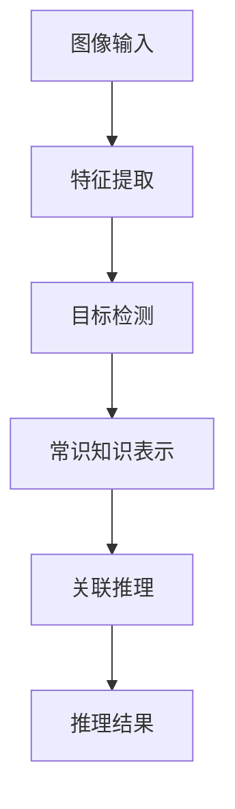
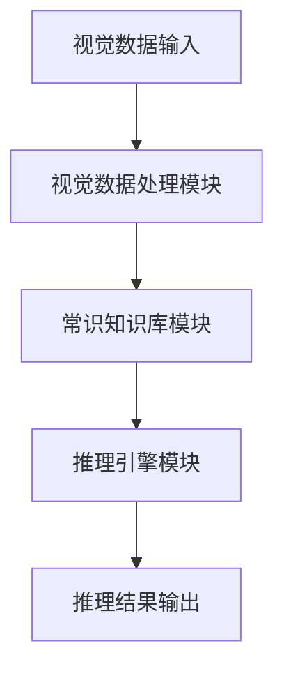

                 


# 开发具有视觉常识推理能力的AI Agent

## 关键词
- AI Agent, 视觉常识推理, 多模态数据, 知识图谱, 视觉推理算法, 系统架构设计

## 摘要
本文详细探讨了开发具有视觉常识推理能力的AI Agent的核心概念、算法原理、系统架构设计及项目实现。通过分析视觉数据与常识推理的结合，提出了一种基于多模态数据的推理框架，结合知识图谱和神经网络模型，构建了一个能够理解视觉信息并进行常识推理的AI Agent。文章从背景介绍到项目实战，层层深入，为读者提供了完整的开发思路和技术实现方案。

---

## 第一部分：背景介绍

### 第1章：问题背景与定义

#### 1.1 问题背景
随着人工智能技术的快速发展，AI Agent 在各个领域的应用越来越广泛。然而，现有的AI Agent大多依赖于单一数据源，缺乏对复杂场景的理解能力。尤其是在视觉领域，如何让AI Agent不仅能够识别图像中的物体，还能结合常识推理能力，理解场景中的上下文关系，成为一个亟待解决的问题。

#### 1.2 定义与目标
**AI Agent** 是指能够感知环境、自主决策并执行任务的智能体。视觉常识推理能力要求AI Agent能够通过视觉数据（如图像或视频）获取信息，并结合常识知识进行推理，从而理解场景中的潜在关系和逻辑。

#### 1.3 当前技术现状与挑战
目前，视觉推理技术主要集中在目标检测和图像识别，但在常识推理方面仍存在较大挑战。AI Agent需要能够处理多模态数据，整合视觉信息与常识知识，并在动态环境中进行实时推理，这对算法的复杂性和计算效率提出了更高的要求。

---

## 第二部分：核心概念与联系

### 第2章：视觉常识推理的核心原理

#### 2.1 视觉数据的理解与处理
视觉数据的处理是AI Agent的第一步，主要包括图像的特征提取、目标检测和语义理解。通过卷积神经网络（CNN）提取图像的低级特征，再利用注意力机制关注重要区域，最终实现对图像的语义理解。

#### 2.2 常识推理的逻辑框架
常识推理需要构建一个知识图谱，存储物体之间的关系、属性以及可能的推理规则。通过将视觉数据中的物体映射到知识图谱中，AI Agent可以利用图结构进行推理，推导出隐藏在常识中的逻辑关系。

#### 2.3 视觉与常识的关联推理
将视觉数据与常识知识进行关联，需要建立两者之间的桥梁。通过将图像中的物体特征与知识图谱中的节点进行匹配，AI Agent可以推断出物体之间的关系，从而理解场景中的潜在逻辑。

---

## 第三部分：算法原理

### 第3章：视觉常识推理算法的设计与实现

#### 3.1 算法框架
视觉常识推理算法的框架包括以下步骤：
1. **图像特征提取**：利用CNN提取图像的特征向量。
2. **目标检测与识别**：通过目标检测算法（如Faster R-CNN）识别图像中的物体。
3. **常识知识表示**：构建知识图谱，表示物体的属性和关系。
4. **关联推理**：将图像中的物体与知识图谱中的节点进行匹配，推导出物体之间的关系。

#### 3.2 算法流程图


#### 3.3 数学模型
视觉常识推理的数学模型基于图结构，表示为：
$$ R(x, y) $$
其中，\( R \) 表示物体 \( x \) 和 \( y \) 之间的关系。

通过注意力机制，模型可以关注图像中的重要区域，提高推理的准确性：
$$ \alpha_i = \frac{\exp(a_i)}{\sum_{j} \exp(a_j)} $$
其中，\( \alpha_i \) 是第 \( i \) 个区域的注意力权重，\( a_i \) 是该区域的注意力得分。

---

## 第四部分：系统架构设计

### 第4章：系统架构与功能设计

#### 4.1 系统功能模块
AI Agent的系统架构包括以下几个模块：
1. **视觉数据处理模块**：负责图像的特征提取和目标检测。
2. **常识知识库模块**：存储和管理常识知识，构建知识图谱。
3. **推理引擎模块**：实现视觉数据与常识知识的关联推理。
4. **交互接口模块**：与用户或外部系统进行交互。

#### 4.2 系统架构图


#### 4.3 系统接口设计
系统接口包括：
- **输入接口**：接收图像数据和用户指令。
- **输出接口**：输出推理结果和决策指令。

---

## 第五部分：项目实战

### 第5章：项目实现与案例分析

#### 5.1 环境搭建
- **工具安装**：安装Python、TensorFlow、PyTorch等工具。
- **数据集准备**：使用COCO数据集进行目标检测和图像分割。

#### 5.2 核心代码实现
```python
import tensorflow as tf
from tensorflow.keras import layers

# 图像特征提取网络
def feature_extractor(input_shape):
    model = tf.keras.Sequential()
    model.add(layers.Conv2D(32, (3,3), activation='relu', input_shape=input_shape))
    model.add(layers.MaxPooling2D((2,2)))
    model.add(layers.Conv2D(64, (3,3), activation='relu'))
    model.add(layers.MaxPooling2D((2,2)))
    return model

# 目标检测网络
def detection_network(input_shape):
    model = tf.keras.Sequential()
    model.add(feature_extractor(input_shape))
    model.add(layers.Flatten())
    model.add(layers.Dense(128, activation='relu'))
    model.add(layers.Dense(num_classes, activation='softmax'))
    return model
```

#### 5.3 实际案例分析
通过一个具体的案例，展示AI Agent如何利用视觉常识推理能力进行场景理解。例如，在一张厨房图片中，AI Agent能够识别出“锅”、“刀”等物体，并推理出“锅”用于烹饪，从而推断出可能的下一步动作。

---

## 第六部分：总结与展望

### 第6章：总结与未来发展

#### 6.1 总结
本文详细介绍了开发具有视觉常识推理能力的AI Agent的核心概念、算法原理和系统架构设计。通过结合多模态数据和知识图谱，构建了一个能够理解视觉信息并进行常识推理的AI Agent。

#### 6.2 未来展望
未来的研究方向包括：
1. 提高推理的效率和准确性。
2. 扩展知识图谱的规模和深度。
3. 实现多模态数据的更高效融合。

---

## 附录

### 附录A：工具安装指南
- Python安装：`pip install python`
- TensorFlow安装：`pip install tensorflow`

### 附录B：数据集信息
- COCO数据集下载地址：[COCO Dataset](https://cocodataset.org/)

### 附录C：参考文献
- [1] LeCun, Y., Bengio, Y., & Hinton, G. (2015). Deep learning. Nature, 521(7555), 436-444.

---

通过以上目录和内容，您可以逐步撰写完整的技术博客文章。每一部分都需要详细展开，确保内容的深度和广度，同时保持逻辑的连贯性和语言的专业性。

