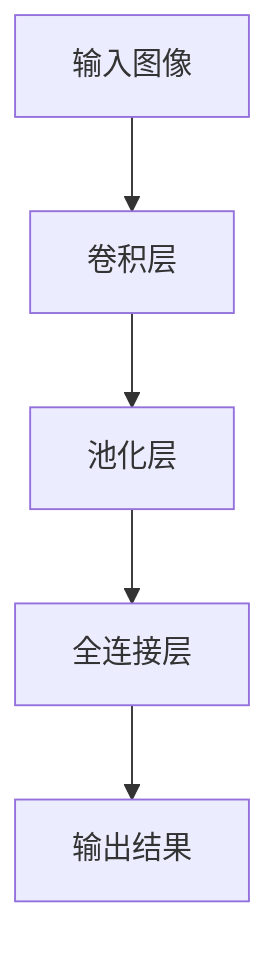
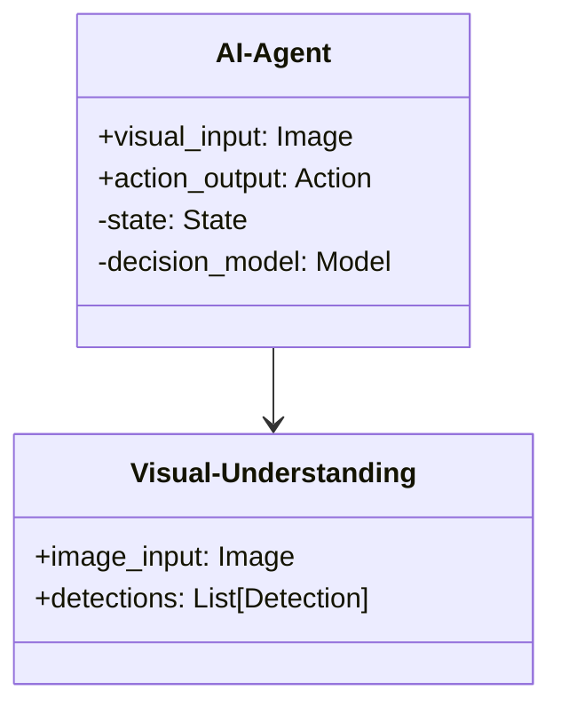
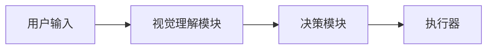

                 


# 开发具有视觉理解能力的AI Agent

**关键词：** AI Agent, 视觉理解, 机器学习, 深度学习, 计算机视觉

**摘要：** 本文详细探讨了开发具有视觉理解能力的AI Agent所需的关键技术与实现方法。通过分析AI Agent的核心概念、视觉理解的原理及其与AI Agent的结合，本文提供了从理论到实践的全面指导，包括算法原理、系统架构设计、项目实战等内容，帮助读者逐步掌握开发具有视觉理解能力的AI Agent的技能。

---

## 第一部分: 开发具有视觉理解能力的AI Agent概述

### 第1章: 背景介绍与核心概念

#### 1.1 问题背景

- **AI Agent的发展现状：** AI Agent作为一种智能体，广泛应用于自动驾驶、智能助手、机器人等领域。然而，现有的AI Agent在视觉理解能力上仍有不足，难以处理复杂的真实场景。
- **视觉理解能力的重要性：** 视觉理解是AI Agent与现实环境交互的关键能力，能够帮助其识别、理解并操作视觉信息，从而提高决策的准确性。
- **当前技术的局限性与挑战：** 当前的视觉理解技术在复杂场景下的鲁棒性不足，且与AI Agent的结合还不够紧密，难以实现端到端的视觉-决策闭环。

#### 1.2 核心概念与问题描述

- **AI Agent的定义：** AI Agent是一种能够感知环境、执行任务并做出决策的智能实体。
- **视觉理解的定义：** 视觉理解是AI Agent通过视觉传感器（如摄像头）获取环境信息，并通过图像处理、目标识别等技术理解环境的能力。
- **问题解决目标与边界：** 本文的目标是开发一种AI Agent，使其能够通过视觉理解技术识别环境中的物体、场景，并基于此做出决策。边界包括不考虑听觉、触觉等其他感官输入，专注于视觉信息的处理。
- **核心概念的结构与要素：** AI Agent的视觉理解能力由视觉感知模块、视觉理解模块和决策模块组成，各模块协同工作以实现对环境的感知和决策。

---

### 第2章: 核心概念与联系

#### 2.1 核心概念原理

- **AI Agent的工作原理：** AI Agent通过感知环境、接收输入，利用内部模型进行决策，并通过执行器输出动作。
- **视觉理解的核心机制：** 视觉理解基于图像处理、目标检测、语义分割等技术，将输入的图像转化为可理解的语义信息。
- **两者结合的实现逻辑：** AI Agent通过视觉感知模块获取环境图像，经过视觉理解模块处理后，将语义信息输入决策模块，最终生成行动策略。

#### 2.2 概念属性对比

| **属性**       | **AI Agent**                | **视觉理解**               |
|-----------------|-----------------------------|-----------------------------|
| 输入            | 多种感知输入（视觉、听觉等） | 图像或视频流                 |
| 输出            | 动作或决策                  | 语义信息或目标识别结果     |
| 处理方式        | 综合分析多种信息            | 专注于图像信息处理           |
| 应用场景        | 自动驾驶、智能助手          | 图像识别、场景理解           |

#### 2.3 ER实体关系图

```mermaid
erd
    entity(AI Agent) {
        id: int
        name: string
        capability: string
    }
    entity(Visual Understanding) {
        id: int
        input: string
        output: string
    }
    AI Agent -- 多对多 --> Visual Understanding
```

---

## 第二部分: 算法原理讲解

### 第3章: 算法原理

#### 3.1 算法原理

- **视觉识别算法流程：** 视觉识别通常包括图像预处理、特征提取、分类器训练和结果输出四个步骤。
- **基于CNN的目标检测算法：** 使用卷积神经网络（CNN）进行目标检测，通过滑动窗口或区域建议网络（RPN）生成候选框，并通过分类器进行目标识别。

#### 3.2 Python实现

##### 环境安装

```bash
pip install numpy
pip install tensorflow
pip install matplotlib
```

##### 核心代码实现

```python
import numpy as np
import tensorflow as tf
import matplotlib.pyplot as plt

# 加载预训练模型
model = tf.keras.applications.VGG16(weights='imagenet', include_top=False)

# 自定义分类器
def build_classifier():
    model = tf.keras.Sequential()
    model.add(tf.keras.layers.Flatten())
    model.add(tf.keras.layers.Dense(256, activation='relu'))
    model.add(tf.keras.layers.Dense(10, activation='softmax'))
    return model

# 训练模型
model.compile(optimizer='adam', loss='sparse_categorical_crossentropy', metrics=['accuracy'])
model.fit(x_train, y_train, epochs=10, batch_size=32)
```

#### 3.3 算法流程图



---

## 第三部分: 数学模型

### 第4章: 数学模型

#### 4.1 深度学习模型的数学表达

卷积神经网络（CNN）的基本结构可以表示为：

$$
f(x) = \max\left( W \cdot x + b, 0 \right)
$$

其中，\( W \) 是卷积核权重，\( b \) 是偏置项，\( x \) 是输入特征图。

#### 4.2 损失函数与优化器

交叉熵损失函数可以表示为：

$$
L = -\sum_{i=1}^{n} y_i \log(p_i) + (1 - y_i)\log(1 - p_i)
$$

其中，\( y_i \) 是标签，\( p_i \) 是模型预测的概率。

优化器通常使用Adam：

$$
\theta_{t+1} = \theta_t - \eta \frac{\partial L}{\partial \theta_t}
$$

---

## 第四部分: 系统架构设计

### 第5章: 系统架构设计

#### 5.1 系统功能设计

- **领域模型：** 定义系统的功能模块及其交互关系。



- **系统架构设计：** 使用分层架构，包括感知层、处理层和决策层。



---

## 第五部分: 项目实战

### 第6章: 项目实战

#### 6.1 环境安装

```bash
pip install numpy
pip install tensorflow
pip install matplotlib
```

#### 6.2 核心代码实现

```python
import numpy as np
import tensorflow as tf
import matplotlib.pyplot as plt

# 加载预训练模型
model = tf.keras.applications.VGG16(weights='imagenet', include_top=False)

# 自定义分类器
def build_classifier():
    model = tf.keras.Sequential()
    model.add(tf.keras.layers.Flatten())
    model.add(tf.keras.layers.Dense(256, activation='relu'))
    model.add(tf.keras.layers.Dense(10, activation='softmax'))
    return model

# 训练模型
model.compile(optimizer='adam', loss='sparse_categorical_crossentropy', metrics=['accuracy'])
model.fit(x_train, y_train, epochs=10, batch_size=32)
```

#### 6.3 案例分析

通过实际案例分析，展示AI Agent在视觉理解任务中的应用，如自动驾驶中的目标检测和路径规划。

---

## 第六部分: 扩展阅读

### 第7章: 扩展阅读

#### 7.1 相关技术与未来趋势

- **相关技术：** 如Transformer在视觉任务中的应用、多模态学习等。
- **未来趋势：** 更强大的视觉模型（如视觉大语言模型）、更高效的算法优化、更广泛的应用场景。

#### 7.2 最佳实践 tips

- **数据预处理：** 确保数据的多样性和代表性。
- **模型优化：** 使用迁移学习和数据增强技术提高模型的泛化能力。
- **性能评估：** 使用准确率、召回率、F1分数等指标评估模型性能。

---

通过以上章节的详细讲解，读者可以逐步掌握开发具有视觉理解能力的AI Agent的核心技术与实现方法。从理论到实践，本文为读者提供了全面的指导和丰富的代码示例，帮助他们在实际项目中应用这些技术。

