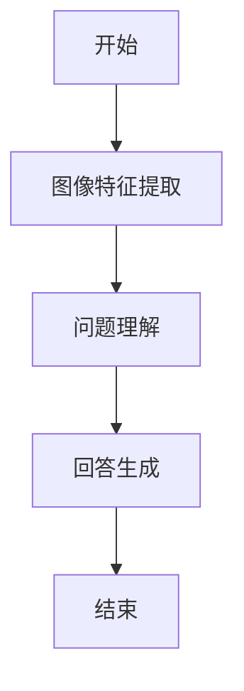
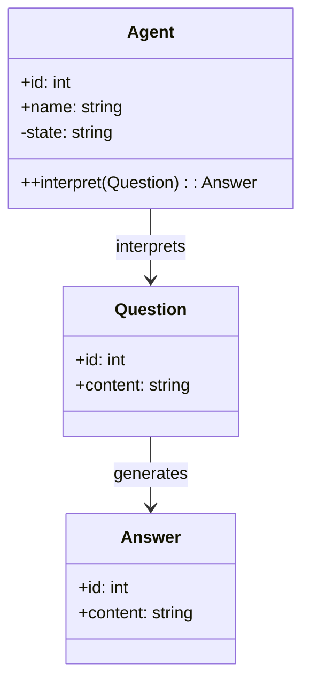
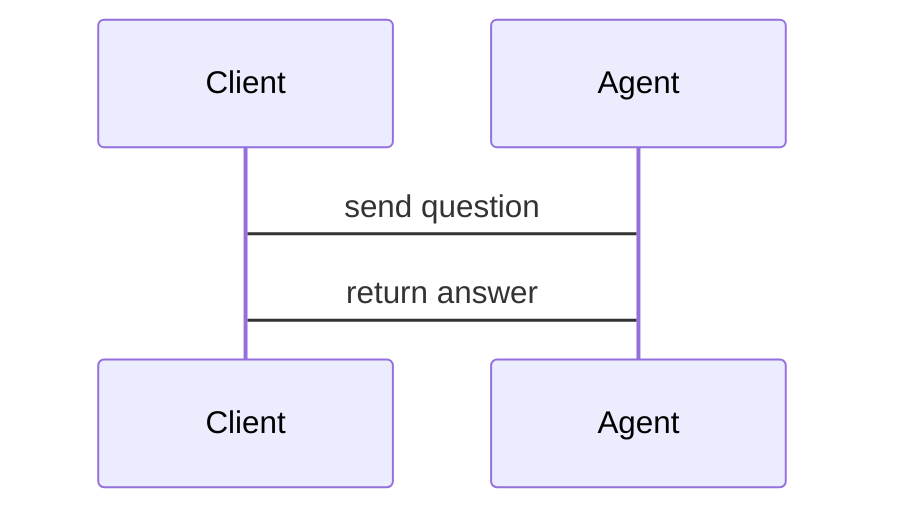

                 


# 开发具有视觉问答能力的AI Agent

> 关键词：视觉问答，AI Agent，多模态数据处理，深度学习，计算机视觉，自然语言处理

> 摘要：本文详细探讨了开发具有视觉问答能力的AI Agent的各个方面，包括背景介绍、核心概念、算法原理、系统架构、项目实战以及最佳实践。通过系统的分析和实际案例，帮助读者理解如何构建一个能够通过视觉数据进行问答交互的智能代理。

---

# 第1章: 背景介绍

## 1.1 问题背景

### 1.1.1 视觉问答的定义与目标
视觉问答（Visual Question Answering, VQA）是一种结合了计算机视觉和自然语言处理的任务，旨在让AI系统能够通过分析图像并回答与图像内容相关的问题。其目标是理解图像中的视觉信息，并将其与语言信息相结合，生成有意义的回答。

### 1.1.2 AI Agent在视觉问答中的作用
AI Agent作为一种智能代理，能够通过视觉问答技术与人类进行交互，理解用户的问题，并基于图像内容生成准确的回答。这种能力使得AI Agent能够应用于多个领域，如智能助手、图像搜索引擎等。

### 1.1.3 当前技术的挑战与机遇
尽管视觉问答技术取得了显著进展，但仍面临许多挑战，如图像理解的复杂性、问题多样性以及回答生成的准确性。这些挑战为技术的发展带来了机遇，推动了AI Agent在视觉问答领域的进一步研究和应用。

## 1.2 问题描述

### 1.2.1 视觉问答的核心问题
视觉问答的核心问题在于如何将图像中的视觉信息与语言信息结合起来，生成准确的回答。这需要AI系统具备强大的图像理解和语言处理能力。

### 1.2.2 AI Agent的交互需求
AI Agent需要能够通过自然语言与用户交互，理解用户的问题，并基于图像内容生成回答。这种交互需求要求系统具备高效的处理能力和准确的理解能力。

### 1.2.3 问题解决的边界与外延
视觉问答的边界在于图像内容的理解和问题的相关性，外延则包括多模态数据的处理、上下文的理解以及多语言支持等。

## 1.3 核心概念与组成

### 1.3.1 AI Agent的结构与功能
AI Agent通常由感知层、认知层和行动层组成。感知层负责获取图像数据，认知层负责理解和生成回答，行动层负责执行交互操作。

### 1.3.2 视觉问答的关键要素
视觉问答的关键要素包括图像理解、问题理解和回答生成。这些要素需要协同工作，才能实现高效的问答交互。

### 1.3.3 核心概念的系统性分析
通过系统性分析，可以发现视觉问答的核心在于多模态数据的处理和融合。AI Agent需要能够将图像信息与语言信息相结合，生成准确的回答。

---

# 第2章: 核心概念与联系

## 2.1 AI Agent的核心原理

### 2.1.1 AI Agent的定义与分类
AI Agent是一种智能系统，能够感知环境并执行任务。根据功能和应用场景的不同，AI Agent可以分为多种类型，如基于规则的代理、基于模型的代理等。

### 2.1.2 视觉问答的实现机制
视觉问答的实现机制包括图像特征提取、问题理解、回答生成等步骤。这些步骤需要协同工作，才能实现高效的问答交互。

### 2.1.3 多模态数据处理的关键技术
多模态数据处理的关键技术包括图像处理、自然语言处理和数据融合技术。这些技术能够帮助AI Agent更好地理解和处理多模态数据。

## 2.2 核心概念对比分析

### 2.2.1 AI Agent与传统问答系统的区别
AI Agent能够处理多模态数据，具有更强的交互能力和适应性，而传统问答系统主要依赖文本数据，功能相对单一。

### 2.2.2 视觉问答与文本问答的对比
视觉问答需要处理图像数据，回答生成需要结合图像内容，而文本问答仅依赖文本数据。视觉问答的复杂性更高，但应用场景更广泛。

### 2.2.3 系统性能对比的特征分析
视觉问答系统的性能受到图像质量、问题复杂性以及模型精度的影响。通过对比分析，可以找到性能优化的方向。

## 2.3 实体关系图

### 2.3.1 ER实体关系图展示
```mermaid
er
    entity(Agent) {
        id: int
        name: string
    }
    entity(Question) {
        id: int
        content: string
    }
    entity(Answer) {
        id: int
        content: string
    }
    relation(Agent, Question, "asks")
    relation(Question, Answer, "generates")
```

---

# 第3章: 算法原理讲解

## 3.1 视觉问答算法概述

### 3.1.1 算法原理
视觉问答算法通常包括图像特征提取、问题理解、回答生成等步骤。图像特征提取可以使用卷积神经网络（CNN）进行，问题理解可以基于自然语言处理技术，回答生成则需要结合图像和问题的语义信息。

### 3.1.2 算法步骤
1. **图像特征提取**：使用CNN提取图像的特征向量。
2. **问题理解**：将问题转化为向量表示。
3. **回答生成**：结合图像特征和问题向量，生成回答。

### 3.1.3 算法流程图


## 3.2 算法实现细节

### 3.2.1 图像特征提取
图像特征提取通常使用预训练的CNN模型，如ResNet、VGG等。特征向量可以用于表示图像的语义信息。

### 3.2.2 问题理解
问题理解需要将自然语言问题转化为向量表示，常用的方法包括词嵌入（Word2Vec）和BERT等模型。

### 3.2.3 回答生成
回答生成需要结合图像特征和问题向量，通常使用生成对抗网络（GAN）或变压器模型（Transformer）进行。

---

# 第4章: 数学模型与公式

## 4.1 视觉问答的数学模型

### 4.1.1 图像表示
图像通常表示为RGB矩阵，每个像素的值为$R, G, B$的组合。

### 4.1.2 特征提取
使用CNN提取图像特征，可以表示为一个向量$F \in \mathbb{R}^{d}$，其中$d$是特征维度。

### 4.1.3 问题表示
问题可以表示为一个向量$Q \in \mathbb{R}^{m}$，其中$m$是词嵌入的维度。

### 4.1.4 回答生成
回答生成可以使用序列到序列模型，如Transformer。回答概率分布为$p(y|x)$，其中$x$是输入。

---

# 第5章: 系统分析与架构设计

## 5.1 系统架构设计

### 5.1.1 领域模型


### 5.1.2 系统架构


### 5.1.3 接口与交互


---

# 第6章: 项目实战

## 6.1 项目介绍

### 6.1.1 项目目标
开发一个能够通过视觉问答与用户交互的AI Agent。

### 6.1.2 项目环境
需要安装Python、TensorFlow、Keras等库。

## 6.2 核心代码实现

### 6.2.1 图像特征提取
```python
import tensorflow as tf
from tensorflow.keras.applications import ResNet50
from tensorflow.keras.applications import imagenet_utils

model = ResNet50(weights='imagenet', include_top=False)
def extract_features(image):
    return model.predict(image)
```

### 6.2.2 问题理解
```python
from transformers import BertTokenizer, TFBertModel

tokenizer = BertTokenizer.from_pretrained('bert-base-uncased')
model = TFBertModel.from_pretrained('bert-base-uncased')

def understand_question(question):
    inputs = tokenizer(question, return_tensors='tf')
    outputs = model(inputs.input_ids, inputs.attention_mask)
    return outputs.last_hidden_state[0, 0, :]
```

### 6.2.3 回答生成
```python
from tensorflow.keras.layers import Input, Dense, Dropout, LSTM
from tensorflow.keras.models import Model

input_features = Input(shape=(d,))
input_question = Input(shape=(m,))
x = LSTM(64, return_sequences=True)(input_question)
x = Dense(32, activation='relu')(x)
x = Dropout(0.5)(x)
output = Dense(vocab_size, activation='softmax')(x)

model = Model(inputs=[input_features, input_question], outputs=output)
model.compile(optimizer='adam', loss='sparse_categorical_crossentropy', metrics=['accuracy'])
```

## 6.3 实际案例分析

### 6.3.1 案例1
**问题**：图中有什么颜色的猫？
**回答**：图中有一只橙色的猫。

### 6.3.2 案例2
**问题**：这是什么类型的花？
**回答**：这是一朵玫瑰花。

---

# 第7章: 最佳实践

## 7.1 小结
开发具有视觉问答能力的AI Agent需要结合计算机视觉和自然语言处理技术，通过多模态数据的处理和融合，实现高效的问答交互。

## 7.2 注意事项
- 数据预处理和标注需要仔细，确保数据质量。
- 模型训练需要选择合适的优化算法和超参数。
- 系统设计需要考虑扩展性和可维护性。

## 7.3 拓展阅读
- 《Deep Learning for Visual Question Answering》
- 《Transformers for NLP and Beyond》
- 《Multi-modal Data Processing with Python》

---

通过以上步骤，我们可以系统地开发一个具有视觉问答能力的AI Agent，结合理论和实践，提升系统的性能和用户体验。

