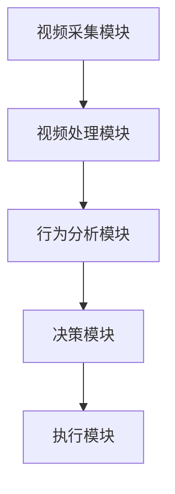
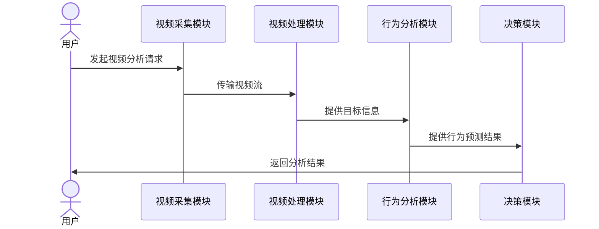

                 


# 开发具有视频分析能力的AI Agent

## 关键词：AI Agent，视频分析，目标检测，行为分析，深度学习，计算机视觉

## 摘要：  
本文将详细探讨如何开发具有视频分析能力的AI Agent。文章从视频分析的基本概念和AI Agent的核心能力入手，逐步分析视频分析的关键技术，如目标检测、跟踪和行为分析。接着，深入讲解AI Agent的算法原理、系统架构设计，以及如何在实际项目中实现这些功能。通过具体的代码实现和案例分析，帮助读者全面理解如何构建一个高效的视频分析AI Agent。

---

## 第1章: 视频分析与AI Agent概述

### 1.1 视频分析的基本概念  
视频分析是通过对视频流中的图像进行处理和理解，提取有用的信息，如目标检测、行为识别等。其核心目标是将视频数据转化为可理解的结构化信息。  

#### 1.1.1 视频分析的定义  
视频分析是一种基于计算机视觉的技术，通过对连续图像序列的处理，提取目标、行为和场景信息。  

#### 1.1.2 视频分析的关键技术  
- **目标检测**: 识别视频中的目标物体（如人、车辆、动物等）。  
- **目标跟踪**: 跟踪目标物体在视频中的运动轨迹。  
- **行为分析**: 理解目标物体的行为模式（如行走、跑步、挥手等）。  

#### 1.1.3 AI Agent的基本概念  
AI Agent是一种智能代理，能够感知环境、做出决策并执行操作。在视频分析中，AI Agent可以作为处理视频数据的核心模块。  

### 1.2 视频分析与AI Agent的结合  
AI Agent通过视频分析技术，能够实现对视频数据的实时监控、目标识别和行为预测。  

#### 1.2.1 视频分析在AI Agent中的作用  
- 提供实时的环境感知能力。  
- 通过目标检测和跟踪，实现对场景中物体的识别与定位。  
- 通过行为分析，预测目标的下一步动作。  

#### 1.2.2 AI Agent在视频分析中的优势  
- **实时性**: AI Agent能够快速处理视频流，提供实时反馈。  
- **智能性**: 通过深度学习算法，AI Agent能够理解复杂的场景信息。  
- **可扩展性**: AI Agent可以根据需求扩展功能，支持多种视频分析任务。  

#### 1.2.3 视频分析与AI Agent的协同工作  
视频分析为AI Agent提供数据输入，AI Agent通过分析这些数据，做出决策并执行操作。两者协同工作，能够实现对视频数据的深度理解和智能处理。  

### 1.3 本章小结  
- 视频分析的核心技术包括目标检测、跟踪和行为分析。  
- AI Agent是一种智能代理，能够通过视频分析技术实现对视频数据的处理和理解。  
- 两者结合能够实现高效的视频监控和智能决策。  

---

## 第2章: 视频分析的核心技术

### 2.1 目标检测  
目标检测是视频分析中的基础技术，用于识别视频中的目标物体。  

#### 2.1.1 目标检测的定义  
目标检测是指在图像中定位目标物体并识别其类别。  

#### 2.1.2 常见的目标检测算法  
- **YOLO**: 实时目标检测算法，速度快且精度高。  
- **FRCNN**: 基于区域的卷积神经网络，适合复杂场景。  

#### 2.1.3 目标检测的实现步骤  
1. 图像预处理：调整图像尺寸和归一化。  
2. 特征提取：通过卷积神经网络提取图像特征。  
3. 边界框回归：预测目标物体的边界框。  
4. 类别预测：预测目标物体的类别。  

#### 2.1.4 目标检测的数学模型  
目标检测的损失函数通常包括分类损失和回归损失：  
$$ \text{损失函数} = \text{分类损失} + \text{回归损失} $$  

### 2.2 视频跟踪  
视频跟踪是目标检测的延伸，用于跟踪目标物体的运动轨迹。  

#### 2.2.1 视频跟踪的定义  
视频跟踪是指在视频流中持续跟踪目标物体的运动轨迹。  

#### 2.2.2 常见的视频跟踪算法  
- **KCF**: 基于核的跟踪算法，速度快且鲁棒性高。  
- **SORT**: 基于匈牙利算法的跟踪方法，适合复杂场景。  

#### 2.2.3 视频跟踪的实现步骤  
1. 初始化：检测第一个目标物体并记录其特征。  
2. 跟踪：在后续帧中匹配目标物体的特征，更新其位置和轨迹。  

### 2.3 行为分析  
行为分析是视频分析的高级技术，用于理解目标物体的行为模式。  

#### 2.3.1 行为分析的定义  
行为分析是指通过视频数据理解目标物体的行为模式。  

#### 2.3.2 常见的行为分析算法  
- **时序卷积网络**: 基于时间序列的卷积神经网络，适合行为识别。  
- **3D-CNN**: 基于三维卷积的网络，能够捕捉空间和时间信息。  

#### 2.3.3 行为分析的实现步骤  
1. 提取视频片段：将视频分为多个短片段。  
2. 特征提取：提取每个片段的特征向量。  
3. 行为分类：通过分类器识别行为类型。  

### 2.4 本章小结  
- 目标检测是视频分析的基础，用于识别目标物体。  
- 视频跟踪是目标检测的延伸，用于跟踪目标物体的运动轨迹。  
- 行为分析是视频分析的高级技术，用于理解目标物体的行为模式。  

---

## 第3章: AI Agent的核心能力

### 3.1 AI Agent的感知能力  
感知能力是AI Agent通过传感器或摄像头获取环境信息的能力。  

#### 3.1.1 视觉感知的定义  
视觉感知是指AI Agent通过摄像头获取图像信息并进行处理的能力。  

#### 3.1.2 视觉感知的关键技术  
- **图像分割**: 将图像划分为不同的区域，识别目标物体。  
- **场景理解**: 通过图像理解场景中的物体和关系。  

#### 3.1.3 视觉感知的实现步骤  
1. 图像采集：通过摄像头获取视频流。  
2. 图像处理：对图像进行预处理，如去噪和增强。  
3. 目标识别：通过目标检测算法识别目标物体。  

### 3.2 AI Agent的决策能力  
决策能力是AI Agent根据感知信息做出决策的能力。  

#### 3.2.1 决策能力的定义  
决策能力是指AI Agent根据感知信息做出最优选择的能力。  

#### 3.2.2 常见的决策算法  
- **强化学习**: 通过奖励机制优化决策策略。  
- **决策树**: 通过树状结构进行决策。  

#### 3.2.3 决策能力的实现步骤  
1. 状态感知：获取当前环境的状态信息。  
2. 状态评估：评估每个可能的动作及其结果。  
3. 动作选择：选择最优动作并执行。  

### 3.3 AI Agent的执行能力  
执行能力是AI Agent根据决策结果执行操作的能力。  

#### 3.3.1 执行能力的定义  
执行能力是指AI Agent根据决策结果执行操作的能力。  

#### 3.3.2 执行能力的关键技术  
- **机器人控制**: 通过指令控制机器人执行动作。  
- **智能交互**: 与人类或其他系统进行交互。  

#### 3.3.3 执行能力的实现步骤  
1. 接收决策结果：获取AI Agent的决策指令。  
2. 系统控制：通过指令控制相关设备执行动作。  
3. 反馈收集：收集执行结果并反馈给AI Agent。  

### 3.4 本章小结  
- AI Agent的感知能力通过视觉感知技术获取环境信息。  
- 决策能力通过强化学习或决策树等算法做出决策。  
- 执行能力通过机器人控制或智能交互执行操作。  

---

## 第4章: 视频分析AI Agent的系统架构设计

### 4.1 系统功能设计  
视频分析AI Agent的功能模块包括：  
- 视频采集模块：负责采集视频流。  
- 视频处理模块：负责目标检测和跟踪。  
- 行为分析模块：负责行为识别和预测。  
- 决策模块：根据行为分析结果做出决策。  

### 4.2 系统架构设计  
系统架构采用模块化设计，各模块之间通过接口进行通信。  

#### 4.2.1 系统架构图  


### 4.3 接口设计  
各模块之间的接口设计如下：  
- 视频采集模块向视频处理模块提供视频流。  
- 视频处理模块向行为分析模块提供目标信息。  
- 行为分析模块向决策模块提供行为预测结果。  

### 4.4 交互设计  
AI Agent与用户或其他系统的交互流程如下：  



### 4.5 本章小结  
- 系统功能设计包括视频采集、处理、行为分析和决策模块。  
- 系统架构采用模块化设计，各模块通过接口进行通信。  
- 交互设计通过序列图展示AI Agent与用户或其他系统的交互流程。  

---

## 第5章: 项目实战——开发视频分析AI Agent

### 5.1 环境搭建  
开发环境包括：  
- 操作系统：Linux或Windows。  
- 开发工具：Python、TensorFlow、OpenCV。  

### 5.2 核心代码实现  
以下为视频分析AI Agent的核心代码示例：  

#### 5.2.1 目标检测代码  
```python
import tensorflow as tf
from tensorflow.keras import layers

model = tf.keras.Sequential([
    layers.Conv2D(32, (3, 3), activation='relu'),
    layers.MaxPooling2D((2, 2)),
    layers.Conv2D(64, (3, 3), activation='relu'),
    layers.MaxPooling2D((2, 2)),
    layers.Flatten(),
    layers.Dense(128, activation='relu'),
    layers.Dense(10, activation='softmax')
])

model.compile(optimizer='adam', loss='sparse_categorical_crossentropy', metrics=['accuracy'])
model.fit(x_train, y_train, epochs=10, validation_data=(x_test, y_test))
```

#### 5.2.2 行为分析代码  
```python
import numpy as np
from sklearn.tree import DecisionTreeClassifier

# 假设X为特征向量，y为行为标签
clf = DecisionTreeClassifier()
clf.fit(X, y)
```

### 5.3 案例分析  
以智能安防场景为例，AI Agent可以实现以下功能：  
- 实时监控视频流，检测异常行为。  
- 识别可疑人物并发出警报。  

### 5.4 项目小结  
- 通过目标检测和行为分析算法，AI Agent能够实现高效的视频监控。  
- 项目实战展示了AI Agent在实际场景中的应用价值。  

---

## 第6章: 视频分析AI Agent的优化与展望

### 6.1 技术优化  
- 提高算法的计算效率，降低延迟。  
- 增强模型的鲁棒性，适应复杂场景。  

### 6.2 未来展望  
- 结合5G和边缘计算，实现更高效的视频分析。  
- 研究更先进的AI算法，如大语言模型（LLM）与视频分析的结合。  

### 6.3 本章小结  
- 技术优化能够提高AI Agent的性能和适应性。  
- 未来展望展示了视频分析AI Agent的发展方向和潜力。  

---

## 结语  
开发具有视频分析能力的AI Agent是一项复杂的工程，需要结合计算机视觉、深度学习和智能决策等技术。通过本文的详细讲解，读者可以全面了解视频分析AI Agent的核心技术、系统架构和实际应用。未来，随着技术的进步，视频分析AI Agent将在更多领域发挥重要作用。

---

