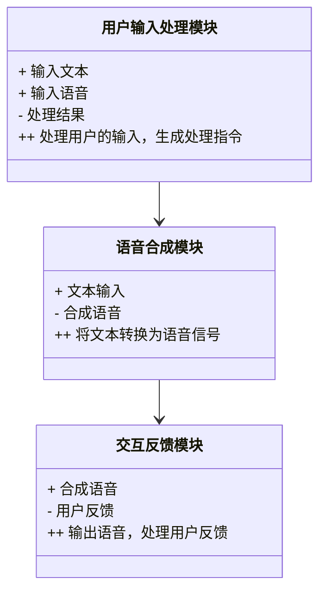
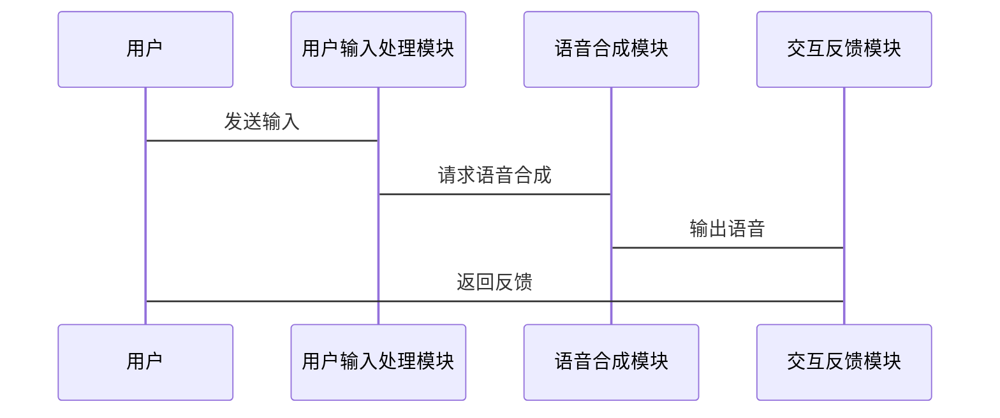

                 


# 开发具有语音合成能力的AI Agent

## 关键词：AI Agent，语音合成，TTS，深度学习，自然语言处理

## 摘要：  
随着人工智能技术的快速发展，AI Agent（智能代理）在各个领域的应用越来越广泛。语音合成作为人机交互的重要方式之一，能够显著提升用户体验。本文将详细探讨如何开发具有语音合成能力的AI Agent，涵盖核心概念、算法原理、系统架构设计以及项目实战等内容，帮助读者从零开始掌握这一技术。

---

# 第一章: AI Agent与语音合成概述

## 1.1 AI Agent的基本概念  
### 1.1.1 什么是AI Agent  
AI Agent（人工智能代理）是一种能够感知环境、自主决策并执行任务的智能系统。它通过与用户的交互或环境的反馈来完成特定目标。  

### 1.1.2 AI Agent的核心功能  
1. **感知环境**：通过传感器或用户输入获取信息。  
2. **决策与推理**：基于获取的信息进行分析和推理，做出最优决策。  
3. **执行任务**：根据决策结果执行具体的操作，如生成语音、发送邮件等。  

### 1.1.3 AI Agent的应用场景  
- 智能音箱（如Amazon Alexa、Google Home）  
- 虚拟助手（如Siri、Google Assistant）  
- 智能客服系统  
- 教育领域的智能辅导系统  

## 1.2 语音合成技术的基本原理  
### 1.2.1 语音合成的定义  
语音合成（Text-to-Speech, TTS）是将文本转换为自然语音的过程。  

### 1.2.2 语音合成的关键技术  
1. **文本分析**：将输入文本分割为单词、句子，并分析其语法结构。  
2. **语音生成**：基于文本分析结果生成语音信号。  
3. **语音优化**：调整语音的音调、速度和语调，使其更自然。  

### 1.2.3 语音合成的应用领域  
- 智能客服  
- 有声读物  
- 视频字幕生成  
- 无障碍技术（帮助视障人士）  

## 1.3 AI Agent与语音合成的结合  
### 1.3.1 AI Agent中集成语音合成的意义  
- 提供更自然的交互方式  
- 支持多语言或多方言的语音输出  
- 增强用户体验  

### 1.3.2 语音合成在AI Agent中的应用场景  
- **智能音箱**：通过语音合成技术实现对话交互。  
- **虚拟助手**：支持语音输出，帮助用户完成任务。  
- **教育工具**：为学习者提供语音指导。  

### 1.3.3 语音合成对用户体验的提升  
- 更直观的交互方式  
- 支持多种语言和方言  
- 提高用户满意度  

## 1.4 本章小结  
本章介绍了AI Agent和语音合成的基本概念，分析了两者的结合方式及其应用场景。通过集成语音合成技术，AI Agent能够为用户提供更智能、更自然的交互体验。

---

# 第二章: AI Agent与语音合成的核心概念与原理

## 2.1 AI Agent的智能模型  
### 2.1.1 人工智能的基本概念  
人工智能（AI）是模拟人类智能的计算机系统，涵盖学习、推理、感知和决策等多个方面。  

### 2.1.2 机器学习与深度学习的原理  
- **机器学习**：通过数据训练模型，使其能够从经验中学习。  
- **深度学习**：基于人工神经网络的机器学习方法，能够处理复杂的非结构化数据。  

### 2.1.3 自然语言处理在AI Agent中的应用  
- **文本理解**：通过NLP技术分析用户输入的文本，理解其意图。  
- **语音生成**：利用NLP生成自然的语音输出。  

## 2.2 语音合成的核心技术  
### 2.2.1 文本到语音（TTS）的基本原理  
TTS系统通过将文本转换为语音信号，生成可听的语音输出。  

### 2.2.2 语音合成的算法选择  
- **基于规则的TTS**：通过预定义的规则生成语音。  
- **统计参数语音合成**：基于统计模型生成语音。  
- **神经网络驱动的TTS**：利用深度学习模型生成高质量语音。  

### 2.2.3 语音合成的质量评估标准  
- **自然度**：生成的语音是否接近人类语音。  
- **清晰度**：语音是否易于理解。  
- **情感表达**：语音是否能够表达特定的情感。  

## 2.3 AI Agent与语音合成的交互流程  
### 2.3.1 用户输入的处理  
AI Agent首先接收用户的输入，如“今天天气怎么样？”  

### 2.3.2 语音合成的实现  
AI Agent调用语音合成模块，将文本转换为语音信号。  

### 2.3.3 合成语音的输出与反馈  
生成的语音通过音箱或耳机播放，用户听到反馈结果。  

## 2.4 本章小结  
本章详细讲解了AI Agent和语音合成的核心概念与原理，分析了不同语音合成技术的特点及其在AI Agent中的应用。

---

# 第三章: 语音合成算法原理

## 3.1 基于规则的语音合成  
### 3.1.1 基于规则的TTS系统  
基于规则的TTS系统通过预定义的语音规则生成语音。  
- 优点：实现简单，成本低。  
- 缺点：生成的语音缺乏自然度，难以适应复杂的语言场景。  

### 3.1.2 基于规则的优缺点分析  
- **优点**：实现简单，易于部署。  
- **缺点**：语音质量较差，难以处理复杂语境。  

## 3.2 统计参数语音合成  
### 3.2.1 统计参数语音合成的基本原理  
统计参数语音合成基于统计模型，通过分析大量语音数据，提取语音特征参数。  

### 3.2.2 统计参数语音合成的实现步骤  
1. 数据预处理：对语音数据进行预处理，提取特征参数。  
2. 模型训练：基于统计模型训练语音生成模型。  
3. 合成语音：根据输入文本生成语音信号。  

### 3.2.3 统计参数语音合成的性能评估  
- **自然度**：生成语音的自然程度。  
- **清晰度**：语音是否易于理解。  

## 3.3 神经网络驱动的语音合成  
### 3.3.1 神经网络在语音合成中的应用  
神经网络驱动的TTS系统利用深度学习模型生成高质量语音。  

### 3.3.2 基于深度学习的TTS系统  
- **模型结构**：通常包括编码器和解码器，用于将文本转换为语音特征。  
- **训练方法**：基于大量语音数据进行端到端训练。  

### 3.3.3 神经网络语音合成的优缺点分析  
- **优点**：生成语音自然度高，能够适应复杂语境。  
- **缺点**：计算资源消耗大，实现复杂。  

## 3.4 本章小结  
本章详细讲解了语音合成的三种主要技术：基于规则的TTS、统计参数语音合成和神经网络驱动的TTS，分析了各自的优缺点。

---

# 第四章: AI Agent的系统架构设计

## 4.1 系统功能模块划分  
### 4.1.1 用户输入处理模块  
- 接收用户的输入，如文本或语音。  
- 分析用户的意图，生成相应的处理指令。  

### 4.1.2 语音合成模块  
- 根据输入文本生成语音信号。  
- 支持多种语言和方言。  

### 4.1.3 交互反馈模块  
- 输出生成的语音。  
- 处理用户的反馈，调整交互策略。  

## 4.2 系统架构设计  
### 4.2.1 分层架构设计  
系统分为输入层、处理层和输出层，每一层负责不同的功能。  

### 4.2.2 模块之间的交互关系  
- 用户输入处理模块与语音合成模块交互。  
- 语音合成模块与交互反馈模块交互。  

### 4.2.3 系统的可扩展性设计  
- 支持新增功能模块。  
- 支持多种语音合成技术的集成。  

## 4.3 系统功能设计（领域模型）  


## 4.4 系统架构设计（架构图）  


## 4.5 系统接口设计  
- **输入接口**：接收用户的输入，如文本或语音。  
- **输出接口**：输出合成的语音信号。  
- **控制接口**：控制系统的运行状态。  

## 4.6 系统交互设计（交互图）  


## 4.7 本章小结  
本章详细设计了AI Agent的系统架构，包括功能模块划分、系统架构图和交互流程图。通过合理的架构设计，能够实现高效的语音合成功能。

---

# 第五章: 项目实战

## 5.1 环境安装与配置  
### 5.1.1 安装Python环境  
- 安装Python 3.x及以上版本。  
- 安装虚拟环境（如virtualenv）。  

### 5.1.2 安装依赖库  
- `pip install numpy`  
- `pip install tensorflow`  
- `pip install pydub`  

### 5.1.3 安装语音合成工具  
- 使用`pydub`调用FFmpeg进行语音合成。  

## 5.2 系统核心实现源代码  
### 5.2.1 语音合成模块实现  
```python
import numpy as np
from tensorflow.keras.models import Model
from tensorflow.keras.layers import Input, LSTM, Dense, TimeDistributed

# 定义模型
input_shape = (None, 128)  # 输入特征维度
input_layer = Input(shape=input_shape)
lstm_layer = LSTM(128, return_sequences=True)(input_layer)
dense_layer = TimeDistributed(Dense(128))(lstm_layer)
model = Model(inputs=input_layer, outputs=dense_layer)
model.compile(loss='mean_squared_error', optimizer='adam')
```

### 5.2.2 模型训练代码  
```python
# 训练数据
X_train = ...  # 特征数据
y_train = ...  # 标签数据

# 训练模型
model.fit(X_train, y_train, batch_size=32, epochs=10, validation_split=0.2)
```

### 5.2.3 语音合成代码  
```python
from pydub import AudioSegment
from pydub.generators import Sine

# 生成合成语音
def generate_voice(text):
    # 将文本转换为特征向量（假设已实现）
    features = text_to_features(text)
    # 预测语音信号
    predicted_signal = model.predict(features)
    # 生成音频
    audio = AudioSegment.empty()
    for freq in predicted_signal:
        audio += Sine(freq).to_audio_segment()
    return audio

generate_voice("今天天气怎么样？")
```

## 5.3 代码应用解读与分析  
- **文本处理**：将输入文本转换为特征向量。  
- **模型预测**：利用训练好的模型生成语音信号。  
- **语音合成**：将预测的语音信号转换为音频文件。  

## 5.4 实际案例分析  
### 5.4.1 案例背景  
假设我们开发一个智能音箱，用户询问“今天天气怎么样？”。  

### 5.4.2 系统处理流程  
1. 用户输入处理模块接收用户的输入。  
2. 语音合成模块将文本转换为语音信号。  
3. 交互反馈模块输出合成的语音。  

### 5.4.3 系统输出结果  
音箱播放“今天天气晴朗，温度在20度左右。”的语音。  

## 5.5 本章小结  
本章通过实际案例，详细讲解了AI Agent开发的环境配置、核心代码实现和系统运行流程。

---

# 第六章: 优化与注意事项

## 6.1 优化策略  
### 6.1.1 模型优化  
- 使用更复杂的深度学习模型（如Transformer）。  
- 增加训练数据量。  

### 6.1.2 系统性能优化  
- 优化语音合成模块的计算效率。  
- 使用多线程或分布式计算加速处理。  

### 6.1.3 用户体验优化  
- 提供多种语音风格选择。  
- 支持语音调节（如语速、音调）。  

## 6.2 注意事项  
- **数据隐私**：确保用户数据的安全性。  
- **系统稳定性**：保证系统的高可用性。  
- **用户体验**：注重交互的自然性和便捷性。  

## 6.3 本章小结  
本章总结了开发AI Agent时的优化策略和注意事项，帮助开发者提高系统的性能和用户体验。

---

# 第七章: AI Agent的语音合成应用案例

## 7.1 案例背景  
某智能音箱公司希望开发一款支持语音合成的智能音箱。  

## 7.2 系统功能设计  
- **用户输入**：支持语音和文本输入。  
- **语音合成**：支持多种语言和方言。  
- **交互反馈**：支持实时反馈和用户确认。  

## 7.3 系统实现  
### 7.3.1 系统架构设计  


### 7.3.2 系统交互设计  


## 7.4 系统运行流程  
1. 用户通过音箱输入问题。  
2. 系统处理用户的输入。  
3. 生成相应的语音反馈。  
4. 用户收到反馈并确认。  

## 7.5 系统性能评估  
- **响应时间**：系统处理用户的输入并返回结果的时间。  
- **语音质量**：生成语音的自然度和清晰度。  
- **用户满意度**：用户的反馈和评价。  

## 7.6 本章小结  
本章通过实际应用案例，详细讲解了AI Agent在语音合成中的应用，展示了系统的功能设计和运行流程。

---

# 第八章: 总结与展望

## 8.1 总结  
本文详细探讨了AI Agent与语音合成的结合，涵盖了核心概念、算法原理、系统架构设计和项目实战等内容。通过合理的系统设计和优化策略，能够开发出高效、稳定的AI Agent语音合成系统。

## 8.2 未来展望  
随着深度学习技术的不断进步，语音合成技术将更加智能化和个性化。未来的AI Agent将支持更多语言、更多场景，并能够根据用户需求动态调整语音风格。

## 8.3 本章小结  
本文总结了AI Agent语音合成系统的核心内容，并展望了未来的发展方向。

---

# 结语  
开发具有语音合成能力的AI Agent是一个复杂的系统工程，需要结合人工智能、自然语言处理和语音合成等多方面的知识。通过本文的详细讲解，读者可以掌握从概念到实践的整个开发流程。希望本文能够为开发者提供有价值的参考，推动AI Agent技术的进一步发展。

--- 

# 附录: 拓展阅读  
- 《神经网络驱动的语音合成技术》  
- 《基于深度学习的智能代理开发》  
- 《语音合成算法的优化与实现》  

--- 

# END

