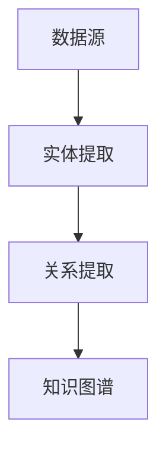
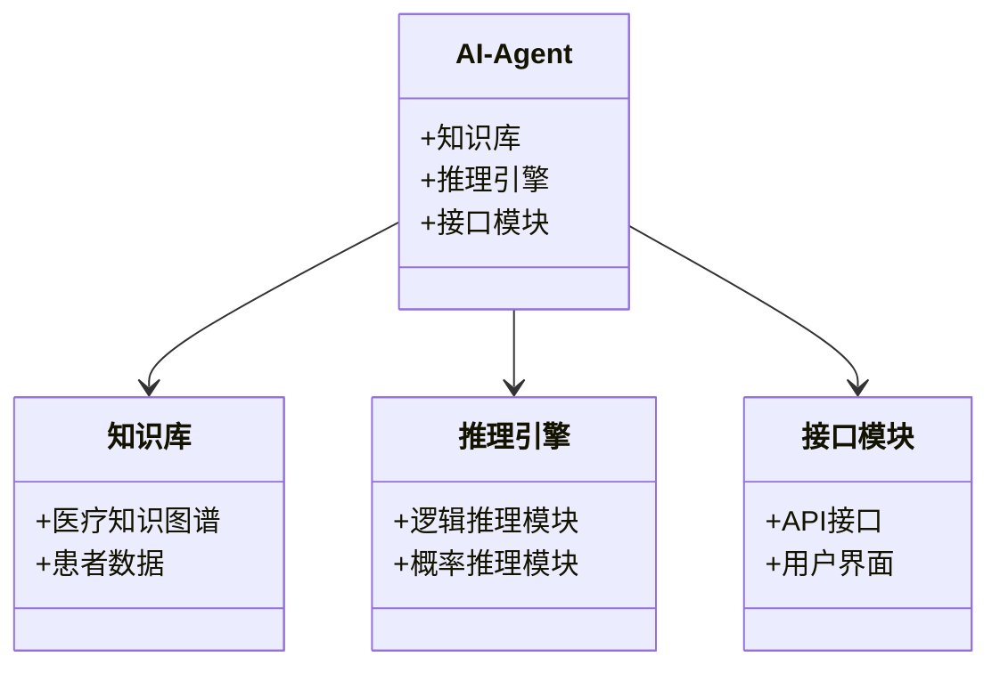
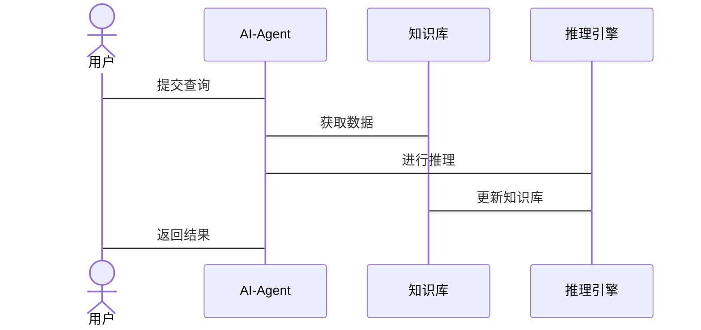

                 


# 开发具有跨域知识推理能力的AI Agent

> 关键词：AI Agent、跨域知识推理、知识图谱、符号逻辑、概率推理、系统架构

> 摘要：本文详细探讨了开发具有跨域知识推理能力的AI Agent的核心概念、算法原理、系统架构以及实际应用。通过分析跨域知识推理的背景、核心概念与联系、算法原理、系统架构设计、项目实战、最佳实践与扩展阅读，为读者提供了从理论到实践的全面指导。

---

## 第一部分：背景介绍

### 第1章：跨域知识推理AI Agent的背景与问题

#### 1.1 问题背景

随着人工智能技术的快速发展，AI Agent（智能体）在各个领域的应用日益广泛。然而，现有的AI Agent大多局限于单一领域，难以处理跨领域的问题。例如，一个医疗领域的AI Agent可能无法有效结合医疗数据和患者的行为数据来提供更精准的诊断建议。这种局限性限制了AI Agent的应用范围和效果。

#### 1.2 问题描述

跨域知识推理的核心问题在于如何将不同领域的知识有效地结合在一起，并通过推理得出合理的结论。具体来说，AI Agent需要能够理解多个领域的知识，并在这些知识之间建立关联，从而解决复杂问题。

#### 1.3 问题解决

为了解决上述问题，我们需要开发一种能够跨域知识推理的AI Agent。这种AI Agent能够整合多个领域的知识，建立知识图谱，并通过逻辑推理和概率推理等方法，实现跨领域的信息处理和决策。

#### 1.4 概念结构与核心要素

跨域知识推理的AI Agent主要由以下几个核心要素组成：
1. **知识表示**：如何将不同领域的知识表示为计算机可以处理的形式。
2. **推理机制**：基于知识表示，如何进行逻辑推理和概率推理。
3. **跨域整合**：如何将不同领域的知识进行整合，形成统一的知识图谱。

---

## 第二部分：核心概念与联系

### 第2章：AI Agent的知识表示与推理机制

#### 2.1 知识表示方法

知识表示是AI Agent进行推理的基础。以下是几种常见的知识表示方法：

1. **符号表示法**：使用符号和规则来表示知识。例如，使用谓词逻辑表示“如果A，则B”。
2. **知识图谱表示法**：通过图结构表示知识，节点表示实体，边表示关系。

#### 2.2 推理机制

推理机制是AI Agent进行跨域知识推理的核心。以下是几种常见的推理机制：

1. **基于逻辑的推理**：通过逻辑规则进行推理，例如使用谓词逻辑进行演绎推理。
2. **基于概率的推理**：通过概率模型进行推理，例如使用贝叶斯网络进行概率推理。

#### 2.3 跨域知识整合

跨域知识整合是实现跨域知识推理的关键。以下是几种常见的整合方法：

1. **基于本体的整合**：通过本体论（Ontology）将不同领域的知识进行统一表示。
2. **基于图谱的整合**：通过知识图谱将不同领域的知识进行整合，形成统一的知识库。

#### 2.4 核心概念ER图

以下是核心概念的ER图：

```mermaid
er
  actor: AI Agent
  knowledge_base: 知识库
  relation: 关系
  attribute: 属性
  actor --> knowledge_base: 访问
  knowledge_base --> relation: 包含
  knowledge_base --> attribute: 包含
```

---

## 第三部分：算法原理讲解

### 第3章：知識表示与推理算法

#### 3.1 知识表示算法

1. **符号表示法的实现**

符号表示法通过使用符号和规则来表示知识。例如，使用谓词逻辑表示“如果A，则B”：

$$ A \rightarrow B $$

2. **知识图谱构建算法**

知识图谱构建算法通过从多个数据源中提取实体和关系，并构建知识图谱。以下是构建知识图谱的流程：



#### 3.2 推理算法

1. **基于逻辑的推理**

基于逻辑的推理通过谓词逻辑进行演绎推理。例如，已知：

$$ A(x) \rightarrow B(x) $$
$$ A(a) $$

可以推导出：

$$ B(a) $$

2. **基于概率的推理**

基于概率的推理通过贝叶斯网络进行概率推理。例如，已知：

$$ P(B|A) = 0.8 $$
$$ P(A) = 0.5 $$

可以计算：

$$ P(B) = P(B|A) \times P(A) + P(B|\neg A) \times P(\neg A) $$

---

## 第四部分：系统分析与架构设计

### 第4章：系统架构设计

#### 4.1 问题场景介绍

我们设计了一个医疗领域的AI Agent，该AI Agent需要整合医疗数据和患者行为数据，提供个性化的诊断建议。

#### 4.2 系统功能设计

以下是系统的功能设计：



#### 4.3 系统交互设计

以下是系统的交互设计：



---

## 第五部分：项目实战

### 第5章：项目实战与代码实现

#### 5.1 环境安装

以下是项目所需的环境和工具：

1. Python 3.8+
2. PyTorch 1.9+
3. NetworkX 2.8+

#### 5.2 核心代码实现

以下是AI Agent的核心代码实现：

```python
import networkx as nx
from sklearn.metrics import accuracy_score

class KnowledgeBase:
    def __init__(self):
        self.graph = nx.Graph()

    def add_node(self, node):
        self.graph.add_node(node)

    def add_edge(self, source, target):
        self.graph.add_edge(source, target)

class ReasoningEngine:
    def __init__(self, knowledge_base):
        self.knowledge_base = knowledge_base

    def logical_inference(self, premise, conclusion):
        # 使用NetworkX进行逻辑推理
        if conclusion in self.knowledge_base.nodes():
            return True
        return False

    def probabilistic_inference(self, premise, conclusion):
        # 使用贝叶斯网络进行概率推理
        # 这里仅作示例，实际实现需要构建贝叶斯网络
        return 0.8  # 示例概率

# 示例使用
kb = KnowledgeBase()
kb.add_node("A")
kb.add_node("B")
kb.add_edge("A", "B")

reasoning_engine = ReasoningEngine(kb)
result = reasoning_engine.logical_inference("A", "B")
print("逻辑推理结果:", result)

# 概率推理示例
prob_result = reasoning_engine.probabilistic_inference("A", "B")
print("概率推理结果:", prob_result)
```

#### 5.3 代码应用解读与分析

上述代码实现了一个简单的知识库和推理引擎。知识库使用NetworkX构建图结构，推理引擎实现了基于逻辑和概率的推理方法。逻辑推理部分使用NetworkX进行简单的逻辑推理，概率推理部分需要进一步扩展。

#### 5.4 实际案例分析

以下是一个实际案例分析：

假设我们有一个医疗知识图谱，包含疾病、症状和治疗方案之间的关系。AI Agent可以根据患者的症状进行推理，推荐可能的治疗方案。

---

## 第六部分：最佳实践与扩展阅读

### 第6章：最佳实践与注意事项

1. **数据质量**：跨域知识推理需要高质量的数据，数据的准确性和完整性直接影响推理结果。
2. **模型选择**：根据具体应用场景选择合适的推理模型，逻辑推理适用于确定性问题，概率推理适用于不确定性问题。
3. **性能优化**：跨域知识推理通常涉及大量的数据和复杂的推理过程，需要进行性能优化。

### 第7章：文章总结

跨域知识推理的AI Agent是一种具有广泛应用前景的技术。通过本文的介绍，读者可以了解跨域知识推理的核心概念、算法原理、系统架构以及实际应用。未来，随着技术的发展，跨域知识推理的AI Agent将在更多领域发挥重要作用。

---

以上是《开发具有跨域知识推理能力的AI Agent》的正文部分，希望对您有所帮助！

