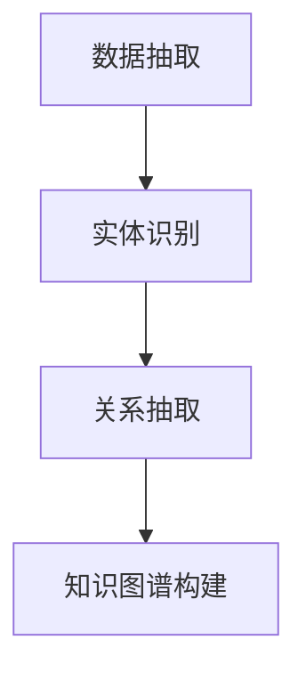
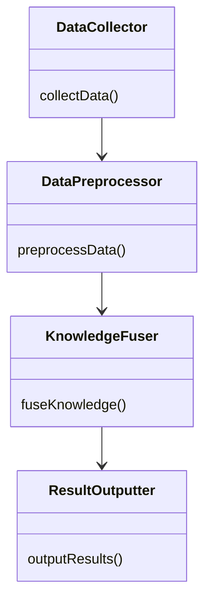
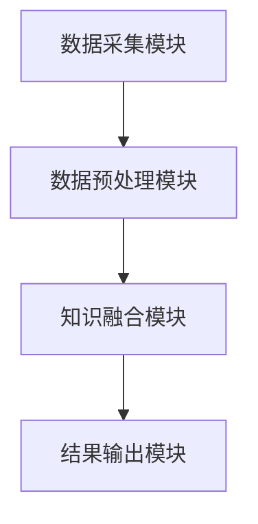
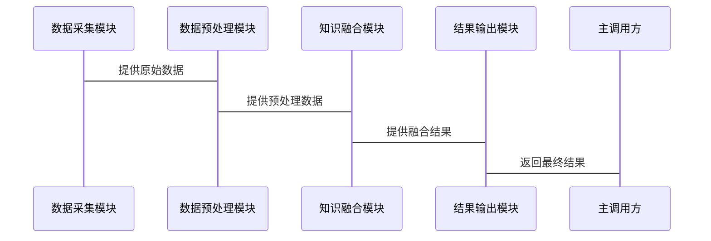

                 


# 开发具有跨域知识融合能力的AI Agent

> 关键词：AI Agent, 跨域知识融合, 多模态数据, 知识图谱, 深度学习, 融合算法

> 摘要：本文详细探讨了开发具有跨域知识融合能力的AI Agent的关键技术。首先介绍了AI Agent的基本概念和跨域知识融合的必要性，接着深入分析了跨域知识融合的理论基础，包括知识表示、数据对齐和融合模型。然后，详细讲解了实现跨域知识融合的算法与模型，包括多模态数据融合、注意力机制和对比学习等。最后通过项目实战，展示了如何设计和实现一个具备跨域知识融合能力的AI Agent系统，并提供了具体的代码实现和案例分析。

---

# 第一部分: 背景与核心概念

## 第1章: AI Agent与跨域知识融合概述

### 1.1 AI Agent的基本概念

#### 1.1.1 AI Agent的定义与特点
AI Agent（人工智能代理）是一种智能实体，能够感知环境、自主决策并执行任务。其特点包括自主性、反应性、目标导向和社会能力。AI Agent能够通过传感器获取信息，通过执行器与环境交互，并基于知识库做出决策。

#### 1.1.2 跨域知识融合的必要性
在复杂的现实场景中，AI Agent需要处理来自多个领域的信息，例如自然语言处理、图像识别和知识图谱等。跨域知识融合能够帮助AI Agent整合不同领域的知识，提升其理解和决策能力。

#### 1.1.3 跨域知识融合的边界与外延
跨域知识融合的边界在于不同领域的知识如何有效整合，外延则包括多模态数据的融合、知识图谱的构建与应用等。

### 1.2 跨域知识融合的核心要素

#### 1.2.1 知识表示与表达
知识表示是跨域融合的基础，常用的表示方法包括符号表示、向量表示和图结构表示。符号表示适用于规则明确的知识，向量表示适用于语义相似性计算，图结构表示适用于复杂的关联关系。

#### 1.2.2 知识关联与推理
跨域知识融合需要建立不同领域知识之间的关联，并通过推理得出新的结论。关联可以通过语义匹配、模式匹配和概率推理等方法实现。

#### 1.2.3 跨域数据的整合与协调
跨域数据整合需要处理数据异构性问题，例如数据格式、语义差异和数据质量等。协调过程包括数据清洗、数据对齐和数据融合。

### 1.3 跨域知识融合的实现方式

#### 1.3.1 数据驱动的方法
数据驱动的方法通过统计学习和机器学习算法，从数据中提取特征并进行融合。这种方法适用于大量数据的情况，但可能缺乏领域知识的指导。

#### 1.3.2 知识驱动的方法
知识驱动的方法基于领域知识和专家经验，通过知识图谱和逻辑推理进行融合。这种方法适用于领域知识明确的场景，但需要大量人工干预。

#### 1.3.3 混合驱动的方法
混合驱动的方法结合数据驱动和知识驱动的优势，通过半监督学习和迁移学习等技术实现跨域融合。这种方法能够充分利用数据和领域知识，提升融合效果。

### 1.4 跨域知识融合的挑战与机遇

#### 1.4.1 数据异构性问题
不同领域的数据格式、语义和结构差异较大，导致数据融合的难度增加。解决数据异构性问题需要数据清洗、标准化和对齐等技术。

#### 1.4.2 知识冲突的处理
跨域融合中可能存在知识冲突，例如同一概念在不同领域中的不同表示。解决知识冲突需要建立冲突检测和协调机制，例如基于概率推理和协商算法。

#### 1.4.3 跨域融合的性能优化
跨域融合的性能优化需要在计算效率和融合精度之间找到平衡。通过分布式计算、增量学习和模型优化等技术可以提升融合性能。

---

## 第2章: 跨域知识融合的理论基础

### 2.1 知识图谱与语义网络

#### 2.1.1 知识图谱的构建
知识图谱是跨域知识融合的重要工具，构建知识图谱需要进行数据抽取、实体识别和关系抽取等步骤。知识图谱的构建可以基于结构化数据、非结构化数据和外部知识库。

#### 2.1.2 语义网络的表示
语义网络通过节点和边表示概念及其关系，节点代表实体或概念，边代表关系。语义网络可以用于知识表示和推理。

#### 2.1.3 知识图谱的查询与推理
知识图谱的查询可以通过SPARQL等查询语言实现，推理可以通过规则推理和逻辑推理等方法进行。

#### 图2-1: 知识图谱的构建流程图


### 2.2 跨域数据的表示与对齐

#### 2.2.1 数据表示的标准化
数据表示的标准化需要将不同领域的数据转换为统一的格式和语义。例如，将自然语言文本转换为向量表示，将图像转换为特征向量。

#### 2.2.2 数据对齐的算法
数据对齐的算法包括基于字符串匹配的算法、基于向量相似度的算法和基于模式匹配的算法。常用的数据对齐算法有Edit Distance、Jaccard相似度和Word2Vec等。

#### 2.2.3 数据对齐的评估指标
数据对齐的评估指标包括准确率、召回率、F1分数和对齐质量。准确率表示正确对齐的比例，召回率表示对齐的覆盖率，F1分数是准确率和召回率的调和平均数。

### 2.3 跨域知识融合的数学模型

#### 2.3.1 融合模型的构建
融合模型的构建需要选择合适的数学模型，例如线性回归、支持向量机和深度学习模型。融合模型需要能够处理多模态数据，例如文本、图像和知识图谱。

#### 2.3.2 融合模型的优化
融合模型的优化可以通过参数调整、模型训练和模型评估实现。优化的目标是提升融合的准确率和效率。

#### 2.3.3 融合模型的验证
融合模型的验证可以通过交叉验证、留出验证和A/B测试等方法实现。验证的目的是评估模型的泛化能力和鲁棒性。

---

## 第3章: 跨域知识融合的算法与模型

### 3.1 跨域数据的特征提取

#### 3.1.1 基于深度学习的特征提取
深度学习模型，如卷积神经网络和循环神经网络，可以提取多模态数据的特征。例如，文本可以通过词嵌入（Word2Vec）提取特征，图像可以通过卷积层提取特征。

#### 3.1.2 基于传统机器学习的特征提取
传统机器学习算法，如主成分分析和线性判别分析，可以用于特征提取。这些方法适用于低维数据和小规模数据。

#### 3.1.3 跨域特征的对齐与融合
跨域特征的对齐与融合可以通过特征变换和特征融合实现。特征变换将不同领域的特征转换为统一的表示，特征融合通过加权融合和注意力机制实现。

### 3.2 跨域知识融合的注意力机制

#### 3.2.1 注意力机制的基本原理
注意力机制是一种权重分配方法，用于关注输入数据中重要的部分。在跨域融合中，注意力机制可以用于特征选择和信息提取。

#### 3.2.2 跨域注意力的实现
跨域注意力的实现可以通过多模态注意力和自适应注意力实现。多模态注意力同时考虑多个模态的特征，自适应注意力根据任务需求动态调整注意力权重。

#### 3.2.3 注意力机制的代码实现
```python
import torch
class MultiModalAttention(nn.Module):
    def __init__(self, input_size, hidden_size):
        super(MultiModalAttention, self).__init__()
        self.W = nn.Parameter(torch.randn(input_size, hidden_size))
        self.U = nn.Parameter(torch.randn(hidden_size, 1))
    
    def forward(self, x1, x2):
        # x1和x2分别是两个模态的特征向量
        # 组合两个模态的特征
        combined = torch.cat((x1, x2), dim=1)
        # 计算注意力权重
        scores = torch.mm(combined, self.W)
        scores = torch.tanh(scores)
        attention = torch.mm(scores, self.U)
        attention = torch.softmax(attention, dim=1)
        # 加权融合
        fused = x1 * attention[:, 0] + x2 * attention[:, 1]
        return fused
```

### 3.3 跨域知识融合的对比学习

#### 3.3.1 对比学习的基本原理
对比学习通过最大化正样本的相似性和最小化负样本的相似性，实现特征的对齐和融合。在跨域融合中，对比学习可以用于多模态数据的对齐。

#### 3.3.2 对比学习的实现
对比学习的实现可以通过构建对比损失函数，使用深度学习模型进行优化。对比损失函数可以采用三元对比损失和二元对比损失。

#### 3.3.3 对比学习的代码实现
```python
import torch
class ContrastiveLoss(nn.Module):
    def __init__(self, temperature=0.1):
        super(ContrastiveLoss, self).__init__()
        self.temperature = temperature
    
    def forward(self, features1, features2, labels):
        # 计算余弦相似度
        similarity = torch.mm(features1, features2.T) / self.temperature
        # 标签处理
        labels = labels.unsqueeze(1)
        positives = torch.diag(similarity)
        negatives = similarity - torch.diag(similarity)
        # 计算损失
        loss = -torch.mean(torch.log(positives) + torch.log(1 - negatives))
        return loss
```

### 3.4 跨域知识融合的数学模型

#### 3.4.1 融合模型的数学表达
融合模型的数学表达可以表示为：
$$ y = f(x_1, x_2, ..., x_n) $$
其中，$x_i$表示不同模态的输入数据，$f$表示融合函数。

#### 3.4.2 融合模型的优化目标
融合模型的优化目标是最大化融合结果的准确率和召回率，同时最小化模型的复杂度和计算成本。

---

## 第4章: 跨域知识融合的系统架构与设计

### 4.1 系统架构设计

#### 4.1.1 系统功能模块
跨域知识融合系统主要包括数据采集模块、数据预处理模块、知识融合模块和结果输出模块。

#### 4.1.2 系统功能模块的类图


#### 4.1.3 系统架构图


### 4.2 系统接口设计

#### 4.2.1 接口定义
系统接口包括数据输入接口、知识融合接口和结果输出接口。数据输入接口接收多模态数据，知识融合接口处理数据融合，结果输出接口返回融合结果。

#### 4.2.2 接口实现
数据输入接口可以使用REST API或文件接口，知识融合接口可以使用函数调用，结果输出接口可以使用JSON格式返回结果。

### 4.3 系统交互流程图



---

## 第5章: 项目实战

### 5.1 项目介绍

#### 5.1.1 项目背景
本项目旨在开发一个具备跨域知识融合能力的智能助手，能够处理文本、图像和知识图谱等多种数据。

#### 5.1.2 项目目标
通过实现跨域知识融合，提升智能助手的理解能力和决策能力，能够回答复杂问题和提供智能建议。

### 5.2 核心代码实现

#### 5.2.1 环境配置
```python
import torch
import torch.nn as nn
import torch.optim as optim
from torch.utils.data import DataLoader
```

#### 5.2.2 数据预处理
```python
def preprocess_data(data):
    # 数据预处理逻辑
    return preprocessed_data
```

#### 5.2.3 知识融合模块
```python
class KnowledgeFuser(nn.Module):
    def __init__(self, input_size, hidden_size):
        super(KnowledgeFuser, self).__init__()
        self.fc1 = nn.Linear(input_size, hidden_size)
        self.fc2 = nn.Linear(hidden_size, 1)
    
    def forward(self, x):
        output = torch.relu(self.fc1(x))
        output = torch.sigmoid(self.fc2(output))
        return output
```

#### 5.2.4 模型训练
```python
def train_model(model, optimizer, criterion, dataloader):
    for epoch in range(num_epochs):
        for inputs, labels in dataloader:
            outputs = model(inputs)
            loss = criterion(outputs, labels)
            optimizer.zero_grad()
            loss.backward()
            optimizer.step()
```

### 5.3 功能解读与分析

#### 5.3.1 功能模块解读
知识融合模块通过深度学习模型实现多模态数据的融合，模型包括特征提取层和融合层。特征提取层提取各模态的特征，融合层通过全连接层实现特征的融合。

#### 5.3.2 功能实现分析
模型训练包括数据加载、前向传播、损失计算和反向传播等步骤。训练过程中，模型不断优化参数，提升融合效果。

### 5.4 案例分析

#### 5.4.1 案例背景
假设我们有一个智能助手，能够处理文本和图像数据，回答用户的问题。

#### 5.4.2 案例实现
用户输入文本和图像，系统通过知识融合模块将文本和图像的特征进行融合，生成最终的回答。

#### 5.4.3 案例结果
融合后的结果能够准确回答用户的问题，提升用户体验。

### 5.5 项目小结

#### 5.5.1 项目总结
通过本项目，我们成功实现了具备跨域知识融合能力的智能助手，验证了跨域知识融合技术的有效性。

#### 5.5.2 项目优化建议
未来可以进一步优化融合算法，提升融合效果和计算效率。

#### 5.5.3 项目扩展方向
未来可以扩展到更多模态的数据融合，例如音频和视频数据，进一步提升智能助手的能力。

---

## 第6章: 总结与展望

### 6.1 总结

#### 6.1.1 核心内容回顾
本文详细介绍了开发具有跨域知识融合能力的AI Agent的关键技术，包括知识表示、数据对齐、融合算法和系统架构设计。

#### 6.1.2 主要收获与启示
通过本文的学习，读者能够理解跨域知识融合的核心概念和实现方法，能够开发具备跨域知识融合能力的AI Agent系统。

### 6.2 未来展望

#### 6.2.1 技术发展与趋势
未来，跨域知识融合将更加智能化和自动化，深度学习和知识图谱技术将进一步融合。

#### 6.2.2 新的挑战与机遇
跨域知识融合将面临更多复杂的挑战，例如多模态数据的融合和知识图谱的动态更新。同时，也将有更多的机遇，例如在智能助手、自动驾驶和医疗健康等领域的应用。

### 6.3 最佳实践 Tips

#### 6.3.1 开发建议
在开发跨域知识融合系统时，建议从简单场景开始，逐步扩展到复杂场景，注重数据质量和模型优化。

#### 6.3.2 注意事项
注意数据异构性和知识冲突问题，选择合适的融合算法和模型，确保系统的健壮性和可扩展性。

#### 6.3.3 拓展阅读
推荐阅读相关领域的经典论文和技术报告，例如知识图谱、多模态学习和分布式表示学习等。

---

# 结语

通过本文的详细讲解，读者能够全面理解开发具有跨域知识融合能力的AI Agent的核心技术。从理论基础到算法实现，从系统设计到项目实战，本文为读者提供了一条清晰的学习路径。未来，随着技术的发展，跨域知识融合将发挥更大的作用，为AI Agent的能力提升提供更多的可能性。

