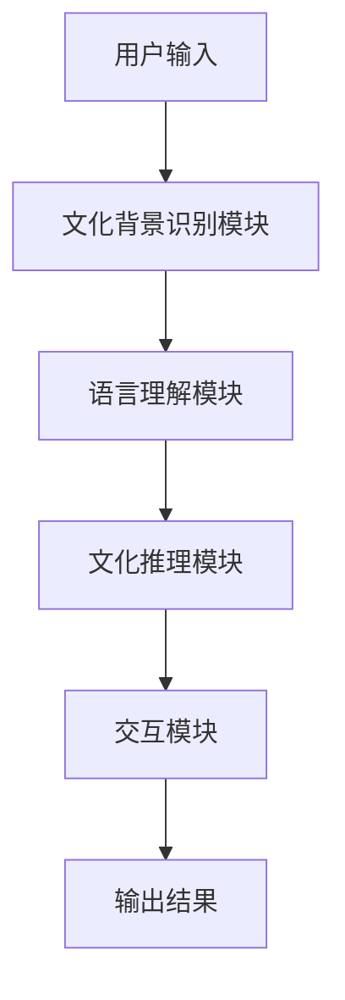
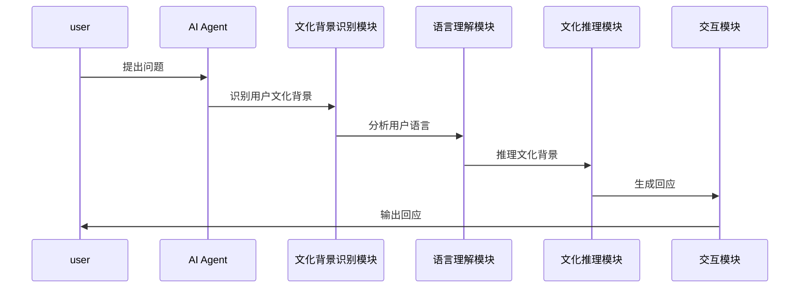

                 


# 开发具有跨文化理解与交流能力的AI Agent

> 关键词：跨文化理解，AI Agent，自然语言处理，机器学习，文化适应性

> 摘要：本文探讨了开发具有跨文化理解与交流能力的AI Agent的核心概念、技术原理和实现方法。通过分析跨文化理解的基本要素，结合AI Agent的感知、推理与决策机制，提出了一种基于多任务学习与迁移学习的模型，并通过实际案例展示了如何在不同文化背景下实现有效的交互。本文还详细讨论了系统架构设计与实现，为开发者提供了从理论到实践的全面指导。

---

## 第一部分: 背景介绍

### 第1章: 跨文化理解与AI Agent的背景介绍

#### 1.1 跨文化沟通的重要性

跨文化沟通是现代社会的核心能力之一。随着全球化的发展，人们需要与来自不同文化背景的人们交流，理解其文化差异、语言习惯和社会规范变得尤为重要。在商业、教育、医疗等领域，跨文化沟通能力直接影响到效率和效果。

AI Agent作为一种智能化的交互工具，其在跨文化环境中的应用潜力巨大。例如，在跨国公司中，AI Agent可以作为多语言支持的虚拟助手，帮助用户解决跨文化背景下的沟通问题。然而，传统的AI Agent往往缺乏对文化差异的深刻理解，导致在实际应用中出现误解或不适应的情况。

#### 1.2 AI Agent的基本概念

AI Agent（人工智能代理）是一种能够感知环境、理解用户需求并采取相应行动的智能系统。AI Agent的核心功能包括：

- **感知**：通过传感器、数据库或用户输入获取信息。
- **推理**：基于获取的信息进行逻辑推理或模式识别。
- **决策**：根据推理结果做出最优决策。
- **行动**：通过执行器或输出模块采取行动。

AI Agent的应用场景广泛，包括智能助手、聊天机器人、推荐系统等。然而，大多数现有的AI Agent在处理跨文化场景时表现不佳，主要原因是缺乏对文化差异的理解和适应能力。

#### 1.3 跨文化AI Agent的结合与意义

将跨文化理解能力引入AI Agent，使其能够在不同文化背景下提供更智能、更自然的交互体验。例如：

- 在多语言对话中，AI Agent需要理解不同语言的语法、词汇和文化隐含意义。
- 在文化敏感的场景中（如宗教、节日等），AI Agent需要避免冒犯用户，提供符合文化规范的回应。

跨文化AI Agent的开发具有重要意义，它不仅能够提升用户体验，还能够促进不同文化之间的理解和交流。然而，跨文化AI Agent的开发面临诸多挑战，包括文化数据的获取、多模态信息的处理以及文化适应性模型的构建等。

---

## 第二部分: 跨文化理解的核心概念与联系

### 第2章: 跨文化理解的核心概念

#### 2.1 跨文化理解的定义与属性

跨文化理解是指个体或系统能够识别、理解并适应不同文化背景的能力。其核心属性包括：

- **文化敏感性**：能够识别和理解不同文化背景的特点。
- **语言适应性**：能够处理多种语言及其文化相关的表达方式。
- **文化推理能力**：能够基于文化背景进行推理和决策。

#### 2.2 AI Agent的核心概念与原理

AI Agent的核心原理包括：

- **感知**：通过自然语言处理（NLP）技术理解用户输入。
- **推理**：基于知识图谱或机器学习模型进行推理。
- **决策**：根据推理结果选择最优行动方案。

#### 2.3 跨文化理解与AI Agent的联系

跨文化理解与AI Agent的结合主要体现在以下几个方面：

- **文化背景识别**：AI Agent需要能够识别用户的文化背景，并调整其交互方式。
- **语言与非语言表达**：AI Agent需要理解不同语言的语法、词汇以及非语言表达（如肢体语言、文化符号等）。
- **文化适应性**：AI Agent需要能够根据文化背景调整其决策和回应方式。

### 第3章: 跨文化理解与AI Agent的核心要素

#### 3.1 跨文化理解的核心要素

跨文化理解的核心要素包括：

1. **文化背景**：包括用户的文化背景、语言习惯、社会规范等。
2. **语言差异**：不同语言的语法、词汇、语境差异。
3. **社会规范**：不同文化中的行为规范、价值观等。

#### 3.2 AI Agent的核心功能

AI Agent的核心功能包括：

1. **感知**：通过NLP技术理解用户的输入。
2. **推理**：基于知识图谱或机器学习模型进行推理。
3. **决策**：根据推理结果选择最优行动方案。

#### 3.3 跨文化理解与AI Agent的协同作用

跨文化理解与AI Agent的协同作用体现在以下几个方面：

- **文化背景识别**：AI Agent能够识别用户的文化背景，并据此调整交互方式。
- **语言与非语言表达**：AI Agent能够理解不同语言的语法、词汇以及非语言表达方式。
- **文化适应性**：AI Agent能够根据文化背景调整其决策和回应方式。

---

## 第三部分: 跨文化理解的算法原理

### 第4章: 跨文化理解的算法原理

#### 4.1 跨文化理解的算法模型

跨文化理解的算法模型主要包括以下几种：

- **多任务学习**：同时学习多种任务（如语言理解、文化推理）。
- **迁移学习**：将已学习的知识迁移到新的文化背景中。

#### 4.2 基于深度学习的跨文化理解模型

基于深度学习的跨文化理解模型主要包括以下步骤：

1. **数据预处理**：将多语言数据进行清洗和标注。
2. **模型训练**：使用多任务学习或迁移学习方法训练模型。
3. **模型推理**：基于训练好的模型进行文化推理和决策。

#### 4.3 跨文化理解模型的数学公式

跨文化理解模型的数学公式可以表示为：

$$
P(c | x) = \frac{P(x | c) P(c)}{P(x)}
$$

其中，$c$ 表示文化背景，$x$ 表示输入数据，$P(c | x)$ 表示在给定输入数据$x$的情况下，文化背景为$c$的概率。

---

## 第四部分: 跨文化AI Agent的系统架构设计

### 第5章: 跨文化AI Agent的系统架构设计

#### 5.1 系统功能设计

跨文化AI Agent的系统功能设计包括以下模块：

1. **文化背景识别模块**：识别用户的文化背景。
2. **语言理解模块**：理解用户的语言输入。
3. **文化推理模块**：基于文化背景进行推理和决策。
4. **交互模块**：与用户进行交互并输出结果。

#### 5.2 系统架构设计

跨文化AI Agent的系统架构设计可以使用以下架构：



#### 5.3 系统接口设计

跨文化AI Agent的系统接口设计包括以下内容：

1. **输入接口**：接收用户的语言输入。
2. **输出接口**：输出与用户交互的结果。

#### 5.4 系统交互设计

跨文化AI Agent的系统交互设计可以使用以下交互流程图：



---

## 第五部分: 跨文化AI Agent的项目实战

### 第6章: 跨文化AI Agent的项目实战

#### 6.1 项目环境安装

跨文化AI Agent的项目实战需要以下环境：

1. **Python 3.8+**
2. **TensorFlow或PyTorch**
3. **自然语言处理库（如spaCy、NLTK）**
4. **跨语言数据集**

#### 6.2 系统核心实现

跨文化AI Agent的核心实现代码如下：

```python
class CrossCulturalAI:
    def __init__(self):
        self.models = {}  # 存储不同语言的模型

    def detect_language(self, text):
        # 使用语言检测模型识别输入文本的语言
        pass

    def adapt_culture(self, language):
        # 根据语言选择对应的模型
        pass

    def respond(self, text):
        language = self.detect_language(text)
        self.adapt_culture(language)
        # 使用当前模型生成回应
        pass
```

#### 6.3 代码应用解读

跨文化AI Agent的核心实现代码解读：

1. **语言检测**：通过语言检测模型识别用户输入的语言。
2. **文化适应**：根据检测到的语言选择对应的模型。
3. **生成回应**：基于选择的模型生成回应。

#### 6.4 实际案例分析

实际案例分析可以包括以下内容：

- **案例一**：多语言对话系统
- **案例二**：文化敏感的推荐系统

#### 6.5 项目小结

跨文化AI Agent的开发需要结合文化理解、语言处理和机器学习技术。通过实际案例分析，我们可以看到跨文化AI Agent在实际应用中的潜力和挑战。

---

## 第六部分: 总结与扩展

### 第7章: 总结与扩展

#### 7.1 总结

跨文化AI Agent的开发需要结合文化理解、语言处理和机器学习技术。通过本文的探讨，我们了解了跨文化理解的核心概念、算法原理和系统架构设计，并通过实际案例展示了跨文化AI Agent的实现方法。

#### 7.2 注意事项

在开发跨文化AI Agent时，需要注意以下几点：

1. **文化数据的获取**：需要获取多样化的文化数据。
2. **模型的泛化能力**：需要保证模型在不同文化背景下的泛化能力。
3. **用户体验**：需要注重用户体验，确保交互过程自然流畅。

#### 7.3 拓展阅读

- **相关书籍**：《跨文化交际学》
- **相关论文**：《Multi-Cultural Natural Language Processing》
- **开源项目**：如[Multilingual BERT](https://github.com/google-research/bert)

---

通过本文的探讨，我们希望能够为开发者提供一个从理论到实践的全面指导，帮助他们开发出具有跨文化理解与交流能力的AI Agent。

