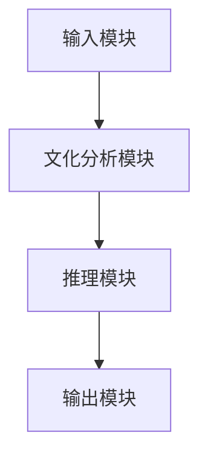
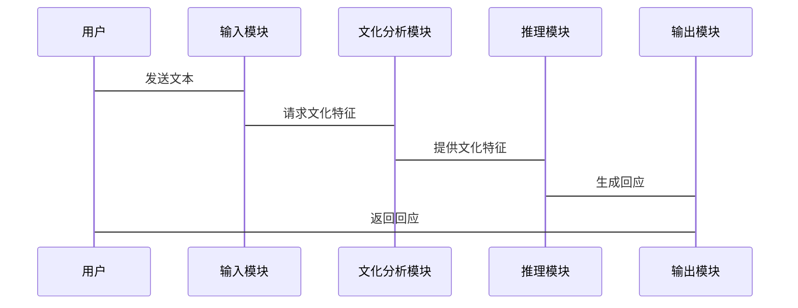

                 


# 开发具有跨文化理解能力的AI Agent

## 关键词：AI Agent, 跨文化理解, 自然语言处理, 多语言模型, 文化敏感性推理

## 摘要：随着全球化的发展，AI Agent需要具备跨文化理解能力，以在不同文化背景下有效沟通和推理。本文详细探讨了跨文化理解的核心概念、算法原理、系统架构，并通过实际案例展示了如何开发和实现具有跨文化理解能力的AI Agent。

---

# 第一部分: 跨文化理解与AI Agent的背景

## 第1章: 跨文化理解与AI Agent的背景

### 1.1 跨文化理解的重要性

#### 1.1.1 跨文化沟通的核心概念
- 跨文化沟通：指在不同文化背景下，个体之间通过语言、行为等方式进行信息交换的过程。
- 文化差异：包括语言、习俗、价值观等方面的不同，影响信息传递和理解。

#### 1.1.2 AI Agent在跨文化场景中的应用
- 跨文化客服系统：帮助不同文化背景的用户解决问题。
- 跨文化内容生成工具：生成符合目标文化背景的内容。
- 跨文化社交助手：辅助用户在跨文化社交中进行有效沟通。

#### 1.1.3 跨文化理解的挑战与机遇
- 挑战：文化差异的多样性和复杂性，难以用单一模型覆盖。
- 机遇：跨文化理解的市场需求增长，推动技术进步。

### 1.2 跨文化理解的定义与特点

#### 1.2.1 跨文化理解的定义
- 跨文化理解：个体或系统能够准确识别和适应不同文化背景下的信息和行为的能力。

#### 1.2.2 跨文化理解的核心要素
| 要素 | 描述 |
|------|------|
| 语言 | 不同语言的语法、词汇和语境差异。 |
| 习俗 | 各国的传统节日、礼仪习惯等。 |
| 价值观 | 不同文化中的核心价值观，如集体主义与个人主义。 |

### 1.3 跨文化AI Agent的潜在应用场景

#### 1.3.1 跨文化客服系统
- 通过自然语言处理技术，理解用户的不同语言和文化背景，提供个性化服务。

#### 1.3.2 跨文化内容生成工具
- 根据目标文化背景生成合适的内容，如广告文案、社交媒体帖子等。

#### 1.3.3 跨文化社交助手
- 帮助用户在跨文化社交中避免文化冲突，提升沟通效率。

### 1.4 跨文化理解在AI Agent中的技术挑战

#### 1.4.1 多语言处理的复杂性
- 不同语言的语法结构差异大，需要处理多种语言模型。

#### 1.4.2 文化差异的动态变化
- 文化背景随时间变化，AI Agent需要持续更新知识库。

#### 1.4.3 跨文化推理的不确定性
- 文化背景影响推理过程，AI Agent需要处理多种可能性。

### 1.5 本章小结
本章介绍了跨文化理解的重要性、核心要素及其在AI Agent中的应用，强调了技术挑战和机遇。

---

# 第二部分: 跨文化理解的核心概念与联系

## 第2章: 跨文化理解的核心概念

### 2.1 跨文化理解的关键要素

#### 2.1.1 文化背景
- 包括用户的地理位置、语言、宗教信仰等因素，影响其语言表达和行为方式。

#### 2.1.2 语言差异
- 不同语言中的词汇、语法和表达习惯差异，影响信息传递的准确性和效果。

#### 2.1.3 社会习俗
- 各国的传统习俗和礼仪，影响沟通方式和行为模式。

### 2.2 跨文化理解与自然语言处理的关系

#### 2.2.1 NLP在跨文化理解中的作用
- 自然语言处理技术帮助AI Agent理解和生成多语言文本。

#### 2.2.2 跨文化NLP的挑战与解决方案
- **挑战**：不同语言的语料库质量参差不齐，小语种数据不足。
- **解决方案**：使用多语言模型，结合文化背景知识进行训练。

### 2.3 跨文化理解与文化敏感性推理

#### 2.3.1 文化敏感性推理的定义
- 文化敏感性推理：AI Agent能够根据用户的文化背景，调整其输出内容，避免冒犯。

#### 2.3.2 跨文化推理的算法模型
- 使用基于上下文的注意力机制，结合文化特征向量进行推理。

#### 2.3.3 跨文化推理的案例分析
- **案例**：AI Agent在与日本用户沟通时，避免使用直接冲突的语言，选择委婉表达。

### 2.4 跨文化理解与多模态数据处理

#### 2.4.1 多模态数据在跨文化理解中的作用
- 结合文本、图像、语音等多种数据源，提升AI Agent的理解能力。

#### 2.4.2 跨模态数据处理的技术挑战
- 不同模态数据的融合难度大，需要复杂的特征提取和对齐技术。

#### 2.4.3 跨模态数据处理的未来发展方向
- 研究多模态模型的通用性，提升跨文化场景下的适应能力。

### 2.5 本章小结
本章详细讲解了跨文化理解的核心概念，探讨了其与自然语言处理和多模态数据处理的关系。

---

# 第三部分: 跨文化AI Agent的算法原理与数学模型

## 第3章: 跨文化AI Agent的算法原理

### 3.1 跨文化语言处理的算法模型

#### 3.1.1 多语言模型
- **多语言模型**：如BERT-Multi，支持多种语言的文本表示和理解。

#### 3.1.2 跨文化语言模型的训练
- 使用多语言语料库进行预训练，结合文化特征进行微调。

#### 3.1.3 跨文化语言模型的评估
- 使用跨文化基准测试数据集，评估模型的准确性。

### 3.2 跨文化理解的数学模型

#### 3.2.1 文化特征向量
- 将文化背景转化为向量表示，用于模型推理。

#### 3.2.2 跨文化注意力机制
- 使用文化特征向量加权注意力层，提升模型对文化差异的敏感性。

#### 3.2.3 跨文化语言模型的数学表示
$$ P(y|x) = \frac{1}{Z} \exp(\theta \cdot f(x)) $$
其中，$x$为输入文本，$y$为输出，$\theta$为文化特征参数，$f(x)$为特征函数。

### 3.3 跨文化推理的算法实现

#### 3.3.1 跨文化推理流程
1. **输入处理**：获取用户输入文本。
2. **文化特征提取**：分析文本中的文化特征。
3. **推理过程**：结合文化特征进行上下文推理。
4. **输出生成**：生成符合文化背景的回应。

#### 3.3.2 跨文化推理的算法优化
- 使用并行计算加速模型推理。
- 结合领域知识优化推理策略。

### 3.4 本章小结
本章详细讲解了跨文化AI Agent的算法原理，包括多语言模型和文化特征向量的使用。

---

# 第四部分: 跨文化AI Agent的系统架构与实现

## 第4章: 跨文化AI Agent的系统架构

### 4.1 系统功能设计

#### 4.1.1 系统模块划分
- **输入模块**：接收多语言文本输入。
- **文化分析模块**：分析文本中的文化特征。
- **推理模块**：基于文化特征进行推理。
- **输出模块**：生成符合文化背景的回应。

#### 4.1.2 系统功能流程
1. 用户输入文本。
2. 系统分析文本的文化特征。
3. 系统基于文化特征进行推理。
4. 系统生成符合文化背景的回应。

### 4.2 系统架构设计

#### 4.2.1 系统架构图


#### 4.2.2 模块交互流程
- **输入模块**：接收用户输入，解析语言和文化背景。
- **文化分析模块**：提取文化特征，如语言、习俗等。
- **推理模块**：结合文化特征和上下文进行推理。
- **输出模块**：生成符合文化背景的回应。

### 4.3 系统接口设计

#### 4.3.1 接口定义
- `get_cultural_features(text: str) -> dict`
- `generate_response(text: str, features: dict) -> str`

#### 4.3.2 接口实现
- 使用API网关处理请求，后端使用微服务架构。

### 4.4 系统交互序列图


### 4.5 本章小结
本章详细讲解了跨文化AI Agent的系统架构，包括模块划分、接口设计和交互流程。

---

# 第五部分: 跨文化AI Agent的项目实战

## 第5章: 跨文化AI Agent的项目实战

### 5.1 环境安装

#### 5.1.1 安装Python环境
- 使用Anaconda安装Python 3.8及以上版本。

#### 5.1.2 安装依赖库
```bash
pip install transformers torch
```

### 5.2 系统核心实现

#### 5.2.1 文化分析模块实现
```python
def get_cultural_features(text: str) -> dict:
    # 示例：提取语言特征
    language = detect_language(text)
    return {"language": language}
```

#### 5.2.2 推理模块实现
```python
def generate_response(text: str, features: dict) -> str:
    language = features.get("language", "en")
    # 根据语言选择适当的回复策略
    response = generate_appropriate_response(text, language)
    return response
```

### 5.3 代码应用解读与分析

#### 5.3.1 代码解读
- `get_cultural_features`函数：分析文本的文化特征。
- `generate_response`函数：根据文化特征生成回应。

#### 5.3.2 代码优化
- 使用缓存技术加速文化特征提取。
- 结合领域知识优化回复策略。

### 5.4 实际案例分析

#### 5.4.1 案例背景
- 用户来自日本，使用日语输入问题。

#### 5.4.2 系统处理流程
1. 输入模块接收日语文本。
2. 文化分析模块提取语言特征为日语。
3. 推理模块结合日语文化特征进行推理。
4. 输出模块生成符合日语文化的回应。

### 5.5 项目小结
本章通过实际案例展示了跨文化AI Agent的实现过程，强调了代码优化和文化特征提取的重要性。

---

# 第六部分: 跨文化AI Agent的最佳实践与注意事项

## 第6章: 跨文化AI Agent的最佳实践

### 6.1 开发注意事项

#### 6.1.1 数据多样性
- 确保训练数据涵盖多种语言和文化背景，避免偏见。

#### 6.1.2 模型可解释性
- 提供可解释的推理过程，帮助用户理解AI Agent的决策依据。

#### 6.1.3 持续优化
- 定期更新模型，适应文化背景的变化。

### 6.2 最佳实践

#### 6.2.1 数据预处理
- 清洗和标注多语言语料库，确保数据质量。

#### 6.2.2 模型训练
- 使用分布式训练加速模型训练，优化计算资源利用率。

#### 6.2.3 模型部署
- 使用云服务部署AI Agent，确保高可用性和扩展性。

### 6.3 拓展阅读

#### 6.3.1 跨文化NLP的研究现状
- 了解最新的研究进展和技术趋势。

#### 6.3.2 跨文化AI Agent的应用前景
- 探讨其在教育、医疗、商业等领域的潜在应用。

### 6.4 本章小结
本章总结了开发跨文化AI Agent的最佳实践，包括数据处理、模型训练和部署等方面。

---

# 结语

开发具有跨文化理解能力的AI Agent是一项具有挑战性的任务，但也充满了潜力和机遇。通过深入了解跨文化理解的核心概念，结合先进的算法原理和系统架构设计，我们可以开发出更加智能化、人性化的AI Agent，为全球用户提供更优质的服务。

---

# 参考文献

（此处列出相关技术文献和参考资料）

