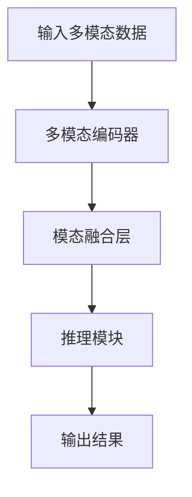
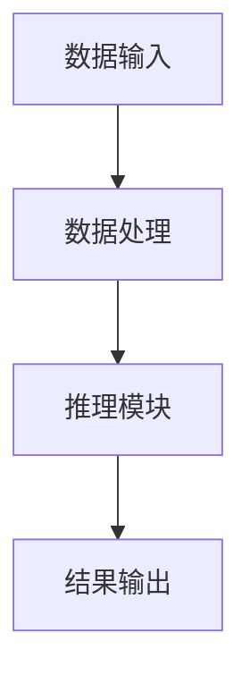
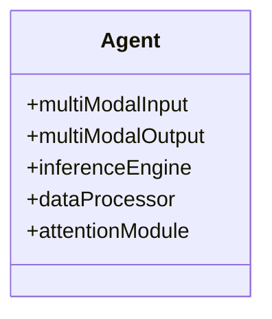
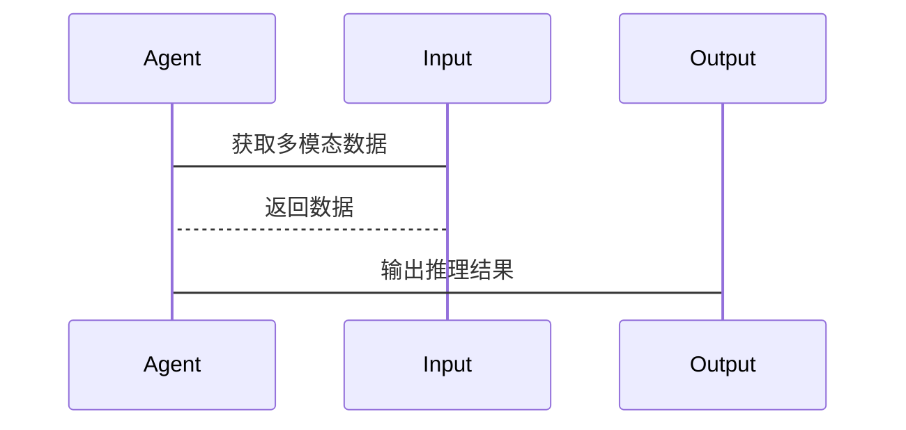

                 


# 开发具有跨模态推理能力的AI Agent

> 关键词：跨模态推理，AI Agent，多模态数据，深度学习，智能系统

> 摘要：本文详细探讨了开发具有跨模态推理能力的AI Agent的关键技术，包括跨模态推理的定义、核心原理、算法实现、系统架构设计以及实际项目案例。通过逐步分析和详细解读，帮助读者掌握如何构建能够处理多种数据模态并进行推理的智能系统。

---

# 第1章: 跨模态推理与AI Agent的背景介绍

## 1.1 跨模态推理的定义与问题背景

### 1.1.1 跨模态推理的定义
跨模态推理是指在多个数据模态（如文本、图像、语音、视频等）之间建立关联并进行推理的能力。通过跨模态推理，AI系统能够综合利用不同模态的信息，提升理解和决策能力。

### 1.1.2 跨模态推理的核心问题与挑战
- **信息融合问题**：如何有效地将不同模态的数据进行融合，以提取有用的特征。
- **推理准确性问题**：在跨模态数据中进行推理时，如何保证推理的准确性和可靠性。
- **计算效率问题**：跨模态推理通常涉及大量的数据处理和计算，如何提高计算效率是一个重要挑战。

### 1.1.3 跨模态推理的边界与外延
跨模态推理不仅限于单一任务，可以扩展到多任务学习、在线学习等更广泛的应用场景。

## 1.2 AI Agent的基本概念与功能

### 1.2.1 AI Agent的定义
AI Agent是一种智能实体，能够感知环境、执行任务并做出决策。它可以是一个软件程序，也可以是一个物理设备。

### 1.2.2 AI Agent的核心功能
- **感知环境**：通过传感器或数据输入接口获取环境信息。
- **决策与推理**：基于获取的信息进行分析和推理，做出决策。
- **执行操作**：根据决策结果执行相应的操作。

### 1.2.3 跨模态推理在AI Agent中的作用
跨模态推理使AI Agent能够综合利用多种数据源的信息，提升感知和决策的准确性。

## 1.3 跨模态推理与AI Agent的技术现状

### 1.3.1 跨模态推理的主流技术
- **多模态编码器**：将不同模态的数据转换为统一的表示形式。
- **模态融合方法**：通过注意力机制、对比学习等方法融合多模态信息。

### 1.3.2 AI Agent的发展趋势
随着深度学习和大模型技术的发展，AI Agent的功能将更加智能化和自主化。

### 1.3.3 跨模态推理在AI Agent中的应用现状
跨模态推理已经在图像描述生成、多语言对话系统等领域取得了显著进展。

---

# 第2章: 跨模态推理的核心概念与联系

## 2.1 跨模态推理的核心原理

### 2.1.1 多模态数据的表示与融合
- **多模态数据表示**：将不同模态的数据转换为统一的向量表示。
- **模态融合**：通过加权、注意力机制等方式，融合多模态信息。

### 2.1.2 跨模态推理的逻辑框架
跨模态推理通常包括以下步骤：
1. 数据输入：接收多模态数据。
2. 数据编码：将数据转换为统一的表示形式。
3. 模态融合：融合多模态信息。
4. 推理与决策：基于融合后的信息进行推理和决策。

### 2.1.3 跨模态推理的数学模型
跨模态推理的数学模型通常涉及多模态编码器和解码器的设计，以及注意力机制的应用。

## 2.2 跨模态推理与AI Agent的核心要素

### 2.2.1 多模态数据的输入与处理
- **数据输入**：接收文本、图像等多种数据。
- **数据预处理**：对数据进行清洗和标准化处理。

### 2.2.2 推理过程中的模态交互
- **模态交互**：不同模态之间的信息交互和融合。
- **推理机制**：基于模态交互进行推理。

### 2.2.3 推理结果的输出与应用
- **结果输出**：将推理结果输出为可理解的形式。
- **应用反馈**：根据反馈调整推理策略。

## 2.3 跨模态推理与AI Agent的ER实体关系图

```mermaid
er
actor(Agent, $id)
actor(Input, $id)
actor(Output, $id)
```

## 2.4 跨模态推理的数据流图



---

# 第3章: 跨模态推理的算法原理

## 3.1 多模态编码器的原理

### 3.1.1 多模态编码器的结构
多模态编码器通常由多个子网络组成，分别处理不同的模态数据。

### 3.1.2 多模态编码器的数学模型

$$
\text{编码器} = \{f_1, f_2, ..., f_n\}
$$

### 3.1.3 多模态编码器的实现示例

```python
class MultiModalEncoder:
    def __init__(self, modals):
        self.modals = modals
    
    def encode(self, input):
        encoded = []
        for modal in self.modals:
            encoded.append(modal.encode(input))
        return encoded
```

## 3.2 多模态解码器的原理

### 3.2.1 多模态解码器的结构
多模态解码器用于将编码后的数据解码为可理解的形式。

### 3.2.2 多模态解码器的数学模型

$$
\text{解码器} = \{g_1, g_2, ..., g_n\}
$$

### 3.2.3 多模态解码器的实现示例

```python
class MultiModalDecoder:
    def __init__(self, modals):
        self.modals = modals
    
    def decode(self, encoded_input):
        decoded = []
        for modal in self.modals:
            decoded.append(modal.decode(encoded_input))
        return decoded
```

## 3.3 跨模态推理中的注意力机制

### 3.3.1 注意力机制的定义
注意力机制用于关注输入数据中的重要部分，提升推理的准确性。

### 3.3.2 注意力机制的数学模型

$$
\text{注意力权重} = \frac{\exp(w_i)}{\sum_{j} \exp(w_j)}
$$

### 3.3.3 注意力机制的实现示例

```python
def attention(query, key, value):
    scores = query @ key.transpose(-2, -1) * key.size(-1)**0.5
    scores = scores.softmax(dim=-1)
    output = scores @ value
    return output
```

---

# 第4章: 跨模态推理的系统架构设计

## 4.1 系统功能设计

### 4.1.1 系统功能模块
- **数据输入模块**：接收多模态数据。
- **数据处理模块**：对数据进行预处理和编码。
- **推理模块**：进行跨模态推理。
- **输出模块**：将推理结果输出。

### 4.1.2 系统功能流程



## 4.2 系统架构设计

### 4.2.1 系统架构图



### 4.2.2 系统接口设计
- **输入接口**：接收多模态数据。
- **输出接口**：输出推理结果。

### 4.2.3 系统交互流程



---

# 第5章: 跨模态推理的项目实战

## 5.1 项目介绍

### 5.1.1 项目目标
开发一个多模态对话系统，能够理解用户的语音和文本输入，并生成相应的回复。

### 5.1.2 项目环境配置
- **Python 3.8+**
- **TensorFlow 2.0+**
- **其他依赖库**

## 5.2 核心功能实现

### 5.2.1 数据输入模块实现

```python
class DataInput:
    def __init__(self):
        self.modal_data = {}
    
    def add_modal(self, name, data):
        self.modal_data[name] = data
```

### 5.2.2 数据处理模块实现

```python
class DataProcessor:
    def __init__(self):
        pass
    
    def process(self, data):
        # 数据预处理逻辑
        pass
```

### 5.2.3 推理模块实现

```python
class InferenceEngine:
    def __init__(self):
        pass
    
    def infer(self, processed_data):
        # 推理逻辑
        pass
```

## 5.3 项目测试与优化

### 5.3.1 功能测试
对各个模块进行单元测试，确保功能正常。

### 5.3.2 性能优化
通过优化算法和调整超参数，提升推理效率和准确性。

## 5.4 案例分析

### 5.4.1 典型案例
分析一个具体的案例，展示跨模态推理在实际应用中的效果。

### 5.4.2 案例小结
总结案例中的经验教训，为后续开发提供参考。

---

# 第6章: 跨模态推理的总结与展望

## 6.1 最佳实践 tips

### 6.1.1 技术选型
选择合适的深度学习框架和模型结构。

### 6.1.2 数据处理
注重数据的质量和多样性。

### 6.1.3 模型优化
通过调参和优化算法提升模型性能。

## 6.2 小结
本文详细介绍了开发具有跨模态推理能力的AI Agent的关键技术，包括核心概念、算法实现和系统架构设计。

## 6.3 注意事项
在实际开发中，需要注意数据隐私和模型的可解释性。

## 6.4 拓展阅读
推荐一些相关的技术书籍和论文，供读者进一步学习。

---

通过以上步骤，我们系统地介绍了开发具有跨模态推理能力的AI Agent的关键技术，从理论到实践，为读者提供了全面的指导。希望本文能为相关领域的研究和应用提供有价值的参考。

