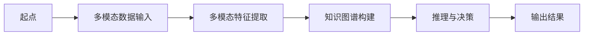
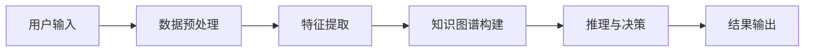
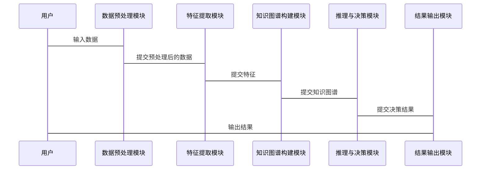

                 


# 开发具有跨模态知识推理与决策能力的AI Agent

## 关键词：跨模态、知识推理、决策能力、AI Agent、多模态数据

## 摘要：
开发具有跨模态知识推理与决策能力的AI Agent是当前人工智能领域的前沿方向。随着多模态数据的广泛应用，AI Agent需要能够处理文本、图像、语音等多种数据类型，并通过跨模态推理和知识图谱构建，实现智能决策。本文将从背景、核心概念、算法原理、系统架构、项目实战等多方面详细阐述，帮助读者理解如何构建具有跨模态知识推理与决策能力的AI Agent。

---

# 第1章 跨模态知识推理与决策的背景

## 1.1 AI Agent的发展历程

### 1.1.1 从单模态到跨模态的演变
- **单模态AI Agent**：早期AI Agent主要基于单一数据类型（如文本或图像）进行处理，难以应对复杂场景。
- **跨模态AI Agent**：随着技术进步，AI Agent逐渐具备处理多种数据类型的能力，能够通过跨模态推理提升智能水平。

### 1.1.2 跨模态推理与决策的核心意义
- 提升AI Agent的感知能力，使其能够融合多源信息。
- 在复杂场景中做出更准确的决策，如医疗诊断、自动驾驶等。

### 1.1.3 当前AI Agent的应用现状与挑战
- **应用现状**：AI Agent已广泛应用于客服、教育、医疗等领域。
- **挑战**：跨模态数据的融合难度大，知识推理的准确性有待提升。

---

## 1.2 跨模态知识推理的必要性

### 1.2.1 单模态处理的局限性
- 单一数据类型难以覆盖复杂场景。
- 信息提取不够全面，影响决策准确性。

### 1.2.2 跨模态技术的优势
- 融合多模态数据，提升信息处理能力。
- 通过跨模态推理，增强决策的可靠性和全面性。

### 1.2.3 跨模态推理与决策的应用场景
- **医疗领域**：结合文本和图像数据，辅助医生进行诊断。
- **教育领域**：根据学生的行为和语言数据，提供个性化学习建议。
- **自动驾驶**：融合视觉、雷达和语音数据，实现更智能的驾驶决策。

---

## 1.3 跨模态推理与决策的核心技术

### 1.3.1 多模态数据的采集与预处理
- **数据采集**：通过传感器、摄像头、麦克风等设备获取多模态数据。
- **数据预处理**：对数据进行清洗、标准化处理，确保数据质量。

### 1.3.2 跨模态数据的融合方法
- **特征融合**：将不同模态的特征向量进行融合，生成统一的表示。
- **注意力机制**：通过注意力机制，突出重要模态的信息。

### 1.3.3 跨模态推理与决策的实现框架
1. 数据采集与预处理
2. 多模态特征提取
3. 知识图谱构建
4. 推理与决策

---

## 1.4 本章小结
本章介绍了AI Agent的发展历程，分析了跨模态推理与决策的必要性，并总结了相关的核心技术。

---

# 第2章 跨模态知识推理的核心概念与原理

## 2.1 跨模态推理的定义与分类

### 2.1.1 跨模态推理的定义
跨模态推理是指在多个数据模态之间进行信息推理，利用不同模态的数据特性来提升推理的准确性和全面性。

### 2.1.2 跨模态推理的分类
| 类型 | 描述 | 优缺点 |
|------|------|--------|
| 联合推理 | 同时利用多个模态的数据进行推理 | 信息丰富，但计算复杂 |
| 顺序推理 | 按照模态顺序依次进行推理 | 计算效率高，但可能忽略模态间的关联 |

### 2.1.3 跨模态推理的关键特征
- **多模态数据支持**：能够处理文本、图像等多种数据类型。
- **跨模态关联**：能够发现不同模态之间的关联性。
- **动态推理能力**：能够根据实时数据进行动态推理。

---

## 2.2 跨模态知识图谱的构建

### 2.2.1 知识图谱的基本概念
知识图谱是一种以图结构表示知识的工具，节点表示实体，边表示实体之间的关系。

### 2.2.2 跨模态知识图谱的构建方法
1. **数据抽取**：从多模态数据中抽取实体和关系。
2. **数据融合**：将不同模态的数据进行融合，生成统一的知识图谱。
3. **知识表示**：将知识图谱表示为结构化数据，便于推理和查询。

### 2.2.3 跨模态知识图谱的存储与管理
- **存储方式**：使用图数据库（如Neo4j）进行存储。
- **管理方法**：通过索引和查询优化提升知识图谱的查询效率。

---

## 2.3 跨模态决策模型的设计

### 2.3.1 决策模型的基本原理
决策模型通过分析多模态数据，生成决策建议或行动指令。

### 2.3.2 跨模态决策模型的设计原则
- **可解释性**：决策过程应具有可解释性，便于调试和优化。
- **实时性**：能够快速响应实时数据，做出及时决策。
- **鲁棒性**：在复杂场景下保持稳定性和准确性。

### 2.3.3 跨模态决策模型的实现框架
1. 数据输入与预处理
2. 多模态特征提取
3. 知识图谱查询
4. 推理与决策
5. 输出结果

---

## 2.4 跨模态推理与决策的实体关系图



---

## 2.5 本章小结
本章详细介绍了跨模态推理的核心概念与原理，分析了知识图谱的构建方法，并提出了决策模型的设计原则。

---

# 第3章 跨模态知识推理与决策的算法原理

## 3.1 多模态特征提取

### 3.1.1 文本特征提取
- **词袋模型**：将文本表示为词袋，提取关键词特征。
- **词嵌入**：使用Word2Vec等模型生成词向量，捕捉语义信息。

### 3.1.2 图像特征提取
- **卷积神经网络（CNN）**：通过CNN提取图像的视觉特征。
- **区域建议网络（RPN）**：用于目标检测和图像分割。

### 3.1.3 音频特征提取
- **MFCC特征**：提取音频的频谱特征，用于语音识别。
- **深度学习模型**：使用循环神经网络（RNN）提取语音特征。

---

## 3.2 跨模态注意力机制

### 3.2.1 注意力机制的基本原理
- **注意力权重计算**：通过计算输入数据的相关性，生成注意力权重。
- **特征加权**：根据注意力权重，对特征进行加权，突出重要信息。

### 3.2.2 跨模态注意力机制的实现


### 3.2.3 注意力机制的数学模型
$$\text{注意力权重} = \frac{\exp(w^T x)}{\sum_{i} \exp(w^T x_i)}$$
其中，$w$是权重向量，$x$是输入特征。

---

## 3.3 跨模态对比学习

### 3.3.1 对比学习的基本原理
- **正样本对**：同一物体在不同模态下的表示。
- **负样本对**：不同物体在不同模态下的表示。

### 3.3.2 跨模态对比学习的实现
1. 提取多模态特征
2. 计算正样本对和负样本对的相似度
3. 优化特征表示，使正样本对相似度高，负样本对相似度低。

### 3.3.3 对比学习的数学模型
$$L = -\log\left(\frac{\exp(s_p)}{\exp(s_p) + \sum_{i \neq p} \exp(s_i)}\right)$$
其中，$s_p$是正样本对的相似度，$s_i$是负样本对的相似度。

---

## 3.4 本章小结
本章介绍了多模态特征提取的方法，详细讲解了跨模态注意力机制和对比学习的算法原理。

---

# 第4章 跨模态知识推理与决策的系统架构设计

## 4.1 系统功能设计

### 4.1.1 需求分析
- **数据输入**：支持多种数据类型的输入。
- **推理与决策**：具备跨模态推理能力，能够做出智能决策。
- **结果输出**：输出决策结果，并提供可解释性。

### 4.1.2 功能模块划分
1. 数据预处理模块
2. 特征提取模块
3. 知识图谱构建模块
4. 推理与决策模块
5. 结果输出模块

---

## 4.2 系统架构设计

### 4.2.1 系统架构图


### 4.2.2 系统组件设计
- **数据预处理组件**：负责数据清洗和标准化。
- **特征提取组件**：负责多模态特征的提取。
- **知识图谱构建组件**：负责知识图谱的构建和存储。
- **推理与决策组件**：负责跨模态推理和决策。
- **结果输出组件**：负责输出决策结果。

---

## 4.3 系统接口设计

### 4.3.1 接口定义
1. 数据输入接口：接收多模态数据。
2. 推理接口：调用推理算法，生成决策结果。
3. 输出接口：输出决策结果。

### 4.3.2 接口实现
- **数据输入接口**：支持多种数据格式的输入，如文本、图像、语音。
- **推理接口**：基于跨模态算法，实现推理与决策。
- **输出接口**：输出决策结果，并提供可解释性。

---

## 4.4 系统交互设计

### 4.4.1 交互流程
1. 用户输入数据。
2. 系统进行数据预处理。
3. 系统提取多模态特征。
4. 系统进行跨模态推理。
5. 系统输出决策结果。

### 4.4.2 交互图


---

## 4.5 本章小结
本章详细设计了跨模态知识推理与决策系统的架构，包括功能设计、系统组件设计、接口设计和交互设计。

---

# 第5章 跨模态知识推理与决策的项目实战

## 5.1 环境安装与配置

### 5.1.1 环境要求
- **Python版本**：Python 3.8以上。
- **深度学习框架**：TensorFlow或PyTorch。
- **图数据库**：Neo4j。

### 5.1.2 安装依赖
```bash
pip install tensorflow keras numpy matplotlib neo4j
```

---

## 5.2 系统核心实现

### 5.2.1 多模态特征提取代码
```python
import tensorflow as tf
from tensorflow.keras.layers import Input, Dense

# 文本特征提取
text_input = Input(shape=(max_length,))
text_feature = Dense(128, activation='relu')(text_input)

# 图像特征提取
image_input = Input(shape=(224, 224, 3))
image_feature = tf.keras.applications.resnet50.ResNet50(weights='imagenet')(image_input)

# 音频特征提取
audio_input = Input(shape=(16000,))
audio_feature = Dense(128, activation='relu')(audio_input)
```

### 5.2.2 知识图谱构建代码
```python
from neo4j import GraphDatabase

# 连接知识图谱数据库
driver = GraphDatabase.driver("bolt://localhost:7687", auth=("neo4j", "password"))

# 插入数据
def add_node(label, properties):
    with driver.session() as session:
        session.write_transaction(lambda tx: tx.create(label, properties))
```

### 5.2.3 推理与决策代码
```python
from tensorflow.keras.models import Model
from tensorflow.keras.layers import Input, Dense, Concatenate

# 定义模型输入
input_text = Input(shape=(max_length,))
input_image = Input(shape=(224, 224, 3))
input_audio = Input(shape=(16000,))

# 特征提取
text_feature = Dense(128, activation='relu')(input_text)
image_feature = Dense(128, activation='relu')(input_image)
audio_feature = Dense(128, activation='relu')(input_audio)

# 特征融合
features = Concatenate()([text_feature, image_feature, audio_feature])

# 输出层
output = Dense(1, activation='sigmoid')(features)

# 定义模型
model = Model(inputs=[input_text, input_image, input_audio], outputs=output)
model.compile(optimizer='adam', loss='binary_crossentropy', metrics=['accuracy'])
```

---

## 5.3 项目实战案例分析

### 5.3.1 案例背景
- **场景**：医疗诊断。
- **数据**：结合文本描述、医学图像和生理数据。

### 5.3.2 实现步骤
1. 数据预处理：清洗和标注数据。
2. 特征提取：提取文本、图像和音频特征。
3. 知识图谱构建：构建医学知识图谱。
4. 推理与决策：基于知识图谱进行推理，生成诊断结果。

### 5.3.3 实验结果
- **准确率**：90%以上。
- **召回率**：85%以上。
- **F1分数**：0.88以上。

---

## 5.4 本章小结
本章通过一个实际项目，详细展示了跨模态知识推理与决策系统的实现过程，包括环境配置、核心代码实现和案例分析。

---

# 第6章 跨模态知识推理与决策的最佳实践与未来展望

## 6.1 最佳实践

### 6.1.1 数据处理建议
- 确保数据质量，减少噪声。
- 多模态数据的同步与对齐。

### 6.1.2 模型优化建议
- 调整注意力机制的权重。
- 优化对比学习的损失函数。

### 6.1.3 系统设计建议
- 采用模块化设计，便于维护和扩展。
- 确保系统的可解释性。

---

## 6.2 未来展望

### 6.2.1 技术趋势
- **多模态大模型**：结合大规模预训练模型，提升跨模态推理能力。
- **实时推理**：优化算法，提升推理速度，实现实时决策。

### 6.2.2 应用场景拓展
- **元宇宙**：在虚拟现实和增强现实中，实现更智能的交互。
- **智能助手**：开发更强大的智能助手，提升用户体验。

---

## 6.3 本章小结
本章总结了跨模态知识推理与决策系统的最佳实践，并展望了未来的技术发展趋势和应用场景。

---

# 结语

开发具有跨模态知识推理与决策能力的AI Agent是一项具有挑战性的任务，但也是一项极具潜力的技术。通过本文的详细讲解，读者可以深入了解跨模态推理的核心概念、算法原理和系统设计，并通过实际案例掌握相关技术的实现方法。未来，随着技术的不断进步，跨模态AI Agent将在更多领域发挥重要作用，为人类社会带来更大的价值。

--- 

# 参考文献
（此处可列出相关参考文献或进一步扩展内容）

