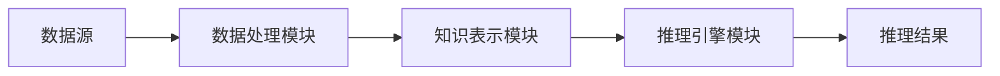

                 


# 开发具有跨模态知识推理能力的AI Agent

> 关键词：跨模态知识推理、AI Agent、多模态数据处理、知识图谱、神经符号推理

> 摘要：本文详细探讨了开发具有跨模态知识推理能力的AI Agent的核心技术与实现方法。文章从跨模态知识推理的背景与概念出发，逐步分析其核心概念、算法原理、系统架构，并通过实际项目案例展示其应用与实现。最后，总结了开发中的最佳实践与未来发展方向。

---

# 第一部分: 跨模态知识推理与AI Agent基础

## 第1章: 跨模态知识推理的背景与概念

### 1.1 跨模态知识推理的定义

#### 1.1.1 多模态数据的定义与特点

多模态数据指的是来自不同感知渠道（如文本、图像、语音、视频等）的数据形式。与单模态数据相比，多模态数据能够提供更丰富的信息，帮助AI Agent更全面地理解和推理问题。

**多模态数据的特点：**
- **异构性**：不同模态的数据具有不同的表示形式和特征。
- **互补性**：不同模态的数据可以互补，提供更全面的信息。
- **复杂性**：多模态数据的处理需要综合考虑多种数据类型和其之间的关系。

#### 1.1.2 知识推理的核心概念

知识推理是指AI Agent在给定知识库的基础上，通过推理规则和逻辑推理，从已知的事实中推导出新的知识或结论的过程。

**知识推理的关键要素：**
- **知识表示**：将知识以某种形式表示（如知识图谱）。
- **推理规则**：定义推理的逻辑规则。
- **推理引擎**：执行推理操作的工具或算法。

#### 1.1.3 跨模态知识推理的定义与范围

跨模态知识推理是指AI Agent能够同时处理多种模态的数据，并在这些数据之间建立关联，进而进行推理和决策的过程。其范围包括跨模态数据的对齐、融合、知识表示与推理等多个方面。

---

### 1.2 跨模态知识推理的背景与问题背景

#### 1.2.1 当前AI技术的局限性

尽管当前AI技术在单模态数据处理方面取得了显著进展，但在处理多模态数据时仍存在以下问题：
- **信息孤岛**：不同模态的数据难以有效整合。
- **推理能力不足**：AI Agent难以在多模态数据中建立关联并进行推理。
- **应用场景受限**：在复杂场景中，单一模态数据难以满足需求。

#### 1.2.2 跨模态数据处理的需求

随着AI技术的广泛应用，跨模态数据处理的需求日益增长。例如，在智能客服系统中，用户可能同时提供文本和语音信息，AI Agent需要能够理解并结合这两种信息进行推理。

#### 1.2.3 知识推理在AI Agent中的重要性

知识推理是AI Agent实现智能决策的核心能力。通过跨模态知识推理，AI Agent能够更好地理解和处理复杂场景中的信息，从而提高其智能水平。

---

### 1.3 跨模态知识推理的应用领域

#### 1.3.1 智能问答系统

跨模态知识推理在智能问答系统中的应用主要体现在结合文本和知识图谱进行推理，从而提供更准确的答案。

#### 1.3.2 多模态对话系统

多模态对话系统需要同时理解用户的文本、语音和图像信息，并进行推理和生成合理的回应。

#### 1.3.3 自动驾驶中的场景理解

自动驾驶系统需要处理来自摄像头、雷达、GPS等多种传感器的数据，并通过跨模态推理理解复杂的交通场景。

#### 1.3.4 医疗影像分析与诊断

在医疗领域，跨模态知识推理可以结合患者的病史、影像数据和诊断结果，帮助医生进行更准确的诊断。

---

## 第2章: 跨模态知识推理的核心概念与联系

### 2.1 跨模态数据处理原理

#### 2.1.1 多模态数据的表示方法

多模态数据的表示方法包括：
- **嵌入表示**：将不同模态的数据映射到同一嵌入空间。
- **符号表示**：用符号或标签表示数据。
- **混合表示**：结合嵌入和符号表示。

#### 2.1.2 跨模态数据对齐的定义

跨模态数据对齐是指将不同模态的数据对齐到同一个语义空间，以便进行有效的信息融合。

#### 2.1.3 跨模态数据融合的技术对比

**跨模态数据融合技术对比表**

| 技术 | 描述 | 优缺点 |
|------|------|--------|
| 对比学习 | 基于对比损失函数对齐数据 | 有效，但需要大量标注数据 |
| 联结层 | 使用共享层融合特征 | 简单，但可能无法捕捉复杂关系 |
| 神经符号融合 | 结合神经网络和符号推理 | 能够处理复杂关系，但实现复杂 |

---

### 2.2 知识表示与推理原理

#### 2.2.1 知识图谱的构建与表示

知识图谱是一种以图结构表示知识的工具，节点表示实体，边表示实体之间的关系。

**知识图谱构建流程：**
1. 数据收集与预处理。
2. 实体识别与抽取。
3. 关系抽取与构建。
4. 知识融合与优化。

#### 2.2.2 符号推理与逻辑推理的对比

**符号推理与逻辑推理对比表**

| 方法 | 描述 | 优缺点 |
|------|------|--------|
| 符号推理 | 基于符号规则进行推理 | 易解释，但灵活性差 |
| 逻辑推理 | 基于逻辑规则进行推理 | 精确，但计算复杂 |

#### 2.2.3 概念属性特征对比表格

**概念属性特征对比表**

| 特征 | 描述 |
|------|------|
| 概念层次 | 表示概念的层次结构 |
| 属性类型 | 表示属性的类型（如类别、数值） |
| 关系类型 | 表示概念之间的关系（如蕴含、矛盾） |

---

### 2.3 跨模态知识推理的实体关系图


---

## 第3章: 跨模态知识推理的算法原理

### 3.1 跨模态对齐算法

#### 3.1.1 对比学习原理

对比学习是一种通过最大化同类样本相似性和最小化异类样本相似性来对齐数据的方法。

**对比学习的损失函数：**

$$ L = \text{Contrastive Loss}(x_i, x_j) $$

#### 3.1.2 多模态对齐的流程图


---

### 3.2 知识推理算法

#### 3.2.1 符号推理算法

符号推理算法基于预定义的符号规则进行推理。

#### 3.2.2 神经符号推理算法

神经符号推理算法结合了神经网络和符号推理，能够处理复杂的关系。

#### 3.2.3 基于图神经网络的推理算法

基于图神经网络的推理算法通过构建图结构进行推理。

---

### 3.3 神经符号推理的数学公式

**神经符号推理的数学表达：**

$$ h = \text{Encoder}(x) $$

$$ r = \text{Reasoning}(h) $$

---

## 第4章: 跨模态知识推理的数学模型与公式

### 4.1 跨模态对齐的数学模型

#### 4.1.1 对比学习的损失函数

$$ L = \text{Contrastive Loss}(x_i, x_j) $$

#### 4.1.2 多模态对齐的数学表达

$$ f(x_i) = f(x_j) $$

---

### 4.2 神经符号推理的数学公式

#### 4.2.1 神经网络编码

$$ h = \text{Encoder}(x) $$

#### 4.2.2 符号推理规则

$$ r = \text{Reasoning}(h) $$

---

## 第5章: 跨模态知识推理的系统分析与架构设计

### 5.1 问题场景介绍

跨模态知识推理系统需要处理多种模态的数据，并结合知识图谱进行推理。

### 5.2 系统功能设计

**系统功能模块：**
1. 数据处理模块。
2. 知识表示模块。
3. 推理引擎模块。

### 5.3 系统架构设计



---

## 第6章: 跨模态知识推理的项目实战

### 6.1 环境安装

安装必要的依赖包，如TensorFlow、PyTorch等。

### 6.2 核心代码实现

```python
def contrastive_loss(x, y):
    similarity = torch.cosine_similarity(x, y)
    loss = (1 - similarity).mean()
    return loss
```

### 6.3 系统测试与优化

测试系统的性能，并根据结果进行优化。

---

## 第7章: 最佳实践与总结

### 7.1 开发中的注意事项

- 数据质量：确保数据的多样性和代表性。
- 模型调优：根据需求调整模型参数。
- 系统扩展性：设计可扩展的系统架构。

### 7.2 小结

跨模态知识推理是AI Agent实现智能决策的核心技术，通过本文的分析与实践，可以更好地理解和开发具有跨模态知识推理能力的AI Agent。

---

## 第8章: 未来发展方向

### 8.1 新技术展望

- 更高效的跨模态对齐算法。
- 更强大的神经符号推理模型。

### 8.2 拓展阅读

推荐相关的技术论文和书籍，供读者进一步学习。

---

通过以上内容，我们可以全面了解开发具有跨模态知识推理能力的AI Agent的核心技术与实现方法。希望本文能为相关领域的研究和实践提供有价值的参考。

