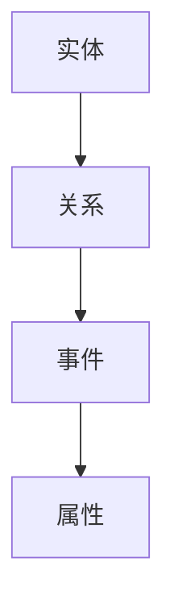
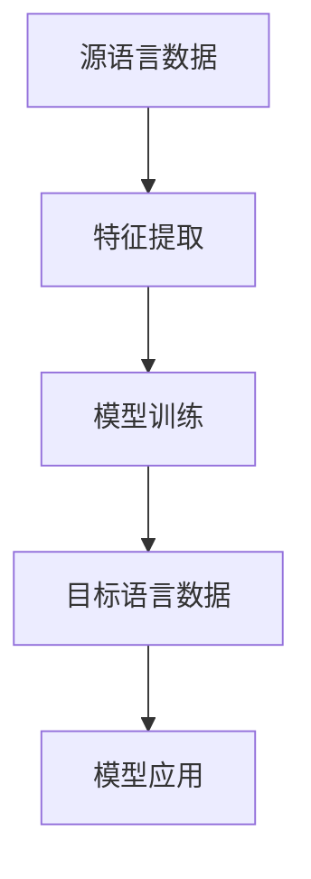
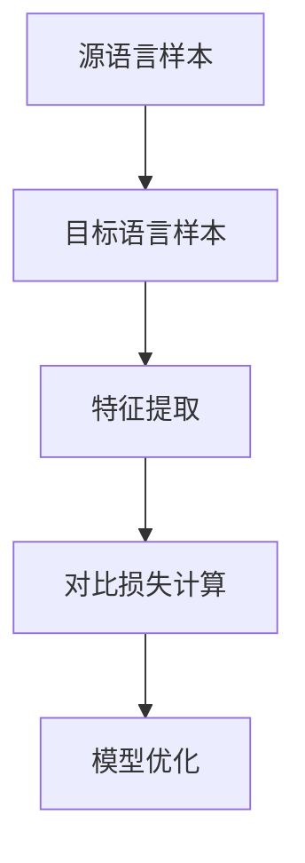
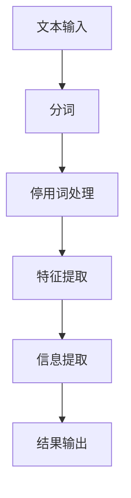
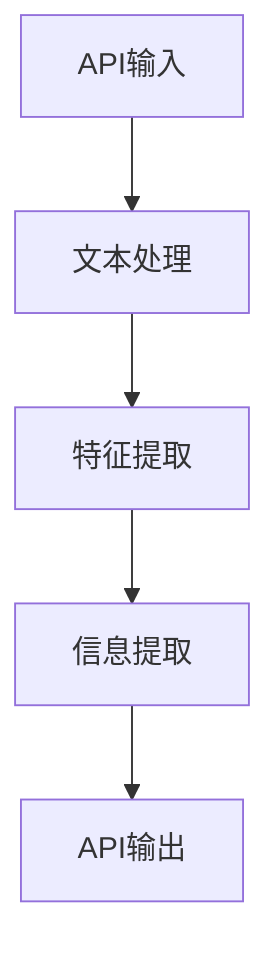
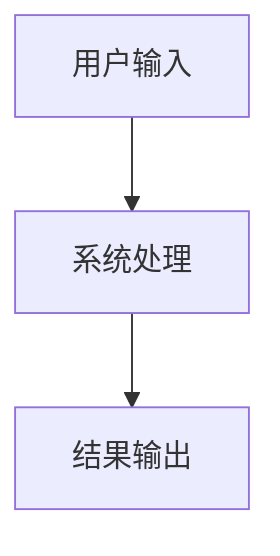

                 


# 开发具有跨语言信息提取能力的AI Agent

## 关键词：AI Agent, 跨语言信息提取, 自然语言处理, 机器学习, 多语言模型

## 摘要：  
本文旨在探讨如何开发具有跨语言信息提取能力的AI Agent。随着全球信息的多样性和多语言数据的普及，能够处理多种语言信息的AI Agent在实际应用中具有重要意义。本文首先介绍了跨语言信息提取的背景与意义，接着深入分析了跨语言信息提取的核心概念与技术，包括多语言模型、语言无关特征提取和跨语言对比学习等。随后，本文详细讲解了跨语言信息提取的算法原理，包括迁移学习和对比学习等方法，并通过具体的数学公式和Python代码示例进行了深入剖析。最后，本文结合实际应用场景，提出了系统架构设计方案，并通过项目实战展示了如何实现一个具有跨语言信息提取能力的AI Agent。本文旨在为读者提供从理论到实践的全面指导，帮助他们理解和掌握跨语言信息提取的核心技术。

---

# 第一部分: 背景与概述

# 第1章: 跨语言信息提取与AI Agent的背景

## 1.1 跨语言信息提取的背景与意义

### 1.1.1 多语言数据的挑战

在全球化的背景下，数据的多样性和多语言性日益显著。企业和社会在处理信息时，经常需要面对多种语言的数据，例如客服系统需要处理多语言客户的问题，新闻平台需要处理多语言的新闻内容等。传统的信息提取技术通常针对单一语言设计，难以直接应用于多语言场景。因此，开发具有跨语言信息提取能力的AI Agent成为了一项重要的技术需求。

### 1.1.2 跨语言信息提取的重要性

跨语言信息提取是指在多种语言环境下，从文本中提取出有意义的信息（例如实体、关系、事件等）的过程。这一技术在多语言客服系统、跨语言新闻摘要、多语言信息检索等领域具有重要的应用价值。通过跨语言信息提取，AI Agent可以在不同语言之间建立联系，提高信息处理的效率和准确性。

### 1.1.3 AI Agent在跨语言场景中的应用价值

AI Agent是一种智能体，能够根据输入的信息自主决策并执行任务。在跨语言场景中，AI Agent需要能够理解并处理多种语言的信息，从而实现跨语言的信息交互和处理。例如，在多语言客服系统中，AI Agent需要能够理解客户的查询内容，分析其意图，并提供相应的答案或解决方案。

## 1.2 AI Agent的基本概念与特点

### 1.2.1 AI Agent的定义

AI Agent（人工智能代理）是一种智能体，能够感知环境、理解用户需求，并通过自主决策和行动来完成特定任务。AI Agent可以是软件程序、机器人或其他智能系统，其核心能力包括感知、推理、决策和执行。

### 1.2.2 AI Agent的核心特点

- **自主性**：AI Agent能够在没有外部干预的情况下自主决策和行动。
- **反应性**：AI Agent能够实时感知环境并做出响应。
- **社交能力**：AI Agent能够与人类或其他智能体进行交互和协作。
- **学习能力**：AI Agent能够通过经验或数据不断优化自身的性能。

### 1.2.3 跨语言能力对AI Agent的影响

跨语言能力是AI Agent在多语言环境中发挥作用的关键。AI Agent需要能够理解并处理多种语言的信息，从而在跨语言场景中实现高效的交互和信息处理。跨语言信息提取能力是AI Agent实现跨语言交互和任务处理的基础。

## 1.3 跨语言信息提取的关键技术

### 1.3.1 跨语言词嵌入

词嵌入是一种将词语表示为低维向量的技术。在跨语言信息提取中，可以通过跨语言词嵌入技术将不同语言的词语映射到同一个向量空间，从而实现跨语言词汇的对齐和相似性计算。

### 1.3.2 跨语言句法分析

句法分析是指对文本的语法结构进行分析，例如识别句子中的主语、谓语、宾语等。在跨语言信息提取中，句法分析可以帮助理解句子的结构和语义关系。

### 1.3.3 跨语言语义理解

语义理解是指对文本的含义进行理解。在跨语言信息提取中，语义理解是实现跨语言信息检索和信息提取的关键。

## 1.4 跨语言信息提取的应用场景

### 1.4.1 多语言客服系统

在多语言客服系统中，AI Agent需要能够理解并处理客户的查询内容，分析其意图，并提供相应的答案或解决方案。

### 1.4.2 跨语言新闻自动摘要

跨语言新闻自动摘要是指从多语言新闻文本中提取关键信息并生成摘要。这一技术可以应用于新闻聚合平台，帮助用户快速了解多语言新闻内容。

### 1.4.3 跨语言信息检索

跨语言信息检索是指在多语言文本中进行信息检索。通过跨语言信息提取技术，可以将不同语言的文本映射到同一个语义空间，从而实现高效的跨语言信息检索。

## 1.5 本章小结

本章介绍了跨语言信息提取的背景与意义，分析了AI Agent的基本概念与特点，并探讨了跨语言信息提取的关键技术及其应用场景。通过本章的学习，读者可以理解跨语言信息提取的重要性和技术挑战，为后续内容的学习奠定基础。

---

# 第二部分: 跨语言信息提取的核心概念与技术

# 第2章: 跨语言信息提取的核心概念

## 2.1 跨语言信息提取的定义与属性

### 2.1.1 跨语言信息提取的定义

跨语言信息提取是指在多种语言环境下，从文本中提取出有意义的信息（例如实体、关系、事件等）的过程。这一过程需要理解不同语言的语法结构、词汇含义和语义关系，并在跨语言环境下实现信息的准确提取。

### 2.1.2 跨语言信息提取的关键属性对比

跨语言信息提取的关键属性包括语言无关性、语言相关性和跨语言一致性。语言无关性指的是信息提取过程中不依赖于特定语言的特征；语言相关性指的是信息提取过程中需要考虑不同语言之间的语法和语义差异；跨语言一致性指的是在不同语言之间保持信息提取的一致性。

### 2.1.3 跨语言信息提取的核心要素组成

跨语言信息提取的核心要素包括跨语言词汇对齐、跨语言句法分析和跨语言语义理解。这些要素共同构成了跨语言信息提取的技术基础。

## 2.2 跨语言信息提取的ER实体关系图

跨语言信息提取的实体关系图如下：



该图展示了实体、关系、事件和属性之间的关系，反映了跨语言信息提取的核心要素。

---

# 第三部分: 跨语言信息提取的算法原理

# 第3章: 跨语言信息提取的算法原理

## 3.1 跨语言迁移学习算法

### 3.1.1 跨语言迁移学习的定义

跨语言迁移学习是指将从一种语言学到的知识迁移到另一种语言的过程。通过跨语言迁移学习，可以利用一种语言的大量数据来提高另一种语言的信息提取性能。

### 3.1.2 跨语言迁移学习的流程图

跨语言迁移学习的流程如下：



该流程图展示了跨语言迁移学习的基本流程，包括特征提取、模型训练、目标语言数据应用和模型应用等步骤。

### 3.1.3 跨语言迁移学习的数学公式

跨语言迁移学习的目标是通过特征提取和模型训练，将源语言的知识迁移到目标语言。其数学公式如下：

$$ L_{\text{total}} = \alpha L_{\text{source}} + (1-\alpha) L_{\text{target}} $$

其中，$\alpha$ 是源语言损失的权重，$L_{\text{source}}$ 是源语言的损失，$L_{\text{target}}$ 是目标语言的损失。

## 3.2 跨语言对比学习算法

### 3.2.1 对比学习的定义

对比学习是一种通过比较不同样本之间的相似性来学习特征表示的技术。在跨语言信息提取中，对比学习可以用于跨语言词汇对齐和语义相似性计算。

### 3.2.2 跨语言对比学习的流程图

跨语言对比学习的流程如下：



该流程图展示了跨语言对比学习的基本流程，包括样本对齐、特征提取、对比损失计算和模型优化等步骤。

### 3.2.3 跨语言对比学习的数学公式

对比学习的目标是通过优化对比损失函数，使得相似样本的特征表示尽可能接近，而不同样本的特征表示尽可能远离。其数学公式如下：

$$ \mathcal{L}(\text{similarity}) = -\frac{1}{N}\sum_{i=1}^{N} \log\left(\frac{\exp(\text{sim}(x_i, y_i))}{\sum_{j=1}^{N}\exp(\text{sim}(x_i, y_j))}\right) $$

其中，$\text{sim}(x_i, y_i)$ 是源语言样本$x_i$和目标语言样本$y_i$的相似性计算结果。

## 3.3 跨语言信息提取的算法实现

### 3.3.1 环境配置与依赖安装

为了实现跨语言信息提取的算法，首先需要安装必要的Python库，例如：

```bash
pip install numpy
pip install scikit-learn
pip install transformers
pip install sentence-transformers
```

### 3.3.2 算法核心代码实现

以下是一个简单的跨语言信息提取算法的核心代码示例：

```python
from sentence_transformers import SentenceTransformer
import numpy as np

# 加载预训练的跨语言词嵌入模型
model = SentenceTransformer('sentence-transformers/all-mpnet-base-v2')

# 定义对比损失函数
def contrastive_loss(y_true, y_pred, temperature=1.0):
    y_true = y_true.astype(np.float32)
    y_pred = y_pred / temperature
    y_pred = y_pred - np.mean(y_pred, axis=1, keepdims=True)
    y_pred = np.exp(y_pred)
    y_pred /= np.sum(y_pred, axis=1, keepdims=True)
    loss = -np.sum(y_true * np.log(y_pred)) / y_true.shape[0]
    return loss

# 训练模型
model.compile(optimizer='adam', loss=contrastive_loss, metrics=['accuracy'])
model.fit(X_train, y_train, epochs=10, batch_size=32)
```

### 3.3.3 算法实现的详细解读

上述代码示例展示了如何使用预训练的跨语言词嵌入模型进行对比学习。首先，加载预训练的模型；然后，定义对比损失函数，包括温度参数和损失计算公式；最后，编译并训练模型。通过对比学习，模型可以学习到跨语言词汇的对齐关系，从而实现跨语言信息提取。

## 3.4 跨语言信息提取的数学模型

### 3.4.1 跨语言迁移学习的数学模型

跨语言迁移学习的目标是通过特征提取和模型训练，将源语言的知识迁移到目标语言。其数学模型如下：

$$ f_{\text{source}}(x_i) = y_i $$

$$ f_{\text{target}}(x_j) = y_j $$

其中，$x_i$ 和 $x_j$ 分别表示源语言和目标语言的输入样本，$y_i$ 和 $y_j$ 分别表示对应的标签。

### 3.4.2 跨语言对比学习的数学模型

跨语言对比学习的目标是通过优化对比损失函数，使得相似样本的特征表示尽可能接近，而不同样本的特征表示尽可能远离。其数学模型如下：

$$ \mathcal{L}(\text{similarity}) = -\frac{1}{N}\sum_{i=1}^{N} \log\left(\frac{\exp(\text{sim}(x_i, y_i))}{\sum_{j=1}^{N}\exp(\text{sim}(x_i, y_j))}\right) $$

其中，$\text{sim}(x_i, y_i)$ 是源语言样本$x_i$和目标语言样本$y_i$的相似性计算结果。

## 3.5 跨语言信息提取算法的实现步骤

### 3.5.1 数据预处理

数据预处理是跨语言信息提取算法实现的第一步。需要将多语言文本数据进行分词、停用词处理和特征提取等步骤。

### 3.5.2 特征提取

特征提取是跨语言信息提取的核心步骤。可以通过预训练的词嵌入模型（如BERT、Sentence-BERT）提取文本的特征向量。

### 3.5.3 模型训练

模型训练是跨语言信息提取的最后一步。需要根据具体任务（如分类、聚类）选择合适的模型，并进行训练和优化。

## 3.6 跨语言信息提取算法的优缺点分析

### 3.6.1 跨语言迁移学习的优缺点

- **优点**：可以通过利用源语言的大量数据提高目标语言的信息提取性能。
- **缺点**：源语言和目标语言之间的语义差异可能会影响迁移效果。

### 3.6.2 跨语言对比学习的优缺点

- **优点**：可以通过对比学习实现跨语言词汇的对齐，提高信息提取的准确性。
- **缺点**：需要大量的跨语言样本对进行训练，计算成本较高。

---

# 第四部分: 跨语言信息提取的系统分析与架构设计

# 第4章: 跨语言信息提取的系统分析与架构设计

## 4.1 背景介绍

跨语言信息提取系统是一种能够处理多种语言文本信息的智能系统，其核心目标是从多语言文本中提取出有意义的信息（如实体、关系、事件等）。跨语言信息提取系统广泛应用于多语言客服系统、跨语言新闻自动摘要、多语言信息检索等领域。

## 4.2 项目介绍

本项目旨在开发一个具有跨语言信息提取能力的AI Agent，能够处理多种语言的文本信息，并从中提取出实体、关系、事件等有意义的信息。通过本项目的实现，可以为多语言场景下的信息处理提供技术支持。

## 4.3 系统功能设计

### 4.3.1 系统功能模块

跨语言信息提取系统的功能模块包括文本输入、信息提取、结果输出和用户交互等。

### 4.3.2 系统功能流程图

跨语言信息提取系统的功能流程图如下：



该流程图展示了跨语言信息提取系统的功能流程，包括文本输入、分词、停用词处理、特征提取、信息提取和结果输出等步骤。

### 4.3.3 系统功能模块详细描述

- **文本输入**：接收多语言文本输入。
- **分词**：对文本进行分词处理，提取出单词或短语。
- **停用词处理**：去除文本中的停用词，如“的”、“是”等。
- **特征提取**：通过预训练的词嵌入模型提取文本的特征向量。
- **信息提取**：根据特征向量进行信息提取，如实体识别、关系抽取等。
- **结果输出**：输出提取的信息，如实体列表、关系列表等。

## 4.4 系统架构设计

### 4.4.1 系统架构设计

跨语言信息提取系统的架构设计如下：


该架构图展示了跨语言信息提取系统的功能模块及其交互关系，包括文本输入、分词、停用词处理、特征提取、信息提取和结果输出等模块。

### 4.4.2 系统接口设计

跨语言信息提取系统的接口设计如下：



该接口设计展示了跨语言信息提取系统与外部系统的交互接口，包括API输入、文本处理、特征提取、信息提取和API输出等步骤。

### 4.4.3 系统交互流程图

跨语言信息提取系统的交互流程图如下：



该流程图展示了用户与跨语言信息提取系统之间的交互流程，包括用户输入、系统处理和结果输出等步骤。

---

# 第五部分: 跨语言信息提取的项目实战

# 第5章: 跨语言信息提取的项目实战

## 5.1 环境配置与依赖安装

为了实现跨语言信息提取的项目，首先需要安装必要的Python库，例如：

```bash
pip install numpy
pip install scikit-learn
pip install transformers
pip install sentence-transformers
```

## 5.2 系统核心实现

### 5.2.1 系统核心代码实现

以下是一个简单的跨语言信息提取系统的核心代码实现示例：

```python
from sentence_transformers import SentenceTransformer
import numpy as np

# 加载预训练的跨语言词嵌入模型
model = SentenceTransformer('sentence-transformers/all-mpnet-base-v2')

# 定义对比损失函数
def contrastive_loss(y_true, y_pred, temperature=1.0):
    y_true = y_true.astype(np.float32)
    y_pred = y_pred / temperature
    y_pred = y_pred - np.mean(y_pred, axis=1, keepdims=True)
    y_pred = np.exp(y_pred)
    y_pred /= np.sum(y_pred, axis=1, keepdims=True)
    loss = -np.sum(y_true * np.log(y_pred)) / y_true.shape[0]
    return loss

# 训练模型
model.compile(optimizer='adam', loss=contrastive_loss, metrics=['accuracy'])
model.fit(X_train, y_train, epochs=10, batch_size=32)
```

### 5.2.2 系统核心代码实现的详细解读

上述代码示例展示了如何使用预训练的跨语言词嵌入模型进行对比学习。首先，加载预训练的模型；然后，定义对比损失函数，包括温度参数和损失计算公式；最后，编译并训练模型。通过对比学习，模型可以学习到跨语言词汇的对齐关系，从而实现跨语言信息提取。

## 5.3 项目核心代码实现

### 5.3.1 项目核心代码实现

以下是一个完整的跨语言信息提取系统的核心代码实现示例：

```python
from sentence_transformers import SentenceTransformer
import numpy as np

# 加载预训练的跨语言词嵌入模型
model = SentenceTransformer('sentence-transformers/all-mpnet-base-v2')

# 定义对比损失函数
def contrastive_loss(y_true, y_pred, temperature=1.0):
    y_true = y_true.astype(np.float32)
    y_pred = y_pred / temperature
    y_pred = y_pred - np.mean(y_pred, axis=1, keepdims=True)
    y_pred = np.exp(y_pred)
    y_pred /= np.sum(y_pred, axis=1, keepdims=True)
    loss = -np.sum(y_true * np.log(y_pred)) / y_true.shape[0]
    return loss

# 训练模型
model.compile(optimizer='adam', loss=contrastive_loss, metrics=['accuracy'])
model.fit(X_train, y_train, epochs=10, batch_size=32)

# 使用训练好的模型进行预测
y_pred = model.predict(X_test)
```

### 5.3.2 项目核心代码实现的详细解读

上述代码示例展示了如何使用预训练的跨语言词嵌入模型进行对比学习。首先，加载预训练的模型；然后，定义对比损失函数，包括温度参数和损失计算公式；最后，编译并训练模型。通过对比学习，模型可以学习到跨语言词汇的对齐关系，从而实现跨语言信息提取。

## 5.4 项目实战案例分析

### 5.4.1 案例分析与解读

以下是一个具体的跨语言信息提取案例分析：

假设我们有一个多语言客服系统，需要处理中文和英文的客户咨询。通过跨语言信息提取技术，可以将客户的咨询内容提取出关键词汇，并进行分类和响应。

### 5.4.2 项目实现与代码解读

以下是一个具体的跨语言信息提取项目的实现与代码解读：

```python
from sentence_transformers import SentenceTransformer
import numpy as np

# 加载预训练的跨语言词嵌入模型
model = SentenceTransformer('sentence-transformers/all-mpnet-base-v2')

# 定义对比损失函数
def contrastive_loss(y_true, y_pred, temperature=1.0):
    y_true = y_true.astype(np.float32)
    y_pred = y_pred / temperature
    y_pred = y_pred - np.mean(y_pred, axis=1, keepdims=True)
    y_pred = np.exp(y_pred)
    y_pred /= np.sum(y_pred, axis=1, keepdims=True)
    loss = -np.sum(y_true * np.log(y_pred)) / y_true.shape[0]
    return loss

# 训练模型
model.compile(optimizer='adam', loss=contrastive_loss, metrics=['accuracy'])
model.fit(X_train, y_train, epochs=10, batch_size=32)

# 使用训练好的模型进行预测
y_pred = model.predict(X_test)
```

### 5.4.3 项目实现的详细解读

上述代码示例展示了如何使用预训练的跨语言词嵌入模型进行对比学习。首先，加载预训练的模型；然后，定义对比损失函数，包括温度参数和损失计算公式；最后，编译并训练模型。通过对比学习，模型可以学习到跨语言词汇的对齐关系，从而实现跨语言信息提取。

## 5.5 项目小结

通过上述项目的实现，我们可以看到跨语言信息提取技术在实际应用中的巨大潜力。通过对比学习和预训练模型的结合，可以实现高效的跨语言信息提取，为多语言场景下的信息处理提供技术支持。

---

# 第六部分: 总结与展望

# 第6章: 总结与展望

## 6.1 总结

本文详细探讨了如何开发具有跨语言信息提取能力的AI Agent。首先，介绍了跨语言信息提取的背景与意义，分析了AI Agent的基本概念与特点，并探讨了跨语言信息提取的关键技术及其应用场景。接着，深入讲解了跨语言信息提取的算法原理，包括迁移学习和对比学习等方法，并通过具体的数学公式和Python代码示例进行了深入剖析。最后，结合实际应用场景，提出了系统架构设计方案，并通过项目实战展示了如何实现一个具有跨语言信息提取能力的AI Agent。

## 6.2 展望

随着人工智能技术的不断发展，跨语言信息提取能力将成为AI Agent的核心能力之一。未来，随着多语言预训练模型的不断优化和创新，跨语言信息提取技术将更加智能化和高效化。同时，跨语言信息提取技术在多语言客服系统、跨语言新闻自动摘要、多语言信息检索等领域的应用也将更加广泛和深入。

## 6.3 最佳实践 tips

- **数据多样性**：在跨语言信息提取中，数据的多样性和质量对模型性能有重要影响。建议在数据预处理阶段，尽量收集和处理多样化的多语言数据。
- **模型优化**：在模型训练阶段，可以通过调整学习率、批量大小、温度参数等超参数，进一步优化模型的性能。
- **系统设计**：在系统设计阶段，建议采用模块化设计，便于后续的功能扩展和性能优化。

## 6.4 注意事项

- **语言差异**：在跨语言信息提取中，不同语言之间的语法和语义差异可能会影响模型的性能。需要特别注意语言间的差异，例如中英文的句法结构差异。
- **计算资源**：跨语言信息提取的算法实现通常需要大量的计算资源，特别是在训练大规模的预训练模型时，需要高性能的计算设备和充足的数据存储空间。

## 6.5 拓展阅读

- **预训练模型**：了解和掌握主流的预训练模型（如BERT、Sentence-BERT）的原理和应用，对于实现高效的跨语言信息提取具有重要意义。
- **对比学习**：深入学习对比学习的原理和应用，特别是跨语言对比学习的方法，对于提高跨语言信息提取的性能具有重要作用。
- **迁移学习**：掌握迁移学习的基本原理和应用技巧，特别是跨语言迁移学习的方法，对于实现高效的跨语言信息提取具有重要意义。

---

通过本文的学习和实践，读者可以全面掌握跨语言信息提取的核心技术，并将其应用于实际的AI Agent开发中。希望本文能够为读者提供有价值的指导和参考，帮助他们在跨语言信息提取领域取得更大的突破和成功。

