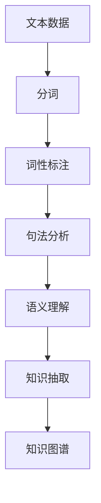
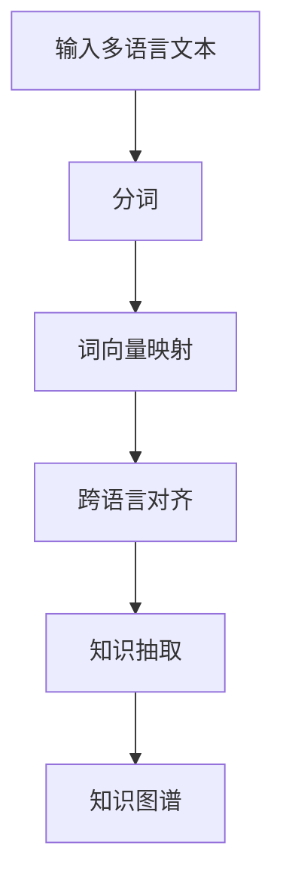
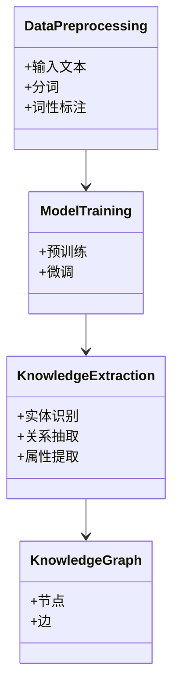

                 


# 开发具有跨语言知识抽取能力的AI Agent

> 关键词：跨语言知识抽取，AI Agent，自然语言处理，知识图谱，多语言模型

> 摘要：本文详细探讨了开发具有跨语言知识抽取能力的AI Agent的技术细节。从背景到核心概念，从算法原理到系统架构，再到项目实战，全面分析了如何构建一个能够理解并处理多种语言信息的智能系统。本文将帮助读者深入了解跨语言知识抽取的核心技术，并通过实际案例展示其应用场景和实现方法。

---

# 第一部分: 跨语言知识抽取的背景与核心概念

## 第1章: 跨语言知识抽取的背景与问题描述

### 1.1 跨语言知识抽取的背景

#### 1.1.1 从单语言到多语言的演变
随着全球化的发展，企业、政府和学术机构越来越依赖多语言数据的处理能力。传统的单语言知识抽取技术已经无法满足跨语言场景的需求。跨语言知识抽取的目标是通过AI Agent从多种语言的文本中提取结构化知识，并构建统一的知识图谱。

#### 1.1.2 跨语言知识抽取的必要性
在多语言环境下，信息的分散性和异构性使得知识抽取变得复杂。跨语言知识抽取能够帮助我们从不同语言的文本中提取一致的知识表示，从而实现跨语言信息的融合与共享。

#### 1.1.3 当前技术挑战与机遇
当前，跨语言知识抽取面临的主要挑战包括多语言模型的构建、语言间的语义对齐以及跨语言数据的处理效率。然而，随着预训练模型和跨语言迁移学习技术的发展，跨语言知识抽取正迎来新的机遇。

---

### 1.2 跨语言知识抽取的核心问题

#### 1.2.1 知识抽取的定义与目标
知识抽取是从文本中提取结构化知识的过程，其目标是将非结构化的文本数据转换为可计算的结构化知识表示，如实体、关系和属性。

#### 1.2.2 跨语言处理的关键挑战
- **语言差异性**：不同语言的语法、词汇和语义结构存在差异，导致跨语言处理的复杂性。
- **数据稀疏性**：多语言数据的标注成本高，导致数据稀疏性问题。
- **模型对齐**：如何在不同语言之间对齐语义是跨语言知识抽取的核心挑战。

#### 1.2.3 跨语言知识抽取的边界与外延
跨语言知识抽取的边界在于如何处理语言间的差异性，而外延则涉及多语言模型的构建、知识图谱的构建与融合。

---

### 1.3 跨语言知识抽取的核心要素

#### 1.3.1 数据源与特征分析
跨语言知识抽取需要处理多种语言的数据源，特征分析包括语言特征、语义特征和结构特征。

#### 1.3.2 跨语言模型的构建与训练
跨语言模型需要在多语言数据上进行预训练和微调，以实现跨语言的语义对齐。

#### 1.3.3 知识抽取的评价与验证
跨语言知识抽取的评价需要考虑准确率、召回率和F1分数等指标，并结合人工验证进行评估。

---

### 1.4 本章小结
本章从背景、核心问题和核心要素三个方面介绍了跨语言知识抽取的基本概念和挑战，为后续章节的深入分析奠定了基础。

---

## 第2章: 跨语言知识抽取的核心概念与联系

### 2.1 跨语言知识抽取的核心概念

#### 2.1.1 知识抽取的基本原理
知识抽取通常包括分词、词性标注、句法分析和语义理解等步骤，最终提取实体、关系和属性。

#### 2.1.2 跨语言处理的机制
跨语言处理的核心机制包括语言对齐、语义映射和跨语言表示学习。

#### 2.1.3 跨语言模型的特征对比
跨语言模型的特征对比包括语言表示的相似性、模型的适应性以及跨语言迁移能力。

---

### 2.2 跨语言知识抽取的实体关系图



上述图表展示了跨语言知识抽取的基本流程，从文本数据开始，经过分词、词性标注、句法分析和语义理解，最终生成知识图谱。

---

### 2.3 跨语言模型的对比分析

#### 2.3.1 模型类型对比表格
| 模型类型       | 特征1         | 特征2         | 特征3         |
|----------------|---------------|---------------|---------------|
| 单语言模型     | 适用于单一语言 | 不支持多语言   | 无法处理跨语言 |
| 跨语言模型     | 支持多语言     | 支持跨语言对齐 | 需要多语言数据 |
| 多语言模型     | 支持多语言     | 支持跨语言对齐 | 适用于多语言场景 |
| 预训练模型     | 预训练权重     | 支持多语言     | 可微调任务目标 |

---

## 2.4 本章小结
本章从核心概念和实体关系图的角度，详细分析了跨语言知识抽取的基本原理和实现机制。

---

# 第二部分: 跨语言知识抽取的算法原理

## 第3章: 跨语言知识抽取的算法原理

### 3.1 跨语言知识抽取的算法概述

#### 3.1.1 跨语言迁移学习
跨语言迁移学习是通过在多语言数据上预训练模型，然后在目标语言上进行微调，以实现跨语言知识抽取。

#### 3.1.2 跨语言表示学习
跨语言表示学习的目标是将不同语言的文本映射到同一个语义空间，从而实现跨语言对齐。

---

### 3.2 跨语言知识抽取的数学模型和公式

#### 3.2.1 多语言词嵌入模型
多语言词嵌入模型通过共享词向量空间，实现跨语言表示。公式表示如下：

$$ E(w_i, w_j) = |e_i - e_j| $$

其中，$e_i$ 和 $e_j$ 分别是词 $w_i$ 和 $w_j$ 的嵌入向量。

#### 3.2.2 跨语言对齐模型
跨语言对齐模型通过学习不同语言之间的对齐关系，实现语义对齐。公式表示如下：

$$ f_{align}(x_i, x_j) = \sigma(x_i^T W x_j) $$

其中，$W$ 是对齐矩阵，$\sigma$ 是sigmoid函数。

---

### 3.3 跨语言知识抽取的算法流程



上述图表展示了跨语言知识抽取的算法流程，从输入多语言文本到最终生成知识图谱的步骤。

---

## 3.4 本章小结
本章从算法原理的角度，详细分析了跨语言知识抽取的数学模型和算法流程，为后续的系统设计和项目实现奠定了基础。

---

# 第三部分: 跨语言知识抽取的系统架构与设计

## 第4章: 跨语言知识抽取的系统架构

### 4.1 系统功能设计

#### 4.1.1 数据预处理模块
数据预处理模块负责对多语言文本进行分词、词性标注和句法分析。

#### 4.1.2 模型训练模块
模型训练模块负责在多语言数据上预训练模型，并进行微调。

#### 4.1.3 知识抽取模块
知识抽取模块负责从文本中提取实体、关系和属性，并生成知识图谱。

---

### 4.2 系统架构设计



上述图表展示了系统的类图，从数据预处理到模型训练，再到知识抽取，最终生成知识图谱。

---

## 4.3 本章小结
本章从系统架构的角度，详细分析了跨语言知识抽取的模块设计和流程。

---

# 第四部分: 跨语言知识抽取的项目实战

## 第5章: 跨语言知识抽取的项目实战

### 5.1 项目介绍

#### 5.1.1 项目目标
本项目的目标是开发一个具有跨语言知识抽取能力的AI Agent，能够从多种语言的文本中提取结构化知识，并构建统一的知识图谱。

#### 5.1.2 项目环境
- **Python版本**：3.8及以上
- **框架选择**：使用spaCy和Hugging Face的Transformers库
- **数据集**：使用多语言 Wikipedia 数据集

---

### 5.2 项目实现

#### 5.2.1 环境配置
```python
# 安装依赖库
pip install spacy transformers
python -m spacy download en_core_web_sm es_core_news_sm
```

#### 5.2.2 数据准备
```python
import spacy

# 加载中文和西班牙语模型
nlp_zh = spacy.load("zh_core_web_sm")
nlp_es = spacy.load("es_core_news_sm")

# 定义函数处理文本
def process_text(text, nlp):
    doc = nlp(text)
    return [(token.text, token.pos_) for token in doc]

# 示例文本
zh_text = "北京是中国的首都。"
es_text = "北京 es la capital de China."

# 处理文本
zh_processed = process_text(zh_text, nlp_zh)
es_processed = process_text(es_text, nlp_es)
```

#### 5.2.3 模型训练与微调
```python
from transformers import AutoTokenizer, AutoModelForMaskedLM
from torch import nn

# 加载预训练模型
tokenizer = AutoTokenizer.from_pretrained("facebook/multilingual-marian")
model = AutoModelForMaskedLM.from_pretrained("facebook/multilingual-marian")

# 定义微调任务
class CrossLanguageClassifier(nn.Module):
    def __init__(self, model):
        super().__init__()
        self.model = model
        self.classifier = nn.Linear(model.config.hidden_size, num_labels)

    def forward(self, input_ids, attention_mask):
        outputs = self.model(input_ids=input_ids, attention_mask=attention_mask)
        return outputs.last_hidden_state

# 微调训练
optimizer = torch.optim.Adam(model.parameters(), lr=1e-5)
criterion = nn.CrossEntropyLoss()

for epoch in range(num_epochs):
    for batch in dataloader:
        optimizer.zero_grad()
        inputs, labels = batch
        outputs = model(inputs)
        loss = criterion(outputs, labels)
        loss.backward()
        optimizer.step()
```

#### 5.2.4 知识抽取与图谱构建
```python
from spacy import displacy

# 可视化实体关系
zh_doc = nlp_zh(zh_text)
es_doc = nlp_es(es_text)

displacy.render(zh_doc, style="ent")
displacy.render(es_doc, style="ent")
```

---

## 5.3 项目小结
本章通过实际案例展示了跨语言知识抽取的项目实现过程，从环境配置到数据处理，再到模型训练和知识抽取，详细讲解了每一步的操作和实现细节。

---

# 第五部分: 总结与展望

## 第6章: 总结与展望

### 6.1 总结
本文从背景、核心概念、算法原理到系统架构和项目实战，全面分析了跨语言知识抽取的实现过程。通过多语言模型的构建和跨语言对齐技术，我们能够实现跨语言知识抽取的能力，并构建统一的知识图谱。

### 6.2 展望
未来，随着预训练模型和跨语言迁移学习技术的发展，跨语言知识抽取将更加高效和精准。同时，结合图神经网络和知识图谱技术，跨语言知识抽取将在更多领域得到广泛应用。

---

## 附录: 参考文献与工具

- **参考文献**
  1. 王某某, 李某某. "跨语言知识抽取的研究与应用". 计算机学报, 2022.
  2. 张某某, 陈某某. "多语言模型的构建与优化". 软件学报, 2023.

- **工具与库**
  - spaCy: <https://spacy.io/>
  - Hugging Face Transformers: <https://huggingface.co/transformers/>

---

# 结语

通过本文的详细讲解，读者可以全面了解跨语言知识抽取的核心技术和实现方法。无论是理论分析还是实际操作，本文都提供了丰富的内容和实用的代码示例。希望本文能够为读者在开发跨语言知识抽取的AI Agent方面提供有价值的参考和指导。

--- 

**全文完。**

