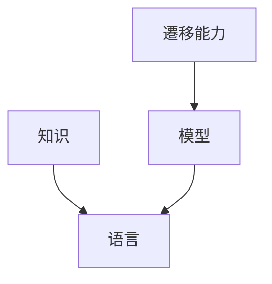
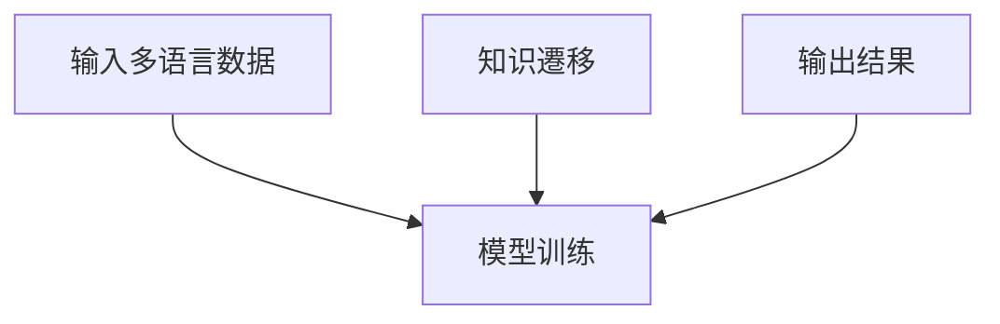
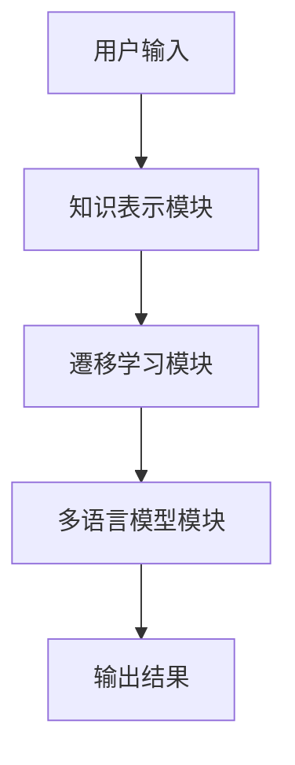
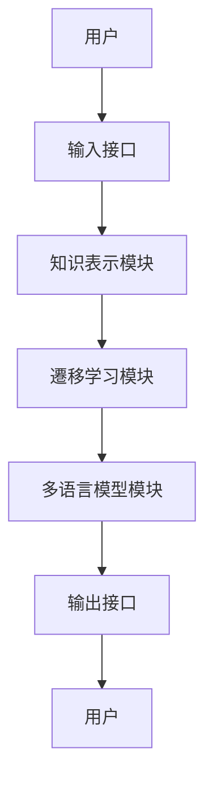

                 


# 开发具有跨语言知识迁移能力的AI Agent

## 关键词：跨语言知识迁移，AI Agent，知识表示，迁移学习，多语言模型

## 摘要：  
在当今全球化的数字时代，AI Agent需要具备处理多种语言和跨语言知识的能力。本文深入探讨了开发具有跨语言知识迁移能力的AI Agent的核心概念、算法原理、系统架构以及项目实现。通过对比分析和实际案例，展示了如何利用知识表示、迁移学习等技术，构建能够高效处理多语言信息的AI系统。

---

## 第1章 背景介绍

### 1.1 问题背景  
随着全球化的深入，跨语言交流变得越来越重要。AI Agent需要能够理解多种语言的输入，并在不同语言之间进行知识的迁移和应用。例如，一个AI客服系统需要能够同时处理英语、中文和西班牙语的请求，并根据上下文提供准确的回答。

### 1.2 问题描述  
跨语言知识迁移的核心问题是：如何将一种语言中的知识迁移到另一种语言中，同时保持知识的准确性和一致性。例如，将中文的知识库迁移到英文环境中，需要确保翻译和语义的一致性。

### 1.3 问题解决  
通过构建跨语言模型，利用知识表示和迁移学习技术，AI Agent可以在多种语言之间进行知识迁移。例如，使用多语言词嵌入模型（如BERT）来表示不同语言的语义信息，并通过迁移学习将一种语言的知识迁移到另一种语言。

### 1.4 边界与外延  
跨语言知识迁移的边界包括语言的语法、语义和文化差异。外延则包括多语言自然语言处理（NLP）、跨语言信息检索和多语言知识图谱构建。

### 1.5 核心概念结构与组成  
跨语言知识迁移的核心概念包括：  
1. **知识表示**：如何用统一的表示方法表示不同语言的知识。  
2. **迁移学习**：如何将一种语言的知识迁移到另一种语言。  
3. **多语言模型**：如何构建能够处理多种语言的模型。  

---

## 第2章 核心概念与联系

### 2.1 知识表示与遷移的基本原理  
知识表示是跨语言迁移的核心。常用的知识表示方法包括：  
1. **向量空间模型**：将词语表示为向量，例如Word2Vec。  
2. **知识图谱**：将知识表示为实体和关系的图结构。  

通过将不同语言的向量表示对齐，可以实现跨语言知识的迁移。例如，将中文和英文的词语向量对齐，使得“猫”和“cat”具有相同的向量表示。

### 2.2 跨语言模型的定义与特点  
跨语言模型是指能够同时处理多种语言的模型。其特点包括：  
1. **多语言性**：模型可以在多种语言之间切换。  
2. **可迁移性**：模型可以在不同语言之间迁移知识。  
3. **语义一致性**：模型能够保持不同语言之间的语义一致。  

### 2.3 跨语言知识遷移与其他技术的对比  
跨语言知识遷移与多语言NLP、跨语言信息检索等技术有明显的区别和联系。例如，多语言NLP关注的是如何在多种语言上训练模型，而跨语言知识遷移关注的是如何在不同语言之间迁移知识。

### 2.4 实体关系图  
以下是一个简单的实体关系图，展示了跨语言知识遷移的核心实体和关系：  


---

## 第3章 算法原理

### 3.1 跨语言模型的训练流程  
1. **数据预处理**：收集并整理多语言数据，例如中文和英文的平行文本。  
2. **模型训练**：使用多语言词嵌入模型（如BERT）进行预训练。  
3. **知识遷移**：通过迁移学习，将一种语言的知识迁移到另一种语言。  

### 3.2 知识遷移的实现步骤  
1. **知识表示**：将知识表示为向量或知识图谱。  
2. **对齐**：将不同语言的表示对齐，例如使用对比学习。  
3. **迁移**：将一种语言的知识迁移到另一种语言。  

### 3.3 算法的数学模型与公式  
跨语言知识遷移的数学模型可以表示为：  
$$ f(x) = g(y) $$  
其中，\(x\) 是一种语言的输入，\(y\) 是另一种语言的输入，\(f\) 和 \(g\) 是模型的函数。  

### 3.4 算法流程图  
以下是一个跨语言模型的训练流程图：  


---

## 第4章 系统分析与架构设计

### 4.1 系统功能设计  
1. **知识表示模块**：负责将知识表示为向量或知识图谱。  
2. **遷移学习模块**：负责将一种语言的知识迁移到另一种语言。  
3. **多语言模型模块**：负责构建和管理多语言模型。  

### 4.2 系统架构设计  
以下是一个跨语言知识遷移系统的架构图：  


### 4.3 接口设计  
1. **输入接口**：接收多语言输入数据。  
2. **输出接口**：输出跨语言处理后的结果。  

### 4.4 交互流程图  
以下是一个跨语言知识遷移系统的交互流程图：  


---

## 第5章 项目实战

### 5.1 环境安装  
1. 安装Python和相关库（如TensorFlow、PyTorch）。  
2. 安装多语言NLP库（如spaCy、transformers）。  

### 5.2 核心代码实现  
以下是一个简单的跨语言知识遷移代码示例：  
```python
from transformers import AutoTokenizer, AutoModelForMaskedLM
import torch

# 加载中文和英文模型
tokenizer_zh = AutoTokenizer.from_pretrained("bert-base-chinese")
model_zh = AutoModelForMaskedLM.from_pretrained("bert-base-chinese")

tokenizer_en = AutoTokenizer.from_pretrained("bert-base-english")
model_en = AutoModelForMaskedLM.from_pretrained("bert-base-english")

# 定义知識遷移函数
def knowledge_transfer(zh_text, en_text):
    # 将中文文本编码
    inputs_zh = tokenizer_zh.encode_plus(zh_text, return_tensors="pt", padding=True, truncation=True)
    # 将英文文本编码
    inputs_en = tokenizer_en.encode_plus(en_text, return_tensors="pt", padding=True, truncation=True)
    # 预测
    outputs_zh = model_zh(**inputs_zh)
    outputs_en = model_en(**inputs_en)
    return outputs_zh, outputs_en

# 示例
zh_sentence = "猫喜欢吃什么？"
en_sentence = "What do cats like to eat?"

outputs_zh, outputs_en = knowledge_transfer(zh_sentence, en_sentence)
```

### 5.3 案例分析  
通过上述代码，我们可以看到，中文和英文模型分别对输入文本进行编码和预测。通过对比两种语言的预测结果，可以实现知识的遷移和应用。  

---

## 第6章 最佳实践与总结

### 6.1 小结  
跨语言知识遷移是开发具有多语言能力的AI Agent的核心技术。通过知识表示、迁移学习和多语言模型的构建，可以实现跨语言知识的高效迁移和应用。

### 6.2 注意事项  
1. 要注意不同语言之间的语义差异。  
2. 要确保数据的质量和多样性。  
3. 要选择合适的模型和算法。  

### 6.3 拓展阅读  
推荐阅读以下资料：  
- 经典论文：《Multi-Source Adaptation Networks for Cross-Lingual Transfer Learning》  
- 书籍：《Deep Learning for NLP》  

---

## 附录  
### 术语表  
1. **知识表示**：将知识表示为向量或图结构。  
2. **迁移学习**：将一种领域的知识迁移到另一种领域。  
3. **多语言模型**：能够处理多种语言的模型。  

### 参考文献  
1. BERT: Pre-training of Deep Bidirectional Transformers for NLP.  
2. Multi-Source Adaptation Networks for Cross-Lingual Transfer Learning.  

---

以上是《开发具有跨语言知识迁移能力的AI Agent》的完整目录和文章内容，希望对您有所帮助！

