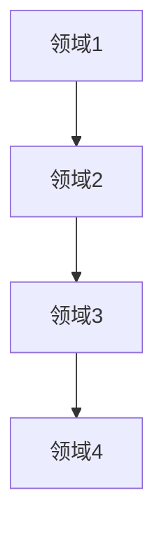
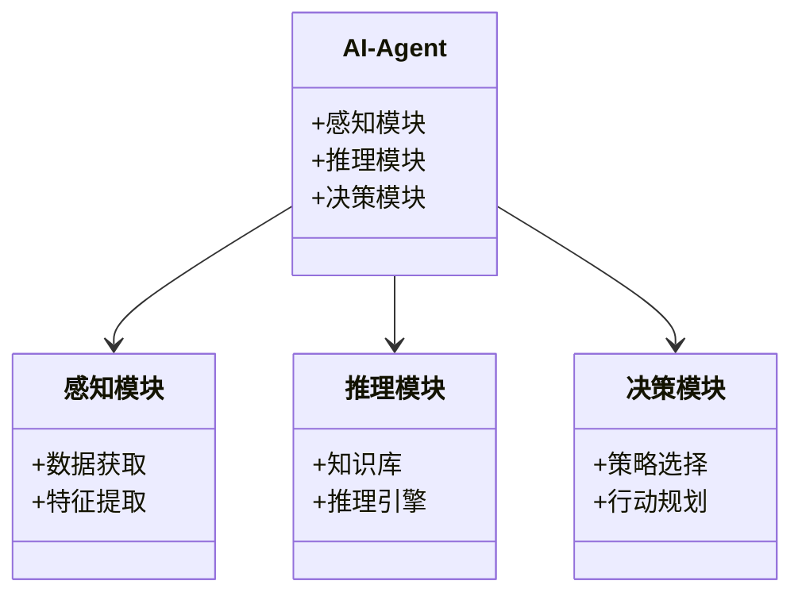
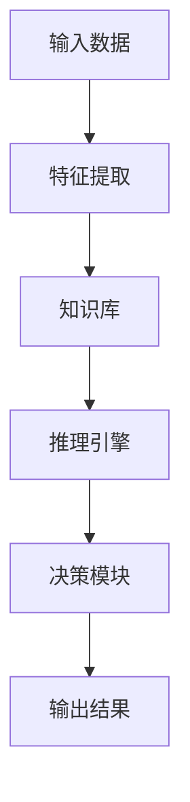
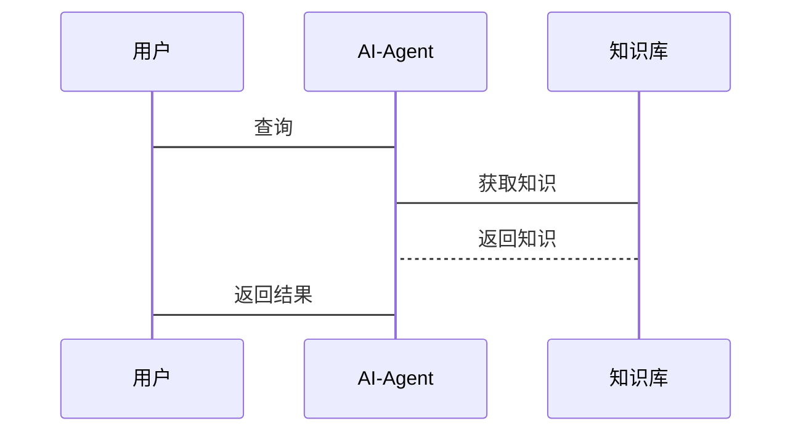

                 


# 开发具有跨领域推理能力的AI Agent

> 关键词：AI Agent，跨领域推理，知识表示，多任务学习，系统架构

> 摘要：本文系统地探讨了开发具有跨领域推理能力的AI Agent的关键技术，从核心概念、算法原理到系统架构，结合实际案例，深入分析了如何构建能够处理多种领域信息的智能系统。

---

# 目录

1. **背景与问题背景**  
   1.1 问题背景  
   1.2 问题描述  
   1.3 问题解决  

2. **核心概念与联系**  
   2.1 核心概念原理  
   2.2 概念对比表格  
   2.3 ER实体关系图  

3. **算法原理讲解**  
   3.1 算法原理  
   3.2 算法流程  
   3.3 数学模型与公式  

4. **系统架构设计**  
   4.1 问题场景介绍  
   4.2 系统功能设计  
   4.3 系统架构图  
   4.4 系统接口与交互  

5. **项目实战**  
   5.1 环境安装与配置  
   5.2 核心代码实现  
   5.3 案例分析与解读  

6. **优化与扩展**  
   6.1 性能优化策略  
   6.2 功能扩展方向  
   6.3 未来研究展望  

7. **总结与展望**  
   7.1 全文总结  
   7.2 未来展望  

---

# 第1章 背景与问题背景

## 1.1 问题背景

### 1.1.1 当前AI Agent的发展现状
AI Agent（智能体）作为人工智能的核心技术，近年来取得了显著进展。然而，大多数现有AI Agent仅能在单一领域或特定任务中表现优异，难以应对跨领域复杂问题。

### 1.1.2 跨领域推理能力的重要性
跨领域推理能力使AI Agent能够理解并整合不同领域的知识，从而在复杂场景中做出更全面的决策，提升问题解决能力。

### 1.1.3 问题的提出与研究意义
现有AI Agent在跨领域推理方面的能力有限，限制了其应用范围。开发具有跨领域推理能力的AI Agent具有重要的研究价值和实际意义。

## 1.2 问题描述

### 1.2.1 AI Agent的基本定义
AI Agent是指在环境中能够感知并自主行动以实现目标的智能实体。

### 1.2.2 跨领域推理能力的定义
跨领域推理能力是指AI Agent能够理解、整合和推理来自不同领域的知识的能力。

### 1.2.3 问题的边界与外延
跨领域推理的边界包括知识整合、领域适应，外延涉及多任务学习、知识图谱构建等。

## 1.3 问题解决

### 1.3.1 跨领域推理的核心目标
构建能够处理多种领域信息的AI Agent，提升其推理和决策能力。

### 1.3.2 解决方案的总体思路
通过知识表示、多任务学习和领域适应等技术实现跨领域推理。

### 1.3.3 解决方案的关键步骤
1. 知识整合与表示  
2. 跨领域推理算法设计  
3. 系统架构搭建  

## 1.4 本章小结
本章介绍了AI Agent的背景，明确了跨领域推理能力的重要性，提出了问题的解决思路和关键步骤。

---

# 第2章 核心概念与联系

## 2.1 核心概念原理

### 2.1.1 知识表示与推理机制
知识表示是跨领域推理的基础，推理机制则决定了AI Agent如何利用这些知识进行推理。

### 2.1.2 跨领域知识整合方法
通过知识图谱和符号逻辑等方法整合不同领域的知识。

### 2.1.3 跨领域推理的实现方式
基于规则的推理和基于机器学习的推理是主要的实现方式。

## 2.2 概念对比表格

| 对比项       | 单一领域推理      | 跨领域推理       |
|--------------|------------------|------------------|
| 知识来源     | 单一领域知识      | 多个领域知识      |
| 推理范围     | 限定领域         | 跨越多个领域     |
| 复杂性       | 较低             | 较高             |

## 2.3 ER实体关系图



## 2.4 本章小结
本章详细解释了跨领域推理的核心概念，通过对比和图表展示了概念之间的关系。

---

# 第3章 算法原理讲解

## 3.1 算法原理

### 3.1.1 多任务学习框架
多任务学习通过共享部分参数，实现跨领域知识的整合和推理。

### 3.1.2 知识蒸馏
通过教师模型将领域知识迁移到学生模型，提升跨领域推理能力。

## 3.2 算法流程

### 3.2.1 数据预处理
对多领域数据进行清洗、标注和格式转换。

### 3.2.2 模型训练
使用多任务损失函数训练模型，实现跨领域知识的学习。

### 3.2.3 推理阶段
基于训练好的模型，进行跨领域推理和决策。

## 3.3 数学模型与公式

### 3.3.1 损失函数
$$ L = \lambda_1 L_1 + \lambda_2 L_2 $$

### 3.3.2 参数优化
$$ \theta = \theta - \eta \cdot \nabla_\theta L $$

---

# 第4章 系统架构设计

## 4.1 问题场景介绍
AI Agent需要在医疗、金融等多个领域中进行推理和决策。

## 4.2 系统功能设计



## 4.3 系统架构图



## 4.4 系统接口与交互



---

# 第5章 项目实战

## 5.1 环境安装与配置
安装Python、TensorFlow、Keras等工具，配置开发环境。

## 5.2 核心代码实现

### 5.2.1 多任务学习模型代码

```python
import tensorflow as tf
from tensorflow import keras

# 定义多任务模型
class MultiTaskModel(keras.Model):
    def __init__(self):
        super().__init__()
        self.shared_layer = keras.layers.Dense(64, activation='relu')
        self.task1_layer = keras.layers.Dense(1, name='task1_output')
        self.task2_layer = keras.layers.Dense(1, name='task2_output')

    def call(self, inputs):
        x = self.shared_layer(inputs)
        x1 = self.task1_layer(x)
        x2 = self.task2_layer(x)
        return x1, x2

# 定义损失函数
def multi_task_loss(y_true, y_pred):
    loss1 = keras.losses.mean_squared_error(y_true[0], y_pred[0])
    loss2 = keras.losses.mean_squared_error(y_true[1], y_pred[1])
    return 0.5 * loss1 + 0.5 * loss2

# 编译模型
model = MultiTaskModel()
model.compile(optimizer='adam', loss={'task1_output': multi_task_loss, 'task2_output': multi_task_loss})
```

### 5.2.2 知识图谱构建代码

```python
from kgpedia import extract Knowledge

# 示例知识图谱构建
knowledge = extract Knowledge("医疗领域")
print(knowledge)
```

## 5.3 案例分析与解读
通过实际案例分析，展示AI Agent如何在跨领域场景中进行推理和决策。

---

# 第6章 优化与扩展

## 6.1 性能优化策略
通过模型压缩、参数优化等方法提升推理速度和准确性。

## 6.2 功能扩展方向
探索与知识图谱、强化学习的结合，提升AI Agent的综合能力。

## 6.3 未来研究展望
跨领域推理AI Agent的研究方向，如动态知识更新、实时推理等。

---

# 第7章 总结与展望

## 7.1 全文总结
总结全文内容，强调跨领域推理AI Agent的重要性和实现方法。

## 7.2 未来展望
展望未来的研究方向和技术发展趋势。

---

# 参考文献

[此处列出相关文献和资源]

