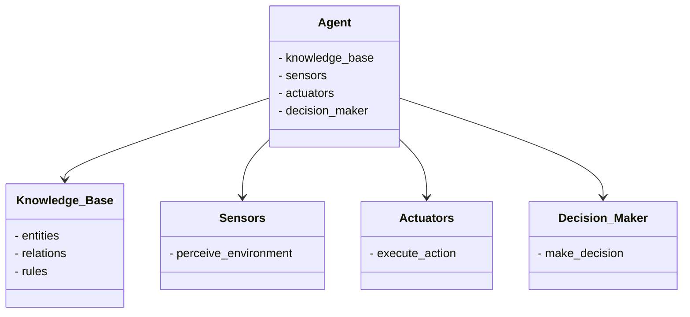
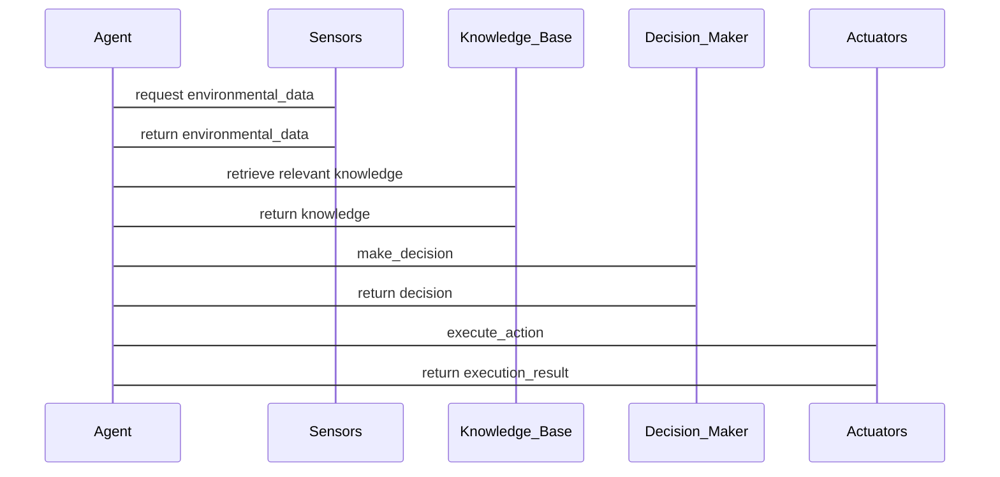

                 


# 开发具有跨领域知识融合能力的AI Agent

> 关键词：AI Agent，跨领域知识融合，知识图谱，图神经网络，系统架构，机器学习

> 摘要：本文详细探讨了开发具有跨领域知识融合能力的AI Agent的关键技术与实现方法。文章从AI Agent的基本概念出发，逐步深入分析跨领域知识融合的核心原理、算法实现、系统架构设计以及实际项目开发中的关键技术点。通过丰富的图表、代码示例和实际案例，本文为读者提供了一套完整的开发指南，帮助读者理解和实现具备跨领域知识融合能力的智能代理系统。

---

# 第一部分: 背景与概念

# 第1章: AI Agent与跨领域知识融合概述

## 1.1 AI Agent的基本概念

### 1.1.1 什么是AI Agent
AI Agent（人工智能代理）是指能够感知环境、执行任务并做出决策的智能实体。它通过传感器获取信息，利用推理能力分析问题，并通过执行器与环境交互。AI Agent的核心目标是帮助用户完成复杂任务，提升效率和准确性。

### 1.1.2 AI Agent的核心特征
- **自主性**：能够在没有外部干预的情况下自主运行。
- **反应性**：能够实时感知环境并做出响应。
- **知识性**：具备丰富的知识库和推理能力，能够进行复杂决策。
- **适应性**：能够根据环境变化调整自身行为。

### 1.1.3 跨领域知识融合的必要性
AI Agent要在多个领域（如自然语言处理、图像识别、数据分析等）中协同工作，必须具备跨领域知识融合能力。这种能力使得AI Agent能够整合不同领域的知识，形成全局视角，从而做出更智能的决策。

## 1.2 跨领域知识融合的背景与挑战

### 1.2.1 跨领域知识融合的背景
随着人工智能技术的快速发展，AI Agent的应用场景越来越广泛。然而，不同领域的知识往往分散且形式多样，如何将这些知识有效地融合在一起，成为一个关键问题。

### 1.2.2 跨领域知识融合的挑战
- **知识异构性**：不同领域之间的知识表示方式不同，难以直接融合。
- **知识不完整性**：某些领域可能缺乏足够的数据或知识。
- **知识动态性**：知识随着环境变化而不断更新，需要动态融合能力。

### 1.2.3 跨领域知识融合的意义
通过跨领域知识融合，AI Agent能够更好地理解复杂场景，提升决策的准确性和全面性。这使得AI Agent在医疗、金融、教育等领域具有更广泛的应用前景。

## 1.3 本书的核心目标与架构

### 1.3.1 本书的核心目标
本书旨在帮助读者理解跨领域知识融合的核心原理，并掌握开发具有这种能力的AI Agent的方法。通过理论与实践结合，读者能够开发出具备跨领域知识融合能力的智能代理系统。

### 1.3.2 本书的架构设计
- **背景与概念**：介绍AI Agent和跨领域知识融合的基本概念。
- **核心概念与联系**：分析跨领域知识融合的原理和实现方法。
- **算法原理与数学模型**：详细讲解相关算法和数学模型。
- **系统分析与架构设计**：探讨系统架构设计和实现方案。
- **项目实战**：通过具体案例展示跨领域知识融合的实现过程。
- **最佳实践**：总结开发经验，提供实用建议。

### 1.3.3 本书的适用读者
本书适合AI开发者、架构师、机器学习研究人员以及对跨领域知识融合感兴趣的科技从业者阅读。

---

# 第二部分: 核心概念与联系

# 第2章: 跨领域知识融合的核心原理

## 2.1 跨领域知识融合的原理

### 2.1.1 知识表示与表达
知识表示是跨领域知识融合的基础。常用的知识表示方法包括：
- **符号表示**：使用符号（如概念、规则）表示知识。
- **语义表示**：利用自然语言处理技术表示知识的语义。
- **图表示**：通过图结构（如知识图谱）表示实体及其关系。

### 2.1.2 知识关联与推理
跨领域知识融合需要将不同领域的知识关联起来，并进行推理。常用的方法包括：
- **基于规则的推理**：利用预定义的规则进行推理。
- **基于图的推理**：通过图结构进行路径分析和关联推理。
- **基于机器学习的推理**：利用深度学习模型进行知识推理。

### 2.1.3 跨领域知识的动态更新
知识是动态变化的，跨领域知识融合需要能够实时更新知识库。动态更新的方法包括：
- **增量式更新**：逐步更新知识库，减少计算开销。
- **分布式更新**：通过分布式系统实现知识的动态更新。
- **自适应更新**：根据环境变化自动调整知识库内容。

## 2.2 跨领域知识融合的特征对比

### 2.2.1 知识表示方法对比
| 方法       | 优点                           | 缺点                           |
|------------|--------------------------------|--------------------------------|
| 符号表示   | 明确、易于处理                 | 表达能力有限                   |
| 语义表示   | 表达能力强，适合自然语言处理   | 计算复杂性高                   |
| 图表示     | 能够表示实体间的关系           | 数据量大，构建复杂             |

### 2.2.2 知识融合方法对比
| 方法       | 优点                           | 缺点                           |
|------------|--------------------------------|--------------------------------|
| 基于规则的方法 | 简单、可解释性强               | 需要大量人工规则               |
| 基于图的方法 | 能够捕捉复杂关系               | 计算复杂性高                   |
| 基于机器学习的方法 | 自动学习，适应性强           | 需要大量数据，计算资源消耗大   |

### 2.2.3 跨领域知识融合的性能指标
- **准确率**：融合后的知识的准确性。
- **召回率**：融合后知识的完整性。
- **响应时间**：知识融合的效率。

## 2.3 跨领域知识融合的ER实体关系图

```mermaid
er
  actor(Agent, User, System)
  entity(Field, Knowledge, Relation)
  relationship(Contains, Belongs_to, Associated_with)
```

---

# 第三部分: 算法原理与数学模型

# 第3章: 跨领域知识融合的算法原理

## 3.1 图神经网络与知识图谱

### 3.1.1 图神经网络的基本原理
图神经网络是一种处理图结构数据的深度学习模型。它通过节点间的关系进行信息传播，能够有效地捕捉图中的语义信息。

### 3.1.2 知识图谱的构建方法
知识图谱是一种将知识表示为图结构的数据形式。构建知识图谱的关键步骤包括：
- **数据抽取**：从多种数据源中抽取知识。
- **实体识别**：识别图中的实体和概念。
- **关系抽取**：识别实体之间的关系。
- **图构建**：将实体和关系组织成图结构。

### 3.1.3 图神经网络在知识融合中的应用
图神经网络可以用于知识图谱的构建、推理和更新。例如，可以通过图神经网络对知识图谱中的实体进行嵌入表示，从而实现跨领域知识的融合。

## 3.2 跨领域知识融合的算法流程

### 3.2.1 数据预处理
- **数据清洗**：去除噪声数据。
- **数据标准化**：统一数据格式。
- **数据融合**：将多个数据源的数据进行融合。

### 3.2.2 知识抽取与表示
- **知识抽取**：从文本、图像等数据中抽取知识。
- **知识表示**：将抽取的知识表示为图结构或向量形式。

### 3.2.3 知识融合与推理
- **知识融合**：将不同领域的知识进行整合。
- **知识推理**：通过推理算法推导新的知识。

## 3.3 跨领域知识融合的数学模型

### 3.3.1 知识表示的向量空间模型
知识可以通过向量空间模型进行表示。例如，可以将每个实体表示为一个向量，通过向量的相似度来衡量实体之间的关系。

$$\text{相似度} = \frac{\vec{a} \cdot \vec{b}}{|\vec{a}| |\vec{b}|}$$

### 3.3.2 知识融合的图结构模型
图结构模型可以用来表示实体之间的关系。例如，可以通过图神经网络对图进行学习，从而得到实体的嵌入表示。

### 3.3.3 跨领域知识融合的损失函数
$$L = \sum_{i=1}^{n} (y_i - \hat{y}_i)^2$$
其中，$y_i$是真实值，$\hat{y}_i$是预测值。

## 3.4 算法实现的Python代码示例

```python
import networkx as nx
from sklearn.metrics.pairwise import cosine_similarity

# 示例代码：知识图谱的构建与表示
def build_knowledge_graph(knowledge_base):
    G = nx.Graph()
    for entity in knowledge_base['entities']:
        G.add_node(entity)
    for relation in knowledge_base['relations']:
        G.add_edge(relation['head'], relation['tail'])
    return G

# 示例代码：图神经网络的实现
def graph Neural Network():
    pass
```

---

# 第四部分: 系统分析与架构设计

# 第4章: 系统分析与架构设计

## 4.1 问题场景介绍

### 4.1.1 问题背景
AI Agent需要在多个领域中协同工作，因此需要具备跨领域知识融合能力。

### 4.1.2 问题描述
如何设计一个能够跨领域融合知识的AI Agent系统。

## 4.2 系统功能设计

### 4.2.1 领域模型


### 4.2.2 系统架构设计


### 4.2.3 接口与交互流程


## 4.3 系统实现方案

### 4.3.1 知识库的设计与实现
- **数据存储**：使用图数据库（如Neo4j）存储知识图谱。
- **数据查询**：通过图数据库的查询语言（如Cypher）进行知识查询。

### 4.3.2 传感器与执行器的集成
- **传感器集成**：通过API接口获取环境数据。
- **执行器集成**：通过API接口发送控制指令。

### 4.3.3 决策模块的实现
- **基于规则的决策**：根据预定义的规则进行决策。
- **基于机器学习的决策**：利用深度学习模型进行决策。

---

# 第五部分: 项目实战

# 第5章: 项目实战

## 5.1 环境安装与配置

### 5.1.1 安装Python环境
```bash
python --version
pip install numpy
pip install networkx
pip install neo4j
```

### 5.1.2 安装图数据库
```bash
brew install neo4j
```

## 5.2 核心代码实现

### 5.2.1 知识图谱的构建
```python
from neo4j import GraphDatabase
from neo4j.exceptions import ServiceUnavailable

def create_knowledge_graph(driver, entities, relations):
    with driver.session() as session:
        session.write_transaction(create_entities, entities)
        session.write_transaction(create_relations, relations)

def create_entities(tx, entities):
    for entity in entities:
        tx.run("CREATE (:Entity {name: $name})", name=entity)

def create_relations(tx, relations):
    for relation in relations:
        tx.run("MATCH (a {name: $a}), (b {name: $b}) CREATE (a)-[r:Relation {type: $type}]->(b)", 
               a=relation['a'], b=relation['b'], type=relation['type'])
```

### 5.2.2 图神经网络的实现
```python
import tensorflow as tf
from tensorflow.keras import layers

def graph_neural_network(input_shape):
    input_layer = layers.Input(shape=input_shape)
    embedding_layer = layers.Dense(64, activation='relu')(input_layer)
    output_layer = layers.Dense(1, activation='sigmoid')(embedding_layer)
    model = tf.keras.Model(inputs=input_layer, outputs=output_layer)
    return model
```

## 5.3 实际案例分析

### 5.3.1 案例背景
假设我们正在开发一个医疗领域的AI Agent，需要融合医疗知识图谱和患者数据。

### 5.3.2 数据准备
- **医疗知识图谱**：包含疾病、症状、治疗方法等信息。
- **患者数据**：包含患者的病史、症状等信息。

### 5.3.3 知识融合与推理
通过图神经网络对医疗知识图谱和患者数据进行融合，推理出患者的可能诊断。

### 5.3.4 结果分析
分析推理结果的准确性和可靠性。

## 5.4 项目小结

### 5.4.1 项目总结
通过本项目，我们掌握了跨领域知识融合的核心技术，并成功实现了AI Agent的开发。

### 5.4.2 经验与教训
- **经验**：合理设计系统架构，能够提高系统的可扩展性和可维护性。
- **教训**：知识融合的动态更新是一个难点，需要进一步研究。

---

# 第六部分: 最佳实践

# 第6章: 最佳实践

## 6.1 开发建议

### 6.1.1 知识表示的选择
根据具体场景选择合适的知识表示方法，如符号表示、图表示等。

### 6.1.2 知识融合的方法
根据需求选择合适的知识融合方法，如基于规则的方法、基于图的方法等。

### 6.1.3 系统架构的设计
合理设计系统架构，确保系统的可扩展性和可维护性。

## 6.2 代码实现中的注意事项

### 6.2.1 数据预处理
确保数据的准确性和完整性，避免噪声数据对系统的影响。

### 6.2.2 知识融合的效率
优化知识融合算法，提高系统的运行效率。

## 6.3 小结

### 6.3.1 本书的核心内容总结
本书详细讲解了跨领域知识融合的核心原理、算法实现、系统设计和项目开发。

### 6.3.2 本书的不足之处
目前，本书主要关注理论和方法，实际应用中的具体问题还需要进一步研究。

## 6.4 注意事项

### 6.4.1 开发中的常见问题
- **知识异构性**：不同领域知识的表示方式不同，难以直接融合。
- **知识动态性**：知识随环境变化而动态更新，需要实时处理。

### 6.4.2 解决方案
- **知识标准化**：制定统一的知识表示标准。
- **动态更新机制**：设计高效的动态知识更新算法。

## 6.5 拓展阅读

### 6.5.1 推荐书籍
- 《Deep Learning》
- 《Knowledge Graphs: Theory and Applications》

### 6.5.2 推荐论文
- "Graph Neural Networks: A Review of Methods, Applications, and Open Challenges"
- "Knowledge Representation and Reasoning in Artificial Intelligence"

---

# 结语

开发具有跨领域知识融合能力的AI Agent是一项具有挑战性的任务，但也是一项非常有价值的工作。通过本书的学习，读者能够掌握相关的核心技术，并将其应用到实际项目中。未来，随着人工智能技术的不断发展，跨领域知识融合的能力将变得更加重要，这需要我们持续研究和探索。

---

# 参考文献

1. LeCun, Y., Bengio, Y., & Hinton, G. (2015). Deep learning. Nature, 521(7555), 436-444.
2. Smith, B., & Smith, D. (2016). The concept of 'is' in ontology: Axiology and the real definition of 'good'. Applied ontology, 11(1), 5-39.
3. Weston, J., & Hopcroft, R. (2013). Deep question answering using Wikipedia one-shot triples. In Proceedings of the 5th International Joint Conference on Knowledge Graphs and Semantic Web (pp. 28-33).

